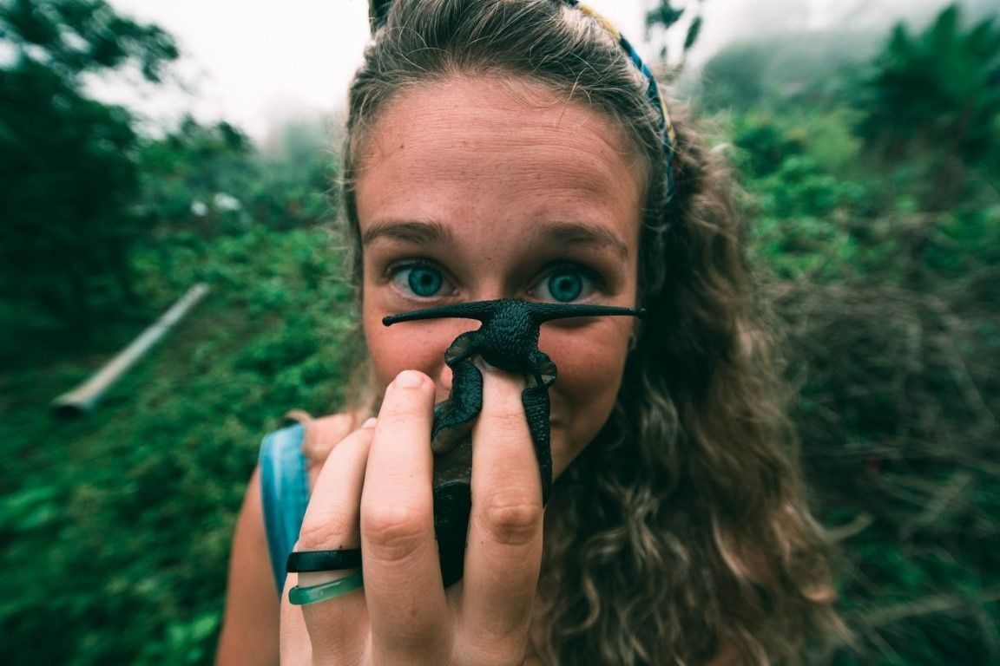
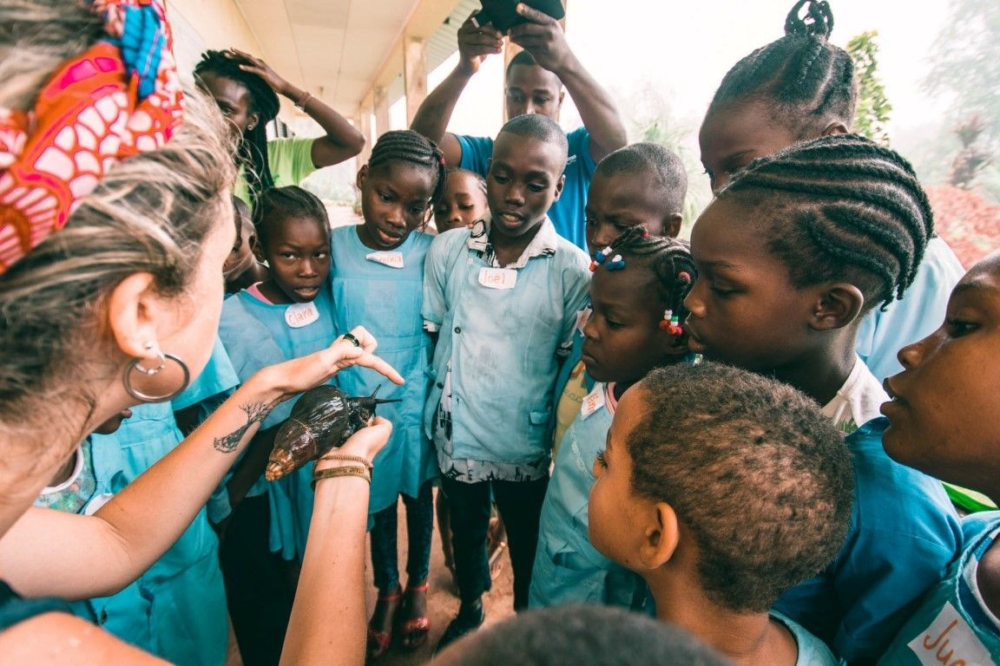
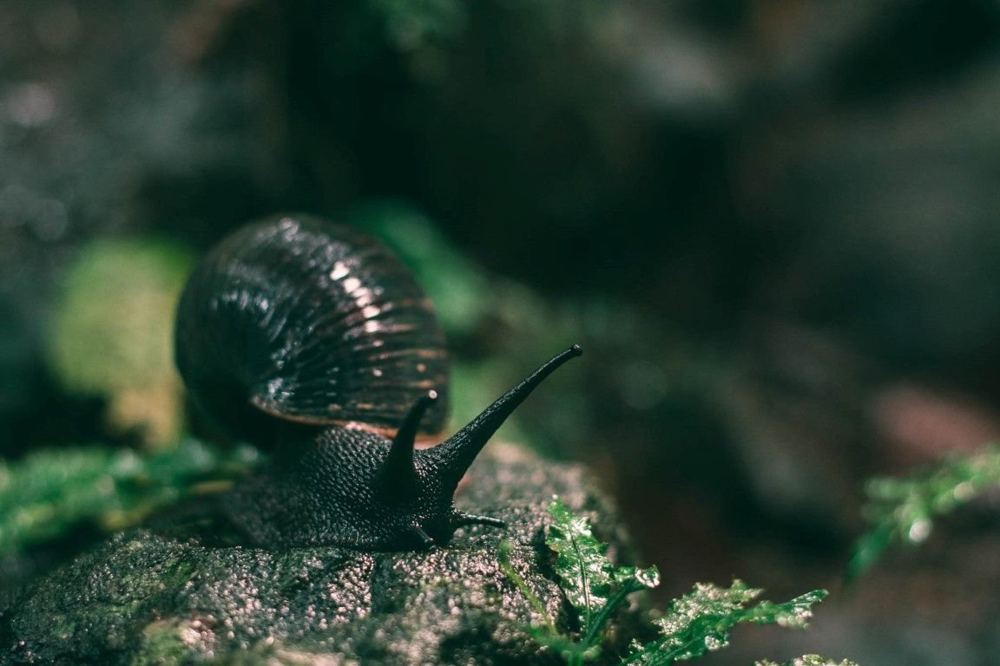

[facebook](https://www.facebook.com/sharer/sharer.php?u=https%3A%2F%2Fwww.natgeo.pt%2Fanimais%2F2019%2F09%2Fmartina-panisi-protege-caracois-gigantes-em-sao-tome-e-principe) [twitter](https://twitter.com/share?url=https%3A%2F%2Fwww.natgeo.pt%2Fanimais%2F2019%2F09%2Fmartina-panisi-protege-caracois-gigantes-em-sao-tome-e-principe&via=natgeo&text=Martina%20Panisi%20%E2%80%93%20Protege%20Carac%C3%B3is%20Gigantes%20em%20S%C3%A3o%20Tom%C3%A9%20e%20Pr%C3%ADncipe) [whatsapp](https://web.whatsapp.com/send?text=https%3A%2F%2Fwww.natgeo.pt%2Fanimais%2F2019%2F09%2Fmartina-panisi-protege-caracois-gigantes-em-sao-tome-e-principe) [flipboard](https://share.flipboard.com/bookmarklet/popout?v=2&title=Martina%20Panisi%20%E2%80%93%20Protege%20Carac%C3%B3is%20Gigantes%20em%20S%C3%A3o%20Tom%C3%A9%20e%20Pr%C3%ADncipe&url=https%3A%2F%2Fwww.natgeo.pt%2Fanimais%2F2019%2F09%2Fmartina-panisi-protege-caracois-gigantes-em-sao-tome-e-principe) [mail](mailto:?subject=NatGeo&body=https%3A%2F%2Fwww.natgeo.pt%2Fanimais%2F2019%2F09%2Fmartina-panisi-protege-caracois-gigantes-em-sao-tome-e-principe%20-%20Martina%20Panisi%20%E2%80%93%20Protege%20Carac%C3%B3is%20Gigantes%20em%20S%C3%A3o%20Tom%C3%A9%20e%20Pr%C3%ADncipe) [Animais](https://www.natgeo.pt/animais) 
# Martina Panisi – Protege Caracóis Gigantes em São Tomé e Príncipe 
## O projeto 'Forest Giants' de Martina Panisi e da sua equipa dedica-se a difundir a importância da conservação da biodiversidade em São Tomé e Príncipe e ao papel de cada pessoa nessa proteção, usando como símbolo uma espécie nativa da ilha. Por [National Geographic](https://www.natgeo.pt/autor/national-geographic) Publicado 17/09/2019, 18:26 , Atualizado 2/02/2021, 09:30 

Martina com um Búzio-d’Obô em São Tomé e Príncipe. As pessoas da comunidade tentam criar esta espécie por ser mais rara hoje em dia e pelo seu valor medicinal. Fotografia por Vasco Pissarra Em 2018 **Martina Panisi** recebeu uma bolsa Early Career da National Geographic com um dos objetivos enaltecer o valor e diversidade das espécies invertebradas e o seu papel fundamental na saúde dos ecossistemas. Atualmente, a Doutoranda da Faculdade de Ciências da Universidade de Lisboa difunde uma história à população de São Tomé e Príncipe. 

**O projeto [Forest Giants](http://www.forestgiants.org/index.html)** nasceu com a necessidade urgente de sensibilizar o público local e internacional acerca da proteção da biodiversidade nativa em São Tomé e Príncipe. Estudos recentes apontam para a existência de cerca de 80 espécies de caracóis e lesmas nas ilhas de São Tomé e Príncipe, sendo que mais do que metade delas são endémicas. 

Para esse fim, Martina decidiu usar a história do desaparecimento rápido de uma espécie culturalmente importante nas ilhas: o **Búzio-d'Obô** ( _Archachatina bicarinata_ ), um caracol gigante terrestre endémico das ilhas utilizado para fins medicinais e alimentares. Esta espécie, como outras nas ilhas, está a ser esquecida pelas novas gerações que, para além de não a conhecer, não sabe as ameaças associadas à floresta e às espécies que a habitam. 

As crianças de duas escolas primárias conhecem ao vivo os Búzios-d’Obô que estão a ser criados no Jardim Botânico, na primeira saída de campo escolar deles. Fotografia por Vasco Pissarra O seu projeto tem uma componente forte de educação, onde tenta facilitar o diálogo entre gerações diferentes e envolver públicos alvos diferentes, utilizando o búzio gigante como símbolo do Parque Natural das ilhas. Através de aulas e workshops, a equipa educa comunidades e escolas locais a conservar e proteger o Búzio-d’Obô. Isto é particularmente importante em um meio onde as visitas de estudo não são comuns. 

Daqui a um mês, na sua próxima ida à ilha irá tentar trabalhar mais sobre o centro de conservação da espécie, que construiu com os restantes elementos da equipa em maio, onde conseguem reproduzir a espécie e começará a estudar a sua ecologia pela primeira vez. 

**Já disse que o seu coração e a sua cabeça estão cheios de perguntas e desafios. Pode partilhar algumas das suas inquietações?** 

Estou cheia de inquietações (risos). Quando dedicamos todo o nosso tempo a uma causa, acaba por ser um pedaço de nós. E, se não virmos as coisas avançarem rápido o suficiente, ficamos inquietos muito facilmente. 

Além disso, há uma desconexão grande entre a sociedade e a natureza, que é algo que não pode ser desconectado. Tendemos a separarmo-nos da natureza e não podemos… A natureza somos nós. Tudo o que lhe fizermos vai acarretar consequências para nós. 

**O que a inspira?** 

Qualquer espécie tem uma sua história, os seus detalhes, as suas características, mesmo os seres vivos mais pequenos, que por vezes não têm a nossa atenção ou fogem ao nosso olhar. Quando as crianças, ou mesmo os adultos, reparam finalmente na importância destes pormenores da natureza que os rodeia, fico inspirada e com a força necessária para continuar a trabalhar para que seja construída esta conexão entre as pessoas e o ambiente. 

[**OBSERVE: BÚZIOS-D'OBÔ, OS GIGANTES AMEAÇADOS DA FLORESTA**](https://www.natgeo.pt/photography/2019/09/buzios-dobo-os-gigantes-ameacados-da-floresta) 

ver galeria **Quando deixa São Tomé, que preocupações traz na mochila?** 

Quando deixamos São Tomé, deixo os meus bebés. No centro temos as primeiras crias de Búzio-d’Obô, onde fica um rapaz que estamos a formar para esse efeito. Contudo, a forma de trabalhar lá é diferente da forma em que trabalhamos na Europa e não podemos esperar as mesmas condições de trabalho e as mesmas motivações nas pessoas. Quando fico mais descansada com este assunto, consigo avançar na prática. 

O grande problema destes projetos em São Tomé e noutros países em desenvolvimento, é a falta de apropriação daquilo que é deixado lá. Assim que alguém vai embora, as coisas morrem. 

**Como combina a sua ação em prol da conservação e o espírito aventureiro?** 

É muito fácil e para mim é o ideal! No campo, onde fazemos trabalho de conservação, existe sempre algum imprevisto, nem que seja chuva. Aventuras não faltam, quando lá vou! Para mim conservação e aventura são a mesma coisa. 

**Como descobriu a história do Búzio-d'Obô?** 

Já cuidava de animais invertebrados quando era pequena, em Itália. Quando vim para a Faculdade de Ciências da Universidade de Lisboa procurei um invertebrado que estivesse em risco de desaparecer. 

Com a ajuda do meu orientador Ricardo de Lima, consegui financiamento para lá ir e a população já tinha notado que havia um decréscimo desta espécie, classificada como vulnerável em 1996. Depois disso, não foi feito mais nenhum estudo, à exceção da ilha do Príncipe. Inicialmente era apenas um estudo ecológico na floresta, mas quando nos deslocávamos para as aldeias as pessoas sabiam e decidimos adicionar essa componente social ao projeto. 

**Que impacto teve o projeto?** 

A nível local, um terço das escolas de São Tomé já sabem quem somos e já conhecem o Búzio-d’Obô e o que está a acontecer à espécie. Além disso, conseguimos mobilizar várias entidades. 

No centro temos vários crias da espécie que já é uma grande vitória e a nível internacional, conseguimos que as pessoas se interessassem por uma espécie que é um pouco diferente e não dá tanto nas vistas. 

**Quais os próximos passos?** 

Garantir a sustentabilidade do projeto e encontrar uma forma de agir a um nível mais geral. Cada vez mais a conversa tem de ser ao nível da floresta e do ecossistema, incluindo soluções práticas do que as pessoas podem fazer hoje para assegurar o futuro. 

Além disso temos de aumentar os números da espécie e a preocupação e dedicação das comunidades a esta causa. 

**Se não tivesse sido possível seguir o seu sonho de se tornar conservacionista, que carreira tinha seguido?** 

Para mim não haviam dúvidas, era mesmo este o meu sonho, desde pequena. Se não tivesse sido possível, gostava de ser educadora (que acabo por ser), ou música. 

**Se pudesse pedir um desejo para o Planeta, qual seria?** 

Eu desejo que as pessoas um dia acordem com olhos novos e percebam a beleza da natureza que nos rodeia. Qualquer ser, por menor que seja, é lindo. 

_**Vasco Pissarra** é cofundador do projeto Gigantes da Floresta, ecólogo marinho e usa a fotografia para facilitar a aproximação do público não cientista a causas de conservação de natureza._ 

