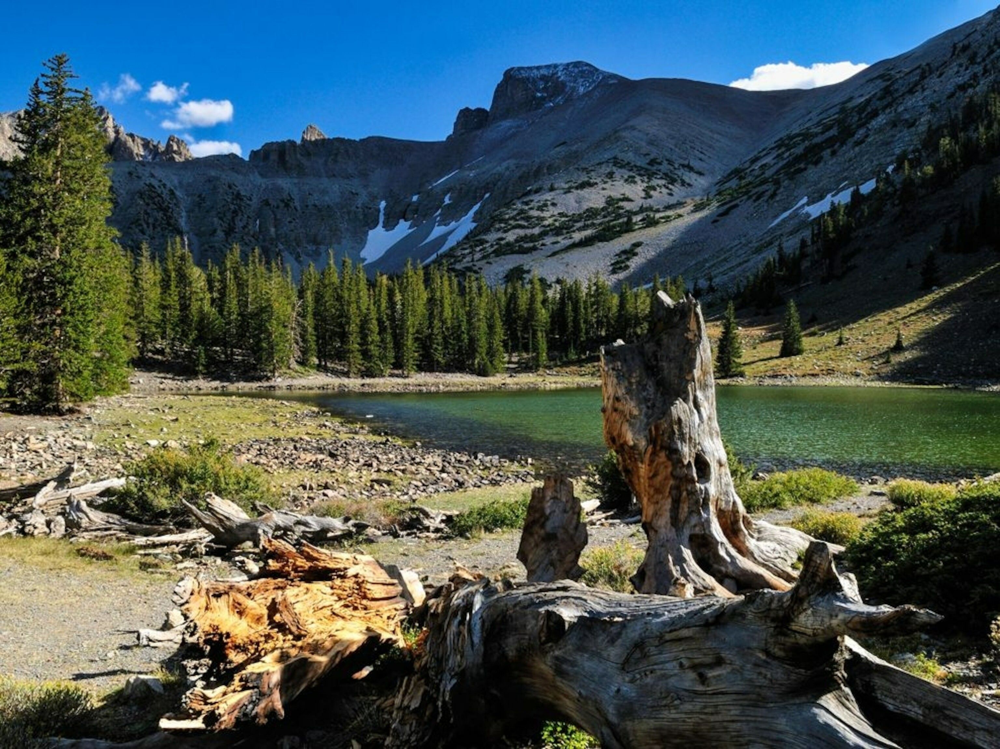

[facebook](https://www.facebook.com/sharer/sharer.php?u=https%3A%2F%2Fwww.natgeo.pt%2Fanimais%2F2021%2F02%2Fentrevista-joana-pereira-conservacao-da-vida-selvagem) [twitter](https://twitter.com/share?url=https%3A%2F%2Fwww.natgeo.pt%2Fanimais%2F2021%2F02%2Fentrevista-joana-pereira-conservacao-da-vida-selvagem&via=natgeo&text=%E2%80%9CPoucas%20medidas%20de%20conserva%C3%A7%C3%A3o%20ser%C3%A3o%20eficientes%20se%20n%C3%A3o%20contribu%C3%ADrem%20em%20paralelo%20para%20um%20al%C3%ADvio%20das%20necessidades%20da%20popula%C3%A7%C3%A3o.%E2%80%9D) [whatsapp](https://web.whatsapp.com/send?text=https%3A%2F%2Fwww.natgeo.pt%2Fanimais%2F2021%2F02%2Fentrevista-joana-pereira-conservacao-da-vida-selvagem) [flipboard](https://share.flipboard.com/bookmarklet/popout?v=2&title=%E2%80%9CPoucas%20medidas%20de%20conserva%C3%A7%C3%A3o%20ser%C3%A3o%20eficientes%20se%20n%C3%A3o%20contribu%C3%ADrem%20em%20paralelo%20para%20um%20al%C3%ADvio%20das%20necessidades%20da%20popula%C3%A7%C3%A3o.%E2%80%9D&url=https%3A%2F%2Fwww.natgeo.pt%2Fanimais%2F2021%2F02%2Fentrevista-joana-pereira-conservacao-da-vida-selvagem) [mail](mailto:?subject=NatGeo&body=https%3A%2F%2Fwww.natgeo.pt%2Fanimais%2F2021%2F02%2Fentrevista-joana-pereira-conservacao-da-vida-selvagem%20-%20%E2%80%9CPoucas%20medidas%20de%20conserva%C3%A7%C3%A3o%20ser%C3%A3o%20eficientes%20se%20n%C3%A3o%20contribu%C3%ADrem%20em%20paralelo%20para%20um%20al%C3%ADvio%20das%20necessidades%20da%20popula%C3%A7%C3%A3o.%E2%80%9D) [Animais](https://www.natgeo.pt/animais) 
# “Poucas medidas de conservação serão eficientes se não contribuírem em paralelo para um alívio das necessidades da população.” 
## Joana Pereira, exploradora da National Geographic, desenhou um projeto que visa minimizar os conflitos entre humanos e a vida selvagem com o contributo de comunidades locais. Por [Filipa Coutinho](https://www.natgeo.pt/autor/filipa-coutinho) Publicado 1/02/2021, 11:52 , Atualizado 2/02/2021, 13:06 

A exploradora e investigadora Joana Pereira durante o seu projeto de conservação e gestão da vida selvagem. 

Fotografia por Joana Pereira **[Joana Pereira](https://www.researchgate.net/profile/Joana_Pereira27)** dedica-se ao estudo das interações humanos-vida selvagem e ao seu impacto na vulnerabilidade de comunidades rurais no Parque Nacional das Quirimbas e na Reserva Especial do Niassa, em Moçambique. Procura compreender o contexto social e ecológico do conflito entre humanos e os animais selvagens e definir estratégias de mitigação. 

É doutoranda no Centro de Ecologia, Evolução e Alterações Climáticas (cE3c) da Faculdade de Ciências da Universidade de Lisboa. Ao longo da sua formação passou pelo Grupo Lobo (Associação para a Conservação do Lobo e do seu Ecossistema), pela Fundação Mona, pelas Universidades de Lund e Zagreb, pelo Instituto Max Planck e fez voluntariado no Instituto Superior de Psicologia Aplicada, na Liga para a Proteção da Natureza, no LxCRAS – Centro de Recuperação de Animais Silvestres e num Projeto de Conservação Africano. 

Em 2019 recebeu uma [bolsa da National Geographic Society](https://www.natgeo.pt/bolsas) para estudar estratégias de atenuação dos conflitos entre as comunidades e a vida selvagem no solo moçambicano. Esta semana conversámos com ela sobre o impacto do seu trabalho e como os humanos podem coexistir com a vida selvagem num mundo benéfico para os dois lados da equação. 

**Explique o seu trabalho numa frase.** 

O meu trabalho consiste em investigar o papel das interações entre humanos e fauna-bravia, de um ponto de vista social, político e económico, na definição de estratégias de coexistência em duas áreas protegidas de Moçambique. 

**O que a entusiasma todos os dias no seu trabalho?** 

Fico entusiasmada com a oportunidade de contribuir com sugestões práticas e concretas que possam ter um impacto positivo na vida das pessoas e na conservação de várias espécies. Paralelamente, ter o enorme privilégio de conhecer um bocadinho do Norte de Moçambique, viver a sua natureza esplêndida, a cultura, as pessoas de sorriso fácil e que vivem a vida com leveza. É impossível não nos apaixonarmos! 

**Quais os impactos da pandemia de COVID-19 no seu projeto?** 

Impediu-me de viajar para Moçambique em 2020 e continuar o trabalho da forma como tinha planeado. No entanto, o que mais impactou o meu trabalho, e a que nada se compara aos impactos reais vividos na província de Cabo Delgado, foi o escalar do terrorismo islâmico em toda a região. A instabilidade já se sentia em 2019 nas minhas idas ao Parque Nacional das Quirimbas, situado a norte de Pemba. As pessoas estavam assustadas e indivíduos desconhecidos nas comunidades eram sinal de alarme. Havia regiões do parque que se encontravam interditas e várias aldeias perto de onde trabalhei estavam a ser atacadas. O cenário ficou caótico pouco depois de voltar a Portugal, eliminando completamente a esperança, talvez ingénua, que eu tinha de voltar Pemba. A isto, juntou-se a pandemia. Tive de me adaptar perante a impossibilidade de regressar a Quirimbas para concluir o trabalho. Mudei então para a Reserva Especial do Niassa, tive de contratar um técnico local para continuar esse trabalho de campo e passei a focar-me na produção de material digital para divulgação dos resultados junto das entidades envolvidas. 

### “Temos de nos certificar que as necessidades básicas das comunidades estão a ser atendidas.” **De que forma os humanos e a vida selvagem podem coexistir de uma forma benéfica para ambos?** 

Em primeiro lugar, penso que temos de nos certificar que as necessidades básicas das comunidades estão a ser atendidas. Se queremos conservar espécies em perigo numa região onde as comunidades não têm acesso a fontes de água potável, muito menos a saúde, e vivem em constante insegurança alimentar, poucas medidas de conservação serão eficientes se não contribuírem em paralelo para um alívio destas necessidades. 

Acredito também que precisamos de estar conscientes que conflitos sociais e políticos podem estar a exacerbar a relação com os animais. Se apenas nos focarmos em resolver problemas visíveis, como a destruição de _machambas_ (nome dado aos campos agrícolas pelos moçambicanos), ou ataques a animais domésticos, sem abordarmos conflitos subjacentes e socialmente enraizados, nenhuma medida de mitigação ou compensação resultará a longo prazo. Por último, as pessoas necessitam de obter benefícios tangíveis por coexistirem diariamente com grandes mamíferos, e precisam também de sentir que, ao conservarem estes animais e os seus ecossistemas, estão a contribuir para o seu próprio desenvolvimento sustentável. 

Joana Pereira com uma das comunidades que ouviu. 

Fotografia por Joana Pereira **Como é que a bolsa da NGS a ajudou?** 

A bolsa de _Early Career_ da NGS realizou muitos sonhos pessoais e profissionais. Permitiu-me pisar pela primeira vez terras Moçambicanas e viver em Pemba durante alguns meses, desde onde partia em incursões ao Parque Nacional das Quirimbas. A bolsa permitiu-me desenhar um projeto de doutoramento muito alinhado comigo e com os meus princípios enquanto investigadora. Mas mais importante, deu-me a oportunidade de desenhar um projeto que, na minha opinião, deu espaço às comunidades para serem ouvidas e poderem participar, mesmo que indiretamente, na tomada de decisão. A mim deu-me a possibilidade de orientar o projeto de acordo com as necessidades locais. Acabou, portanto, por ter um papel chave no desenvolvimento de todo o projeto. 

A exploradora e investigadora nos mangais da ilha do Ibo, no norte de Moçambique. 

Fotografia por Joana Pereira **Quais serão os seus próximos passos?** 

Já estamos a replicar o que foi feito em Quirimbas na Reserva Especial do Niassa, situada a Noroeste de Moçambique. Niassa tem um sistema de gestão diferente de Quirimbas e, também, com uma população de grandes mamíferos mais abundante, pelo que será interessante comparar os resultados obtidos nestas duas áreas protegidas. Por último, queremos construir um modelo socio-ecológico que represente a dinâmica dos impactos positivos e negativos nas comunidades humanas e animais nesta área. 

**Se pudesse pedir um desejo para o Planeta, qual seria?** 

Que ganhemos todos consciência dos impactos de cada ação individual e no poder que temos enquanto cidadãos de pressionar marcas, instituições e governos a fazer mais por nós e pelo ambiente. 

Acompanhe o trabalho de Joana Pereira na sua conta de [Twitter](https://twitter.com/JoanaGoPer) . 

_O [Big Cat Month](https://www.natgeo.pt/big-cat-month-2021) dá destaque aos grandes felinos ao longo de fevereiro no National Geographic Wild, com programação especial todos os dias do mês._ 

