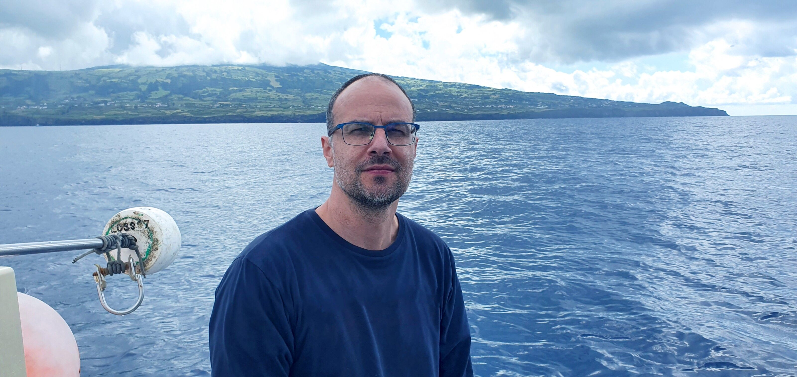
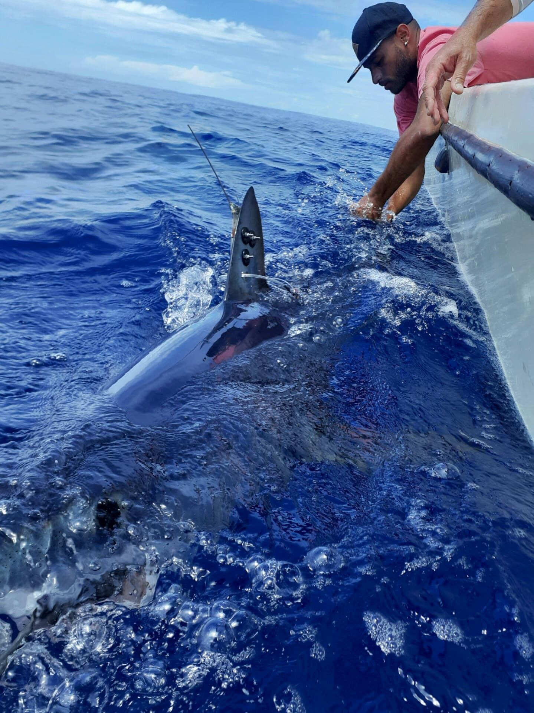
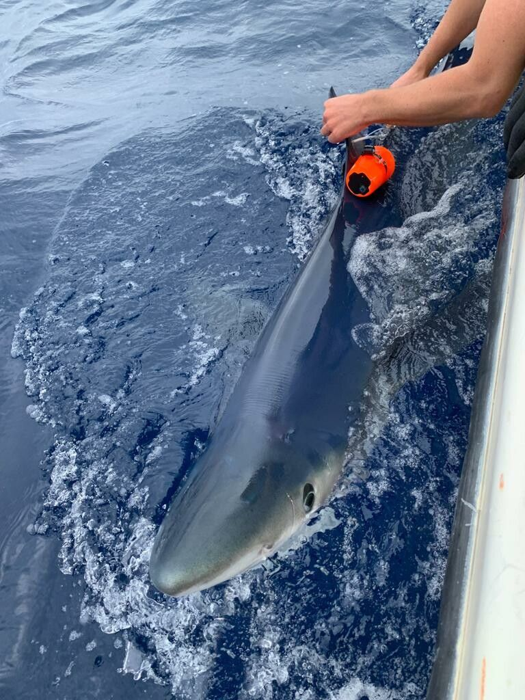

[facebook](https://www.facebook.com/sharer/sharer.php?u=https%3A%2F%2Fwww.natgeo.pt%2Fanimais%2F2021%2F07%2Fentrevista-nuno-queiroz-tubarao-anequim-devia-ter-uma-quota-pesca-zero) [twitter](https://twitter.com/share?url=https%3A%2F%2Fwww.natgeo.pt%2Fanimais%2F2021%2F07%2Fentrevista-nuno-queiroz-tubarao-anequim-devia-ter-uma-quota-pesca-zero&via=natgeo&text=Nuno%20Queiroz%3A%20%E2%80%9C%C3%89%20j%C3%A1%20evidente%20que%20o%20tubar%C3%A3o-anequim%20devia%20ter%20uma%20quota%20de%20pesca%20de%20zero%E2%80%9D) [whatsapp](https://web.whatsapp.com/send?text=https%3A%2F%2Fwww.natgeo.pt%2Fanimais%2F2021%2F07%2Fentrevista-nuno-queiroz-tubarao-anequim-devia-ter-uma-quota-pesca-zero) [flipboard](https://share.flipboard.com/bookmarklet/popout?v=2&title=Nuno%20Queiroz%3A%20%E2%80%9C%C3%89%20j%C3%A1%20evidente%20que%20o%20tubar%C3%A3o-anequim%20devia%20ter%20uma%20quota%20de%20pesca%20de%20zero%E2%80%9D&url=https%3A%2F%2Fwww.natgeo.pt%2Fanimais%2F2021%2F07%2Fentrevista-nuno-queiroz-tubarao-anequim-devia-ter-uma-quota-pesca-zero) [mail](mailto:?subject=NatGeo&body=https%3A%2F%2Fwww.natgeo.pt%2Fanimais%2F2021%2F07%2Fentrevista-nuno-queiroz-tubarao-anequim-devia-ter-uma-quota-pesca-zero%20-%20Nuno%20Queiroz%3A%20%E2%80%9C%C3%89%20j%C3%A1%20evidente%20que%20o%20tubar%C3%A3o-anequim%20devia%20ter%20uma%20quota%20de%20pesca%20de%20zero%E2%80%9D) [Animais](https://www.natgeo.pt/animais) 
# Nuno Queiroz: “É já evidente que o tubarão-anequim devia ter uma quota de pesca de zero” 
## Em conversa com a National Geographic, o investigador Nuno Queiroz sublinhou a urgência da melhoria das medidas de proteção dos tubarões e a necessidade da sua implementação rigorosa. Por [Filipa Coutinho](https://www.natgeo.pt/autor/filipa-coutinho) Publicado 15/07/2021, 14:49 

Nuno Queiroz, um dos maiores especialistas portugueses no estudo e monitorização de tubarões, esteve recentemente nos Açores a marcar tubarões para posterior análise do seu comportamento. 

Fotografia por Nuno Queiroz Os tubarões podem provocar medo e receio como nenhuma outra criatura marinha, mas isso não justifica a sua ingrata demonização pela cultura popular. Sabia que a probabilidade de morrermos esmagados por uma máquina de venda automática é maior do que no ataque de um tubarão? 

O [relatório internacional de ataques de tubarões](https://www.floridamuseum.ufl.edu/shark-attacks/yearly-worldwide-summary/) do Museu de História Natural da Flórida confirmou um total de 96 ataques de tubarões a humanos no ano de 2020, em todo o mundo. A análise revela ainda que o número de incidentes sem “provocação” humana foi substancialmente mais baixo do que a média dos cinco anos anteriores (2015-2019). Embora os confinamentos generalizados, as praias fechadas e a redução das viagens possam ter contribuído para esta queda em 2020, o relatório indica que as tendências de curto prazo demonstram a redução dos ataques de tubarões. 

Se o número de ataques é reduzido, por outro lado, a ação humana continua a apresentar um grande perigo para estes animais. Apesar da destruição do habitat, da poluição e das alterações climáticas prejudicarem a conservação dos tubarões, o maior impacto é a pesca excessiva. Estima-se que ocorram anualmente cerca de 100 milhões de capturas. De acordo com um [estudo](https://www.natgeo.pt/animais/2021/01/populacoes-oceanicas-de-raias-e-tubaroes-colapsaram) recente, as populações de 18 espécies de tubarões e raias colapsaram 70% desde 1970. Os autores da investigação alertam que, caso este ritmo se mantenha, muitas das espécies podem desaparecer dentro de uma ou duas décadas. 

[Nuno Queiroz](https://cibio.up.pt/people/details/ncqueiro) , investigador do Centro de Investigação de Biodiversidade e Recursos Genéticos (CIBIO-InBIO) dedicado ao estudo e monitorização de tubarões, tem vários trabalhos a decorrer com o seu grupo de investigação MOVE, Movement Ecology. Além da procura de [padrões semelhantes no comportamento de diferentes espécies de predadores marinhos](https://www.nature.com/articles/nature09116) , a equipa analisa o [risco a que os tubarões estão sujeitos](https://www.nature.com/articles/s41586-019-1444-4) , comparando zonas onde os tubarões passam mais tempo com zonas onde os barcos de pesca também passam mais tempo. 

O grupo de investigadores do CIBIO-InBIO está a desenvolver tecnologia própria, como um logger capaz de medir o oxigénio disponível na água, para melhor estudar o [impacto da desoxigenação dos oceanos no comportamento dos tubarões](https://elifesciences.org/articles/62508) e como isso influência o seu risco de captura. 

Numa conversa com a National Geographic, Nuno Queiroz explicou o impacto dos declínios populacionais de algumas espécies e frisou a urgência de aumentar os esforços de conservação. 

**O que o levou a dedicar o seu trabalho ao estudo de tubarões?** 

Desde pequeno que sempre senti um fascínio pela vida marinha e em particular por tubarões. O meu pai tinha uma série de livros do Hans Hass e ia regularmente pescar, e contava sempre histórias do que ia vendo, incluindo tubarões (isto ao largo de Moçambique onde nasci). 

**Em que zonas de Portugal existe maior concentração de tubarões? E maior diversidade de espécies?** 

Os tubarões existem por toda a costa portuguesa, mas há zonas onde é mais fácil encontrá-los, como por exemplo no Algarve ou ao largo dos [Açores](https://www.natgeo.pt/animais/2021/06/varios-tubaroes-de-alto-mar-avistados-ao-largo-dos-acores) e Madeira. Diria que os Açores serão a zona onde existe uma maior diversidade porque para além de ser possível observar espécies também comuns em Portugal continental, é uma região que recebe a 'visita' sazonal de espécies menos frequentes, como tubarões-baleia por exemplo. 

**Esquerda:** **Superior:** A equipa de investigadores esteve a marcar tubarões com a tag da equipa e transmissores de satélite. 

**Direita:** **Inferior:** A marcação dos indivíduos é feita através de transmissores colocados na barbatana, uma zona maioritariamente composta por cartilagem e pouco vascularizada, ideal para uma marcação com o menor impacto possível. 

fotografias de Nuno Queiroz **Tem conhecimento de algum acidente relacionado com tubarões em Portugal?** 

Acidente grave não. Mas tenho um amigo que sofreu um corte num dedo durante um torneio de marcação de tubarões. 

**Qual o impacto da pandemia na migração de tubarões?** 

Ainda não se conhece bem. O que foi observado, sobretudo no primeiro confinamento mundial, foi um maior número de tubarões avistados perto da costa, em praias e portos. Isto estará provavelmente relacionado com a enorme diminuição de ruído que foi verificada. Existe agora um projeto mundial de biotelemetria da International Bio-Logging Society ( [COVID-19 BIO-LOGGING INITIATIVE](https://www.bio-logging.net/) ) que vai analisar o comportamento de várias espécies de animais antes, durante e depois do confinamento. 

**Por que motivo é tão urgente proteger estes animais?** 

Porque nas últimas décadas várias espécies sofreram declínios populacionais enormes (algumas espécies chegaram a perder cerca de 80 a 90% da população). E foram sobretudo as espécies de valor comercial a sofrer os maiores declínios. São predadores de topo que têm uma função importantíssima de controle _top-down_ . Há casos bem documentados de como a remoção de predadores de topo como tubarões causa um distúrbio ecológico grave que leva, por exemplo, a uma explosão populacional das suas presas, muitas vezes com impactos económicos. Estes exemplos são sobretudo para zonas costeiras com cadeias alimentares bem definidas sendo que o impacto da remoção de tubarões no mar alto não está ainda bem estudado. 

**Quais as ações de conservação atualmente praticadas em Portugal?** 

Portugal tem algumas zonas de proteção marítima costeiras, mas em relação às espécies pelágicas de mar alto, adota as medidas definidas a nível europeu para as diferentes zonas de pesca (Atlântico, Pacífico Sul e Índico). Por exemplo, existe atualmente uma quota de pesca (limite de captura) para os tubarões-anequins (em águas internacionais do Atlântico Norte) e para tubarões-azuis (mais recente). 

**Como se podem aumentar os esforços de conservação das espécies de tubarão que ocorrem na Zona Económica Exclusiva (ZEE) portuguesa?** 

Sobretudo com a melhoria das medidas de proteção definidas para as diferentes zonas de pesca, como por exemplo o Atlântico Norte. Estas medidas acabam depois por ter um impacto nas ZEE. Por exemplo, é já evidente que o tubarão-anequim devia ter uma quota de pesca de zero. Aliás, esta espécie foi recentemente incluída no anexo II da CITES e tem o seu comércio proibido. Mas incompreensivelmente, é ainda possível aos barcos de bandeira europeia capturar anequins. 

**De que forma a população pode contribuir para a conservação dos tubarões?** 

Uma vez que o consumo de carne e barbatanas não é muito expressivo, a população poderia fazer pressão sobre a classe política para que as medidas de proteção fossem melhoradas e implementadas rigorosamente, uma vez que muitas espécies estão em risco não só pela pesca excessiva, mas também por causa das alterações climáticas (ligadas ao aquecimento e [desoxigenação](https://www.natgeo.pt/animais/2021/07/desoxigenacao-do-atlantico-esta-a-empurrar-os-tubaroes-para-superficie) ). 

_Durante o mês de julho, veja o maior **[Sharkfest](https://www.natgeo.pt/sharkfest-2021)** de sempre, no National Geographic Wild e no Disney+._ 

