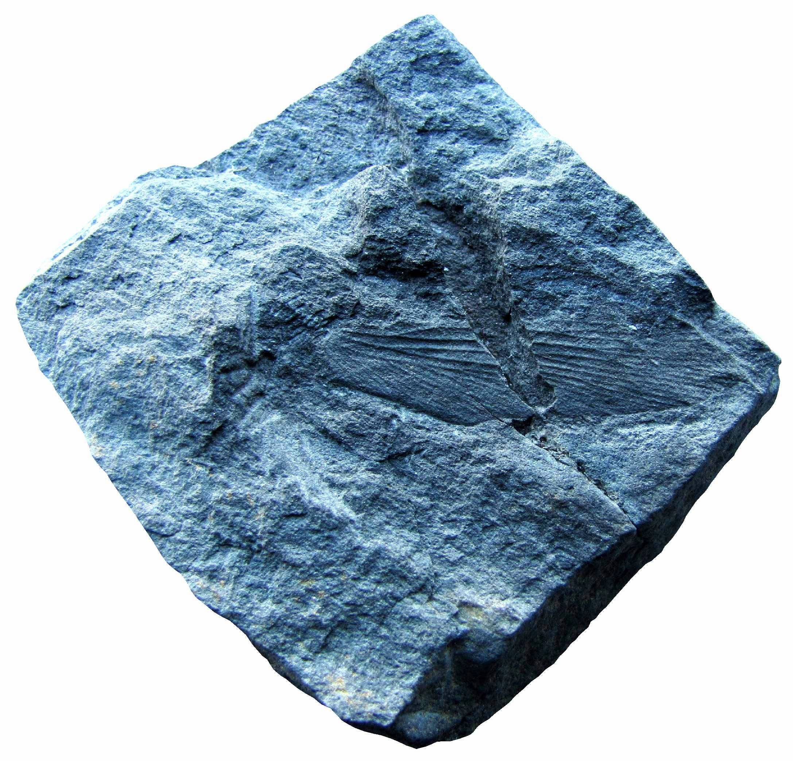

[facebook](https://www.facebook.com/sharer/sharer.php?u=https%3A%2F%2Fwww.natgeo.pt%2Fciencia%2F2019%2F09%2Ffossil-de-primitiva-barata-parasitoide-descoberto-na-regiao-do-douro) [twitter](https://twitter.com/share?url=https%3A%2F%2Fwww.natgeo.pt%2Fciencia%2F2019%2F09%2Ffossil-de-primitiva-barata-parasitoide-descoberto-na-regiao-do-douro&via=natgeo&text=F%C3%B3ssil%20de%20Primitiva%20%E2%80%9BBarata%20Parasit%C3%B3ide%E2%80%99%20Descoberto%20na%20Regi%C3%A3o%20do%20Douro) [whatsapp](https://web.whatsapp.com/send?text=https%3A%2F%2Fwww.natgeo.pt%2Fciencia%2F2019%2F09%2Ffossil-de-primitiva-barata-parasitoide-descoberto-na-regiao-do-douro) [flipboard](https://share.flipboard.com/bookmarklet/popout?v=2&title=F%C3%B3ssil%20de%20Primitiva%20%E2%80%9BBarata%20Parasit%C3%B3ide%E2%80%99%20Descoberto%20na%20Regi%C3%A3o%20do%20Douro&url=https%3A%2F%2Fwww.natgeo.pt%2Fciencia%2F2019%2F09%2Ffossil-de-primitiva-barata-parasitoide-descoberto-na-regiao-do-douro) [mail](mailto:?subject=NatGeo&body=https%3A%2F%2Fwww.natgeo.pt%2Fciencia%2F2019%2F09%2Ffossil-de-primitiva-barata-parasitoide-descoberto-na-regiao-do-douro%20-%20F%C3%B3ssil%20de%20Primitiva%20%E2%80%9BBarata%20Parasit%C3%B3ide%E2%80%99%20Descoberto%20na%20Regi%C3%A3o%20do%20Douro) [Ciência](https://www.natgeo.pt/ciencia) 
# Fóssil de Primitiva ‛Barata Parasitóide’ Descoberto na Região do Douro 
## O paleontólogo português Pedro Correia descobriu um fóssil raro de uma barata primitiva com 300 milhões de anos na região do Douro. A descoberta do novo fóssil de inseto foi publicada na revista científica Historical Biology. Por [National Geographic](https://www.natgeo.pt/autor/national-geographic) Publicado 24/09/2019, 14:02 

Novo fóssil de inseto (espécime UP-MHNFCUP-177229) preservando uma impressão de asa dianteira de uma barata parasitóide (Eneriblatta sp.) descoberto nos afloramentos carboníferos de São Pedro da Cova. Fotografia por Pedro Correia _“ **Este inseto fóssil pertence a um grupo extinto de baratas parasitóides e ancestral das baratas modernas que existiu no final do Paleozóico, durante o Período Carbonífero** ”_ , revela Pedro Correia depois da [publicação](https://www.tandfonline.com/doi/abs/10.1080/08912963.2019.1661407?fbclid=IwAR1VQ6S2-kwRog-JY9WYgElz1P6R9JQjZd7RntMNZOuUY95DA3GymQGmgOE&journalCode=ghbi20) da descoberta. As baratas parasitóides representam um grupo de dictópteros primitivos do grupo-tronco Dictyoptera conhecidos vulgarmente como “roacóides”, e estão entre os insetos alados (aqueles que possuem asas) mais antigos que viveram nas grandes florestas tropicais do Carbonífero, chamadas de “Florestas de Carvão”. 

Os roacóides são frequentemente considerados como verdadeiros blatários por causa de suas grandes semelhanças na forma do corpo e do padrão de nervação das asas com espécies atuais de baratas pertencentes à subordem Blattaria. Mas os roacóides diferenciavam-se dos seus descendentes ou congéneres modernos por terem ovipositores longos nas terminálias das fêmeas. Os ovipositores são caracterizados por uma genitália externa desenvolvida que permite que as fêmeas depositem os seus ovos em plantas e animais hospedeiros. Ao contrário das fêmeas de blatários modernos que transportam os seus ovos armazenados em ootecas (cápsulas de ovos) ou formados individualmente, as fêmeas de roacóides depositavam um ou mais ovos no interior (endoparasitóides) ou na superfície (ectoparasitóides) do seu hospedeiro. Quando eclodiam dos ovos, as larvas de baratas parasitóides alimentavam-se dos seus hospedeiros até se tornarem em indivíduos adultos. 

Desenhos esquemáticos da vista dorsal e ventral de uma barata parasitóide (roacóide – dictóptero paleozóico) do Período Carbonífero, exibindo uma genitália externa – ovipositor. Fotografia por Hörnig Et Al. 2018 “ _Os ovipositores foram uma estratégia evolutiva para os dictópteros primitivos obterem uma fonte segura de alimento para as suas crias, mas também permitir a sua segurança contra potenciais predadores. É possível também que um clima progressivamente mais quente e seco que caracterizou a região do Douro no final do Período Carbonífero, tenha conduzido ao aparecimento de grupos específicos de insetos, tais como os dictópteros, a desenvolver órgãos ovipositórios”_ , afirma o paleontólogo. 

Molde latex e desenho esquemático de uma asa dianteira do novo fóssil de barata parasitóide (Eneriblatta sp. – UP-MHNFCUP-177229). Fotografia por Pedro Correia Parasitóides modernos como as vespas da subordem Apocrita (Hymenoptera) desenvolveram semelhantes órgãos ovipositórios, com ovipositores muito compridos para inserir os ovos no interior dos hospedeiros. __ Esta relação ecológica interespecífica (entre espécies distintas) leva quase sempre à morte do hospedeiro (parasitoidismo). “ _É uma estratégia de sobrevivência desenvolvida por este tipo de insetos especializados para se alimentar, reproduzir-se e deixar descendência_ ”, conclui o cientista português. 

O novo fóssil de inseto foi encontrado numa jazida fossilífera, em São Pedro da Cova, onde tinha sido recentemente descoberto pelo paleontólogo português uma nova espécie de planta extinta da ordem Cycadopsida, a cicadopsídea _Lesleya iberiensis_ . 

Uma primitiva ‛barata parasitóide’ sobre a folhagem da nova espécie Lesleya iberiensis. Fotografia por CORREIA ET AL. 2016 reconstrução artística de Andrey Atuchin Pedro Correia e a sua equipa já tinham anteriormente descoberto nos afloramentos de São Pedro da Cova duas espécies de inseto novas para a ciência e o primeiro aracnídeo documentado no Carbonífero português. Mais recentemente, o paleontólogo descreveu duas novas espécies de plantas extintas, a pteridospérmica **_[Douropteris alvarezii](https://www.natgeo.pt/ciencia/2018/09/nova-planta-fossil-descoberta-em-sao-pedro-da-cova)_** e a esfenopsídea **_[Annularia noronhai](https://www.natgeo.pt/ciencia/2019/05/nova-especie-de-planta-fossil-descoberta-na-regiao-do-douro)_** , ambas encontradas na mesma região. **** 

Afloramento (jazida fossilífera) onde foi encontrado o fóssil de barata parasitóide. Fotografia por Pedro Correia Os fósseis da barata parasitóide encontram-se referenciados e armazenados nas coleções do Museu de História Natural e da Ciência da Universidade do Porto. O estudo científico teve colaboração dos paleoentomólogos franceses Thomas Schubnel e André Nel, ambos do Museu Nacional de História Natural de Paris (França). 

Pedro Correia juntamente com a sua equipa irão muito em breve apresentar um trabalho científico inédito sobre interações ecológicas entre plantas e insetos que ocorreram na região do Douro no Carbonífero superior, há 300 milhões de anos. 

_Pedro Correia é investigador doutorado no Instituto das Ciências da Terra da Faculdade de Ciências da Universidade do Porto, onde desenvolve investigação na área da Paleobotânica._ 

