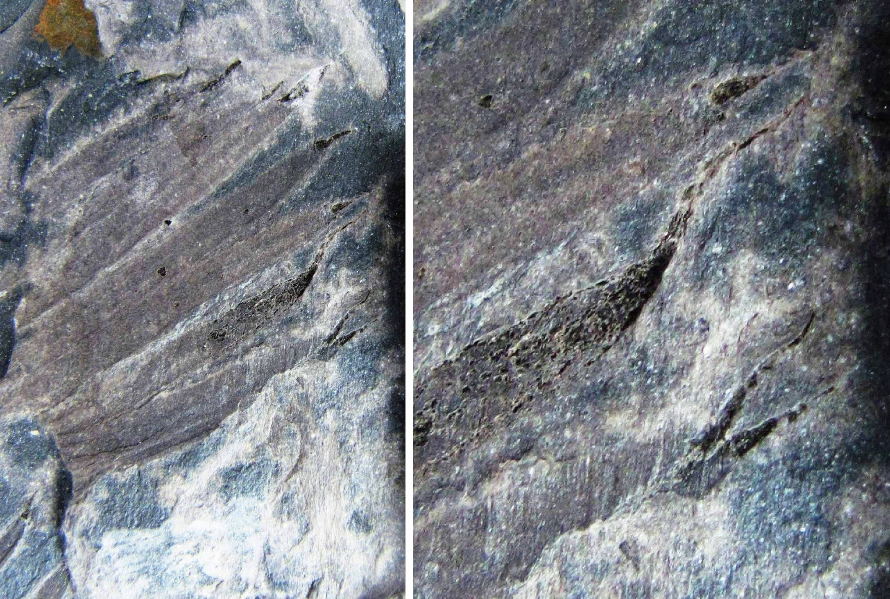

[facebook](https://www.facebook.com/sharer/sharer.php?u=https%3A%2F%2Fwww.natgeo.pt%2Fciencia%2F2019%2F05%2Fnova-especie-de-planta-fossil-descoberta-na-regiao-do-douro) [twitter](https://twitter.com/share?url=https%3A%2F%2Fwww.natgeo.pt%2Fciencia%2F2019%2F05%2Fnova-especie-de-planta-fossil-descoberta-na-regiao-do-douro&via=natgeo&text=Nova%20Esp%C3%A9cie%20de%20Planta%20F%C3%B3ssil%20Descoberta%20na%20Regi%C3%A3o%20do%20Douro) [whatsapp](https://web.whatsapp.com/send?text=https%3A%2F%2Fwww.natgeo.pt%2Fciencia%2F2019%2F05%2Fnova-especie-de-planta-fossil-descoberta-na-regiao-do-douro) [flipboard](https://share.flipboard.com/bookmarklet/popout?v=2&title=Nova%20Esp%C3%A9cie%20de%20Planta%20F%C3%B3ssil%20Descoberta%20na%20Regi%C3%A3o%20do%20Douro&url=https%3A%2F%2Fwww.natgeo.pt%2Fciencia%2F2019%2F05%2Fnova-especie-de-planta-fossil-descoberta-na-regiao-do-douro) [mail](mailto:?subject=NatGeo&body=https%3A%2F%2Fwww.natgeo.pt%2Fciencia%2F2019%2F05%2Fnova-especie-de-planta-fossil-descoberta-na-regiao-do-douro%20-%20Nova%20Esp%C3%A9cie%20de%20Planta%20F%C3%B3ssil%20Descoberta%20na%20Regi%C3%A3o%20do%20Douro) [Ciência](https://www.natgeo.pt/ciencia) 
# Nova Espécie de Planta Fóssil Descoberta na Região do Douro 
## Foi descoberta uma nova espécie de esfenopsídeos denominada Annularia noronhai nos afloramentos de São Pedro da Cova, na Bacia do Douro. Por [National Geographic](https://www.natgeo.pt/autor/national-geographic) Publicado 22/05/2019, 12:21 

Parte e contraparte do holótipo UP-MHNFCP-154065 – ramo articulado com verticilos compostos de folhas lanceoladas Fotografia por Pedro Correia Após a descoberta de um novo género de planta num **[fóssil com mais de 300 milhões de anos](https://www.natgeo.pt/ciencia/2018/09/nova-planta-fossil-descoberta-em-sao-pedro-da-cova)** , a equipa do Instituto das Ciências Terra da Universidade do Porto liderada pelo paleontólogo Pedro Correia, encontrou uma nova espécie de esfenopsídeos nos afloramentos de São Pedro da Cova. Esta localidade é uma das zonas portuguesas mais ricas em fósseis do período Carbonífero. O novo estudo foi publicado este mês na revista científica [Historical Biology](https://www.tandfonline.com/doi/abs/10.1080/08912963.2019.1613391?fbclid=IwAR1oKqHvtmqTWPYETesnZD4Ky1UFFEs565oMR2HXDMOXpC1JeHeOIp5Wxbo&journalCode=ghbi20) . 

“ **_É um achado importante para a ciência, pois fornece informações valiosas sobre as relações ecológicas e evolutivas dos esfenopsídeos_** ”, revela Pedro Correia. Os esfenopsídeos são um grupo de plantas articuladas da família Calamitaceae, conhecidos como ‘cavalinhas extintas’, parentes do atual _Equisetum_ (Equisetaceae), o único táxon existente da ordem Equisetales. Os esfenopsídeos são muito diversificados e consistem em vários géneros fósseis, e representaram um dos grupos mais difundidos de plantas terrestres no final da era Paleozóica. 

Holótipo UP-MHNFCP-154065 – parte terminal de folhas lanceoladas com ápices de forma acuminada-caudada Fotografia por Pedro Correia **_Annularia noronhai_** distingue-se principalmente pelas suas folhas lanceoladas com ápices acuminados e caudados, com mucros muito alongados. Esses curiosos mucros são descritos como sendo possíveis “ganchos” para se agarrarem a ramos adjacentes da planta parental ou mesmo de plantas vizinhas. Esta característica morfo-funcional específica é o resultado de uma adaptação ecológica dentro da Bacia do Douro num ambiente intramontanhoso. 

“ _Annularia noronhai é uma das várias novas espécies que têm sido descobertas nos afloramentos de S. Pedro da Cova **** nos últimos 10 anos da nossa investigação na paleobotânica do Carbonífero em Portugal. O microclima restritivo a um ambiente intramontanhoso com características ripícolas que caracterizou a Bacia do Douro há 300 milhões de anos conduziu a um certo grau de endemismo florístico local, dando origem a várias espécies endémicas na Bacia do Douro, em particular na região de São Pedro da Cova_ ”, afirma o paleontólogo. 

Desenho interpretativo em câmara clara do espécime-tipo (holótipo UP-MHNFCP-154065) de Annularia noronhai sp. nov. Fotografia por Pedro Correia O novo achado fóssil foi batizado com o nome **_Annularia noronhai_** em homenagem ao geólogo português Fernando Noronha, antigo docente na Faculdade de Ciências da Universidade do Porto. 

Os fósseis da nova espécie encontram-se referenciados e armazenados nas coleções do Museu de História Natural e da Ciência da Universidade do Porto. 

Este estudo teve o contributo dos investigadores Artur Sá da Universidade de Trás-os-Montes e Alto Douro (Vila Real), Zbynek Šimunek dos Serviços Geológicos de Praga (República Checa), Christopher Cleal do Museu Nacional de Ciências Naturais do País de Gales (Reino Unido), Bruno Vallois do Museu de História Natural de Grenoble (França) e Rúben Domingos da Universidade Nova de Lisboa (Caparica). 

Em breve, a equipa apresentará mais estudos científicos sobre outras novas espécies de plantas primitivas que se juntam a outras descobertas de fósseis de insetos, igualmente descritos recentemente, documentados na região do Douro. 

