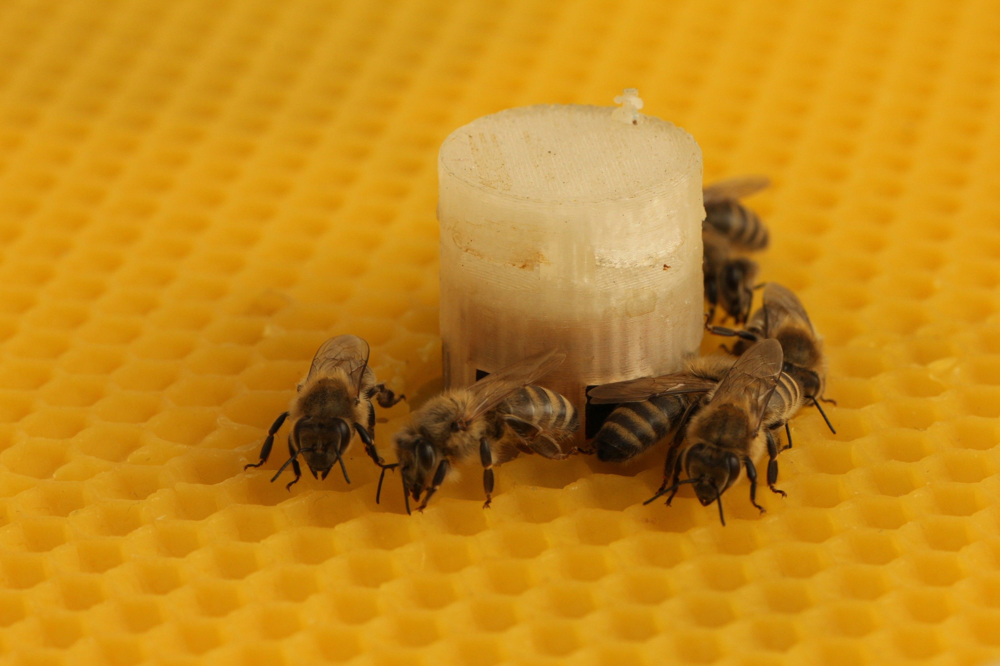
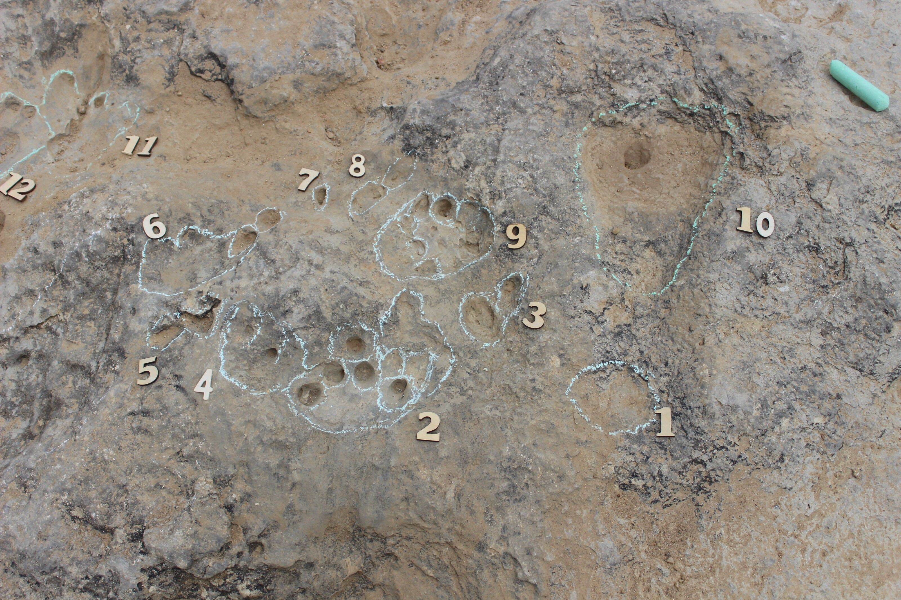
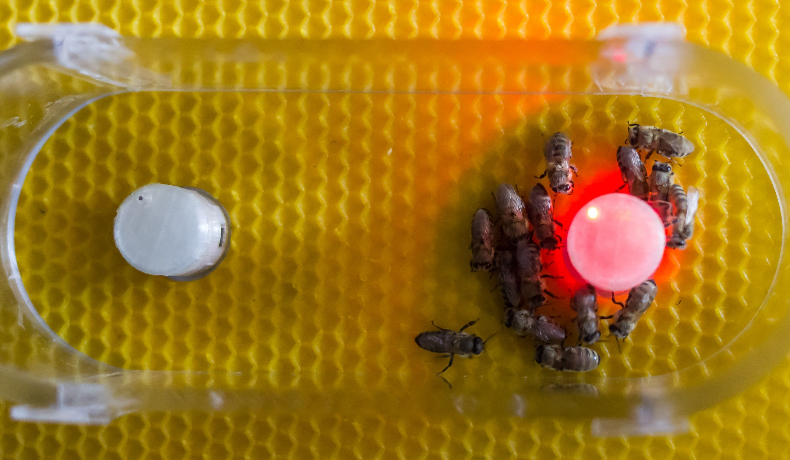
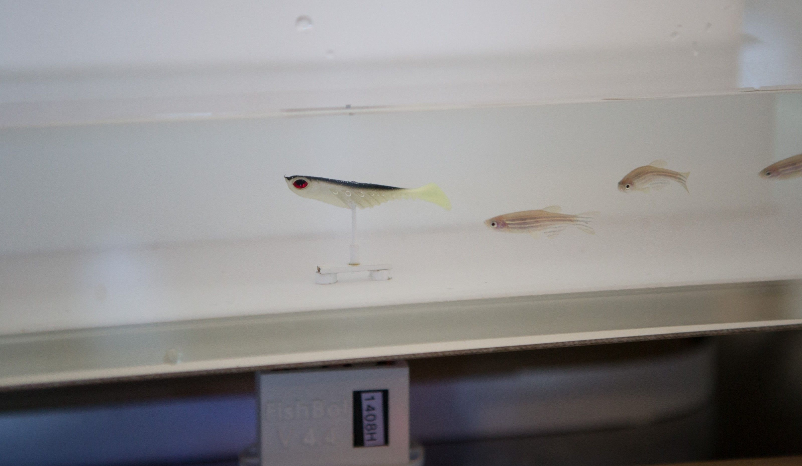

[facebook](https://www.facebook.com/sharer/sharer.php?u=https%3A%2F%2Fwww.natgeo.pt%2Fciencia%2F2019%2F04%2Fprojeto-com-cunho-portugues-ajuda-abelhas-a-comunicar-com-peixes) [twitter](https://twitter.com/share?url=https%3A%2F%2Fwww.natgeo.pt%2Fciencia%2F2019%2F04%2Fprojeto-com-cunho-portugues-ajuda-abelhas-a-comunicar-com-peixes&via=natgeo&text=Projeto%20com%20Cunho%20Portugu%C3%AAs%20Ajuda%20Abelhas%20a%20Comunicar%20com%20Peixes) [whatsapp](https://web.whatsapp.com/send?text=https%3A%2F%2Fwww.natgeo.pt%2Fciencia%2F2019%2F04%2Fprojeto-com-cunho-portugues-ajuda-abelhas-a-comunicar-com-peixes) [flipboard](https://share.flipboard.com/bookmarklet/popout?v=2&title=Projeto%20com%20Cunho%20Portugu%C3%AAs%20Ajuda%20Abelhas%20a%20Comunicar%20com%20Peixes&url=https%3A%2F%2Fwww.natgeo.pt%2Fciencia%2F2019%2F04%2Fprojeto-com-cunho-portugues-ajuda-abelhas-a-comunicar-com-peixes) [mail](mailto:?subject=NatGeo&body=https%3A%2F%2Fwww.natgeo.pt%2Fciencia%2F2019%2F04%2Fprojeto-com-cunho-portugues-ajuda-abelhas-a-comunicar-com-peixes%20-%20Projeto%20com%20Cunho%20Portugu%C3%AAs%20Ajuda%20Abelhas%20a%20Comunicar%20com%20Peixes) [Ciência](https://www.natgeo.pt/ciencia) 
# Projeto com Cunho Português Ajuda Abelhas a Comunicar com Peixes 
## O projeto ASSISIbf desenvolve robots que aprendem a linguagem animal para desenvolverem canais de comunicação entre diferentes espécies. Por [National Geographic](https://www.natgeo.pt/autor/national-geographic) Publicado 23/04/2019, 16:24 

Abelhas em torno de um robô. As temperaturas próximas de 36° atraem as abelhas. Fotografia por EU-FET project ASSISIbf [ASSISIbf](http://assisi-project.eu/) ( _Animal and Robot Societies Self Organise and Integrate by Social Interaction_ ) é um consórcio de seis instituições europeias da Áustria (equipa coordenadora do projeto), Alemanha, Croácia, França, Portugal e Suíça, financiado com 6 milhões de euros. A equipa portuguesa envolvida no projeto trabalha no [Instituto de Biossistemas e Ciências Integrativas](http://bioisi.pt/) (BioISI), uma unidade de investigação da [Faculdade de Ciências da Universidade de Lisboa](https://ciencias.ulisboa.pt/) (FCUL). 

O principal objetivo do projeto é estabelecer uma sociedade híbrida composta de diferentes grupos de animais e de robôs. Esta abordagem permite aos investigadores interferirem nas sociedades animais e, potencialmente, gerir o meio ambiente de outra forma. Pode ter impactos em áreas como a agricultura, a gestão de recursos animais e a proteção ambiental. 

Os investigadores ambicionam **influenciar o comportamento animal através dos robôs** e aumentar as capacidades sensoriais e cognitivas dos robôs através dos animais. A interação com os animais também pode enriquecer as competências dos robôs, permitindo-lhes aprender autonomamente a sua linguagem. O projeto mostrou ser possível a formação de uma sociedade híbrida entre grupos de abelhas juvenis, de peixes zebra e de robôs que interagem com as duas espécies de animais. 

O Professor **Luís Correia** , líder da equipa portuguesa e docente do Departamento de Informática da FCUL, respondeu a 10 perguntas sobre o impacto deste trabalho de investigação na intervenção humana em sociedades animais. 

Grupo de peixes zebra e um robô que interage com eles. O robô tem duas partes, uma por baixo do aquário, que assegura a locomoção, e outra dentro do aquário, constituída por uma maquete de peixe zebra. O acoplamento entre as duas partes do robô é através de ímanes. A perceção é assegurada por uma câmara de visão por cima do aquário e por sensores de distância na parte com locomoção. Fotografia por Frank Bonnet **Porquê a escolha de abelhas e peixes?** 

Porque ambas as espécies são gregárias e interessava-nos trabalhar com comportamentos coletivos, e porque ambas são espécies com que se pode trabalhar em laboratório e evoluem em ambientes suficientemente diferentes para não haver qualquer tipo de influência físico-química entre elas. Este último ponto é importante porque queríamos garantir que a única troca de informação entre as duas espécies teria de ser intermediada por robôs. 

**Quanto tempo demorou o desenvolvimento do algoritmo dos robots?** 

Três a quatro anos, em sucessivas fases, para o conjunto dos robôs que interagem com as abelhas e dos que interagem com os peixes. 

**Que significado tem este projeto para o combate da possível extinção das espécies animais?** 

Este projeto mostra ser possível trocar informação entre grupos de animais de duas espécies distintas, em ambientes distintos, intermediados por robôs que são bem assimilados por ambas as espécies. As possibilidades deste tipo de comunicação entre espécies são inúmeras e estão virtualmente por explorar. Como tal, uma dessas possibilidades é estimular comportamentos coletivos de uma espécie por outra, de modo a aumentar as possibilidades de sobrevivência da primeira. 

Espaço de decisão binária para as abelhas. Dois robôs competem entre si para atrair abelhas. São robôs sem locomoção. Atuam alterando a sua temperatura, entre 28° e 36° C, vibrando e emitindo um sopro de ar moderado. Todos estes estímulos têm efeitos significativos nas abelhas. Cada robô tem 6 sensores de proximidade para deteção de abelhas na sua vizinhança. Fotografia por EU-FET project ASSISIbf **Quais as vantagens de animais artificiais face à intervenção humana?** 

É incomportável ter humanos a desempenhar o papel de interagir individualmente ou com pequenos grupos de animais de uma espécie. As limitações decorrem tanto da multiplicidade de interações que é necessária como do próprio acesso físico ao meio onde evoluem os animais. Os robôs podem ser construídos à escala dos animais, funcionam autonomamente e têm capacidade de evoluir o seu comportamento em função das interações que vão tendo. E podemos constantemente obter as informações sobre o que se vai sucedendo, quer nos animais, percecionados pelos robôs, quer nos robôs, pelo seu próprio estado. 

**Qual a importância desta descoberta para as próximas gerações humanas?** 

Para além do que já foi referido em resposta a uma pergunta anterior, pensamos que os resultados deste projeto podem ter interesse para novas formas de pastorícia e de criação de animais em geral, como apicultura, piscicultura, pecuária, etc. Uma outra possibilidade a explorar é a de usar organismos microscópicos, do tipo fungos, por exemplo, em computação massivamente paralela. Este projeto também mostrou essa possibilidade de computação híbrida, realizada por animais e robôs. 

**Como é que esta descoberta pode influenciar o comportamento animal?** 

O comportamento de populações animais intervencionadas (digamos assim) com robôs pode ser modulado, influenciando os animais em comportamentos que lhe são naturais, como por exemplo a optarem mais frequentemente por uma fonte de alimentação do que por outra, ou na escolha de locais para o ninho ou abrigo. 

Robô lidera um grupo de peixes zebra num segmento de aquário em forma de corredor. Fotografia por Frank Bonnet **Será possível proteger e gerir de outra forma o meio ambiental?** 

Possível será, a uma escala local, como já foi referido anteriormente. A uma escala global requer uma intervenção muito vasta, de modo a que a influência possa ser significativa. 

**Poderemos obter novos _insights_ sobre o comportamento animal?** 

Definitivamente sim. Este foi um dos aspetos que nos foi mais evidente no decorrer do projeto. Verificámos comportamentos nos grupos de animais que não eram documentados, como por exemplo as abelhas juvenis se dividirem normalmente em três tipos de comportamentos distintos: imobilidade, vaguear, seguir ao longo de paredes. 

**Poderão utilizar esta tecnologia para combater algumas epidemias na área da saúde?** 

Não consigo responder de uma maneira conclusiva. O projeto investigou e produziu resultados na modulação (que se pode considerar como uma alteração ligeira) do comportamento de coletivos de animais. Se este tipo de intervenção puder vir a ser utilizado no combate de epidemias na área da saúde, então a resposta será afirmativa. 

**Quais as próximas etapas do projeto?** 

O projeto ASSISIbf foi financiado pelo programa FET (Future and Emerging Technologies) da União Europeia, durante cinco anos e meio e terminou no final de julho de 2018. O consórcio, constituído por seis parceiros europeus ainda irá publicar resultados dos últimos estudos realizados, que esperamos venham a ter um impacto significativo. Posteriormente devemos estudar possibilidades de submeter outras propostas, que permitam aprofundar a investigação agora realizada. 

