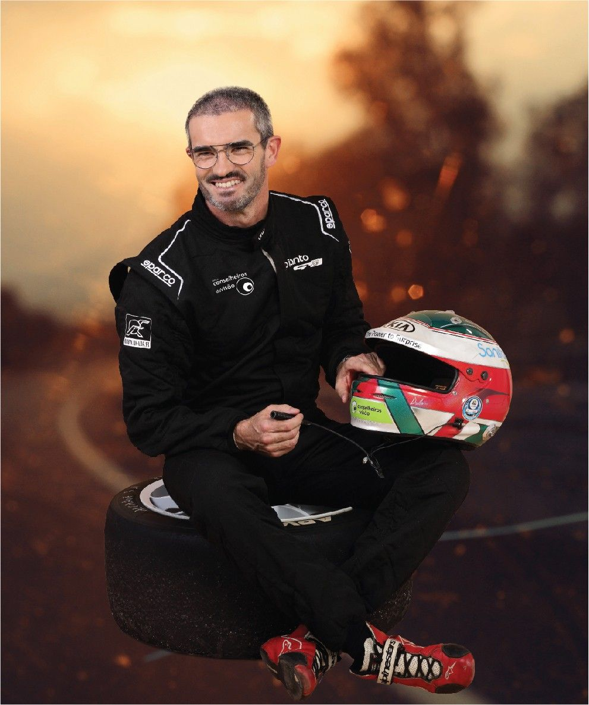

[facebook](https://www.facebook.com/sharer/sharer.php?u=https%3A%2F%2Fwww.natgeo.pt%2Fciencia%2F2019%2F06%2Fsabia-que-25-dos-acidentes-estao-relacionados-com-problemas-visuais) [twitter](https://twitter.com/share?url=https%3A%2F%2Fwww.natgeo.pt%2Fciencia%2F2019%2F06%2Fsabia-que-25-dos-acidentes-estao-relacionados-com-problemas-visuais&via=natgeo&text=Sabia%20que%2025%25%20dos%20Acidentes%20Est%C3%A3o%20Relacionados%20com%20Problemas%20Visuais%3F) [whatsapp](https://web.whatsapp.com/send?text=https%3A%2F%2Fwww.natgeo.pt%2Fciencia%2F2019%2F06%2Fsabia-que-25-dos-acidentes-estao-relacionados-com-problemas-visuais) [flipboard](https://share.flipboard.com/bookmarklet/popout?v=2&title=Sabia%20que%2025%25%20dos%20Acidentes%20Est%C3%A3o%20Relacionados%20com%20Problemas%20Visuais%3F&url=https%3A%2F%2Fwww.natgeo.pt%2Fciencia%2F2019%2F06%2Fsabia-que-25-dos-acidentes-estao-relacionados-com-problemas-visuais) [mail](mailto:?subject=NatGeo&body=https%3A%2F%2Fwww.natgeo.pt%2Fciencia%2F2019%2F06%2Fsabia-que-25-dos-acidentes-estao-relacionados-com-problemas-visuais%20-%20Sabia%20que%2025%25%20dos%20Acidentes%20Est%C3%A3o%20Relacionados%20com%20Problemas%20Visuais%3F) PATROCINADO POR 

[Ciência](https://www.natgeo.pt/ciencia) 
# Sabia que 25% dos Acidentes Estão Relacionados com Problemas Visuais? 
## Descubra a importância da acuidade ocular na prevenção rodoviária e o porquê de uma visão controlada regularmente poder fazer a diferença num cenário de perigo eminente. Por [National Geographic](https://www.natgeo.pt/autor/national-geographic) Publicado 17/06/2019, 11:58 

A visão é um dos sentidos mais importantes na condução. É fundamental ver bem para 
distinguir corretamente os objetos, as distâncias, a velocidade e prever as reações das 
outras pessoas na estrada. Fotografia por Conselheiros da Visão Conduz, mas tem a certeza que vê suficientemente bem? Conduzir é uma tarefa importante, quer seja condutor ou passageiro. Se a sua visão estiver comprometida, a sua aptidão para conduzir em segurança também estará. 

Em Portugal, segundo um [estudo](https://observatorio.acp.pt/estudos/entity/o-condutor-portugues) do Observatório ACP (Automóvel Club de Portugal) realizado em 2018, 90% dos adultos com mais de 18 anos inquiridos possui carta de condução. Numa sociedade onde a multiplicidade de atividades quotidianas exige um grau cada vez maior de gestão de tempo e coordenação de deslocações, existe uma utilização crescente do automóvel e três em cada quatro condutores inquiridos conduz diariamente. 

Enquanto conduz, **90% da informação sensorial necessária é recolhida através da visão** . Os seus olhos são um dos aspetos de segurança mais cruciais quando se encontra à frente de um volante. É quando está parado que possui maior campo visual, com cerca de 180° horizontais e 130° verticais. Quando se encontra em movimento e, sobretudo, sempre que a velocidade aumenta, a sua visão foca-se automaticamente mais adiante, reduzindo o seu campo visual em todas as direções. 

**Quando foi a última vez que realizou um exame ocular?** 

Estima-se que 20% dos condutores têm um defeito visual não corrigido e, destes, 15% tem uma acuidade visual inferior a 50%. À medida que envelhece, a sua acuidade visual começa a deteriorar-se e carece de mais luz para ver tão bem como via quando era mais jovem. Apesar de muitas pessoas continuarem a ver bem, é natural que a sua capacidade de ver objetos em movimento diminua. 

Miopia, astigmatismo ou hipermetropia são patologias que podem sofrer alterações com o tempo e, por isso, é fundamental que controle a sua visão periodicamente. Um problema ocular não tratado pode contribuir para um acidente rodoviário: cerca de **25% dos acidentes rodoviários estão relacionados com problemas visuais** . 

Atualmente, para obter ou renovar a carta de condução em Portugal, é obrigatório realizar um exame médico visual completo. Esse exame incide sobre o campo visual, a visão crepuscular e as doenças oftalmológicas progressivas e pode revelar sinais de outros problemas de saúde como tensão arterial alta, diabetes e até doenças cardíacas. 

Se tem alguma dúvida sobre a sua condição ocular, deve realizar um exame visual antes de voltar a conduzir. 

Assegure-se que utiliza óculos de sol quando conduz durante o dia para aumentar as suas condições de segurança.
Fotografia por Conselheiros da Visão **Qual a relevância da utilização de óculos de sol?** 

Mesmo para condutores com boa visão, o uso de óculos de sol com lentes filtrantes pode ajudar a prevenir o risco de acidente por encandeamento. Na primavera, outono e inverno, o sol está mais baixo, podendo ser incomodativo e restringir a capacidade visual. 

- O uso de lentes polarizadas é uma excelente opção, uma vez que elimina reflexos causados pela luz do sol na estrada. 

- As lentes com coloração amarela ou laranja proporcionam um maior contraste em tempo de nevoeiro ou chuva. 

- Para um maior conforto, use lentes fotocromáticas de tom variável e alta proteção ocular. 

Quando circular na estrada com sol, independentemente da estação, não se esqueça dos seus óculos de sol. 

<code>{"tag":"VIDEO","src":"data:audio/mpeg;base64,SUQzBAAAAAAAI1RTU0UAAAAPAAADTGF2ZjU2LjI1LjEwMQAAAAAAAAAAAAAA//tQAAAAAAAAAAAAAAAAAAAAAAAAAAAAAAAAAAAAAAAAAAAASW5mbwAAAA8AAAACAAAEEwCZmZmZmZmZmZmZmZmZmZmZmZmZmZmZmZmZmZmZmZmZmZmZmZmZmZmZmZmZmZmZmZmZ//////////////////////////////////////////////////////////////////8AAAAATGF2YzU2LjI2AAAAAAAAAAAAAAAAJAAAAAAAAAAABBN3YQi+AAAAAAAAAAAAAAAAAAAAAP/7kGQAD/AAAGkAAAAIAAANIAAAAQAAAaQAAAAgAAA0gAAABExBTUUzLjk5LjVVVVVVVVVVVVVVVVVVVVVVVVVVVVVVVVVVVVVVVVVVVVVVVVVVVVVVVVVVVVVVVVVVVVVVVVVVVVVVVVVVVVVVVVVVVVVVVVVVVVVVVVVVVVVVVVVVVVVVVVVVVVVVVVVVVVVVVVVVVVVVVVVVVVVVVVVVVVVVVVVVVVVVVVVVVVVVVVVVVVVVVVVVVVVVVVVVVVVVVVVVVVVVVVVVVVVVVVVVVVVVVVVVVVVVVVVVVVVVVVVVVVVVVVVVVVVVVVVVVVVVVVVVVVVVVVVVVVVVVVVVVVVVVVVVVVVVVVVVVVVVVVVVVVVVVVVVVVVVVVVVVUxBTUUzLjk5LjVVVVVVVVVVVVVVVVVVVVVVVVVVVVVVVVVVVVVVVVVVVVVVVVVVVVVVVVVVVVVVVVVVVVVVVVVVVVVVVVVVVVVVVVVVVVVVVVVVVVVVVVVVVVVVVVVVVVVVVVVVVVVVVVVVVVVVVVVVVVVVVVVVVVVVVVVVVVVVVf/7kmRAj/AAAGkAAAAIAAANIAAAAQAAAaQAAAAgAAA0gAAABFVVVVVVVVVVVVVVVVVVVVVVVVVVVVVVVVVVVVVVVVVVVVVVVVVVVVVVVVVVVVVVVVVVVVVVVVVVVVVVVVVVVVVVVVVVVVVVVVVVVVVVVVVVVVVVVVVVVVVVVVVVVVVVVVVVVVVVVVVVVVVVVVVVVVVVVVVVVVVVVVVVVVVVVVVVVVVVVVVVVVVVVVVVVVVVVVVVVVVVVVVVVVVVVVVVVVVVVVVVVVVVVVVVVVVVVVVVVVVVVVVVVVVVVVVVVVVVVVVVVVVVVVVVVVVVVVVVVVVVVVVVVVVVVVVVVVVVVVVVVVVVVVVVVVVVVVVVVVVVVVVVVVVVVVVVVVVVVVVVVVVVVVVVVVVVVVVVVVVVVVVVVVVVVVVVVVVVVVVVVVVVVVVVVVVVVVVVVVVVVVVVVVVVVVVVVVVVVVVVVVVVVVVVVVVVVVVVVVVVVVVVVVVVVVVVVVVVVVVVVVVVVVVVVVVVVVVVVVVVVVVVVVVVVVVVVVVVVVVVVVVVVVVVVVU="}</code> <code>{"tag":"VIDEO"}</code>  

Publicidade: O seu vídeo começa em 

--:-- 

-------- 
--:-- / --:-- 
-------- 

Na condução, a visão é o sentido mais importante **Porque deve ter atenção redobrada à noite?** 

A condução noturna representa menos de 10% do tráfego diário, contudo, **provoca mais de 50% dos acidentes mortais** . 

A visão noturna implica que os olhos se adaptem às mudanças e variações de luz. Durante a noite, com menos iluminação e tarefas visuais mais complexas, a nossa visão é alterada, comprometendo a perceção de distâncias, veículos, objetos, cores ou contrastes. O desconforto em conduzir durante a noite, tem tendência a acentuar-se em pessoas com miopia e astigmatismo. 

Durante a noite, deve ter especial atenção ao encandeamento causado por faróis, iluminação pública ou em túneis. Para este caso, lentes com tratamento antirreflexo de alta qualidade são a solução ideal. 

Para descobrir se necessita de óculos diferentes para o dia e a noite ou de lentes com tratamento antirreflexo, faça um [exame ocular de diagnóstico ocular](http://conselheirosdavisao.pt/contactos/) . 

Manuel Gião, piloto profissional Fotografia por Conselheiros da Visão **Para testar a sua acuidade visual…** 

…procure uma matrícula que está longe ao ponto de não a conseguir distinguir. Caminhe na sua direção até conseguir lê-la e pare. Meça a distância desse local até ao veículo. 

Ultrapassa os 20 metros? Se exceder é bom sinal! Caso não ultrapasse ou tiver alguma dúvida sobre a sua condição ocular, deve fazer um exame visual numa ótica. Ao cuidar da sua saúde ocular, está a contribuir para a sua segurança rodoviária. 

Este conteúdo é-lhe trazido pelo nosso parceiro. Não reflete necessariamente a visão da National Geographic ou da sua equipa editorial. 

