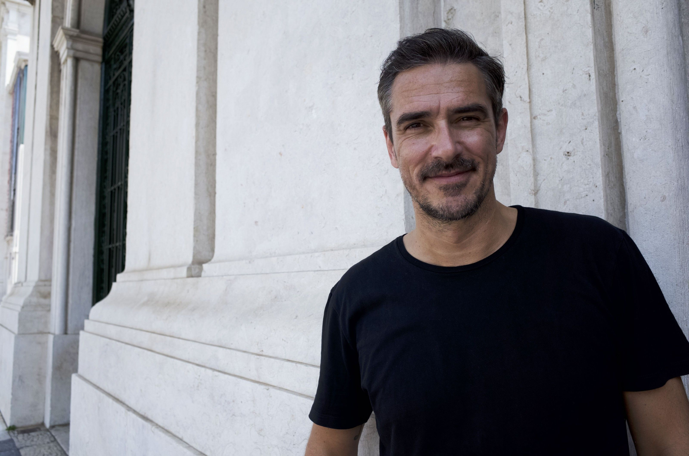

[facebook](https://www.facebook.com/sharer/sharer.php?u=https%3A%2F%2Fwww.natgeo.pt%2Fciencia%2F2018%2F11%2Fentrevista-a-miguel-stanley) [twitter](https://twitter.com/share?url=https%3A%2F%2Fwww.natgeo.pt%2Fciencia%2F2018%2F11%2Fentrevista-a-miguel-stanley&via=natgeo&text=Entrevista%20a%20Miguel%20Stanley) [whatsapp](https://web.whatsapp.com/send?text=https%3A%2F%2Fwww.natgeo.pt%2Fciencia%2F2018%2F11%2Fentrevista-a-miguel-stanley) [flipboard](https://share.flipboard.com/bookmarklet/popout?v=2&title=Entrevista%20a%20Miguel%20Stanley&url=https%3A%2F%2Fwww.natgeo.pt%2Fciencia%2F2018%2F11%2Fentrevista-a-miguel-stanley) [mail](mailto:?subject=NatGeo&body=https%3A%2F%2Fwww.natgeo.pt%2Fciencia%2F2018%2F11%2Fentrevista-a-miguel-stanley%20-%20Entrevista%20a%20Miguel%20Stanley) [Ciência](https://www.natgeo.pt/ciencia) 
# Entrevista a Miguel Stanley 
## O Dr. Miguel Stanley apresenta o primeiro documentário da National Geographic sobre Medicina Dentária. ‘O Futuro do Sorriso com Dr. Miguel Stanley’ demonstra como a inteligência artificial irá alterar os limites da medicina dentária. Por [National Geographic](https://www.natgeo.pt/autor/national-geographic) Publicado 22/11/2018, 16:28 

O Médico Dentista Miguel Stanley. Fotografia por © National geographic Channels O Dr. Miguel Stanley, Médico Dentista e primeiro português a apresentar um [documentário da National Geographic](https://www.natgeo.pt/ciencia/2018/10/o-futuro-do-sorriso-com-dr-miguel-stanley) , tem uma enorme paixão por reabilitação oral complexa e tecnologia digital aplicada à sua área. Com prática privada exclusivamente dedicada a implantologia e estética dentária, tornou-se um reconhecido líder de opinião internacional. 

Nos últimos 15 anos, percorreu o mundo e partilhou a sua filosofia de trabalho em mais de 200 conferências, em mais de 50 países. Tem uma equipa interdisciplinar completamente dedicada a esta área, na [White Clinic](http://whiteclinic.pt/) que foi originada em 1999. Criou a famosa filosofia de _NoHalfSmiles_ e o conceito de _SlowDentistry_ . Acredita na importância da ética na área da Medicina Dentária e adora partilhar a sua visão com os mais novos - a futura geração de dentistas de todo o mundo. 

**Qual a Importância do Sorriso nas Nossas Vidas?** 

O sorriso não é apenas algo físico. É algo dinâmico e sentimental. Uma pessoa que não possua dentes ou que tenha uma dentição incompleta, pode de facto ter um sorriso bonito porque é algo que nos sai da alma e que transcende qualquer forma física. A gargalhada é a expressão humana que nos une, é algo implicitamente ligado ao nosso ser. 

Obviamente que como Médico Dentista, o conceito de sorriso adquire uma terminologia diferente e o meu papel é o de ajudar a criar a identidade de uma pessoa que não possui o sorriso que deseja. Por isso mesmo, diria que o sorriso é uma das maiores ferramentas sociais. Uma ferramenta incrivelmente poderosa e que a sua falta poderá implicar graves complicações psicológicas e socias na vida da pessoa. 

**Qual o Caso Clínico que Mais o Impressionou?** 

Com mais de 20 anos de carreira é impossível falar e contabilizar todos os casos clínicos em que estive envolvido. No entanto, a partir do momento em que conseguimos mudar a vida de uma só pessoa, isso tem automaticamente um impacto em nós próprios. 

Sou o resultado de 22 anos de constante conexão emocional com todos os milhares de pacientes e, por isso mesmo, a minha vida é uma representação de milhares de histórias. 

No entanto, creio que faz sentido mencionar um caso que é retratado no documentário da National Geographic e que me impressionou bastante. O caso da Joyce. Por toda a dinâmica à volta da sua transformação. Por ser uma pessoa que vivia em absoluta pobreza, com dificuldades que possivelmente nenhum de nós consegue imaginar e que a falta de um sorriso esteticamente bonito fez com que a mesma não se sentisse mulher. 

Conseguir devolver-lhe essa sensação fez com que a Joyce se integrasse melhor na sociedade, e melhorasse o relacionamento com a sua família e os seus filhos. A sua dinâmica mudou em menos de 24 horas. 

**Como Implementa a Filosofia ‘ _No Half Smiles’_ ?** 

_NoHalfSmiles_ , é uma _catch phrase_ desenvolvida há mais de 10 anos que ajuda a condensar numa só frase toda a minha filosofia de trabalho. Filosofia assente no facto de não pretender fazer tratamentos baseados na capacidade financeira dos meus pacientes, mas sim de acordo com as reais necessidades da boca. 

Como Médico Dentista, baseio-me em três premissas. Primeiramente, e como grande prioridade encontra-se a Biologia, a saúde da boca. Em segundo lugar, a função mastigatória e por último, a estética. Sendo que, o meu papel como fundador e diretor clínico da White Clinic é garantir que todos os nossos pacientes têm um tratamento assente nestas três premissas. Um tratamento adequado às necessidades de cada um e acima de tudo ético. 

Apesar da combinação destas três premissas ser fundamental num tratamento, acredito que um sorriso saudável é um sorriso bonito. Infelizmente não conseguimos chegar a todas as pessoas, mas fazemos o nosso melhor com as pessoas de quem tratamos. 

**Veja o trailer do documentário:** 

O Futuro do Sorriso com Dr. Miguel Stanley 

**Quais São as Vantagens da Tecnologia de Impressão 3D Face à técnica tradicional de colocação de implantes?** 

Uma das grandes vantagens da tecnologia de impressão 3D é que nos permite, com um grau de fiabilidade incrível, fazer cirurgias no computador através de um software especializado. Para isso, preciso de uma TAC (Tomografia Axial Computorizada) ou CBCT ( _Cone Beam Computer Tomography_ ) - tecnologia usada na White Clinic desde 2008, que serão posteriormente partilhadas com o scanner intraoral. 

Ao fundirmos a CBCT ao scan intraoral conseguimos ter imagens da cabeça e da boca do paciente no nosso software e com isto preparar uma guia cirúrgica para que a colocação dos implantes seja quase perfeita. 

Vantagens de recorrer a estas tecnologias? O facto de conseguirmos eliminar quase todos os riscos e garantir a colocação ideal dos próprios implantes e em grande parte ter os dentes provisórios já prontos.Poupando muitas horas de consulta tanto para o médico como para o paciente. 

**Que Papel Tem a Medicina Dentária na Evolução da Espécie Humana?** 

Não existem muitas áreas médicas que interfiram na estrutura humana de uma forma tão liberal como a Medicina Dentária. Infelizmente, não há muito controlo sobre os tratamentos efetuados, o que até pode vir a alterar ou comprometer o nosso DNA e a nossa estrutura nos anos vindouros. 

Nas últimas duas ou três gerações, deparamo-nos com cada vez menos pessoas a possuírem sisos - os terceiros molares. Porquê? Simplesmente porque a nossa alimentação não o exige. 

Acredito que no futuro, através de células estaminais e com a possibilidade de recorrer a tecnologias como CRISPR ( _Clustered Regularly Interspaced Palindromic Repeats_ ) e manipulação genética, a regeneração dentária (crescimento de nova dentição) será o próximo passo e daqui a duas ou três gerações, a Medicina Dentária de hoje será algo do passado. 

**No Futuro, a Medicina Dentária Pode Aliar-se Mais à Inteligência Artificial?** 

Isso é algo que já acontece. Neste momento existem empresas que recorrem à inteligência artificial para analisarem raios-x dentários e efetuarem diagnósticos, utilizando _meta data driven information_ , ou seja, centenas de milhares de análises independentes que criam uma metodologia. Ou seja, utilizam a inteligência artificial para analisar por exemplo raios x dentários e efetuar consequentemente diagnósticos. 

Acredito que nos próximos anos, ainda nesta geração, teremos que abdicar do conceito de um humano fazer o diagnóstico e o plano de tratamento. E honestamente creio que isso será algo positivo, desde que haja um humano a ter poder de veto. Porque acredito que a inteligência artificial fará um diagnóstico mais imparcial, sem ser baseado na capacidade financeira do paciente mas sim na ciência, algo que na White Clinic fazemos desde sempre. 

**Podemos Obter Novos _Insights_ Sobre o Comportamento Humano?** 

Diria que nos últimos 100 anos, nós, Médicos Dentistas, somos associados a uma figura pejorativa. Basta olharmos para os filmes de Hollywood em que somos retratados como pessoas solitárias, desagradáveis, causadores de dor, etc. Consequência deste estigma? O resultado do nosso trabalho não está embebido no fabrico social. 

Médicos Dentistas como eu e como as pessoas que integram a minha equipa, trabalham diariamente com dedicação e com o objetivo de devolver sorrisos às pessoas. E por isso mesmo, merecem reconhecimento e destaque na sociedade. Porque na realidade, fazemos mais do que construir sorrisos bonitos, devolvemos vida e felicidade às pessoas. 

E por isso mesmo, é com muito orgulho que represento esta área e transmito _insights_ sobre o trabalho incrível que a nossa indústria desenvolve diariamente, através deste documentário da National Geographic. 

**A Dentição dos Tubarões Regenera-se Facilmente. Como Podemos Evoluir com os Predadores do Oceano?** 

A dentição do ser humano é muito idêntica, em termos de DNA, à dos tubarões. 

Através deste documentário, descobrimos que enquanto nós, seres humanos, deixamos de produzir dentes após a segunda dentição, os tubarões continuam este processo ao longo de toda a sua vida. 

Alguns cientistas estão a estudar a possibilidade de isolar o gene responsável por esta capacidade regenerativa e adaptá-lo ao nosso DNA, recorrendo à tecnologia CRISPR. Já imaginaram o que seria se o ser humano tivesse a capacidade de regenerar a sua própria dentição, depois da segunda dentição? Algo tremendo. 

Uma consequência com alguns danos para a indústria de implantologia, mas, que sem consequências nefastas para o ser humano, seria uma alternativa mais económica e natural comparativamente à dentição artificial. 

**Quais São os Seus Trunfos para a Tendência de Robotização da Medicina?** 

Penso que a Robotização na área da Medicina Dentária vai tornar-se cada vez mais real nos próximos anos. Durante as gravações do documentário tivemos acesso a alguma informação confidencial relativamente a desenvolvimentos neste tema. Avanços impressionantes e que demonstram como os robôs estão a transformar a nossa indústria. 

Um exemplo desta transformação é o facto de já recorrermos a robôs que criam uma coroa dentária em três horas. Algo que, pela mão humana demoraria oito horas. Já estamos a usar esta tecnologia diariamente. No entanto, falar de um robot que ajuda na integração do paciente em todo o processo de tratamento, nas suas emoções, incertezas e inseguranças, parece-me algo precoce uma vez que é uma área que apenas o ser humano consegue atuar. Um colega meu Coreano fala bem disto no documentário. 

A verdade, é que nos últimos 20 anos temos investido fortemente na tecnologia digital e possuímos um forte _Know How_ nesta área. Esse é o nosso trunfo. À medida que vão surgindo novos avanços tecnológicos na robotização, nós, na White Clinic estamos preparados para os receber. 

[source](https://www.natgeo.pt/ciencia/2018/11/entrevista-a-miguel-stanley)