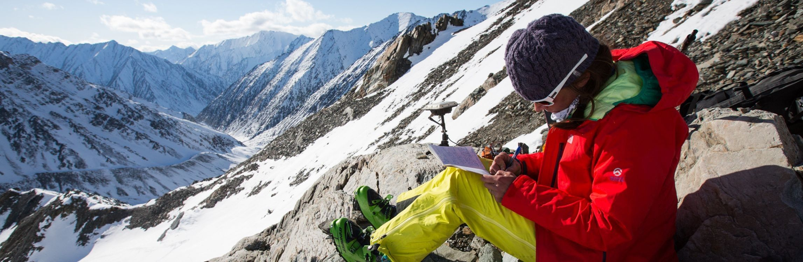

[facebook](https://www.facebook.com/sharer/sharer.php?u=https%3A%2F%2Fwww.natgeo.pt%2Fciencia%2F2019%2F12%2Fconhece-bolsas-da-national-geographic-society) [twitter](https://twitter.com/share?url=https%3A%2F%2Fwww.natgeo.pt%2Fciencia%2F2019%2F12%2Fconhece-bolsas-da-national-geographic-society&via=natgeo&text=Conhece%20as%20Bolsas%20da%20National%20Geographic%20Society%3F) [whatsapp](https://web.whatsapp.com/send?text=https%3A%2F%2Fwww.natgeo.pt%2Fciencia%2F2019%2F12%2Fconhece-bolsas-da-national-geographic-society) [flipboard](https://share.flipboard.com/bookmarklet/popout?v=2&title=Conhece%20as%20Bolsas%20da%20National%20Geographic%20Society%3F&url=https%3A%2F%2Fwww.natgeo.pt%2Fciencia%2F2019%2F12%2Fconhece-bolsas-da-national-geographic-society) [mail](mailto:?subject=NatGeo&body=https%3A%2F%2Fwww.natgeo.pt%2Fciencia%2F2019%2F12%2Fconhece-bolsas-da-national-geographic-society%20-%20Conhece%20as%20Bolsas%20da%20National%20Geographic%20Society%3F) [Ciência](https://www.natgeo.pt/ciencia) 
# Conhece as Bolsas da National Geographic Society? 
## Desde 1888, a National Geographic Society atribuiu mais de 15 mil bolsas nos campos da conservação, educação, investigação, storytelling e tecnologia. Por [National Geographic](https://www.natgeo.pt/autor/national-geographic) Publicado 19/02/2020, 05:50 , Atualizado 12/01/2022, 09:32 

Ao longo de 130 anos, a National Geographic distingue-se por desafiar, proteger e inspirar a humanidade a ir mais além. Desde 1888, a National Geographic Society atribuiu **mais de 15 mil bolsas** nos campos da conservação, educação, investigação, escrita e tecnologia. Através da sua paixão, persistência, curiosidade e dedicação, os nossos [exploradores](https://www.natgeo.pt/exploracao/2019/02/spark-historias-inspiradoras-dos-nossos-exploradores) contribuem para o conhecimento do planeta e criam soluções para um futuro mais sustentável. 

Investimos em pessoas ousadas e em ideias transformadoras, em diversas áreas de estudo: **conservação** , **educação** , **investigação** , **storytelling** e **tecnologia** . O nosso objetivo é identificar, cultivar e desenvolver pessoas capazes de mudar o mundo de hoje e o de amanhã. Os nossos bolseiros são — e serão sempre — o coração e a alma daquilo que fazemos. 

Quando atribuímos uma bolsa, não estamos apenas a patrocinar um projeto. Estamos também a convidar um cientista, conservacionista, educador ou contador de histórias a juntar-se a uma comunidade de pessoas apaixonadas que pensam da mesma forma, uma comunidade de líderes globais. Estes líderes são os exploradores da National Geographic. 

Apesar do elevado número de bolsas atribuídas, os exploradores provenientes ou com projetos em Portugal, ainda são menos do que gostaríamos. Conheça as histórias portuguesas de sucesso mais recentes, nos projetos de [Ricardo Rocha](https://www.natgeo.pt/ciencia/2021/09/entrevista-ricardo-rocha-diversidade-racial-etnica-ciencia-portuguesa) , [Gonçalo Curveira-Santos](https://www.natgeo.pt/animais/2021/02/entrevista-goncalo-curveira-santos-carnivoros-gestao-conservacao) , [Joana Pereira](https://www.natgeo.pt/animais/2021/02/entrevista-joana-pereira-conservacao-da-vida-selvagem) e [Martina Panisi](https://www.natgeo.pt/animais/2019/09/martina-panisi-protege-caracois-gigantes-em-sao-tome-e-principe) . 

As bolsas vão além do financiamento para os projetos, com eventual exposição através dos canais de comunicação da National Geographic e acolhimento na comunidade global de exploradores. Com a bolsa terá acesso ao arquivo da National Geographic e a apoio e aconselhamento na monitorização, avaliação e a empréstimos de equipamento técnico. Pode ter a oportunidade de fazer a diferença! 

**TIPOLOGIA DE BOLSAS** 

Nível I (até 20 mil dólares) 

Nível II (até 100 mil dólares) 

**AS BOLSAS FINANCIAM** 

Custos de campo diretos, incluindo viagens (bilhetes aéreos, aluguer de veículos) 

Alimentação e alojamento 

Materiais e equipamento de campo 

Assistentes e consultores 

Algum trabalho de laboratório 

Apoio a dependentes 

**AS BOLSAS NÃO FINANCIAM** 

Ensino 

Viagens para conferências 

Despesas gerais de organizações ou universidades 

**NA CANDIDATURA** 

Inclua colaborações locais 

Aconselhe-se com supervisores e/ou mentores 

Descreva exemplos do histórico de trabalho 

Envie um vídeo (apenas para as Bolsas Early Career) 

Escreva com o objetivo de informar e persuadir um público profissional alargado 

Informe-nos em caso de ter compromissos com media 

Forneça um potencial plano de distribuição 

Identifique o contexto da história em projetos científicos/jornalísticos anteriores 

Especifique o público 

**EVITAR** 

Candidatar-se num feriado/época festiva 

Utilizar gíria desnecessária 

Colocar-se em perigo excessivo 

Submeter mais do que uma candidatura 

**QUESTÕES A TER EM CONSIDERAÇÃO** 

É a pessoa ideal para contar esta história? 

É um projeto/história excecional ou indispensável? 

Está alinhado com as prioridades da National Geographic? 

Qual será o impacto do projeto/história? 

**PRÓXIMOS DEADLINES** 

Nível I e nível II - candidaturas até 12 de abril 2023 

**LINKS ÚTEIS** 

[Elegibilidade](https://www.nationalgeographic.org/funding-opportunities/grants/how-to-apply/eligibility/) 

[Mais informações](https://www.nationalgeographic.org/funding-opportunities/grants/) 

[Candidaturas](https://www.nationalgeographic.org/funding-opportunities/grants/how-to-apply) 

[source](https://www.natgeo.pt/ciencia/2019/12/conhece-bolsas-da-national-geographic-society)