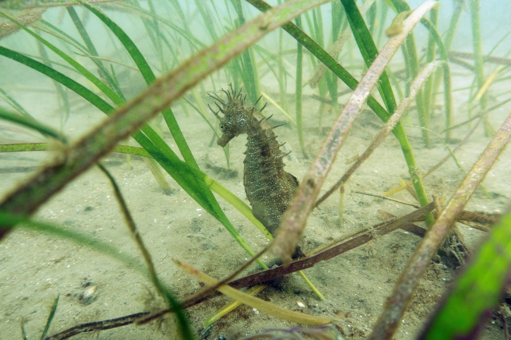
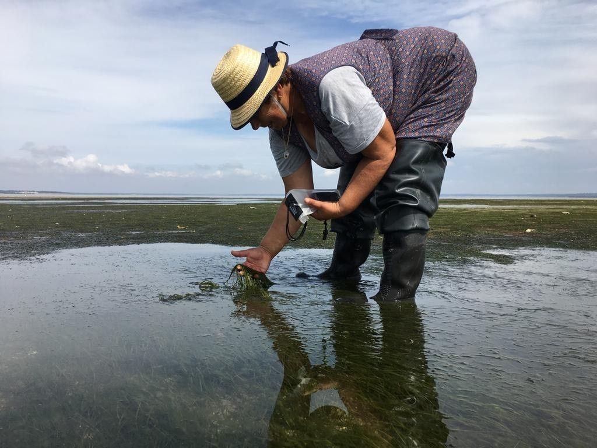
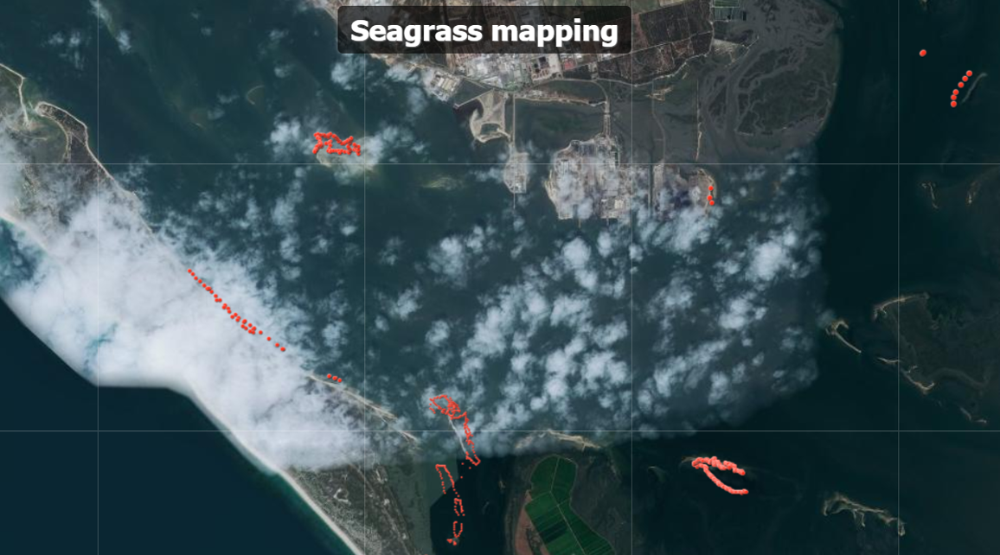

[facebook](https://www.facebook.com/sharer/sharer.php?u=https%3A%2F%2Fwww.natgeo.pt%2Fciencia%2F2019%2F12%2Fdescoberto-importante-tesouro-natural-no-estuario-do-sado) [twitter](https://twitter.com/share?url=https%3A%2F%2Fwww.natgeo.pt%2Fciencia%2F2019%2F12%2Fdescoberto-importante-tesouro-natural-no-estuario-do-sado&via=natgeo&text=Descoberto%20Importante%20Tesouro%20Natural%20no%20Estu%C3%A1rio%20do%20Sado) [whatsapp](https://web.whatsapp.com/send?text=https%3A%2F%2Fwww.natgeo.pt%2Fciencia%2F2019%2F12%2Fdescoberto-importante-tesouro-natural-no-estuario-do-sado) [flipboard](https://share.flipboard.com/bookmarklet/popout?v=2&title=Descoberto%20Importante%20Tesouro%20Natural%20no%20Estu%C3%A1rio%20do%20Sado&url=https%3A%2F%2Fwww.natgeo.pt%2Fciencia%2F2019%2F12%2Fdescoberto-importante-tesouro-natural-no-estuario-do-sado) [mail](mailto:?subject=NatGeo&body=https%3A%2F%2Fwww.natgeo.pt%2Fciencia%2F2019%2F12%2Fdescoberto-importante-tesouro-natural-no-estuario-do-sado%20-%20Descoberto%20Importante%20Tesouro%20Natural%20no%20Estu%C3%A1rio%20do%20Sado) [Ciência](https://www.natgeo.pt/ciencia) 
# Descoberto Importante Tesouro Natural no Estuário do Sado 
## A expedição de mergulho mais recente do projeto Guardiãs do Mar: Mulheres Pescadoras Líderes da Conservação do Oceano, liderado pela exploradora da National Geographic Raquel Gaspar, encontrou uma importante comunidade de cavalos-marinhos no Sado. Por [National Geographic](https://www.natgeo.pt/autor/national-geographic) Publicado 20/12/2019, 15:01 

Cavalo-marinho-de-focinho-comprido nas pradarias do Estuário do Sado. Fotografia por Miguel Correia O projeto ‘ **Guardiãs do Mar: Mulheres Pescadoras Lideres da Conservação do Oceano’** que tem como foco mulheres pescadoras que lideram a conservação do estuário do Sado, para o qual [**Raquel Gaspar**](https://www.natgeo.pt/meio-ambiente/2019/03/projeto-guardias-do-mar-financiado-com-bolsa-da-national-geographic) obteve uma bolsa de exploração da National Geographic, continua a mapear as pradarias marinhas e a monitorizar o seu estado de preservação. 

As palavras de Raquel transbordam o encanto deste habitat: “ _Quando mergulhamos nas pradarias entramos numa água verde jade. Temos pouca visibilidade. Às vezes quase apenas um palmo, outras vezes uns 3 metros. Mas quando damos por nós estamos dentro de uma floresta de ervas e algas onde os juvenis de muitas espécies encontram abrigo e alimento. Quase sempre encontramos ovos de choco. E encontramos sempre muitos cavalos-marinhos-de-focinho-comprido. Esta espécie depende das pradarias marinhas para se alimentar e esconder dos predadores._ ” 

Em outubro, a equipa de biólogos marinhos do projeto, realizou mais uma expedição de mergulho, desta vez na pradaria de _Cymodocea nodosa_ - uma espécie de erva marinha vulnerável segundo a categoria de ameaça UICN em Portugal. Raquel Gaspar, cofundadoura da [Ocean Alive](https://www.ocean-alive.org/) foi acompanhada pela sua, a bióloga Sílvia Tavares e por biólogos do Centro de Ciências do Mar (CCMAR). 

A bordo da embarcação da Reserva Natural do Estuário do Sado esteve Miguel Correia, biólogo do CCMAR especialista em cavalos-marinhos. Fascinado descreve este local como um “ _tesouro do Sado_ ” pela importante comunidade de cavalos-marinhos que vive nestas pradarias marinhas. 

O cavalo-marinho-de-focinho-comprido, que vive nestas águas, é extremamente dependente das pradarias marinhas, habitat por excelência, onde se alimenta e se abriga contra predadores. Miguel Correia alerta que “ _caso não sejam tomadas medidas de proteção, as populações de cavalos-marinhos podem sofrer um acentuado decréscimo do seu número de efetivos, ficando assim suscetíveis à extinção local. O desaparecimento desta população é uma séria ameaça ao seu estatuto de conservação global._ ” 

Para ver este vídeo é necessário aceitar as cookies do Youtube 

**Guardiãs monitoras das pradarias marinhas** 

Através do projeto Guardiãs do Mar, a Ocean Alive criou novas profissões para as pescadoras, valorizando a sua sabedoria. Raquel Gaspar treinou cinco mulheres da comunidade piscatória como monitoras das pradarias, ensinando-as a utilizar o GPS e a mapear as manchas deste habitat. Hoje, cinco casais de pescadores do estuário do Sado colaboram com o projeto, constituindo este trabalho um rendimento complementar ao que obtêm pela atividade da pesca. 

Uma das pescadoras que integram o projeto Guardiãs do Mar durante a monitorização às pradarias marinhas do Estuário do Sado. Fotografia por Raquel Gaspar , Ocean Alive 

Durante as grandes marés baixas, as pescadoras contornam as manchas de pradarias que ficam fora de água. Nas marés mortas vão de barco, com os maridos, recolher informação sobre a localização das pradarias que estão imersas. De regresso a casa os dados são recebidos por uma bióloga assistente do projeto, também da comunidade piscatória, que os prepara e envia para a equipa do CCMAR. Desde agosto foram mapeados **15 bancos de pradarias** no Estuário do Sado. Explore onde se localizam os bancos de pradarias, através da ferramenta de zoom no [**mapa**](https://www.arcgis.com/apps/presentation/index.html?webmap=35d45fa527de4c0580be4c21041431fc) . 

Localização de alguns dos bancos de pradarias marinhas no Estuário do Sado. Fotografia por Raquel Gaspar , Ocean Alive As pradarias marinhas são um dos habitats do planeta mais desconhecidos e com mais valor, pela sua função de maternidade e sumidouro de carbono. O projeto apoiado pela bolsa da National Geographic espera ter como impacto a proteção e restauro deste habitat. 

_Este artigo teve os contributos de Raquel Gaspar e Miguel Correia, biólogo do CCMAR especialista em cavalos-marinhos. As expedições de mergulho científico do projeto distinguido pela bolsa de exploradora da National Geographic têm a parceria da Marinha Portuguesa._ 

[source](https://www.natgeo.pt/ciencia/2019/12/descoberto-importante-tesouro-natural-no-estuario-do-sado)