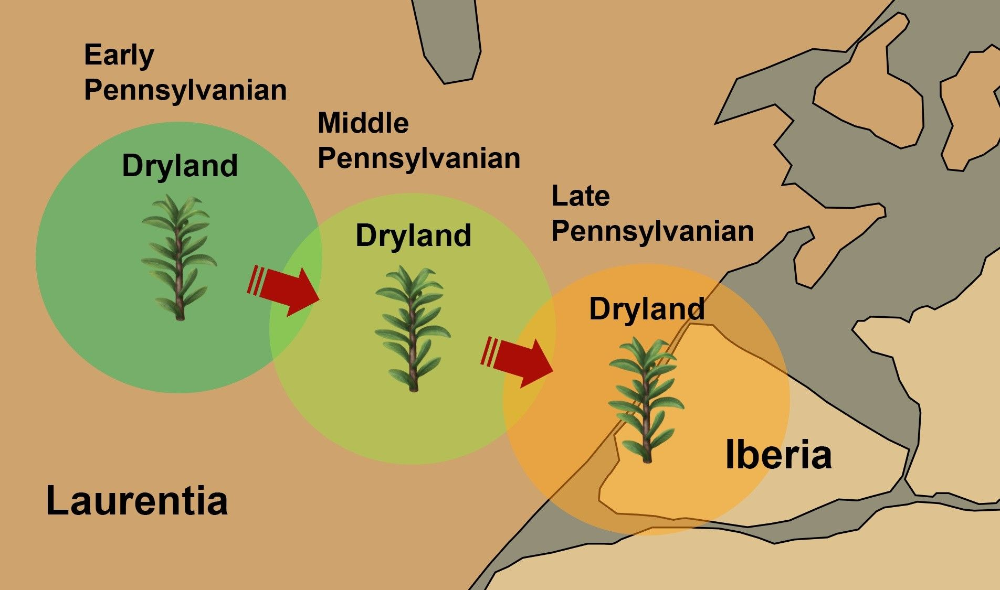

[facebook](https://www.facebook.com/sharer/sharer.php?u=https%3A%2F%2Fwww.natgeo.pt%2Fciencia%2F2020%2F05%2Fcientistas-portugueses-e-canadianos-revelam-como-supercontinente-pangeia-se-formou) [twitter](https://twitter.com/share?url=https%3A%2F%2Fwww.natgeo.pt%2Fciencia%2F2020%2F05%2Fcientistas-portugueses-e-canadianos-revelam-como-supercontinente-pangeia-se-formou&via=natgeo&text=Cientistas%20Portugueses%20e%20Canadianos%20Revelam%20Como%20Supercontinente%20Pangeia%20se%20Formou) [whatsapp](https://web.whatsapp.com/send?text=https%3A%2F%2Fwww.natgeo.pt%2Fciencia%2F2020%2F05%2Fcientistas-portugueses-e-canadianos-revelam-como-supercontinente-pangeia-se-formou) [flipboard](https://share.flipboard.com/bookmarklet/popout?v=2&title=Cientistas%20Portugueses%20e%20Canadianos%20Revelam%20Como%20Supercontinente%20Pangeia%20se%20Formou&url=https%3A%2F%2Fwww.natgeo.pt%2Fciencia%2F2020%2F05%2Fcientistas-portugueses-e-canadianos-revelam-como-supercontinente-pangeia-se-formou) [mail](mailto:?subject=NatGeo&body=https%3A%2F%2Fwww.natgeo.pt%2Fciencia%2F2020%2F05%2Fcientistas-portugueses-e-canadianos-revelam-como-supercontinente-pangeia-se-formou%20-%20Cientistas%20Portugueses%20e%20Canadianos%20Revelam%20Como%20Supercontinente%20Pangeia%20se%20Formou) [Ciência](https://www.natgeo.pt/ciencia) 
# Cientistas Portugueses e Canadianos Revelam Como Supercontinente Pangeia se Formou 
## Os cientistas descobriram evidências de uma conexão geográfica entre a Ibéria e os EUA que ocorreu há cerca de 300 milhões de anos. Por [National Geographic](https://www.natgeo.pt/autor/national-geographic) Publicado 15/05/2020, 10:27 

Visão ampliada do interior do supercontinente Pangeia que apresenta a ligação geográfica entre as massas continentais antigas da Laurentia (América do Norte) e da Ibéria (noroeste do Gondwana) e elevação das cadeias montanhosas Apalachiana e Varisca durante o Pensilvánico Superior, no final do Paleozóico. Reconstrução de Nathan Rogers. 

Fotografia por Pedro Correia Existe agora um amplo consenso de que o supercontinente do Paleozóico superior, Pangeia, é apenas o mais recente de uma série de supercontinentes cuja fusão e dispersão pontuaram a história da Terra. Pangeia foi uma colossal massa terrestre, sólida, que formou um único continente, quando todos os continentes estavam unificados devido à movimentação das placas tectónicas. A fusão deste megacontinente resultou da colisão entre dois grandes continentes, o Laurásia situado no Hemisfério Norte e o Gondwana localizado no Hemisférico Sul. No entanto, algumas questões importantes sobre o momento temporal da colisão continental entre Laurásia e Gondwana e a configuração final do Pangeia ainda permaneciam sem resposta. 

Um [artigo publicado em fevereiro no jornal _Scientific Reports_](https://www.nature.com/articles/s41598-020-59461-x?fbclid=IwAR0EFYFNnIF1MP-oXDALn4d-a0IyMsvg7s3pN-HIRKcoBlOCGaKSLed0WhI) apresenta o “elo perdido” da colisão entre os continentes Laurásia e Gondwana, que foi essencial para entender o momento e as condições em que o supercontinente Pangeia foi formado. Este estudo foi conduzido pelo paleontólogo português [Pedro Correia](https://www.researchgate.net/profile/Pedro_Correia3) do Instituto das Ciências da Terra da Universidade do Porto e pelo geólogo [Brendan Murphy](https://www.americanscientist.org/author/j._brendan_murphy) da Universidade St. Francis Xavier, no Canadá. 

Configuração “Wegeneriana” (Pangeia-A) baseada na conexão continental entre Laurentia e Ibéria no final do Paleozóico. Reconstrução de Nathan Rogers. 

Fotografia por Pedro Correia “É o primeiro vislumbre do vínculo entre a América do Norte e a Península Ibérica quando estas regiões estavam localizadas nos trópicos durante o período Carbonífero”, afirma Pedro Correia. 

No artigo científico, os autores apresentam as primeiras evidências paleobotânicas, biostratigráficas, paleoambientais e paleoclimáticas de uma ligação geográfica entre os montes Apalaches na costa leste dos Estados Unidos e a Península Ibérica que ocorreu no Pensilvánico Superior do período Carbonífero, há cerca de 307 a 299 milhões de anos. “Estas evidências implicam que as massas terrestres antigas da Laurentia e Ibéria estavam geograficamente conectadas durante o processo final de amalgamação [fusão] do Pangeia e permite confirmar qual era a sua configuração quando se começou a decompor há 200 milhões de anos”, explica Pedro Correia, o principal autor do estudo. 

O trabalho científico levou 10 anos a concluir e teve início com os estudos de doutoramento do paleontólogo Pedro Correia na região de São Pedro da Cova, na Bacia do Douro. São Pedro da Cova tem sido palco de várias descobertas recentes na área da paleontologia em Portugal, onde o paleontólogo português e a sua equipa têm descoberto fósseis de várias novas [espécies de plantas](https://www.natgeo.pt/ciencia/2019/05/nova-especie-de-planta-fossil-descoberta-na-regiao-do-douro) e insetos do período Carbonífero. 

**Testemunhos da fusão final do supercontinente Pangeia** 

A equipa concentrou-se no estudo das floras que estavam restritas a ambientes secos ou áridos que existiram na região central do Pangeia. “Para a minha tese de doutoramento, estudei rochas sedimentares carboníferas do Gzheliano inferior (com cerca de 303 milhões de anos) na Bacia do Douro, que foram depositadas na mesma época que o supercontinente Pangeia se estava a formar por colisões continentais entre a América do Norte, a Europa e África. Tentei compreender como a vida das plantas respondeu à formação das montanhas. O nosso conjunto de dados é derivado de recentes descobertas paleontológicas que fiz nessas rochas, em particular a primeira ocorrência do fóssil _Lesleya_ no Maciço Ibérico (a antiga Ibéria). _Lesleya_ é um género raro de pteridospérmica e um membro enigmático de plantas adaptadas ao clima seco (geralmente descritas como xeromórficas) que estavam restritas a ambientes bem drenados, de baixa humidade [designados ambientes secos ou áridos – Drylands] localizados nas regiões tropicais do Pangeia central e que viveram tanto na Laurentia como na Ibéria. Os seus fósseis são um registo excecional e valioso das condições paleoambientais e paleoclimáticas. Os fósseis de _Lesleya_ têm sido amplamente documentados em ambientes secos da América do Norte que estavam localizados na região central do Pangeia naquela época”, diz Pedro Correia. 

Holótipo (UP-MHNFCP-094951, -094952, -094954) de **_Lesleya iberiensis_** sp. nov., do Gzheliano inferior (Pensilvánico Superior) da região de São Pedro da Cova, Bacia do Douro. (A) Fotografia do espécime fóssil de uma folha preservado em xisto, quebrado em três pedaços. (B) Molde látex do espécime fóssil, mostrando relevo positivo. (C) Desenho interpretativo do espécime original, mostrando margens foliares e nervura central reconstruídas (linhas pontilhadas). Barra de escala: 20 mm. 

Fotografia por Pedro Correia **Aridificação e migração de floras xeromórficas no interior do Pangeia** 

Por serem indicadores de condições climáticas e ambientais, a ocorrência de floras xeromórficas típicas da América do Norte, como _Lesleya_ , no registo fóssil do Carbonífero de Portugal, é uma evidência de dispersão e migração de floras adaptadas ao clima quente e seco entre Laurentia e Ibéria. Esta migração florística sugere que Laurentia e Ibéria partilharam o mesmo ambiente árido tropical durante o Pensilvánico Superior, há cerca de 307 a 299 milhões de anos. 

Por outro lado, o aparecimento de _Lesleya_ em rochas de idade do Gzheliano inferior da Bacia do Douro acontece imediatamente após uma transição de um período glacial para um período interglacial (período mais quente – fase pós-glacial) no intervalo Kasimoviano–Gzheliano, aproximadamente há 304 milhões de anos atrás, indicando que esta flora migrou da Laurentia para a Ibéria quando surgiram novos habitats secos. Esta mudança climática abrupta coincidiu com uma aridificação generalizada dentro do interior do Pangeia em resultado da sua fusão no final do Paleozóico, e afetou grande parte das regiões tropicais onde Ibéria estava localizada, na qual o seu clima ficou mais seco e menos húmido durante o Gzheliano (há 304 a 299 milhões de anos). 

Conectada à Laurentia, Ibéria tornou-se um refúgio ou um novo habitat para muitas espécies de flora, sobretudo floras xeromórficas vindas da América do Norte, onde se adaptaram e colonizaram novos ambientes durante o Gzheliano inferior. Durante este intervalo de tempo, novas espécies de plantas xeromórficas, como _Lesleya iberiensis_ , apareceram na Ibéria onde se desenvolvem em ambientes bem drenados e de baixa humidade. 

Visão ampliada da região central do Pangeia-A (configuração “Wegeneriana”) que mostra uma ligação geográfica entre Laurentia e Ibéria e o surgimento de ambientes secos formados em diferentes escalas espaciais e temporais e a migração diacrónica da flora adaptada ao clima quente e seco, como o género _Lesleya_ , entre as duas massas terrestres antigas. Reconstrução de Nathan Rogers. 

Fotografia por Pedro Correia **Pangeia-A versus Pangeia-B: uma controvérsia com mais de 40 anos** 

A recorrência episódica de montagem e desintegração dos supercontinentes, ou seja, o ciclo do supercontinente, foi associada à construção de montanhas (denominadas de orógenos) à escala global, ao crescimento da crosta, à alteração climática rápida, à evolução da vida, aos ciclos biogeoquímicos, a mudanças no nível do mar, a grandes províncias ígneas, à circulação profunda do manto, à dinâmica do núcleo do manto e a perturbações no campo magnético da Terra. A colisão entre os continentes Laurásia e Gondwana foi um evento importante na amalgamação final do supercontinente Pangeia e resultou na destruição do oceano primitivo Rheic e na formação das cadeias montanhosas Apalachiana e Varisca no interior do Pangeia. 

Como parte de um grande “puzzle”, a Ibéria é uma peça-chave para entender como e quando ocorreu a colisão continental entre Gondwana e Laurásia. A Ibéria era uma pequena massa de terra continental que fazia parte da margem noroeste do Gondwana. Atualmente, a massa terrestre restante da antiga Ibéria compõe o núcleo da Península Ibérica, o qual consiste num bloco cratónico hercínico, conhecido como Maciço Ibérico ou Maciço Hespérico. 

Embora a existência do Pangeia seja uma pedra angular da geologia, muito se debate acerca da sua configuração. As duas configurações hipotéticas principais são Pangeia-A (proposta pelo meteorologista e geofísico alemão Alfred Wegener em 1912) e Pangeia-B (configuração baseada em dados paleomagnéticos, apresentados por Edward A. Irving num [artigo da Nature de 1977](https://www.nature.com/articles/270304a0) ). No modelo Pangeia-A, o supercontinente não se deformou internamente entre amalgamação e separação. Por outro lado, a configuração Pangeia-B requer vários milhares de quilómetros de um cisalhamento (movimento) dextral do continente Laurásia em relação ao do Gondwana durante a vida útil do Pangeia. A validade destas reconstruções tem sido vigorosamente debatida há mais de 40 anos. 

**O supercontinente Pangeia começou a formar-se há cerca de 380 milhões de anos e a fraturar-se há cerca de 200 milhões de anos.** Pangeia-A é o modelo clássico de supercontinente proposto por Alfred Wegener, vulgarmente conhecido como configuração “Wegeneriana”. A maioria dos cientistas concorda com uma configuração do Pangeia-A no momento em que começou a se decompor. “Aqueles que defendem o modelo Pangeia-B afirmam que o Pangeia mudou a sua configuração nos 180 milhões de anos anteriores devido a tensões internas. Este modelo requer que Gondwana esteja localizado a cerca de 3000 km a leste em relação à América do Norte, em comparação com a configuração Wegeneriana. Os nossos dados mostram que a Ibéria e a Laurentia se situavam ao longo do mesmo cinturão paleo-equatorial há 300 milhões de anos, que é precisamente onde estariam numa reconstrução de Pangeia-A. Isso implica que a parte central do Pangeia tinha essencialmente a mesma configuração de há 300 a 200 milhões de anos atrás”, diz **** Brendan Murphy, especialista mundial em tectónica de placas e co-autor do artigo científico. 

“Os nossos resultados não são apenas essenciais para resolver a controvérsia de longa data [Pangeia-A versus Pangeia-B] sobre a posição paleogeográfica do Gondwana em relação à Laurásia, mas também ilustram o paleoclima e a paleogeografia dos orógenos Apalachianos e Ibéricos [Variscos]. Além disso, a nossa contribuição aborda aspectos críticos do momento de elevação das montanhas e das mudanças climáticas e ambientais durante a colisão continental entre Laurásia e Gondwana”, acrescenta Pedro Correia. 

A conexão paleobiogeográfica entre Laurentia e Ibéria registra os estágios iniciais de elevação dos orógenos Apalachianos e Ibéricos (Variscos) durante a montagem e fusão de Pangeia. A migração de floras xeromórficas da Laurentia para a Ibéria foi influenciada por mudanças climáticas e topográficas induzidas tectonicamente. Como as cadeias montanhosas atuaram como uma barreira física à troca de floras entre continentes, a dispersão e migração deste tipo de floras ocorreram antes da elevação das cadeias montanhosas Apalachiana e Varisca, isto é, durante o Gzheliano inferior. O momento desta conexão paleobiogeográfica implica que a elevação dos orógenos Apalachianos e Ibéricos ocorreu durante o Gzheliano superior e o Asseliano (Pérmico inferior), aproximadamente há 301 a 295 milhões de anos. O estudo revela também o tempo do fecho do oceano Rheic. 

Restrições paleogeográficas e paleotopográficas dentro do Pangeia-A demonstram a ligação continental entre Laurentia oriental e Ibéria e a elevação dos orógenos Apalachianos e Varíscos no intervalo Gzheliano superior, há cerca de 301 a 295 milhões de anos. Reconstrução de Nathan Rogers. 

Fotografia por Pedro Correia Os fósseis de _Lesleya iberiensis_ encontram-se referenciados e armazenados nas coleções do [Museu de História Natural e da Ciência da Universidade do Porto](https://mhnc.up.pt/) . 

_Pedro Correia é investigador doutorado no Instituto das Ciências da Terra da Faculdade de Ciências da Universidade do Porto, onde desenvolve investigação na área da Paleobotânica. Brendan Murphy é professor associado na Universidade St. Francis Xavier, no Canadá._ 

