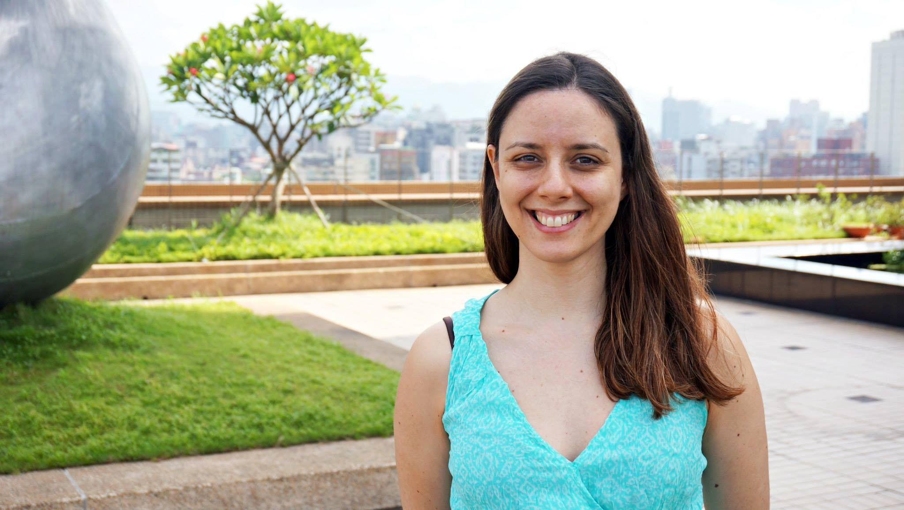

[facebook](https://www.facebook.com/sharer/sharer.php?u=https%3A%2F%2Fwww.natgeo.pt%2Fciencia%2F2020%2F02%2Fentrevista-a-zita-martins-a-primeira-astrobiologa-portuguesa) [twitter](https://twitter.com/share?url=https%3A%2F%2Fwww.natgeo.pt%2Fciencia%2F2020%2F02%2Fentrevista-a-zita-martins-a-primeira-astrobiologa-portuguesa&via=natgeo&text=Entrevista%20a%20Zita%20Martins%20%E2%80%93%20a%20Primeira%20Astrobi%C3%B3loga%20Portuguesa) [whatsapp](https://web.whatsapp.com/send?text=https%3A%2F%2Fwww.natgeo.pt%2Fciencia%2F2020%2F02%2Fentrevista-a-zita-martins-a-primeira-astrobiologa-portuguesa) [flipboard](https://share.flipboard.com/bookmarklet/popout?v=2&title=Entrevista%20a%20Zita%20Martins%20%E2%80%93%20a%20Primeira%20Astrobi%C3%B3loga%20Portuguesa&url=https%3A%2F%2Fwww.natgeo.pt%2Fciencia%2F2020%2F02%2Fentrevista-a-zita-martins-a-primeira-astrobiologa-portuguesa) [mail](mailto:?subject=NatGeo&body=https%3A%2F%2Fwww.natgeo.pt%2Fciencia%2F2020%2F02%2Fentrevista-a-zita-martins-a-primeira-astrobiologa-portuguesa%20-%20Entrevista%20a%20Zita%20Martins%20%E2%80%93%20a%20Primeira%20Astrobi%C3%B3loga%20Portuguesa) [Ciência](https://www.natgeo.pt/ciencia) 
# Entrevista a Zita Martins – a Primeira Astrobióloga Portuguesa 
## Entrevistámos Zita Martins, Astrobióloga e codiretora nacional do Programa MIT Portugal, que através da sua persistência e curiosidade, nos inspira a ir mais além. Por [National Geographic](https://www.natgeo.pt/autor/national-geographic) Publicado 4/02/2020, 14:19 

Zita Martins investiga a hipótese de vida em outros planetas e a potencial contribuição de compostos orgânicos presentes em meteoritos e cometas para a origem da vida na Terra. Fotografia por José Aponte Foi a primeira Astrobióloga portuguesa e é uma das maiores especialistas em astrobiologia do mundo. Enquanto cientista convidada da NASA, resolveu um dilema que o qual a comunidade científica procurava resposta há mais de 40 anos: alguns meteoritos tinham sido analisados e tinham sido detetados os compostos que fazem parte do nosso material genético nesses meteoritos – mas a comunidade científica não sabia se esses compostos tinham sido fruto de contaminação terrestre ou extraterrestre. [**Zita Martins**](https://fenix.tecnico.ulisboa.pt/homepage/ist31684) **** conseguiu descobrir que estes compostos presentes em meteoritos são formados fora da Terra e que já existiam antes da vida na Terra e foram trazidos por meteoritos para o nosso planeta. 

Acumula o cargo de professora associada no Instituto Superior Técnico com a participação em várias missões espaciais e a codiretoria nacional do Programa Científico-tecnológico MIT Portugal. Em 2015, a especialista no estudo da origem, evolução e distribuição da vida no Universo foi condecorada com o título de Oficial da Ordem Militar de Sant’Iago da Espada pelo Presidente da República pelo seu mérito e contributo científico. 

**Explique o seu trabalho numa frase.** 

Sou Astrobióloga, sou uma cientista que procura descobrir como surgiu a vida na Terra e se existe vida em outras partes do nosso sistema solar. 

**Como é que a série de televisão ‘Cosmos’ a influenciou a estudar Astrobiologia?** 

Quando estava no liceu, tinha 14/15 anos, tive uma professora de Biologia que nos mostrava nas aulas algumas cassetes de vídeo do Carl Sagan e dos seus programas de televisão, neste caso o programa Cosmos. Lembro-me que na altura fiquei muito fascinada pela maneira simples, acessível, mas cientificamente correta como falava. Fascinou-me porque ele falava um pouco de tudo, não falava só de Astronomia ou só de Espaço. Falava também de Geologia, Química e Física, de uma forma muito simples. 

O Carl Sagan foi uma inspiração nesse sentido, não só para mim, mas para muitas pessoas da minha geração. Obviamente que aos 14/ 15 anos não pensava na palavra Astrobiologia ou na carreira de Astrobiologia. Anos mais tarde, quanto entrei na faculdade e tirei uma licenciatura em química no Instituto Superior Técnico de cinco anos, o nosso último ano era um estágio de um ano a fazermos o que quiséssemos. Lembro-me que no quarto ano andava à procura do que queria fazer. Gostava de Química, mas não queria fazer só Química para o resto da vida. E lembro-me de ler o livro do Carl Sagan ‘Contacto’ e ao mesmo tempo dar na televisão um filme com a Jodie Foster e lembro-me que me deu um clique e pensei “ _é mesmo isto que eu quero fazer para o resto da minha vida, é nisto que eu quero trabalhar_ ”, é aplicar todos os conhecimentos que tenho de Química, mas a Química no Espaço. 

O Carl Sagan teve um papel fundamental e se hoje sou Astrobióloga e estou a trabalhar nesta área, é devido a ele. Daí a importância da comunicação da Ciência e de inspirar as futuras gerações de cientistas. 

**Se pudesse viajar no tempo, o que gostaria de descobrir sobre a origem da humanidade?** 

Se for passado, o momento crucial da origem da vida. Porque é uma das grandes questões que ainda não resolvemos em Ciência e honestamente não sei se alguma vez conseguiremos descobrir. Temos dados e muita investigação a ser feita nessa área, mas obviamente não podemos viajar para trás no tempo e para tentar responder à curiosidade de tantos colegas na área, que no passado seria sem sombra de dúvidas o momento da origem da vida. 

**Quais as descobertas astronómicas das últimas décadas que destaca?** 

Começando talvez pela primeira vez que se detetou um exoplaneta e que ganhou o Prémio Nobel da Física em 2019. Isto foi nos anos 90, mas desde então exponencialmente descobrimos cada vez mais planetas a orbitar outras estrelas. 

O ano passado celebrámos a ida do homem à Lua e isso para mim também foi um momento-chave, em termos científicos e históricos, pela corrida entre americanos e russos. 

Depois, a primeira e até hoje, a única missão espacial de deteção de vida extraterrestre – a Missão Viking em 1976. Eu ainda não era nascida, mas quando se trabalha nessa área é uma missão fundamental. Já tivemos variadíssimas missões espaciais desde os anos 60, mas de deteção de vida extraterrestre só tivemos uma com sucesso. Isto mostra a dificuldade e os anos que se põe a nível de investigação. 

Mais recentemente temos a missão Roseta - uma missão europeia de cometas - e a missão ExoMars, que já está na órbita de Marte. Há uma série de missões espaciais, mas estas são as que pessoalmente me marcaram mais. 

**Quais as coordenadas de Portugal no mapa astronómico?** 

Temos agora uma Agência Espacial Portuguesa que é um marco, porque uma série de países, nomeadamente na Europa, tinham agências espaciais, e Portugal não tinha. Houve uma grande luta da comunidade científica portuguesa e esse esforço ao longo dos anos, finalmente deu frutos. Estando inseridos na comunidade europeia, fazemos parte e contribuímos financeiramente para a Agência Espacial Europeia e temos um papel a desempenhar nas várias missões espaciais. Há muitos cientistas envolvidos em missões espaciais, temos o Pedro Machado, o Nuno Santos, …muitos deles a fazer belíssimo trabalho que tem de ser reconhecido e nomeado. 

Estou envolvida em várias missões espaciais, como a Comet Interceptor. Sou a única cientista portuguesa, portanto, mais uma vez estamos a colocar Portugal no mapa numa muitíssimo importante missão espacial. Portugal também participa na missão que será lançada ao mesmo tempo, a Ariel – que irá analisar a atmosfera de planetas, onde temos o Pedro Machado que lidera a participação portuguesa na equipa, da qual também faço parte. Faço parte também de duas missões que irão para a Estação Espacial Internacional – a ExoCube e a OREOcube; e de uma missão espacial japonesa Hayabusa 2, que no fim deste ano esperamos que chegue inteira a Terra com as suas amostras de um asteroide. 

Obviamente temos também um tecido empresarial que trabalha, contribui e desenvolve equipamento para missões espaciais e há que reconhecer novamente isso. Acho que vamos conseguir levar este barco da investigação a nível do espaço a bom porto. Vejo com um sorriso o ano de 2020 e os próximos anos nesta área. 

**Numa era em que a tecnologia evoluí a anos-luz, tem algum sonho espacial?** 

Os meus sonhos nesta área são sempre a longo prazo. As missões espaciais chegam a demorar décadas para ser preparadas e eu não me posso queixar porque faço parte de uma série de futuras missões espaciais, independentemente de tudo o que aconteça no futuro – porque nunca sabemos se uma missão espacial vai ter sucesso ou não. 

Quem trabalha nesta área não pode ver apenas o objetivo final, só fazer parte de uma missão espacial já é um enorme privilégio. E eu faço parte de uma variedade enorme de missões espaciais e em adolescente, quando ouvia e via as cassetes do Carl Sagan nunca iria imaginar que estaria envolvida em tais missões espaciais. 

Para mim o sonho de fazer parte de uma missão que vai a um cometa, a um asteroide ou a outro sítio qualquer do nosso sistema solar só por si já é uma grande alegria. Temos todo um sistema solar para analisar e até fora do nosso sistema solar, todo um universo, e para mim fazer parte de cada uma destas coisas já é uma enorme conquista e que me coloca um sorriso todos os dias na cara. 

**Se pudesse pedir um desejo para o Planeta, qual seria?** 

Numa altura em que estamos numa crise climática tão grande e em que estamos a abrir os olhos para o que temos estado a fazer ao nosso planeta, um desejo seria reforçar ainda mais a disciplina de cidadania nas escolas de todo o país. 

Conhecimento só por si não tem grande valor. Enquanto cientistas sabemos que todo o conhecimento que nós adquirimos tem de ser para o bem da humanidade. Vejo isso por exemplos nas missões espaciais que faço parte. Tudo o que estamos a desenvolver em termos de tecnologia vai gerar _spin-offs_ , vai gerar outros objetos que mais tarde têm utilidade e que melhoram a qualidade de vida dos seres humanos. 

Esse seria o meu desejo: dar ferramentas para que o povo perceba a importância da educação e do conhecimento para o bem-estar do mundo em geral. 

**CURIOSIDADES 

Cresceu em…** Lisboa. 

**O seu herói científico é…** Carl Sagan. 

**Num dia típico…** não há um dia típico! 

**Para se divertir…** estou com a família, estou com os amigos, viajo, cozinho, ouço música, vou ao cinema, vou ao teatro, vou ao ballet, ... 

**O seu sítio preferido no mundo é…** a minha casa – Portugal sem sombra de dúvidas! 

**Não consegue viajar sem…** o passaporte e o telemóvel. 

**O seu melhor conselho para alguém que sonhe em trabalhar em Astrobiologia é…** estudar muito, adquirir conhecimento interdisciplinar, ler muito e viajar para várias universidades. 

_Esta entrevista foi encurtada por motivos editoriais._ 

[source](https://www.natgeo.pt/ciencia/2020/02/entrevista-a-zita-martins-a-primeira-astrobiologa-portuguesa)