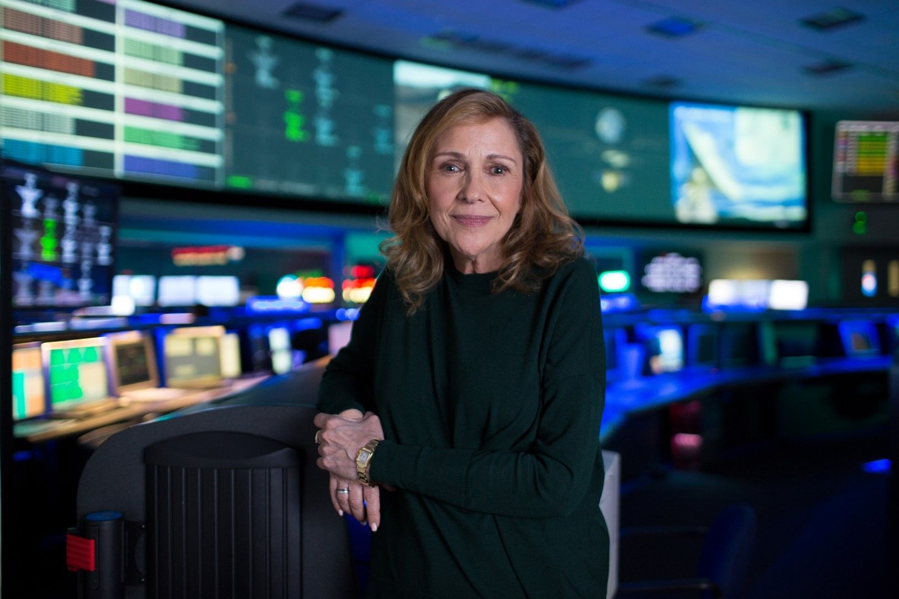

[facebook](https://www.facebook.com/sharer/sharer.php?u=https%3A%2F%2Fwww.natgeo.pt%2Fciencia%2F2020%2F03%2Fentrevista-ann-druyan-produtora-de-cosmos-mundos-possiveis) [twitter](https://twitter.com/share?url=https%3A%2F%2Fwww.natgeo.pt%2Fciencia%2F2020%2F03%2Fentrevista-ann-druyan-produtora-de-cosmos-mundos-possiveis&via=natgeo&text=Entrevista%20a%20Ann%20Druyan%2C%20Produtora%20de%20%E2%80%98Cosmos%3A%20Mundos%20Poss%C3%ADveis%E2%80%99) [whatsapp](https://web.whatsapp.com/send?text=https%3A%2F%2Fwww.natgeo.pt%2Fciencia%2F2020%2F03%2Fentrevista-ann-druyan-produtora-de-cosmos-mundos-possiveis) [flipboard](https://share.flipboard.com/bookmarklet/popout?v=2&title=Entrevista%20a%20Ann%20Druyan%2C%20Produtora%20de%20%E2%80%98Cosmos%3A%20Mundos%20Poss%C3%ADveis%E2%80%99&url=https%3A%2F%2Fwww.natgeo.pt%2Fciencia%2F2020%2F03%2Fentrevista-ann-druyan-produtora-de-cosmos-mundos-possiveis) [mail](mailto:?subject=NatGeo&body=https%3A%2F%2Fwww.natgeo.pt%2Fciencia%2F2020%2F03%2Fentrevista-ann-druyan-produtora-de-cosmos-mundos-possiveis%20-%20Entrevista%20a%20Ann%20Druyan%2C%20Produtora%20de%20%E2%80%98Cosmos%3A%20Mundos%20Poss%C3%ADveis%E2%80%99) [Ciência](https://www.natgeo.pt/ciencia) 
# Entrevista a Ann Druyan, Produtora de ‘Cosmos: Mundos Possíveis’ 
## Ann Druyan é produtora executiva e autora da série e livro ‘Cosmos: Mundos Possíveis’, a continuação do admirável legado de Carl Sagan. Por [National Geographic](https://www.natgeo.pt/autor/national-geographic) Publicado 30/03/2020, 17:47 

Ann Druyan durante a produção da série 'Cosmos: Mundos Possíveis'. Fotografia por National Geographic Channels Ann Druyan foi coautora da icónica série **‘Cosmos’** , lançada em 1980, e de seis êxitos de vendas do New York Times, com [Carl Sagan](https://www.natgeo.pt/historia/quem-foi-carl-sagan) , seu falecido marido. Foi também diretora criativa do projeto Voyager Interstellar Message da NASA e diretora do programa da primeira missão espacial a vela solar, lançada num míssil balístico intercontinental russo em 2005. 

Em 2014 Ann Druyan estreou ‘Cosmos: Odisseia no Espaço’, a série que daria continuidade à viagem pela origem e maravilhas do universo, e que foi galardoada com os prémios Peabody, Producers Guild e Emmy. Este ano, lançou mais uma sequela desta magnífica odisseia - ‘Cosmos: Mundos Possíveis’, criada e produzida por si, e pelo coautor da série, Brannon Braga. A [série](https://www.natgeo.pt/video/tv/cosmos-mundos-possiveis) de 13 episódios é emitida no canal National Geographic, segundas-feiras às 22:10, e o livro, editado pela Gradiva, já chegou às livrarias portuguesas e pode ser adquirido no [site da editora](http://www.gradiva.pt/catalogo/47629/cosmos:-mundos-possiveis) . 

Recentemente, tivemos a oportunidade de conversar com a autora sobre a produção da série e a exploração do universo. 

**A Ann e o Carl Sagan trouxeram o espaço para as salas de estar dos anos 80. Como foi produzir a série de televisão 'Cosmos: Mundos Possíveis', 40 anos depois?** 

A ideia foi, desde o início nos anos 80, transportar as pessoas para a realidade do cosmos. Recorremos a tecnologia de ponta na altura. Usámos por isso, pela primeira vez, uma câmara ligada a um computador com o objetivo de criar efeitos especiais. 

Quarenta anos depois, a multiplicidade de possibilidades para simular a realidade natural ao longo do universo e de observar a Terra à mais pequena escala é impressionante. E creio que, nestes cinco anos de preparação da série e do livro, não houve nenhuma ideia, por mais extravagante que fosse, que eu e o coautor da série, Brannon Braga, não tivéssemos conseguido concretizar. 

Hoje temos à nossa disposição um arsenal vastíssimo de efeitos para simular a realidade do cosmos como nunca tivemos antes. A ideia de levar o telespectador a um exoplaneta ou de o transportar até ao domínio do mundo quântico tornou-se tão fácil que me espanta e entristece o facto destes recursos à disposição de todos não serem mais utilizados para mostrar e compreender a grandiosidade, a beleza e a complexidade da Natureza e de tudo o que nos rodeia, e de serem mais usados para mostrar como se podem destruir cidades, países, etc. Acho que isso é uma espécie de tragédia da nossa civilização. 

**Carl Sagan disse uma vez que "somos feitos de pó das estrelas". A exploração do cosmos ainda é uma viagem de autodescoberta?** 

Que bonita e profunda formulação. Sim, sim, sim, definitivamente sim. Essa é uma das razões principais e talvez a mais profunda pela qual nós fazemos este tipo de ciência. É precisamente porque queremos saber de onde vimos. Para mim a mais bonita constatação que fizemos durante a preparação de __ ‘Cosmos’, __ e eu não sei se fui eu ou o Carl ou o Steve Soter que a formulámos, foi a de nós sermos um caminho para o cosmos se compreender a si mesmo. Esta é uma formulação profundamente espiritual. Procurar o sentido do cosmos, afirmar que o pó das estrelas ganhou vida e consciência para procurar as suas origens e o modo como tudo começou, se isto não é uma caminhada de descoberta espiritual então não sei o que será. Por isso, sim, é uma viagem de autodescoberta em todas as suas dimensões. Eu não sou uma cientista e não nasci com aquele fascínio inato pela ciência, mas tudo isto se transformou na minha busca pessoal. No momento em que eu percebi quão pessoal e universal pode ser este conhecimento do cosmos percebi também que queria dedicar o resto da minha vida à sua descoberta. 

**Numa época em que a tecnologia está a evoluir tanto, quase se diria à velocidade da luz, tem algum sonho 'interestelar'?** 

Sim! Tenho imensos sonhos interestelares. Primeiro, tenho sorte. Este pode parecer um tempo vazio e sombrio em que a nossa autoestima nunca esteve tão baixa como está agora, mas penso quão afortunados somos por viver numa época em que a ciência afastou a densa cortina da noite permitindo-nos ver e compreender as estrelas e tudo o que nos rodeia. Os i _nputs_ das descobertas científicas são tão poderosos como as quedas de água, trazem-nos tanto conhecimento. E, no entanto, ao mesmo tempo, parecemos uma civilização de _zombies_ que parece não querer acordar para que possamos salvar-nos, salvar o nosso futuro, proteger os nossos filhos e netos… Neste período de quarentena devida ao vírus, as pessoas começaram subitamente a ouvir os cientistas e a levar finalmente a sério aquilo que eles dizem. E a minha esperança é que façam o mesmo com os avisos que eles andam a fazer há cerca de 20 anos acerca do aquecimento global, do aumento da temperatura média do planeta e acerca dos danos que estamos a provocar ao nosso habitat, ao ambiente de todo o planeta e às outras espécies… Que este seja o momento para despertarmos, para começarmos a pensar seriamente e para começarmos a viver de acordo com a escala de tempo dos cientistas, não apenas até às próximas eleições ou de acordo com os mais poderosos interesses corporativos, mas tendo em mente de forma muito séria o futuro dos nossos descendentes. 

<code>{"tag":"VIDEO"}</code> <code>{"tag":"VIDEO"}</code>  

Publicidade: O seu vídeo começa em 

--:-- 

-------- 
--:-- / --:-- 
-------- 

audio/video source is invalid 

This is a sample 

## Color 

## Opacity 

## Font 

## Size 

## Color 

## Effect 

## Color 

## Opacity 

Player Shortcuts 

Play/Pause 

P or Spacebar 

Full Screen 

F 

Exit Full Screen 

F or Esc 

Skip Back 5 Seconds 

← 

Skip Ahead 5 Seconds 

→ 

Jump Back 10 Seconds 

J 

Jump Ahead 10 Seconds 

L 

Restart 

0 or Home 

Skip to the End 

End 

Volume Up 

↑ 

Volume Down 

↓ 

Mute Audio 

M 

Toggle Closed Captions 

C 

Decrease Caption Size 

− 

Increase Caption Size 

= or + 

Cycle Caption Text Preset 

B 

Show Keyboard Controls 

<kbd>?</kbd> or / 

ACABOU DE VER 

#### Cosmos: Mundos Possíveis - trailer 

A SEGUIR 

Este vídeo começará em 

8 
segundos 

Cosmos: Mundos Possíveis - trailer 

[source](https://www.natgeo.pt/ciencia/2020/03/entrevista-ann-druyan-produtora-de-cosmos-mundos-possiveis)