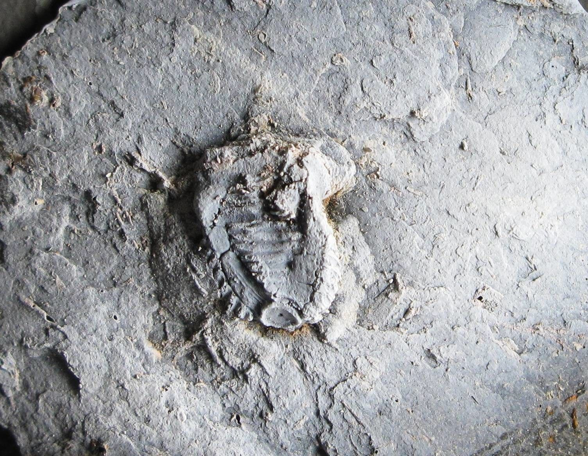

[facebook](https://www.facebook.com/sharer/sharer.php?u=https%3A%2F%2Fwww.natgeo.pt%2Fciencia%2F2020%2F07%2Fpaleontologos-portugueses-descobrem-fossil-bizarro-de-crinoide-na-peninsula-iberica) [twitter](https://twitter.com/share?url=https%3A%2F%2Fwww.natgeo.pt%2Fciencia%2F2020%2F07%2Fpaleontologos-portugueses-descobrem-fossil-bizarro-de-crinoide-na-peninsula-iberica&via=natgeo&text=Paleont%C3%B3logos%20Portugueses%20Descobrem%20F%C3%B3ssil%20Bizarro%20de%20Crin%C3%B3ide%20na%20Pen%C3%ADnsula%20Ib%C3%A9rica) [whatsapp](https://web.whatsapp.com/send?text=https%3A%2F%2Fwww.natgeo.pt%2Fciencia%2F2020%2F07%2Fpaleontologos-portugueses-descobrem-fossil-bizarro-de-crinoide-na-peninsula-iberica) [flipboard](https://share.flipboard.com/bookmarklet/popout?v=2&title=Paleont%C3%B3logos%20Portugueses%20Descobrem%20F%C3%B3ssil%20Bizarro%20de%20Crin%C3%B3ide%20na%20Pen%C3%ADnsula%20Ib%C3%A9rica&url=https%3A%2F%2Fwww.natgeo.pt%2Fciencia%2F2020%2F07%2Fpaleontologos-portugueses-descobrem-fossil-bizarro-de-crinoide-na-peninsula-iberica) [mail](mailto:?subject=NatGeo&body=https%3A%2F%2Fwww.natgeo.pt%2Fciencia%2F2020%2F07%2Fpaleontologos-portugueses-descobrem-fossil-bizarro-de-crinoide-na-peninsula-iberica%20-%20Paleont%C3%B3logos%20Portugueses%20Descobrem%20F%C3%B3ssil%20Bizarro%20de%20Crin%C3%B3ide%20na%20Pen%C3%ADnsula%20Ib%C3%A9rica) [Ciência](https://www.natgeo.pt/ciencia) 
# Paleontólogos Portugueses Descobrem Fóssil Bizarro de Crinóide na Península Ibérica 
## Investigadores portugueses descobriram um fóssil raro de um crinóide extinto, do grupo dos equinodermes, com cerca de 394 a 388 milhões de anos, descrito pela primeira vez na Península Ibérica. Por [National Geographic](https://www.natgeo.pt/autor/national-geographic) Publicado 8/07/2020, 09:56 

Molde em látex do fóssil português do crinóide _Tiaracrinus quadrifrons_ (espécime FCT-DCT-4638), exibindo vários detalhes que permitem identificar a espécie. 

Fotografia por Pedro Correia O período Devónico em Portugal é ainda pouco conhecido e certos locais não são estudados há 100 anos. Por este motivo, cada trabalho feito reveste-se de uma importância imensa para o entendimento deste período em território nacional. Isto é especialmente relevante na região norte onde os trabalhos recentes sobre esta temática são raros. São Pedro da Cova é uma dessas regiões. Nessa área o Devónico ocorre numa estreita faixa pertencente ao Anticlinal de Valongo, uma dobra de proporções gigantescas famosa pelas suas trilobites do período Ordovícico e que tem representado quase toda a era Paleozóica, à exceção do período Pérmico. 

Num artigo publicado na [Geological Journal](https://onlinelibrary.wiley.com/doi/abs/10.1002/gj.3760) , foram descritos recentemente os três primeiros exemplares de _Tiaracrinus quadriforns_ na Península Ibérica, sendo que um deles provém de Polentinos, Palencia (Norte de Espanha) tendo sido doado para o estudo por Felix Collantes, um paleontólogo amador espanhol. Esta descoberta levada a cabo pelo doutorando [Rúben Domingos](https://www.researchgate.net/profile/Ruben_Domingos2) e pelo paleontólogo [Pedro Correia](https://www.researchgate.net/profile/Pedro_Correia3) do Instituto da Ciências da Terra da Universidade do Porto, estende a distribuição espacial e temporal deste género e espécie. 

	 

	 
		 

		 

		 As melhores histórias num único lugar 

		 [Subscreva já](https://www.disneyplus.com/?cid=DTCI-Synergy-NatGeoPartners-Site-Acquisition-PTLaunch-PT-DisneyPlus-DisneyPlus-PT-ArticleLink-natgeo.pt_In_Article_Promo_Link-NA) 

	 
	 
	 

**O que é um _Tiaracrinus_ ?** 

O _Tiaracrinus_ é um género de crinóide, do grupo dos equinodermes que incluem as estrelas-do-mar ou os ouriços-do-mar, com características invulgares conhecidas em vários países da Europa e norte de África. Apresenta uma simetria tetramétrica e quatro campos com epispires (poros) o que fez com que alguns especialistas no passado os classificassem como blastóides ou cistóides (grupos de equinodermes primitivos já totalmente extintos), no entanto, hoje em dia sabemos que se trata de um crinóide. 

O pedúnculo que o fixa ao substrato (como acontece em muitos crinóides) não é conhecido, assim como os seus braços. Até hoje só foram encontrados cálices que correspondem ao local onde a boca, o ânus e as entranhas do animal se encontram. As várias espécies do género viveram entre o Lochkoviano (início do Devónico Inferior) até ao Eifeliano (início do Devónico Médio). 

A espécie _Tiaracrinus **** quadriforns_ é restrita ao Eifeliano, no entanto, o espécime descoberto em Espanha é datado do Emsiano, o que sugere que esta espécie é mais antiga do que se pensava inicialmente. Esta ocorrência tem implicações para a idade do afloramento Português pois permite atribuir uma idade compreendida entre o Emsiano e o Eifeliano. Alguns fósseis de trilobites e braquiópodes parecem suportar este intervalo temporal. Juntamente com estes fósseis foi descoberta uma rica paleofauna composta por corais, briozoários, braquiópodes, bivalves, tentaculites, crinóides e trilobites, que abre uma janela para um ecossistema primordial perdido no tempo. 

Exemplar fóssil do crinóide _Tiaracrinus quadrifrons_ (espécime FCT-DCT-4638) descoberto na região de São Pedro da Cova. (a) Visão geral do molde interno do exemplar natural. (b) A mesma amostra com a anatomia assinalada. (c) Lado oposto da mesma amostra. (d) e (e) Moldes externos do espécime ilustrado em (a, b e c), mostrando as costilhas e anel radial. (f) Molde látex do molde externo ilustrado em (e). Barras de escala = 2 mm de comprimento. Ep - epispires; RC - canais radiais; RF - campo de costilhas; Ri - costilhas; RR - anel radial. 

Fotografia por Pedro Correia 

**São Pedro da Cova: um lugar especial** 

São Pedro da Cova é um lugar singular para a paleontologia e a geologia. Aqui surgem afloramentos que incluem o Silúrico, o Devónico e o Carbonífero (Bacia Carbonífera do Douro), onde cada um deles apresenta um conteúdo paleontológico de elevado valor científico e patrimonial, que em alguns casos está condicionado pelo avanço da indústria imobiliária. 

O Devónico ocorre no flanco inverso do Anticlinal de Valongo representado por uma estreita faixa que em tempos foi contínua e que em vários segmentos se encontra deformada, o que torna impossível a existência de fósseis. 

O afloramento do Devónico onde a descoberta foi feita está localizado numa plantação de eucaliptos e corresponde a uma camada de siltitos finos, encaixada entre xistos brancos do Silúrico e litologias do Carbonífero, formando uma descontinuidade relacionada com a formação do Anticlinal de Valongo que verticalizou as camadas de rochas onde se inclui o Devónico e que deformou as rochas da Bacia Carbonífera do Douro. 

Os dados paleontológicos e sedimentológicos recolhidos neste afloramento mostram que há cerca de 394-388 milhões de anos, São Pedro da Cova foi um mar de águas pouco profundas, calmas e límpidas com sedimentação fina e pequenos recifes de coral espalhados por um fundo móvel de sedimentos finos. Devido à abundância de vida este paleoambiente seria rico em oxigénio e, pela presença de corais e crinóides, seria um ambiente mixohialino (com níveis de salinidade normais), pois este tipo de animais geralmente não tolera variações no teor salino da água. 

A baixa corrente, implicada pela fina sedimentação e marcas de ondulação (denominadas _ripple marks_ ) ligeiramente assimétricas juntamente com a baixa profundidade sugere um ambiente bem iluminado que permite a existência de corais na área. Outro indicador de uma baixa corrente é a concentração de numerosas pequenas conchas de tentaculites que se encontram alinhadas com a direção da corrente de deriva litoral e ainda pela presença de crinóides como o _Tiaracrinus_ . Estes animais alimentavam-se de partículas à tona de água que captavam com os seus braços e as levavam à boca. É necessária uma corrente para que estes organismos se consigam alimentar devidamente. O mesmo se aplica aos corais e aos braquiópodes. 

“Trata-se de um trabalho inédito para este período em Portugal e permite-nos ter um vislumbre de um antigo ecossistema, totalmente diferente do que se observa no mesmo local atualmente, e abre portas a novos trabalhos relacionados com esta fascinante temática”, afirma Rúben Domingos, doutorando na Faculdade de Ciências e Tecnologias da Universidade Nova de Lisboa. 

“O período Devónico é uma etapa importante na história da vida na Terra e espera-se que no futuro mais trabalhos sejam realizados neste local com fim de se compreender o significado deste no território de São Pedro da Cova e noutras regiões de Portugal, igualmente importantes, onde os estudos são escassos ou mesmo inexistentes e onde ainda há muito para descobrir”, explica Rúben Domingos. 

Este estudo teve o contributo dos investigadores [Ary Pinto de Jesus](https://www.researchgate.net/profile/Ary_Pinto_De_Jesus) da Universidade do Porto, [Paulo Legoinha](https://www.researchgate.net/profile/Paulo_Legoinha) da Universidade Nova de Lisboa, e [Pedro Callapez](https://www.researchgate.net/profile/Pedro_Callapez) da Universidade de Coimbra. 

Os materiais portugueses e espanhóis de _Tiaracrinus_ encontram-se arquivados nas coleções de paleontologia da Faculdade de Ciências e Tecnologias da Universidade Nova de Lisboa. 

