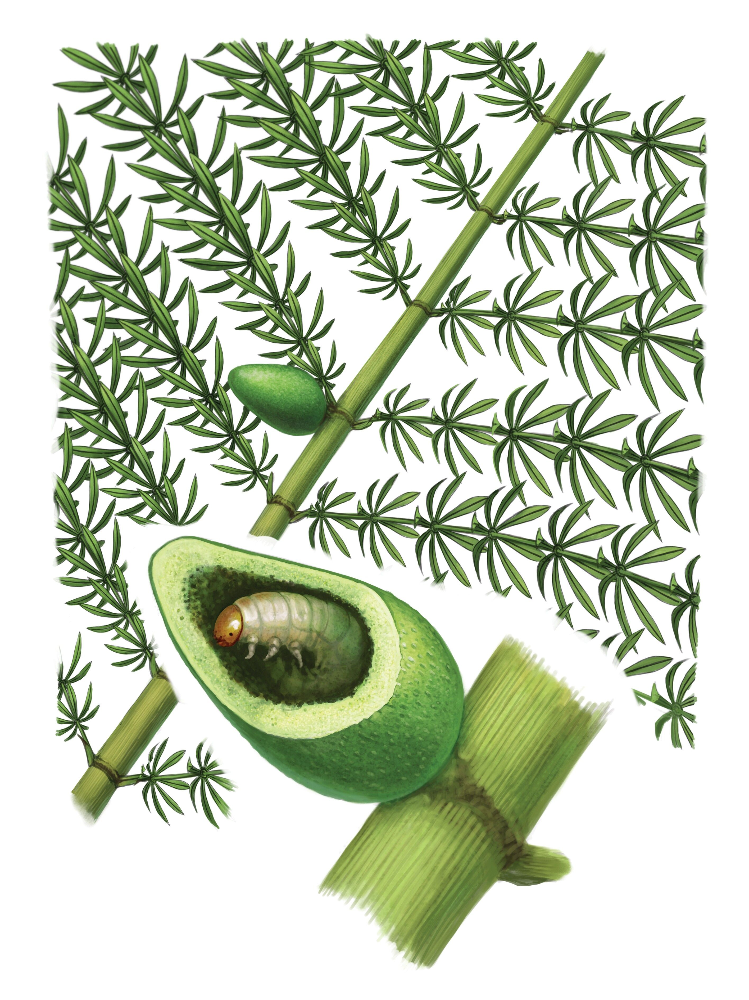
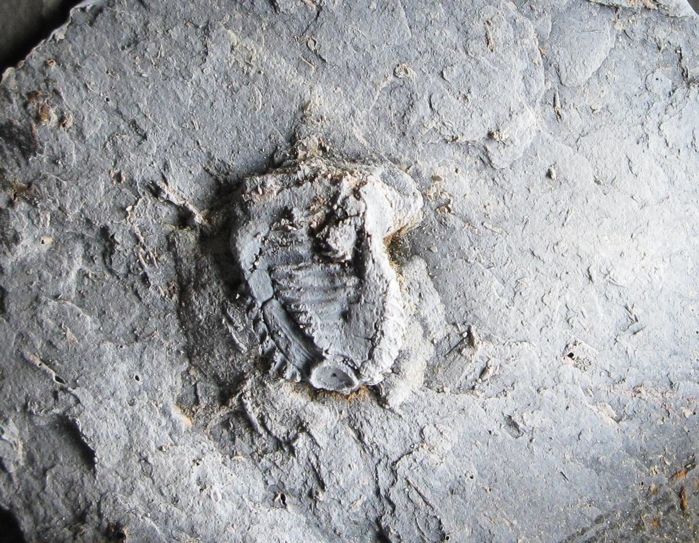
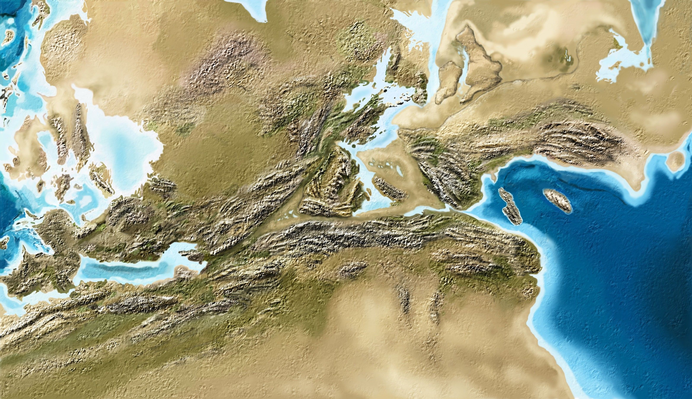
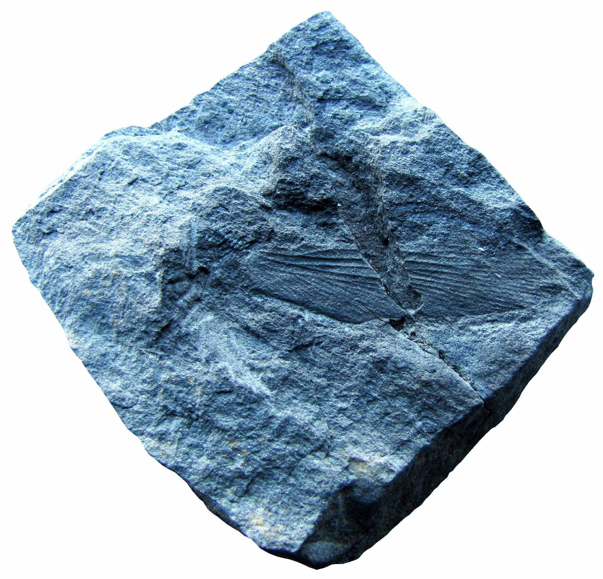

[facebook](https://www.facebook.com/sharer/sharer.php?u=https%3A%2F%2Fwww.natgeo.pt%2Fciencia%2F2020%2F10%2Fdescoberta-especie-de-cavalinha-com-cerca-de-300-milhoes-de-anos-na-regiao-do-douro) [twitter](https://twitter.com/share?url=https%3A%2F%2Fwww.natgeo.pt%2Fciencia%2F2020%2F10%2Fdescoberta-especie-de-cavalinha-com-cerca-de-300-milhoes-de-anos-na-regiao-do-douro&via=natgeo&text=Descoberta%20Esp%C3%A9cie%20de%20Cavalinha%20com%20Cerca%20de%20300%20Milh%C3%B5es%20de%20Anos%20na%20Regi%C3%A3o%20do%20Douro) [whatsapp](https://web.whatsapp.com/send?text=https%3A%2F%2Fwww.natgeo.pt%2Fciencia%2F2020%2F10%2Fdescoberta-especie-de-cavalinha-com-cerca-de-300-milhoes-de-anos-na-regiao-do-douro) [flipboard](https://share.flipboard.com/bookmarklet/popout?v=2&title=Descoberta%20Esp%C3%A9cie%20de%20Cavalinha%20com%20Cerca%20de%20300%20Milh%C3%B5es%20de%20Anos%20na%20Regi%C3%A3o%20do%20Douro&url=https%3A%2F%2Fwww.natgeo.pt%2Fciencia%2F2020%2F10%2Fdescoberta-especie-de-cavalinha-com-cerca-de-300-milhoes-de-anos-na-regiao-do-douro) [mail](mailto:?subject=NatGeo&body=https%3A%2F%2Fwww.natgeo.pt%2Fciencia%2F2020%2F10%2Fdescoberta-especie-de-cavalinha-com-cerca-de-300-milhoes-de-anos-na-regiao-do-douro%20-%20Descoberta%20Esp%C3%A9cie%20de%20Cavalinha%20com%20Cerca%20de%20300%20Milh%C3%B5es%20de%20Anos%20na%20Regi%C3%A3o%20do%20Douro) [Ciência](https://www.natgeo.pt/ciencia) 
# Descoberta Espécie de Cavalinha com Cerca de 300 Milhões de Anos na Região do Douro 
## Uma equipa liderada por um paleontólogo português descobriu uma nova espécie de cavalinha primitiva com galha de inseto na região de São Pedro da Cova, no concelho de Gondomar. Por [National Geographic](https://www.natgeo.pt/autor/national-geographic) Publicado 27/10/2020, 10:26 

Holótipo UP-MHNFCP-155167 da esfenopsídea calamitaliana _Annularia paisii_ sp. nov. mostra uma galha induzida por insetos “parasitas”. 

Fotografia por Pedro Correia **Há cerca de 300 milhões de anos,** crescia uma cavalinha com caules ramosos e folhas distribuídas em espirais com a forma de xícaras na área de São Pedro da Cova. Em 2004, [Pedro Correia](https://www.researchgate.net/profile/Pedro_Correia3) , paleontólogo português no Instituto das Ciências da Terra da Universidade do Porto, estava numa das suas primeiras escavações que tinha realizado nesta região do Douro quando descobriu um fóssil de uma nova espécie de esfenopsídea calamitaliana - um grupo de cavalinhas extintas que existiu no período Carbonífero. Esta nova espécie de planta fóssil, batizada de _Annularia paisii_ , tem uma particularidade especial, preserva uma galha de inseto resultante de uma relação entre uma planta hospedeira e um inseto parasita. 

As interações entre os artrópodes terrestres e as plantas vasculares compreendem um dos ecossistemas terrestres mais complexos e intrigantes que persistem desde o período Devónico. As interações artrópodes-plantas são diversas, com várias espécies de plantas hospedeiras e artrópodes, sobretudo insetos, que interagem em vários níveis tróficos como a herbivoria, parasitismo e polinização. As características, a intensidade e a diversidade destas interações são influenciadas pelo tipo de clima e ambiente de cada região. 

(Leia também o artigo sobre o [fóssil bizarro de crinóide descoberto pelo mesmo paleontólogo nesta região](https://www.natgeo.pt/ciencia/2020/07/paleontologos-portugueses-descobrem-fossil-bizarro-de-crinoide-na-peninsula-iberica) .) 

As galhas de insetos representam a mais complexa biologicamente de todas as principais interações artrópodes-plantas, consistindo em relações parasitárias, caracterizadas pelo dano endofítico do tecido da planta induzido por insetos que pode ocorrer em todos os principais órgãos da planta. O dano galhador induzido por insetos consiste em estruturas de plantas atipicamente aumentadas, tridimensionais, conspícuas, geralmente de simetria bilateral ou radial e endurecidas externamente, que oferecem às larvas de insetos encapsuladas um microclima, nutrição e proteção contra inimigos naturais. As galhas de insetos geralmente afetam as plantas apenas localmente, mas em alguns casos podem causar efeitos sistémicos. 

Galha de inseto preservada in situ na _Annularia paisii_ (planta hospedeira). 

Fotografia por Pedro Correia As galhas de insetos têm uma longa história evolutiva e os primeiros registos fósseis são conhecidos dos estratos rochosos do período Carbonífero. Estas galhas de insetos mais antigas ocorreram em caules de fetos arborescentes e esfenopsídeas calamitalianas. Embora as galhas de insetos tenham sido bem documentadas numa ampla variedade de espécies de plantas hospedeiras, cerca de 80% das galhas existentes ocorrem nas folhas. As galhas da idade do Carbonífero são muito pouco conhecidas porque raramente são encontradas e ocasionalmente relatadas no registo fóssil. 

Reconstrução artística da planta hospedeira _Annularia paisii_ sp. nov. com a sua galha de inseto _Paleogallus carpannularites_ . 

Fotografia por Pedro Correia e reconstrução de Andrey Atuchin As cavalinhas são plantas com uma linhagem histórica muito antiga, com registo fóssil do Devónico até aos dias atuais, existindo abundantemente em Portugal. A nova espécie hospedada _Annularia paisii_ mostra uma galha induzida por insetos parasitas (popularmente conhecidos como insetos galhadores), que é uma interação ecológica até agora desconhecida pela ciência que recebeu o nome _Paleogallus carpannularites_ . Isso mostra a existência de complexas relações inseto-planta há 303 milhões de anos e reitera a importância do registo fóssil do Carbonífero português. Os padrões de herbivoria de insetos e outros artrópodes nas cavalinhas são pouco conhecidos. O artigo, no qual são documentados 315 milhões de anos de relações parasitárias em esfenopsídeas por artrópodes herbívoros, foi publicado recentemente na revista científica [International Journal of Plant Sciences](https://www.journals.uchicago.edu/doi/abs/10.1086/707105?fbclid=IwAR1AUc8FdlCaQV_sCXN0GjVYfUzbEkiEtZC_jmkd3P0jpy7SDiunrICScAk&journalCode=ijps&mobileUi=0) . 

**Adaptação ecológica de _Annularia paisii_** 

O arranjo das folhas de _Annularia paisii_ parece anómalo para uma espécie de _Annularia_ . As suas folhas estão dispostas em espirais em forma de xícara, uma característica típica de uma outra esfenopsídea, como a _Asterophyllites_ . Várias explicações podem explicar esta condição. Talvez as folhas de _Annularia paisii_ tenham sido retraídas para esta configuração durante o enterro. Outra hipótese é a de que a forma de chávena possa ter sido uma característica induzida, resultante da sua sensibilidade à luz solar ou de um estímulo tátil externo semelhante à planta sensível moderna, _Mimosa pudica_ . Outra possibilidade é ter sido uma reação fisiológica de um inseto herbívoro, como um antagonismo da vesícula. 

O nome _Annularia paisii_ é eleito em homenagem ao paleobotânico português João Pais (1949–2016), da Universidade Nova de Lisboa. Os fósseis da planta encontram-se referenciados e armazenados nas coleções do Museu de História Natural e da Ciência da Universidade do Porto. 

 [Leia](https://www.natgeo.pt/ciencia/2020/07/paleontologos-portugueses-descobrem-fossil-bizarro-de-crinoide-na-peninsula-iberica) [Paleontólogos Portugueses Descobrem Fóssil Bizarro de Crinóid...](https://www.natgeo.pt/ciencia/2020/07/paleontologos-portugueses-descobrem-fossil-bizarro-de-crinoide-na-peninsula-iberica) [Ler artigo](https://www.natgeo.pt/ciencia/2020/07/paleontologos-portugueses-descobrem-fossil-bizarro-de-crinoide-na-peninsula-iberica)  [Leia](https://www.natgeo.pt/ciencia/2020/05/cientistas-portugueses-e-canadianos-revelam-como-supercontinente-pangeia-se-formou) [Cientistas Portugueses e Canadianos Revelam Como Supercontine...](https://www.natgeo.pt/ciencia/2020/05/cientistas-portugueses-e-canadianos-revelam-como-supercontinente-pangeia-se-formou) [Ler artigo](https://www.natgeo.pt/ciencia/2020/05/cientistas-portugueses-e-canadianos-revelam-como-supercontinente-pangeia-se-formou)  [Leia](https://www.natgeo.pt/ciencia/2019/09/fossil-de-primitiva-barata-parasitoide-descoberto-na-regiao-do-douro) [Fóssil de Primitiva ‛Barata Parasitóide’ Descoberto na Região...](https://www.natgeo.pt/ciencia/2019/09/fossil-de-primitiva-barata-parasitoide-descoberto-na-regiao-do-douro) [Ler artigo](https://www.natgeo.pt/ciencia/2019/09/fossil-de-primitiva-barata-parasitoide-descoberto-na-regiao-do-douro) 