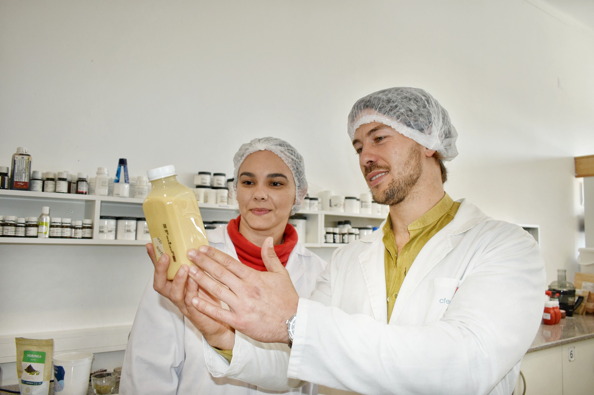

[facebook](https://www.facebook.com/sharer/sharer.php?u=https%3A%2F%2Fwww.natgeo.pt%2Fciencia%2F2022%2F08%2Fcriados-ovos-de-origem-vegetal-portugueses-e-que-substituem-os-ovos-de-galinha) [twitter](https://twitter.com/share?url=https%3A%2F%2Fwww.natgeo.pt%2Fciencia%2F2022%2F08%2Fcriados-ovos-de-origem-vegetal-portugueses-e-que-substituem-os-ovos-de-galinha&via=natgeo&text=Criados%20ovos%20de%20origem%20vegetal%2C%20portugueses%20e%20que%20substituem%20os%20ovos%20de%20galinha) [whatsapp](https://web.whatsapp.com/send?text=https%3A%2F%2Fwww.natgeo.pt%2Fciencia%2F2022%2F08%2Fcriados-ovos-de-origem-vegetal-portugueses-e-que-substituem-os-ovos-de-galinha) [flipboard](https://share.flipboard.com/bookmarklet/popout?v=2&title=Criados%20ovos%20de%20origem%20vegetal%2C%20portugueses%20e%20que%20substituem%20os%20ovos%20de%20galinha&url=https%3A%2F%2Fwww.natgeo.pt%2Fciencia%2F2022%2F08%2Fcriados-ovos-de-origem-vegetal-portugueses-e-que-substituem-os-ovos-de-galinha) [mail](mailto:?subject=NatGeo&body=https%3A%2F%2Fwww.natgeo.pt%2Fciencia%2F2022%2F08%2Fcriados-ovos-de-origem-vegetal-portugueses-e-que-substituem-os-ovos-de-galinha%20-%20Criados%20ovos%20de%20origem%20vegetal%2C%20portugueses%20e%20que%20substituem%20os%20ovos%20de%20galinha) [Olhares de Portugal](https://www.natgeo.pt/olhares-de-portugal) 
# Criados ovos de origem vegetal, portugueses e que substituem os ovos de galinha 
## Os investigadores Mayla Araújo e Daniel Abegão desenvolveram um ovo vegetal com um paladar idêntico ao ovo tradicional e com um bom valor nutricional. Por [Filipa Coutinho](https://www.natgeo.pt/autor/filipa-coutinho) Publicado 10/08/2022, 11:22 

O Happineggs foi criado pela investigadora Mayla Araújo e por Daniel Abegão, investigador e também administrador e responsável técnico do CFER – Centre for Food Education e Research, sediado em Alcobaça. 

Fotografia por Plantalicious Qual é coisa qual é ela que parece ovo, cheira a ovo, sabe a ovo, mas que não é um ovo? 

Brevemente, existirão no mercado português, ovos mais saudáveis e também mais sustentáveis. Após mais de cinco anos de investigação e desenvolvimento, foi criado um ovo vegetal com características muito próximas ao ovo da galinha. A “postura” em laboratório é feita a partir de proteínas vegetais biológicas, como a ervilha, sem qualquer tipo de conservante. 

O Happineggs foi criado nas instalações do CFER, onde existe uma cozinha para as experimentações necessárias até à criação do produto final que estará brevemente à venda. Mayla Araújo e Daniel Abegão, sócios da Plantalicious - uma empresa portuguesa focada no desenvolvimento de produtos _plant-based -_ preveem que o Happineggs seja lançado no mercado português nos próximos meses. 

A base de proteínas vegetais de arroz, ervilha e feijão de soja permite aproximar-se ao ovo de galinha, quer em termos de aspeto, como de comportamento em receitas e paladar. Este ovo vegetal contém também na sua génese azeite biológico português. 

**Esquerda:** **Superior:** Com a mesma textura, aroma e sabor, o ovo 100% vegetal pode ser utilizado nas mesmas receitas que incluam ovos de galinha. **** 

**Direita:** **Inferior:** Tartar de beterraba com gema de ovo Happineegs criado pelo chef Robson Oliveira, do restaurante Bono, em Lisboa. 

fotografias de Plantalicious Além de 100% vegetal, a produção industrial destes ovos é mais sustentável, com menos consumo de água e uma menor pegada de carbono. A ideia de criação de um produto que é análogo ao ovo da galinha foi inspirada no crescimento do mercado _vegan_ . Pensado para veganos e alérgicos a ovo, mas criado para todos os que procuram uma alimentação mais saudável e mais sustentável. 

A equipa está de momento a terminar a implementação industrial do projeto e já tem potenciais clientes interessados em outros mercados na Europa, em África e na América. 

Esta lacuna que existe no mercado português vai deixar de existir. 

