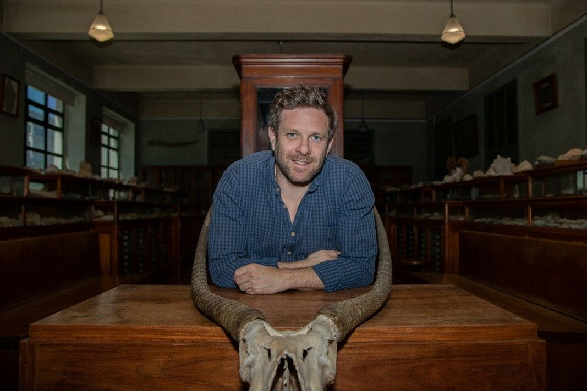
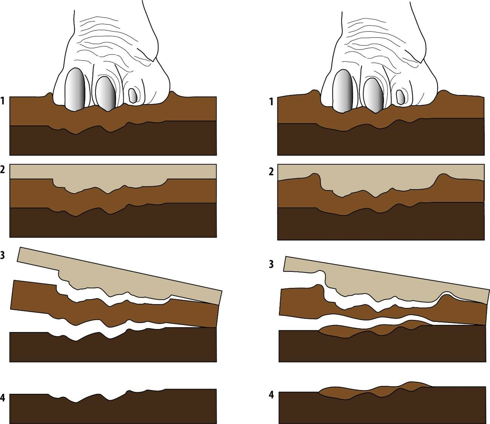

[facebook](https://www.facebook.com/sharer/sharer.php?u=https%3A%2F%2Fwww.natgeo.pt%2Fciencia%2F2022%2F08%2Fdescobertas-mais-pegadas-de-dinossaurios-no-cabo-espichel) [twitter](https://twitter.com/share?url=https%3A%2F%2Fwww.natgeo.pt%2Fciencia%2F2022%2F08%2Fdescobertas-mais-pegadas-de-dinossaurios-no-cabo-espichel&via=natgeo&text=Descobertas%20mais%20pegadas%20de%20dinoss%C3%A1urios%20no%20Cabo%20Espichel) [whatsapp](https://web.whatsapp.com/send?text=https%3A%2F%2Fwww.natgeo.pt%2Fciencia%2F2022%2F08%2Fdescobertas-mais-pegadas-de-dinossaurios-no-cabo-espichel) [flipboard](https://share.flipboard.com/bookmarklet/popout?v=2&title=Descobertas%20mais%20pegadas%20de%20dinoss%C3%A1urios%20no%20Cabo%20Espichel&url=https%3A%2F%2Fwww.natgeo.pt%2Fciencia%2F2022%2F08%2Fdescobertas-mais-pegadas-de-dinossaurios-no-cabo-espichel) [mail](mailto:?subject=NatGeo&body=https%3A%2F%2Fwww.natgeo.pt%2Fciencia%2F2022%2F08%2Fdescobertas-mais-pegadas-de-dinossaurios-no-cabo-espichel%20-%20Descobertas%20mais%20pegadas%20de%20dinoss%C3%A1urios%20no%20Cabo%20Espichel) [Olhares de Portugal](https://www.natgeo.pt/olhares-de-portugal) 
# Descobertas mais pegadas de dinossáurios no Cabo Espichel 
## A descoberta de dois moldes e mais de 500 pegadas de dinossáurios foi feita na Praia do Areia do Mastro e coordenada pelo paleontólogo Silvério Figueiredo. Por [Filipa Coutinho](https://www.natgeo.pt/autor/filipa-coutinho) Publicado 4/08/2022, 16:49 

Possível reconstituição do ambiente e do dinossáurio que produziu os moldes de pegadas encontrados. Esta formação geológica está atribuída ao Cretácico Inferior. 

Ilustração de Deverson Pepi **O Cabo Espichel volta a ser palco** de mais uma notável descoberta no campo da paleontologia. Recentemente foram publicados dois artigos na revista científica _Cretaceous Research_ sobre novos conjuntos de pegadas de dinossáurios do Cretácico Inferior, descobertos em 2019, nas camadas superiores da Formação Areia do Mastro. 

As pegadas são as primeiras a serem encontradas nesta formação. O trabalho de investigação foi coordenado por [Silvério Figueiredo](https://ipt.academia.edu/Silv%C3%A9rioFigueiredo/CurriculumVitae) , docente no Instituto Politécnico de Tomar, presidente do Centro Português de Geo-História e Pré-História, e investigador sénior do Centro de Geociências da Universidade de Coimbra. No estudo participou também uma equipa internacional de investigadores. 

Foram descritos dois moldes de pegadas de dinossáurios ornitópodes descobertos na Praia do Areia do Mastro e um conjunto de 541 pegadas, localizadas nas camadas junto do mar, que se estendem desde o sítio da Boca do Chapim até perto da Praia do Areia do Mastro, no extremo ocidental da península de Setúbal, cerca de dois quilómetros a norte do Cabo Espichel – onde foram encontradas [pegadas de crocodilomorfos](https://www.natgeo.pt/ciencia/2021/08/cabo-espichel-encontradas-pegadas-de-crocodilomorfos-com-129-milhoes-de-anos) descritas no ano passado. 

As camadas onde se encontram estas pegadas são constituídas por calcário micrítico depositado na faixa situada entre o nível médio da maré alta e o nível médio da maré baixa, num ambiente lagunar sob clima tropical. Segundo Silvério Figueiredo, “as camadas apresentam uma grande bioturbação, essencialmente resultante do intenso pisoteamento produzido pelos dinossáurios que ali passaram há cerca de 129 milhões de anos”. 

As duas pegadas, uma delas incompleta, estavam preservadas como moldes naturais convexos. O paleontólogo explica que se tratam de “pegadas tridáctilas, com os dedos mais largos do que compridos. Estes moldes apresentam uma superfície posterior redonda e larga e têm uma impressão de almofada em cada dígito. Com base nas características encontradas, são atribuídas ao icnogénero _Caririchnium_ isp”. Este icnogénero está presente em outros locais do Cretácico Inferior da Península Ibérica. Curiosamente, em Espanha, as ocorrências de _Caririchnium_ são típicas de ambientes continentais, enquanto que em Portugal têm sido encontradas principalmente em ambientes intermareais e estuarinos. 

As 541 pegadas foram identificadas numa superfície altamente dinoturbada e, após o seu estudo, concluiu-se que foram produzidas por três grupos de dinossáurios: saurópodes, ornitópodes e terópodes. Os diferentes tamanhos de pegadas sugerem uma diversidade de indivíduos, quer em tamanho, quer em idade. 

Representação esquemática da formação das pegadas. Na primeira coluna, a pegada é impressa numa camada e o peso do animal provoca a formação de sub-impressões nas camadas subjacentes ao pé; na segunda coluna, o nível de erosão atual expõe o molde da pegada resultante da compactação do sedimento pisado pelo animal e da erosão das camadas em torno do molde. 

Ilustração de Fernanda Sousa para o artigo de Figueiredo et al A maioria das pegadas foram produzidas pelos grupos de herbívoros. As pegadas são sub-impressões, ou seja, os dinossauros passaram por uma camada superior aquela onde aparecem as pegadas, produzindo a compactação do semento que pisaram e deformando a camada inferior. Esta formação das pegadas e a atual a ação da erosão produz algumas pegadas convexas e outras concavas, conforme exemplificado na ilustração. 

Silvério Figueiredo explica que, “devido à intensa bioturbação e à limitada área exposta, é difícil definir claramente trilhos. No entanto, estas pegadas podem fornecer informações sobre os produtores e os seus comportamentos”. Interpreta-se que as pegadas tenham sido feitas em vários momentos. De acordo com os dados obtidos pela equipa, os dinossáurios herbívoros utilizaram esta área costeira como passagem entre as áreas de pastagem, enquanto os carnívoros frequentavam este local para caçar, quer em grupo, quer individualmente. 

Pelo seu elevado número e pela sua localização inédita, esta descoberta é um importante marco patrimonial da paleontologia portuguesa. 

