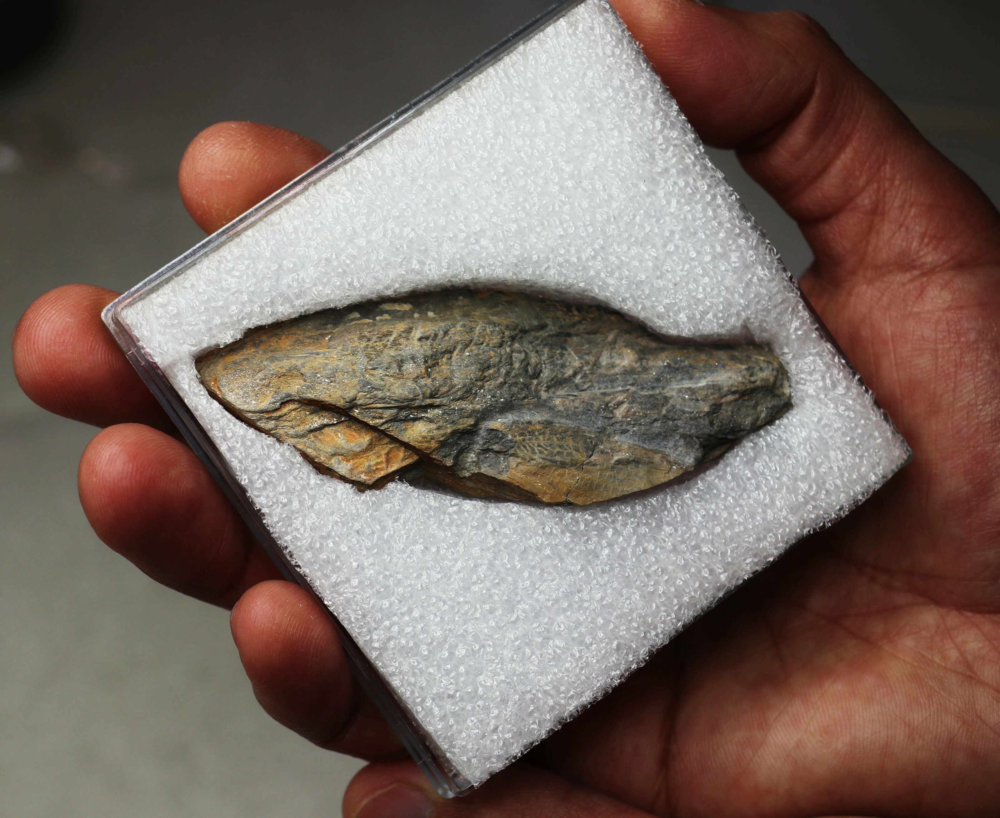
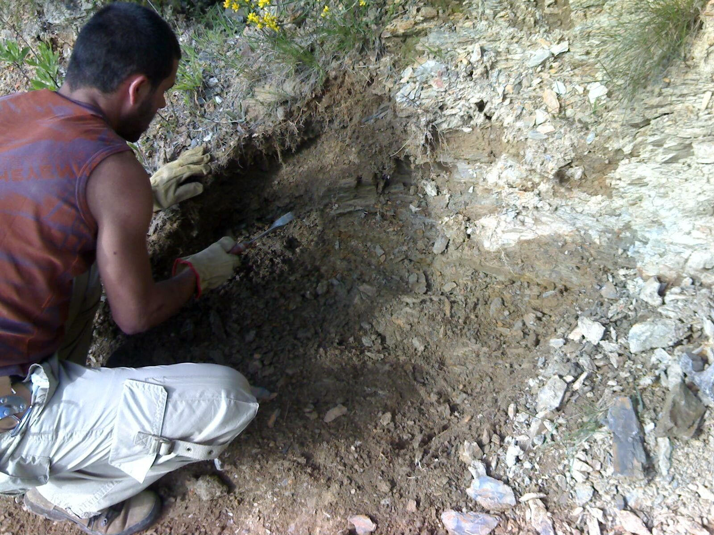
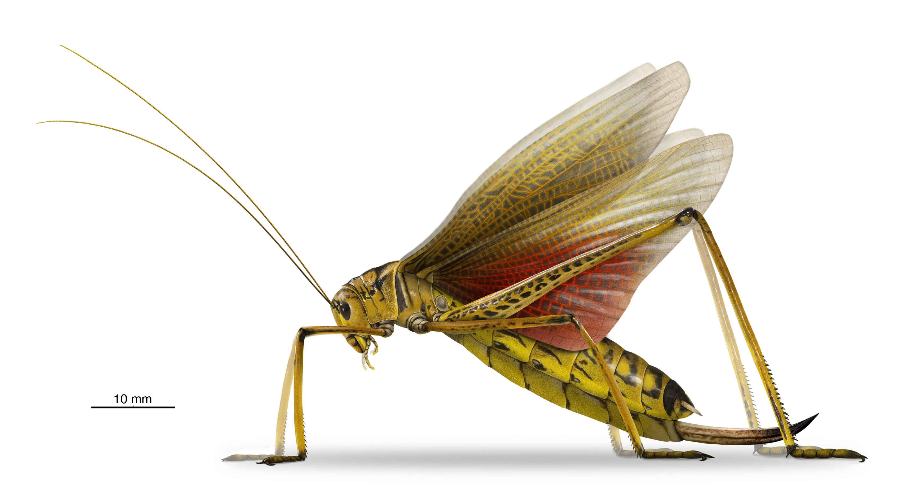

[facebook](https://www.facebook.com/sharer/sharer.php?u=https%3A%2F%2Fwww.natgeo.pt%2Fciencia%2F2022%2F06%2Ffossil-de-gafanhoto-primitivo-descoberto-em-sao-pedro-da-cova) [twitter](https://twitter.com/share?url=https%3A%2F%2Fwww.natgeo.pt%2Fciencia%2F2022%2F06%2Ffossil-de-gafanhoto-primitivo-descoberto-em-sao-pedro-da-cova&via=natgeo&text=F%C3%B3ssil%20de%20%E2%80%9Cgafanhoto%E2%80%9D%20primitivo%20descoberto%20em%20S%C3%A3o%20Pedro%20da%20Cova) [whatsapp](https://web.whatsapp.com/send?text=https%3A%2F%2Fwww.natgeo.pt%2Fciencia%2F2022%2F06%2Ffossil-de-gafanhoto-primitivo-descoberto-em-sao-pedro-da-cova) [flipboard](https://share.flipboard.com/bookmarklet/popout?v=2&title=F%C3%B3ssil%20de%20%E2%80%9Cgafanhoto%E2%80%9D%20primitivo%20descoberto%20em%20S%C3%A3o%20Pedro%20da%20Cova&url=https%3A%2F%2Fwww.natgeo.pt%2Fciencia%2F2022%2F06%2Ffossil-de-gafanhoto-primitivo-descoberto-em-sao-pedro-da-cova) [mail](mailto:?subject=NatGeo&body=https%3A%2F%2Fwww.natgeo.pt%2Fciencia%2F2022%2F06%2Ffossil-de-gafanhoto-primitivo-descoberto-em-sao-pedro-da-cova%20-%20F%C3%B3ssil%20de%20%E2%80%9Cgafanhoto%E2%80%9D%20primitivo%20descoberto%20em%20S%C3%A3o%20Pedro%20da%20Cova) [Olhares de Portugal](https://www.natgeo.pt/olhares-de-portugal) 
# Fóssil de “gafanhoto” primitivo descoberto em São Pedro da Cova 
## Um fóssil de um "gafanhoto" primitivo com mais de 300 milhões de anos, descoberto no norte de Portugal, revelou um novo género e nova espécie. Por [Filipa Coutinho](https://www.natgeo.pt/autor/filipa-coutinho) Publicado 23/06/2022, 15:03 

O fóssil encontrado na região de São Pedro da Cova, na Bacia Carbonífera do Douro, é um registo extremamente raro do Carbónico português e da Península Ibérica. 

Fotografia por [Pedro Correia](https://www.natgeo.pt/fotografo/pedro-correia) _“Tenho novidades espetaculares!”_ , escrevia Pedro Correia no email que me endereçou. O artigo da equipa que o paleontólogo lidera tinha sido publicado na [Historical Biology](https://www.tandfonline.com/doi/full/10.1080/08912963.2022.2067760?fbclid=IwAR1f2L2Q6avC5srENjEoOdAAunmEnVEyT-zWSOqYHgNCOnLpG8-bVrEcpNg) . Após [várias descobertas](https://www.natgeo.pt/search?q=pedro+correia&type=article) na região, foram encontrados restos fossilizados de um "gafanhoto" pré-histórico com 300 milhões de anos na região de São Pedro da Cova. 

Este novo fóssil recebeu o nome _Lusitadischia sai, que_ deriva de 'Lusitania', a antiga palavra latina para a maior parte do Portugal moderno, e o sufixo 'dischia', frequentemente empregado para os ortópteros _oedischiid_ , um grupo de insetos “saltadores” da família _Oedischiidae_ a que _Lusitadischia sai_ pertence. 

O _Lusitadischia sai_ , agora descrito para a ciência, corresponde a um grupo de insetos primitivos da Archaeorthoptera que existiram no final do Paleozóico. 

Jazida fossilífera da descoberta feita por Pedro Correia. 

Fotografia por [Pedro Correia](https://www.natgeo.pt/fotografo/pedro-correia) O fóssil deste gafanhoto primitivo foi encontrado em 2006 por Pedro Correia, investigador do Centro de Geociências (CGeo) da Universidade de Coimbra. A investigação contou com a colaboração de André Nel, um paleoentomólogo francês que trabalha no Museu Nacional de História Natural de Paris. 

Pedro Correia explica que a “Archaeorthoptera é uma superordem difundida e diversificada, que compreende a atual ordem Orthoptera [um grupo coroa que contém diversos conjuntos de taxa compreendendo gafanhotos, grilos e outros insetos intimamente relacionados], as ordens extintas Caloneurodea, Titanoptera e Cnemidolestodea, além de uma série impressionante de géneros não colocados e espécies no seu grupo tronco”. 

Durante o final do período Carbónico e o período Pérmico, o grupo teve uma diversidade notável, especialmente se for tido em consideração o baixo potencial de fossilização das suas partes do corpo. Na Europa, Archaeorthoptera está bem representado no Carbonífero de França e da Alemanha. No entanto, este clado (Grupo de organismos que têm um ancestral comum) permanece pouco conhecido na Península Ibérica, devido à raridade dos registos até à atualidade. 

Imagem desenhada por um paleoartista, da projeção do “gafanhoto” _Lusitadischia sai_ . 

Ilustração de Vítor Silva Apenas são conhecidos seis espécimes fósseis de arqueortópteros do Gzheliano do Pensilvánico Superior (com idades compreendidas entre os 303 e os 299 milhões de anos), em Espanha e Portugal. “A diversidade representada por tão poucos registos espelha bem a dificuldade de encontrar fósseis do grupo na Península Ibérica”, acrescenta Pedro Correia. Isso não significa necessariamente que este e outros insetos não fossem abundantes e diversificados no Carbónico nesta região, mas sim que a limitação do seu registo fóssil é um grande obstáculo para serem descobertos. 

Pedro Correia conclui que _“Lusitadischia sai é_ o segundo registo da familia _Oedischiidae_ até agora conhecido na Península Ibérica, contribuindo para o aumento da baixa diversidade e demonstrando que está certamente subestimada, devido não só ao limitado potencial de fossilização deste tipo de fauna pré-histórica, mas também à dificuldade, nas condições tafonómicas (de preservação), de encontrar e reconhecer esses raros achados paleoentomológicos". 

O nome específico _sai_ é dado em homenagem a Artur Sá, paleontólogo e docente da Universidade de Trás-os-Montes e Alto Douro, pelo seu importante contributo na estratigrafia e paleontologia do Paleozóico inferior do sudoeste da Europa e norte de África e também na promoção e valorização do Património Geológico, Geoconservação e Geoparques. 

