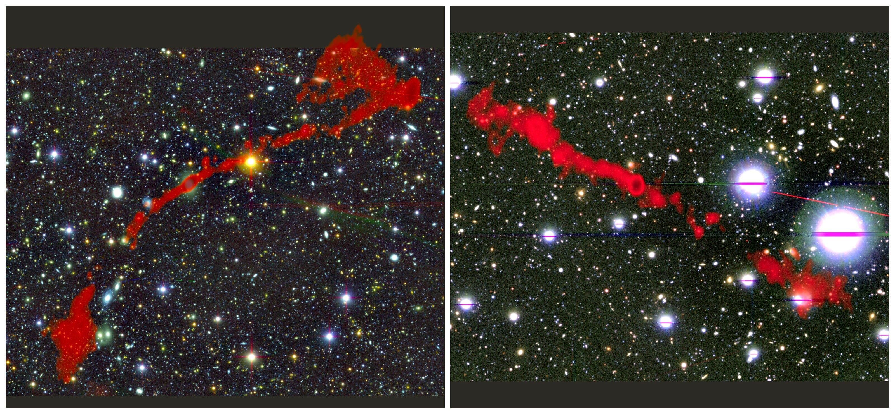
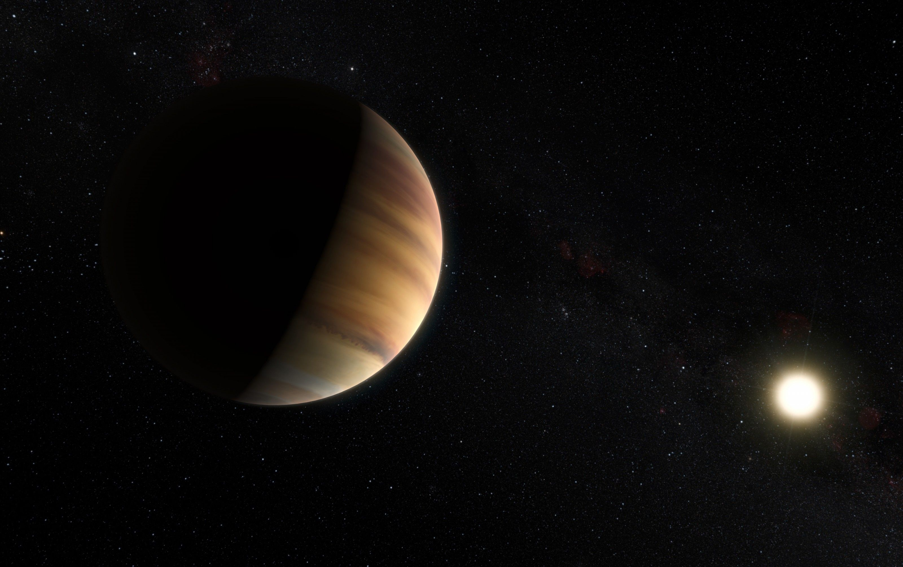
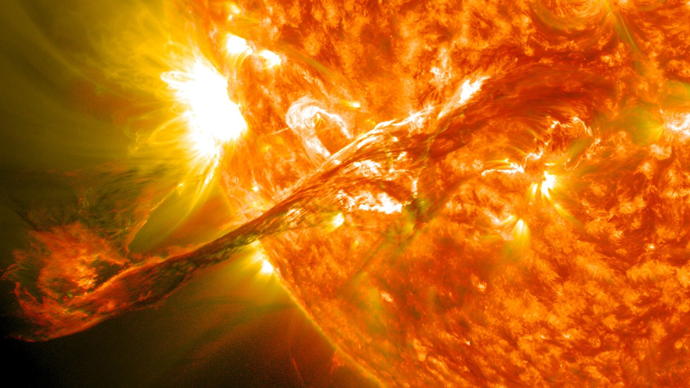
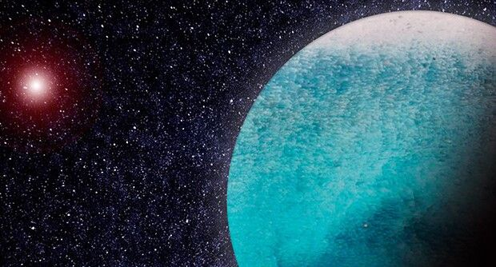

[facebook](https://www.facebook.com/sharer/sharer.php?u=https%3A%2F%2Fwww.natgeo.pt%2Fciencia%2F2021%2F01%2Fgigantes-cosmicos-dao-pontape-de-saida-a-nova-era-na-astronomia) [twitter](https://twitter.com/share?url=https%3A%2F%2Fwww.natgeo.pt%2Fciencia%2F2021%2F01%2Fgigantes-cosmicos-dao-pontape-de-saida-a-nova-era-na-astronomia&via=natgeo&text=Gigantes%20C%C3%B3smicos%20D%C3%A3o%20Pontap%C3%A9%20de%20Sa%C3%ADda%20a%20Nova%20Era%20na%20Astronomia) [whatsapp](https://web.whatsapp.com/send?text=https%3A%2F%2Fwww.natgeo.pt%2Fciencia%2F2021%2F01%2Fgigantes-cosmicos-dao-pontape-de-saida-a-nova-era-na-astronomia) [flipboard](https://share.flipboard.com/bookmarklet/popout?v=2&title=Gigantes%20C%C3%B3smicos%20D%C3%A3o%20Pontap%C3%A9%20de%20Sa%C3%ADda%20a%20Nova%20Era%20na%20Astronomia&url=https%3A%2F%2Fwww.natgeo.pt%2Fciencia%2F2021%2F01%2Fgigantes-cosmicos-dao-pontape-de-saida-a-nova-era-na-astronomia) [mail](mailto:?subject=NatGeo&body=https%3A%2F%2Fwww.natgeo.pt%2Fciencia%2F2021%2F01%2Fgigantes-cosmicos-dao-pontape-de-saida-a-nova-era-na-astronomia%20-%20Gigantes%20C%C3%B3smicos%20D%C3%A3o%20Pontap%C3%A9%20de%20Sa%C3%ADda%20a%20Nova%20Era%20na%20Astronomia) [Ciência](https://www.natgeo.pt/ciencia) 
# Gigantes Cósmicos Dão Pontapé de Saída a Nova Era na Astronomia 
## A descoberta de duas novas galáxias gigantes na emissão no rádio, na qual esteve envolvida uma equipa de investigadores portugueses, sugere que mais estruturas impressionantes estão prestes a revelar-se. Por [Filipa Coutinho](https://www.natgeo.pt/autor/filipa-coutinho) Publicado 25/01/2021, 18:00 , Atualizado 26/01/2021, 08:23 

Conceção artística de uma galáxia com emissão eletromagnética no rádio. 

Fotografia por Esa , C. Carreau , ATG Medialab Alerta: isto é apenas o “topo do icebergue” da possível multidão destes gigantes cósmicos. 

Aquilo que era conhecido até agora de uma fase tão importante na vida de uma galáxia - a fase de galáxia ativa - é provavelmente mais comum do que os investigadores julgavam. 

Algumas galáxias projetam jatos de matéria que partem da sua região central e que se estendem muito além da própria galáxia, através do meio intergaláctico. Em alguns casos, estes jatos, detetados em frequências rádio, ultrapassam extensões de centenas de milhares ou mesmo milhões de anos-luz - são as chamadas [radiogaláxias](https://www.natgeo.pt/espaco/2018/09/radiogalaxias-obras-de-arte-do-universo) gigantes, os maiores objetos individuais que existem no Universo. 

Conhecidas menos de mil desde a primeira identificada em 1974, estes gigantes cósmicos poderão afinal ser mais comuns do que se pensava e ter estado invisíveis ao limite da sensibilidade da geração anterior de radiotelescópios, segundo um [artigo](https://doi.org/10.1093/mnras/staa3837) publicado recentemente na revista científica Monthly Notices of the Royal Astronomical Society. [José Afonso](http://www.iastro.pt/ia/newStaffDetails.html?ID=46) , do [Instituto de Astrofísica e Ciências do Espaço](http://www.iastro.pt/) (IA) e da [Faculdade de Ciências da Universidade de Lisboa](https://ciencias.ulisboa.pt/) , foi um dos investigadores que integrou a investigação. 

O artigo científico anuncia a descoberta de duas novas dessas galáxias numa pequena região do céu, algo que se diria impossível em objetos que se acreditava serem tão raros. Em dados recolhidos com o novo radiotelescópio [MeerKAT](https://www.sarao.ac.za/science/meerkat/) , na África do Sul, são visíveis em cada uma destas galáxias dois jatos opostos, típicos de galáxias com núcleo central ativo, mas com dimensões impressionantes. 

As duas radiogaláxias gigantes detetadas com o radiotelescópio MeerKAT. Em fundo é apresentado o céu na luz visível e, sobreposto, a emissão no rádio representada a vermelho. 

Fotografia por I. Heywood Oxford , Rhodes , SARAO Estas duas estruturas recém-descobertas são excelentes alvos para conhecer a história e as transformações por que passaram galáxias deste tipo, e até para perceber como é que o centro da nossa própria galáxia Via Láctea poderá eventualmente vir a atravessar fases de muito maior atividade. Situadas respetivamente a 2,1 e 3,8 mil milhões de anos-luz, as duas galáxias têm dimensões da ordem dos sete milhões de anos-luz, o que é mais de 60 vezes o tamanho da nossa galáxia. 

Os investigadores do IA estão a explorar os dados deste levantamento para descobrir galáxias muito mais distantes do que estas, do tempo em que estas primeiras galáxias surgiram no Universo. Muitas estarão por descobrir, por serem objetos muito ténues, mas finalmente ao alcance da sensibilidade do radiotelescópio MeerKAT. 

Conversámos com José Afonso sobre a recente descoberta e o seu contributo para a revolução do estudo das galáxias em rádio frequências. 

**O que torna esta descoberta tão especial?** 

Esta descoberta mostra que estamos ainda muito longe de compreender como as galáxias se formam e evoluem no Universo, e em particular, qual a abundância e impacto das chamadas galáxias ativas na história do Cosmos. Sabemos que esta fase da vida de uma galáxia, uma fase de atividade intensa na sua região central devido à queda de matéria cai para um buraco negro supermassivo que aí existe, tem consequências na evolução da própria galáxia e para além dela, também na região onde essa galáxia existe. Com esta descoberta mostramos que deverão existir muitas mais galáxias ativas do que anteriormente considerávamos. 

**De que forma é que a nova geração de radiotelescópios pode melhorar a perceção e o estudo das radiogaláxias?** 

A nova geração de radiotelescópios é muito mais sensível e muito mais eficiente na realização de observações. Em particular, com o MeerKAT, na África do Sul, e o ASKAP, na Austrália, nos quais participamos ativamente [IA], teremos acesso a dados de qualidade excecional, mais sensíveis e cobrindo enormes áreas do céu, do que anteriormente. Poderemos estudar e procurar compreender milhões de radiogaláxias, ao longo dos últimos 95% da idade do Universo, o que permitirá perceber a história destas galáxias ao longo dos últimos quase 13 mil milhões de anos. E isso vai ajudar-nos a preparar a próxima revolução na rádio-astronomia, com a chegada do Square Kilometre Array daqui a alguns anos. 

**O que podemos esperar nos próximos meses em relação a esta área de estudo?** 

O estudo das galáxias em rádio frequências vai assistir a uma autêntica revolução nos próximos anos. Temos atualmente o MeerKAT em pleno funcionamento, o ASKAP, na Austrália, a iniciar observações, para além de vários outros percursores para o Square Kilometre Array em vários pontos do planeta, todos eles revolucionários. Estou certo que assistiremos, portanto, a uma revolução no nosso conhecimento do Universo, e em particular no conhecimento da formação e evolução de galáxias, durante os próximos anos. É um período muito entusiasmante para a Astrofísica, e para o nosso conhecimento das galáxias no Cosmos. 

**Quais os próximos passos do IA nesta matéria?** 

No IA estamos muito interessados em compreender a formação e evolução de galáxias. A observação em rádio frequências, que pode revelar alguns dos primeiros exemplos de galáxias com buracos negros supermassivos do Universo, é um tema que temos estado explorar cada vez com maior interesse. Mostrámos recentemente como será possível telescópios como o futuro SKA revelar centenas destes primeiros exemplos de galáxias-monstro no Universo, e estamos agora a usar estas observações do MeerKAT, no âmbito do projeto MIGHTEE, para identificar galáxias candidatas a “primeiras radiogaláxias” no Universo, tentando detetar estes exemplos a distâncias nunca antes alcançadas. 

 [Leia](https://www.natgeo.pt/espaco/2020/05/a-revelacao-de-novos-mundos) [A Revelação de Novos Mundos](https://www.natgeo.pt/espaco/2020/05/a-revelacao-de-novos-mundos) [Ler artigo](https://www.natgeo.pt/espaco/2020/05/a-revelacao-de-novos-mundos)  [Leia](https://www.natgeo.pt/ciencia/2021/01/vamos-mergulhar-numa-estrela-aceita-o-convite) [Vamos Mergulhar Numa Estrela. Aceita o Convite?](https://www.natgeo.pt/ciencia/2021/01/vamos-mergulhar-numa-estrela-aceita-o-convite) [Ler artigo](https://www.natgeo.pt/ciencia/2021/01/vamos-mergulhar-numa-estrela-aceita-o-convite)  [Leia](https://www.natgeo.pt/ciencia/2020/12/exoplaneta-aquatico-descoberto-com-contributo-de-cientistas-portugueses) [Exoplaneta Aquático Descoberto com Contributo de Cientistas P...](https://www.natgeo.pt/ciencia/2020/12/exoplaneta-aquatico-descoberto-com-contributo-de-cientistas-portugueses) [Ler artigo](https://www.natgeo.pt/ciencia/2020/12/exoplaneta-aquatico-descoberto-com-contributo-de-cientistas-portugueses) 

