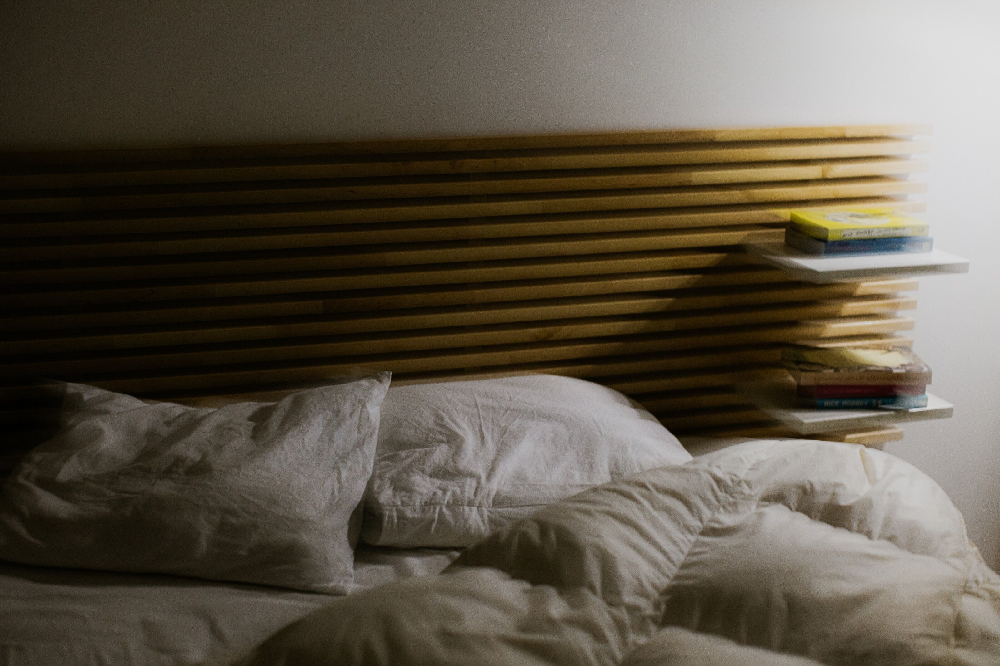

[facebook](https://www.facebook.com/sharer/sharer.php?u=https%3A%2F%2Fwww.natgeo.pt%2Fciencia%2F2021%2F01%2Fpor-que-razao-ainda-nao-estamos-obcecados-com-o-sono) [twitter](https://twitter.com/share?url=https%3A%2F%2Fwww.natgeo.pt%2Fciencia%2F2021%2F01%2Fpor-que-razao-ainda-nao-estamos-obcecados-com-o-sono&via=natgeo&text=Por%20que%20Raz%C3%A3o%20Ainda%20N%C3%A3o%20Estamos%20Obcecados%20com%20o%20Sono%3F) [whatsapp](https://web.whatsapp.com/send?text=https%3A%2F%2Fwww.natgeo.pt%2Fciencia%2F2021%2F01%2Fpor-que-razao-ainda-nao-estamos-obcecados-com-o-sono) [flipboard](https://share.flipboard.com/bookmarklet/popout?v=2&title=Por%20que%20Raz%C3%A3o%20Ainda%20N%C3%A3o%20Estamos%20Obcecados%20com%20o%20Sono%3F&url=https%3A%2F%2Fwww.natgeo.pt%2Fciencia%2F2021%2F01%2Fpor-que-razao-ainda-nao-estamos-obcecados-com-o-sono) [mail](mailto:?subject=NatGeo&body=https%3A%2F%2Fwww.natgeo.pt%2Fciencia%2F2021%2F01%2Fpor-que-razao-ainda-nao-estamos-obcecados-com-o-sono%20-%20Por%20que%20Raz%C3%A3o%20Ainda%20N%C3%A3o%20Estamos%20Obcecados%20com%20o%20Sono%3F) [Ciência](https://www.natgeo.pt/ciencia) 
# Por que Razão Ainda Não Estamos Obcecados com o Sono? 
## Depois de dois anos em que tivemos uma rotina substancialmente mais caseira, ainda existe alguma incúria no ato de dormir. Leia as dicas de um neurohacker sobre como pode (e deve) melhorar a sua higiene de sono. Por [Filipa Coutinho](https://www.natgeo.pt/autor/filipa-coutinho) Publicado 13/01/2021, 17:26 , Atualizado 7/03/2022, 11:02 

A higiene do sono pode ser definida como um conjunto de comportamentos e hábitos adequados que promovam um sono reparador e o bem-estar. **** 

Fotografia por Rui Gaiola **Se esta não foi uma das resoluções para 2022,** ainda vai a tempo de acrescentá-la. Este é o ano! 

Todos passámos por períodos de ansiedade e adaptação a uma realidade sui generis em 2020 e 2021 e à noite muitos de nós ainda sofremos retaliações. Sim, também aconteceu com a nossa equipa. Ao longo dos últimos meses trocámos artigos e ideias entre colegas para tentarmos melhorar a qualidade do nosso sono e potenciar a nossa produtividade. Agora chegou o momento de condensar as recomendações num artigo e derrubar as dúvidas que tantas vezes se levantam e deitam connosco. 

Em 2021, arrancámos o ano com uma conversa com o biomédico Nilson Porto, especialista em _neurohacking_ , e vamos partilhar algumas dicas e _insights_ para que possa melhorar a sua relação com o sono. 

## **Como é a sua higiene do sono?** 
Quando se deita qual é a última coisa para onde olha? Calculamos a resposta. Quando acorda qual é a primeira coisa que segura? Deixe-nos adivinhar… será o seu telemóvel? 

Vivemos numa era de permanente concorrência em que somos condicionados a ser mais produtivos e a rentabilizar o nosso tempo. Por outro lado, o mesmo telemóvel que tem uma aplicação de meditação bombardeia-nos com notícias de última hora e tendências instantâneas. “Só mais cinco minutos” pode facilmente tornar-se em “apenas” mais duas horas, com a justificação do _Fear of Missing Out_ (FOMO, o receio de perder algo). Convenhamos, há sempre uma newsletter a entrar ou uma _story_ a acenar. 

Os seus comportamentos diurnos e a forma como conduz o seu dia, desde o primeiro momento em que abre os seus olhos de manhã, podem afetar a qualidade do seu sono. Nilson Porto afirma que “uma boa noite de sono é iniciada no momento em que acordamos”. O motivo é muito simples: “se acordarmos e começarmos um ritmo padronizado de comportamento, que é o que a maioria das pessoas faz ao pegar no telemóvel e começar a ler mensagens, os primeiros instantes são extremamente sensíveis pelas áreas do cérebro que vão ser ativadas”. Acredite ou não, “isso vai determinar a entrada num certo estado de espírito que pode interferir no dia todo, à medida que a pessoa vai acumulando episódios de carga mental que a impedirão de conseguir fechar os olhos, porque o cérebro não parou”. 

Dormir melhor depende do seu cronotipo, da existência ou falta de sono e do grau de atividade do seu corpo no momento em que pretende dormir. Se bebeu uma bebida alcoólica, ou uma bebida com cafeína ou teína a uma hora tardia, ou se por ventura trabalhou até mais tarde ou mais horas do que habitualmente, não adianta insistir em tentar adormecer. 

Contrariamente ao que algumas pessoas julgam, o álcool não nos ajuda a dormir melhor. Pelo contrário. Pode atirar-nos mais rapidamente para o sono, porém não é metabolizado a tempo antes do sono, impedindo-nos de entrar nas fases mais profundas do sono e no sono REM, fundamentais para o seu efeito reparador. 

Na conversa que tivemos com Nilson Porto, aprofundámos os efeitos de uma noite de insónias, mas também os potenciais danos de uma noite com demasiadas horas de sono. 

Fotografia por Rui Gaiola 
## **Uma noite sem dormir, são oito para substituir** 
De acordo com os [estudos](https://journals.physiology.org/doi/full/10.1152/ajpregu.00149.2016) , basta uma noite de privação de sono para as células T se tornarem menos eficazes na [interação com as células infetadas por vírus](https://pubmed.ncbi.nlm.nih.gov/30755455/) , reduzindo o seu poder de atuação no combate contra uma infeção. Nilson Porto explica que “o sono é comparado a um alimento e a sua supressão tem efeitos equivalentes a alimentos extremamente tóxicos. Os efeitos de uma noite sem dormir equivalem a uma ressaca.” 

Sabia que dormir é uma das formas mais simples e sólidas de fortalecer o sistema imunitário [contra infeções respiratórias como a COVID-19](https://www.natgeo.pt/ciencia/2020/10/quer-reduzir-os-riscos-de-covid-19-precisa-de-dormir-mais) e pode até aumentar a eficácia das vacinas contra a COVID-19? Dormir torna-nos melhores em quase tudo. Os benefícios de uma boa noite de sono são conhecidos há pelo menos 2000 anos, mas ainda não lhe damos o merecido crédito. 

A privação crónica de sono tem consequências a longo prazo, aumentando o risco de diabetes tipo 2 e a probabilidade de desenvolver uma doença cardiovascular ou do foro neurológico. Ficar acordado durante muito tempo compromete a nossa capacidade de raciocínio e pode levar-nos a ficar desleixados ou a cometer erros. “É durante o sono que o nosso corpo tem uma série de funções importantes como por exemplo a consolidação de memórias e a desintoxicação. Os nossos neurónios diminuem de tamanho durante o sono para que se crie um espaço entre eles e se eliminem as toxinas que se acumulam como produtos do seu metabolismo diário. E, se isso não acontece, tal acúmulo danifica e acelera o envelhecimento das células e não se conseguem assimilar certas informações, nem realizar outras funções importantes.” 

Ao longo das últimas décadas, foram identificadas mais de 100 doenças relacionadas com o sono. Se tem dificuldade em conciliar o sono, em manter-se adormecido ou se, por outro lado, tem dificuldade em manter-se acordado durante o dia, pode ter um desarranjo do sono. 

## **Nem todos precisamos da mesma dose** 
A resposta depende da sua cronobiologia. 

Até há alguns anos a literatura científica clássica considerava apenas três cronotipos diferentes: _early birds_ (madrugadores), _hummingbirds_ (beija-flores) e _night owls_ (notívagos). Hoje, através do trabalho desenvolvido pelo afamado psicólogo Dr. Michael Breus, existem quatro diferentes cronotipos alvo de estudos da cronobiologia. Leia uma breve apresentação e tente perceber em qual deles se encaixa. 

**Leões** – São os COOs ( _chief operating officers_ ) das empresas. Costumam possuir personalidades muito emblemáticas. A propósito, eles geralmente acordam com facilidade entre as 4h30 e as 5h00 da manhã e já estão prontos para iniciar o dia. Eles são aqueles que lhe enviam e-mails constantemente, antes mesmo de você abrir os olhos. Eles gostam de fazer uma lista de tarefas todos os dias e de ir da etapa um à etapa dois, da etapa três à etapa quatro – são pensadores muito disciplinados. Mas há um problema em ser um leão. Sabemos que isto parece tudo fantástico, mas os leões acordam às 4h30. Jantar e sessão noturna de cinema acaba por não existir para estes indivíduos, certo? Quase nunca conseguem fazer isso socialmente. Representam cerca de 15% da população e correspondem aos _early birds_ descritos na literatura científica clássica. 

**Ursos** – Representam as pessoas que estão na média (os _hummingbirds_ da nomenclatura clássica). Contrariamente à gíria portuguesa, ser um urso é fantástico! São aproximadamente 55% da população, levantam-se com o sol, adormecem quando a lua aparece. São as mais comuns do mundo. Geralmente os ursos são extrovertidos e têm tendência para ser pessoas muito sociáveis. São indivíduos que fazem o trabalho acontecer. Convidam-no para jantar em sua casa, oferecem-lhe uma bebida no bar ou sugerem uma atividade divertida. São um ótimo grupo de pessoas para sair. 

**Lobos** – Este cronotipo equivale aos _night owls_ clássicos. Representando cerca de 15% da população, estas pessoas têm características muito interessantes. São os artistas, os atores, os escritores, os músicos... São pessoas muito criativas, mas, curiosamente, introvertidas de muitas formas diferentes. Podem fazer as coisas parecerem fantásticas, mas se criarem uma lista de tarefas durante o dia, vão da etapa um à etapa 12, da etapa 7 à etapa 14. Não temos ideia do que estas pessoas estão a fazer. E o que descobrimos com o passar do tempo é que são amigos muito leais, pessoas muito inteligentes, mas, ao mesmo tempo, tudo muda ao final do dia. São pessoas que precisam de mais horas de sono e adormecem mais tarde – geralmente depois da meia noite. Precisam de mais tempo na cama, antes de se levantarem – geralmente depois das 08h30, para o seu cérebro ficar ativo. 

**Golfinhos** – Acredite ou não, os golfinhos dormem com metade do cérebro adormecido e a outra metade acordado, desta forma podem estar “a dormir”, mas ainda procurar predadores ou alimentos. É uma boa representação das pessoas que não dormem tão bem. Um facto interessante sobre os golfinhos: eles são como leões, mas são tão ansiosos que passam por momentos difíceis. Então, são também personalidades emblemáticas. Muitas vezes, autodiagnosticam-se com insónias. Por vezes têm problemas de saúde; são muito preocupados com a saúde, mas podem desenvolver transtorno obsessivo-compulsivo o suficiente para que nunca terminem um projeto, fazendo alterações no último minuto; enquanto isso, todos os que assistem comentam: "Meu Deus, és o maior!”. São cerca de 10 a 15% da população e têm um sono muito irregular. Despertam com o mínimo estímulo ou ruído sonoro. 

Pode dormir apenas seis horas e ainda assim ser saudável. Nilson Porto explica que devemos passar em cada noite de sono pelo menos quatro vezes por cada ciclo completo. Cada ciclo passa por quatro estágios: sono leve (fases 1 e 2), sono profundo (fase 3) e sono REM (fase 4) e dura aproximadamente de 90 (o primeiro ciclo) até 120 minutos (o último). Para se ter um sono reparador é preciso passar pelas quatro fases pelo menos quatro vezes durante a noite. Isso perfaz um tempo médio de sono de sete horas. No entanto, o especialista alerta que “apesar de o corpo humano poder adaptar-se a períodos menores de sono, essa adaptação não significa que é saudável, dependendo do cronotipo de cada pessoa”. 

## **E a Bela Adormecida?** 
Será que dormir mais de 10 horas por noite pode conduzir a outras (ou às mesmas) doenças? 

Há um ditado português que afirma que "quem muito dorme, muito perde." Dormir mais de 10 horas por noite tem sido associado a taxas mais elevadas de doenças, que muitas vezes são acompanhadas por condições como a depressão e a apatia. Há estatísticas que mostram que as pessoas que dormem mais de oito horas por dia têm maior probabilidade de desenvolverem doenças cardiovasculares e hipertensão, por exemplo. Isto porque, durante o sono há redução da atividade cardiovascular, queda da pressão arterial e da frequência cardíaca. Essas alterações exigem que à noite, durante o repouso, o sono seja equilibrado e, de preferência, ininterrupto. 

Segundo o neurocientista, “se o nosso corpo pede uma determinada dose de sono e formos além disso, as áreas do cérebro que devem estar ativas no estado de vigília vão estar reprimidas”. 

## **Uma banana antes de dormir, nem sabe o bem que lhe fazia** 
A produção de melatonina depende da ingestão de alimentos que promovem a sua produção. Então o que comemos também interfere no nosso sono. As bananas são ricas em magnésio, um mineral essencial para relaxarmos. Os alimentos ricos no aminoácido triptofano – o percursor da melatonina e da serotonina – como a batata doce, os ovos, o peru, as nozes, o chocolate negro e os flocos de aveia são outros alimentos que poderão induzir uma boa noite de sono. 

## **A catarse dos lençóis** 
“O ambiente em que dormimos é um dos fatores mais cruciais para dormir bem”, afirma Nilson Porto. Para começar, escolha os lençóis certos. O material dos seus lençóis pode ser um entrave a uma boa noite de sono. Se puder, opte por algodão biológico e suave – este é o material que vai estar em contacto com a sua pele e isso condiciona o tipo de informação que é enviada para o seu cérebro. 

Sabia que alguns colchões contêm espuma de poliuretano à base de petróleo e retardadores contra o fogo que libertam compostos orgânicos voláteis? Lembre-se que todas estas superfícies acumulam mais pó e bactérias do que o que conseguimos ver a olho nu. É fundamental manter uma rotina de lavagem dos seus cobertores, mantas e de tudo o que estiver à volta da sua cama. 

Além disso, “quanto mais escuro estiver o quarto, maior será a produção de melatonina”, independentemente do seu cronotipo. 

## **O divórcio do sono** 
É natural que dormir pouco ou dormir mal se reflita na maneira como os casais se relacionam, gerando ingratidão e redução da capacidade de afeto do importunado para com a pessoa que ressona. Ao comprometer a circulação do sangue nos vasos sanguíneos, a apneia do sono também pode conduzir à [disfunção erétil](https://www.sciencedirect.com/science/article/pii/S2173511512000036) e ao decréscimo dos níveis de testosterona, hormona produzida durante a noite. 

Alguns especialistas prescrevem o “divórcio do sono”, ou seja, que o casal durma em quartos ou camas separadas. Se a síndrome da apneia do sono e a roncopatia são apontadas como algumas das maiores causas de divórcio, é fácil compreender a recomendação de alguns terapeutas familiares em separar os casais durante o sono. Na verdade, este é um hábito que remonta aos monarcas portugueses e não tem motivos para recear fazer um _test drive_ . A intimidade pode passar por definir algumas fronteiras no seu espaço e o divórcio do sono pode até reforçar alguns relacionamentos. 

## **Os 10 Novos Mandamentos** 
Queremos alertá-lo que para dormir não existe um cocktail perfeito (pelo contrário, o álcool deve estar bem distante do seu horário de sono). A receita depende da origem da privação ou má qualidade do sono. Nilson Porto afirma que “tem de se ter coragem para alterar o estilo de vida” e acrescenta que “o caminho mais fácil pode ser o de procurar um médico e esse médico vai receitar um medicamento e a pessoa terá o alívio de adormecer com facilidade, porém isso não irá resolver o problema”. 

Além das recomendações óbvias, como parar de assimilar notícias e imagens dos OOTD ( _outfit of the day_ ) antes de ir dormir, convidamo-lo a experimentar algumas que podem ser menos óbvias. 

1 - Introduza um novo hábito aprazível na sua rotina antes de se deitar. Pode ser tão simples como uma massagem facial com o seu óleo de rosto preferido ou um duche quente. 

2 - Defina um alerta para ir dormir (e talvez deixe de precisar do alarme matinal). 

3 - Tente acordar numa janela de 30 minutos em qualquer dia da semana, para evitar o j _et lag_ social (nome dado à discrepância nos padrões de sono entre os dias de trabalho e os dias livres). 

4 - Experimente dormir com um cobertor mais pesado. O calor e o peso podem induzir mais rapidamente o sono. 

5 - Durante o dia, saia de casa ou abra a janela para apanhar pelo menos meia hora de luz solar. Não tem de olhar ou estar voltado diretamente para o sol. 

6 - Tome uma bebida quente como uma caneca de bebida vegetal com um pouco de canela antes de ir dormir. Agarre na caneca quente e aproveite esse calor para aquecer as suas mãos, num momento de tranquilidade. 

7 - Leve uma planta de alfazema para o seu quarto ou pulverize os lençóis com algumas gotas de óleo essencial de lavanda para induzir o sono. 

8 - Faça uma massagem na palma dos seus pés com o seu creme ou óleo preferido, fazendo pequenos círculos com os dois polegares ao mesmo tempo. 

9 - Teste viver as duas primeiras horas do seu dia sem tecnologia e sem internet. Faça uma caminhada, cozinhe um bolo ou leia um livro. 

10 - Para reduzir o eletromagnetismo dos aparelhos eletrónicos, a melhor solução é deixá-los desligados e distantes do ambiente onde dorme. Pode também procurar um aparelho, [como este](https://www.amazon.com/eLink-EMF-Neutralizer-Protection-Device/dp/B00TRM0UI4/ref=sr_1_8?dchild=1&keywords=EMF+protection&qid=1610363936&sr=8-8) , que se encaixa nas tomadas para reduzir os efeitos das correntes da fiação de dentro das paredes e das tomadas. 

A sua higiene de sono define o seu comportamento e produtividade ao longo do dia. No entanto, dormir não é um interruptor que possamos ligar, é um processo natural que depende do corpo e da mente. Não se preocupe demasiado em dormir oito horas de sono, talvez sete sejam suficientes para si. Há até quem tenha mutação raras em certos genes que lhes permite necessitar de menos horas de sono. 

O facto de ficar obcecado com o número oito pode causar-lhe ansiedade desnecessária que irá atrasar o seu sono. Lembre-se, ter dificuldade em dormir é perfeitamente comum e com os ajustes necessários pode saltar por cima desse obstáculo. 

Hoje, quando deitar a sua cabeça na almofada, reflita. Lembre-se que uma boa noite de sono começa com o primeiro minuto do seu dia. 

_Nilson Porto é um neurohacker, que se declara apaixonado pelo estudo da evolução da consciência humana. Com formação em Biomedicina e Neurociência, é também educador e terapeuta cognitivo comportamental especializado em neurohacking. Desenvolveu um programa de democratização de acesso ao conhecimento, ferramentas e estratégias de neurohacking – em língua portuguesa – através do site_ [_holohacking.com_](http://www.holohacking.com/) _e das suas contas nas redes sociais._ 

