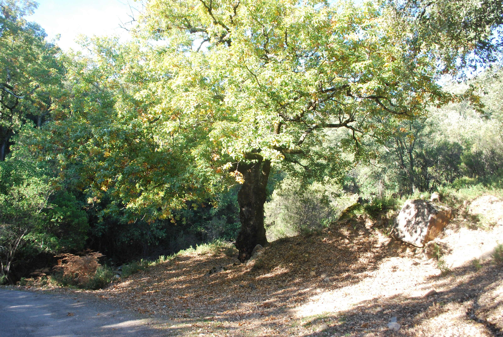
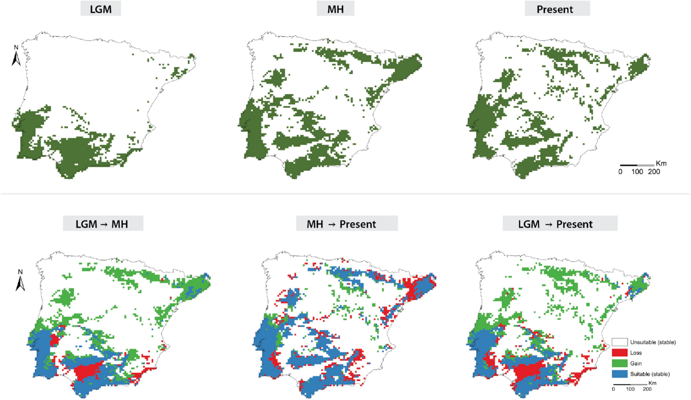

[facebook](https://www.facebook.com/sharer/sharer.php?u=https%3A%2F%2Fwww.natgeo.pt%2Fciencia%2F2021%2F08%2Fcientistas-revelam-como-a-alteracao-da-distribuicao-dos-carvalhos-ibericos-no-passado-ajuda-a-prever-variacoes-futuras) [twitter](https://twitter.com/share?url=https%3A%2F%2Fwww.natgeo.pt%2Fciencia%2F2021%2F08%2Fcientistas-revelam-como-a-alteracao-da-distribuicao-dos-carvalhos-ibericos-no-passado-ajuda-a-prever-variacoes-futuras&via=natgeo&text=Cientistas%20revelam%20como%20a%20altera%C3%A7%C3%A3o%20da%20distribui%C3%A7%C3%A3o%20dos%20carvalhos%20ib%C3%A9ricos%20no%20passado%20ajuda%20a%20prever%20varia%C3%A7%C3%B5es%20futuras%20face%20%C3%A0s%20altera%C3%A7%C3%B5es%20clim%C3%A1ticas) [whatsapp](https://web.whatsapp.com/send?text=https%3A%2F%2Fwww.natgeo.pt%2Fciencia%2F2021%2F08%2Fcientistas-revelam-como-a-alteracao-da-distribuicao-dos-carvalhos-ibericos-no-passado-ajuda-a-prever-variacoes-futuras) [flipboard](https://share.flipboard.com/bookmarklet/popout?v=2&title=Cientistas%20revelam%20como%20a%20altera%C3%A7%C3%A3o%20da%20distribui%C3%A7%C3%A3o%20dos%20carvalhos%20ib%C3%A9ricos%20no%20passado%20ajuda%20a%20prever%20varia%C3%A7%C3%B5es%20futuras%20face%20%C3%A0s%20altera%C3%A7%C3%B5es%20clim%C3%A1ticas&url=https%3A%2F%2Fwww.natgeo.pt%2Fciencia%2F2021%2F08%2Fcientistas-revelam-como-a-alteracao-da-distribuicao-dos-carvalhos-ibericos-no-passado-ajuda-a-prever-variacoes-futuras) [mail](mailto:?subject=NatGeo&body=https%3A%2F%2Fwww.natgeo.pt%2Fciencia%2F2021%2F08%2Fcientistas-revelam-como-a-alteracao-da-distribuicao-dos-carvalhos-ibericos-no-passado-ajuda-a-prever-variacoes-futuras%20-%20Cientistas%20revelam%20como%20a%20altera%C3%A7%C3%A3o%20da%20distribui%C3%A7%C3%A3o%20dos%20carvalhos%20ib%C3%A9ricos%20no%20passado%20ajuda%20a%20prever%20varia%C3%A7%C3%B5es%20futuras%20face%20%C3%A0s%20altera%C3%A7%C3%B5es%20clim%C3%A1ticas) [Ciência](https://www.natgeo.pt/ciencia) 
# Cientistas revelam como a alteração da distribuição dos carvalhos ibéricos no passado ajuda a prever variações futuras face às alterações climáticas 
## Uma equipa ibérica de botânicos e ecólogos estudou as diferenças de distribuição de carvalhos para compreender como as alterações climáticas do passado poderão ajudar a prever a distribuição das espécies face a alterações futuras. Por [Filipa Coutinho](https://www.natgeo.pt/autor/filipa-coutinho) Publicado 27/08/2021, 10:55 

Em Portugal existem oito espécies de carvalhos, sendo que o _Quercus canariensis_ , criticamente em perigo, está circunscrito à Serra de Monchique e a ribeiras da Bacia do Rio Mira com efetivos populacionais muito baixos, podendo não existir mais de 200 a 300 indivíduos a nível nacional. As melhores sub-populações ibéricas desta espécie encontram-se em Algeciras no Parque Natural de Los Alcornocales, Espanha. 

Fotografia por Carlos Vila-Viçosa Compreender como as florestas de carvalhos de folha marcescente, sensíveis a alterações abrutas do clima, se comportaram no passado, permite prever o seu comportamento futuro face às emergentes alterações globais. 

Os carvalhos de folha marcescente são aqueles em que a árvore não “expele” a folha, ou seja, a folha morre e é empurrada pelas folhas novas do ano seguinte. Este é um processo fisiologicamente “caro”, o que explica o “desconforto” ecológico a que estas espécies estão sujeitas e a sua maior suscetibilidade às alterações ambientais. As florestas destas espécies são extremamente importantes no sul da Europa, pois a compensação oferecida pelas precipitações de verão em zonas térmicas, permitiram a coexistência de elementos florísticos, considerados relíquias de períodos antigos. Alguns exemplos são espécies como a adelfeira ( _Rhododendron ponticum_ ), o loureiro ( _Laurus nobilis_ ), o amieiro-negro ( _Frangula alnus subsp. baetica_ ) ou o azereiro ( _Prunus lusitanica_ ) e o próprio carvalho-de-monchique ( _Quercus canariensis_ ) - uma espécie criticamente em perigo de extinção em Portugal, de acordo com a Lista Vermelha da Flora de Portugal. 

Uma equipa ibérica publicou um [artigo](https://www.nature.com/articles/s41598-020-78576-9) na revista científica _Scientific Reports_ que fornece pistas sobre como as alterações na distribuição passada de oito carvalhos possibilita compreender em que zonas as diferentes espécies desapareceram, se mantiveram estáveis ou “ganharam terreno”, face à transição climática no final do quaternário. 

Na primeira linha é possível ver a distribuição das espécies de carvalhos marcescentes nos três períodos estudados (Último Máximo Glacial - há cerca de 20.000 anos, Médio Holoceno - há cerca de 6000 anos, e Atualidade). Na segunda linha é apresentada a evolução da distribuição das espécies nos mesmos períodos. 

Fotografia por Carlos Vila-Viçosa et al. No trabalho científico os autores perceberam que as precipitações, especialmente anual e de verão, juntamente com as temperaturas mínimas de inverno e algumas variáveis de relevo, contribuíram para a alteração na distribuição das diferentes espécies estudadas. 

[Carlos Vila-Viçosa](https://cibio.up.pt/people/details/carlosvv) , investigador e principal autor do artigo, afirma que “é a primeira vez que conseguimos inferir como diferentes espécies de carvalhos se movimentaram ou onde existiram no passado, uma vez que os registos polínicos não conseguem distinguir entre espécies do género _Quercus_ de folha marcescente ou caduca”. 

Na publicação, os autores apresentam alterações significativas na distribuição destas espécies na Península Ibérica nos últimos 20.000 anos. “Para documentar a distribuição atual de cada espécie de carvalho, foi necessário proceder a uma revisão exaustiva de 16 herbários de referência Ibéricos e Europeus. Só assim conseguimos obter modelos com melhor performance para uma correta modelação da distribuição das diferentes espécies, perceber quais as variáveis ambientais que “ditam” a ocorrência de determinada espécie, bem como captar a ocorrência dos seus híbridos, cuja distinção é por vezes dúbia e cujos registos são suscetíveis de erro na identificação”, explica o investigador. 

## **A distribuição de híbridos de carvalhos** 
A distribuição atual de híbridos de carvalhos testemunha áreas de simpatria entre as espécies parentais no passado, isto é, a coexistência ou contacto de duas ou mais sub-populações de diferentes espécies na mesma área geográfica, onde hoje em dia uma delas já se encontra extinta. Através da literatura e de trabalho de campo exaustivo, a equipa encontrou a presença de híbridos que testemunham as mesmas alterações que viram nas distribuições de espécies parentais. 

“As fracas barreiras reprodutivas entre espécies de _Quercus_ são sobejamente conhecidas. Para a minha tese [de doutoramento] estudei quatro casos paradigmáticos de híbridos conhecidos na Península Ibérica que formam autênticas zonas de transição biogeográfica entre as espécies parentais, comportando-se como verdadeiras espécies e formando florestas próprias onde acabam por ter uma frequência relativa mais elevada em face dos próprios parentais. Os casos mais paradigmáticos são áreas de contacto entre o carvalho-cerquinho ( _Q. faginea_ ) e outras espécies, como o carvalho-alvarinho ( _Q. robur_ ) e o carvalho-de-monchique ( _Q. canariensis_ ). Estes híbridos têm sido amplamente documentados na literatura e existem em herbário, vindo a ser descritos já desde o século XIX pelo próprio Félix de Avelar Brotero (1804), que descreve a sua _Quercus hybrida_ , referindo-se à zona de transição entre o carvalho-cerquinho e o carvalho-alvarinho no Centro-Oeste Português”, explica Carlos Vila-Viçosa. 

## **A manutenção de espécies raras com elevado valor de conservação** 
Por serem indicadores de condições climáticas e ambientais favoráveis em termos de precipitação, as áreas onde ainda hoje se encontram, representam ilhas de um passado recente mais húmido, servindo como indicadores que podem retroalimentar planos de conservação para estas espécies. 

Outro [estudo](https://www.mdpi.com/2220-9964/9/12/735) do mesmo grupo de autores retrata as melhores áreas para conservação dos carvalhos ibéricos e quais as que apresentam um maior potencial em termos de riqueza específica para cada área. De acordo com Carlos Vila-Viçosa, o Sudoeste Português afigura-se como uma área de preservação especial, por fornecer condições ótimas a um número elevado de espécies de folha marcescente ou caduca (cinco), e por acolher conjuntamente dois carvalhos raros e ameaçados: o carvalho-de-monchique ( _Quercus canariensis_ ) e o carvalho-estremenho ( _Quercus estremadurensis_ ), dedicado à área de onde foi descrito – a Estremadura Portuguesa. A sub-população desta espécie, distribuída pelo Ocidente Peninsular e Norte de África apresenta-se como um caso de estudo particular, estando filogeneticamente relacionada, mas com uma divergência significativa, com o grupo dos carvalhos alvarinhos ( _roburoides_ ) Europeus. Este grupo de carvalhos inclui tanto a Quercus robur como outra espécie inexistente em Portugal (a _Quercus petraea_ ). Simultaneamente, o carvalho-estremenho ( _Quercus estremadurensis_ ) contém informação genética que é partilhada por ambos, o que reforça o Ocidente Ibérico como um “hot-spot” para a compreensão da história evolutiva deste grupo de carvalhos. 

## **Estudos clássicos complementados com métodos modernos ajudam a prever como as espécies e as florestas mediterrânicas se vão comportar face às alterações climáticas** 
A fusão de diferentes áreas no estudo dos carvalhos ibéricos, que vão desde a história natural, onde se inclui a descrição original e clássica das espécies, ao estudo dos caracteres morfológicos diferenciais que as permitem distinguir entre si, seguida de exercícios de modelação ecológica com recurso a software informático e posteriormente a filogenia (estudo da relação evolutiva entre grupos de espécies ou populações de espécies, que é feito por meio de sequenciação de dados moleculares) com ferramentas de sequenciação de nova geração, permitirão reconstruir a história evolutiva deste grupo particular de espécies ibéricas, cujo papel biogeográfico é extremamente importante para compreender toda a evolução do género _Quercus_ , particularmente na Bacia do Mediterrâneo mas com implicações para o continente Euroasiático. 

A forma como estas diferentes espécies se comportaram face a mudanças abruptas no clima no passado, vai ajudar os investigadores a entender como poderão evoluir as suas dinâmicas demográficas no futuro próximo, suscetíveis a agravadas alterações climáticas que ameaçam a preservação dos ecossistemas florestais, especialmente no Sul da Europa. 

_Carlos Vila-Viçosa é estudante de Doutoramento e investigador no Centro de Investigação em Biodiversidade e Recursos Genéticos (CIBIO-InBIO) e no Museu de História Natural e da Ciência da Universidade do Porto, na área da botânica, biogeografia e evolução. Os seus interesses são a história evolutiva dos carvalhos (Quercus L.) circum-mediterrânicos, prevendo o efeito das alterações climáticas na conservação das suas florestas. Tem interesses alargados às ciências da vegetação, classificação sintaxonómica e taxonomia botânica, relevância biogeográfica do Sudoeste ibérico e Noroeste de África como hot-spots filogeográficos no contexto da bacia mediterrânica._ 

[source](https://www.natgeo.pt/ciencia/2021/08/cientistas-revelam-como-a-alteracao-da-distribuicao-dos-carvalhos-ibericos-no-passado-ajuda-a-prever-variacoes-futuras)