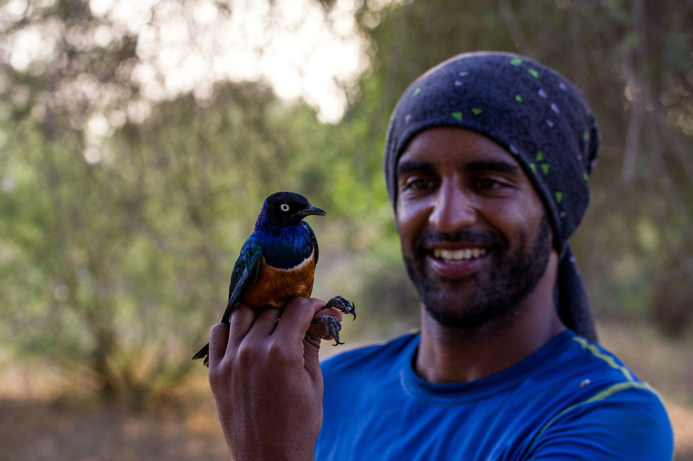
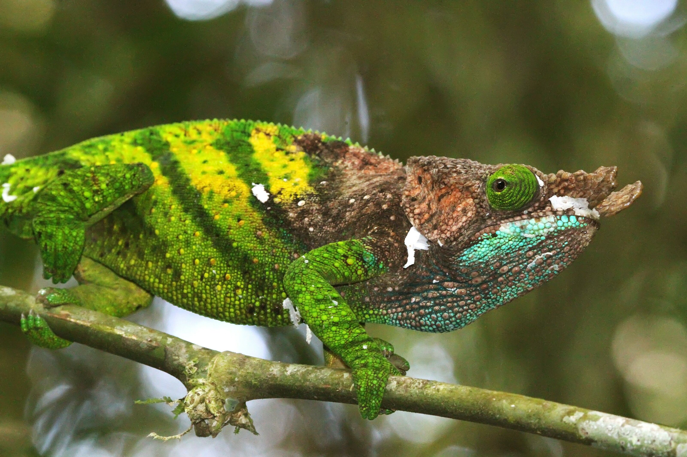
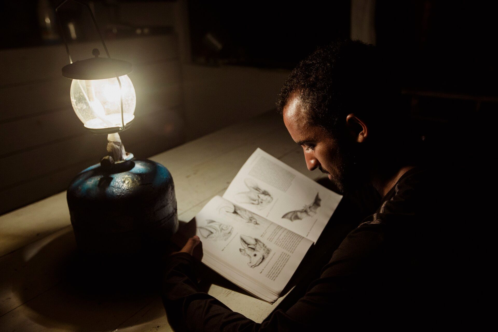
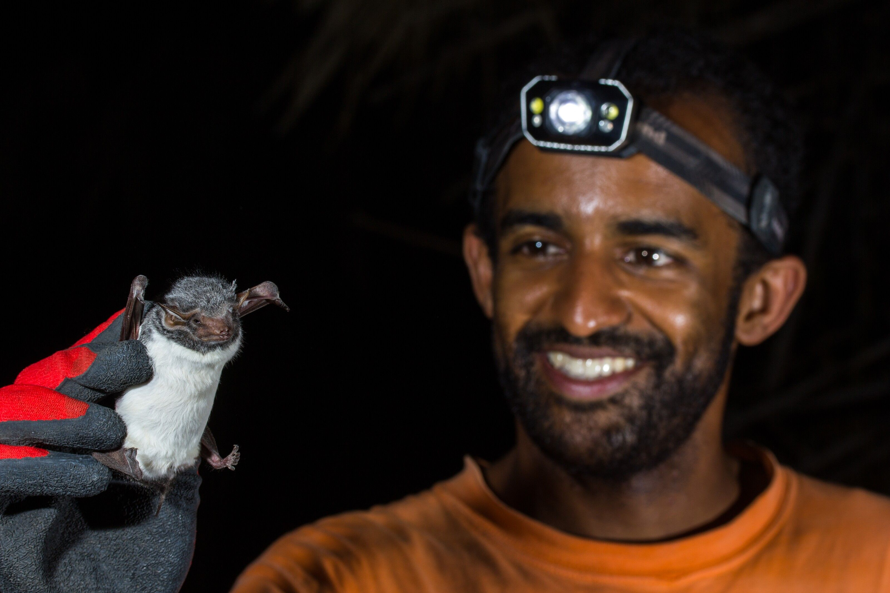

[facebook](https://www.facebook.com/sharer/sharer.php?u=https%3A%2F%2Fwww.natgeo.pt%2Fciencia%2F2021%2F09%2Fentrevista-ricardo-rocha-diversidade-racial-etnica-ciencia-portuguesa) [twitter](https://twitter.com/share?url=https%3A%2F%2Fwww.natgeo.pt%2Fciencia%2F2021%2F09%2Fentrevista-ricardo-rocha-diversidade-racial-etnica-ciencia-portuguesa&via=natgeo&text=Ricardo%20Rocha%3A%20%E2%80%9CA%20diversidade%20racial%20e%20%C3%A9tnica%20na%20ci%C3%AAncia%20Portuguesa%2FEuropeia%20n%C3%A3o%20deve%20continuar%20a%20ser%20um%20tema%20tabu%E2%80%9D) [whatsapp](https://web.whatsapp.com/send?text=https%3A%2F%2Fwww.natgeo.pt%2Fciencia%2F2021%2F09%2Fentrevista-ricardo-rocha-diversidade-racial-etnica-ciencia-portuguesa) [flipboard](https://share.flipboard.com/bookmarklet/popout?v=2&title=Ricardo%20Rocha%3A%20%E2%80%9CA%20diversidade%20racial%20e%20%C3%A9tnica%20na%20ci%C3%AAncia%20Portuguesa%2FEuropeia%20n%C3%A3o%20deve%20continuar%20a%20ser%20um%20tema%20tabu%E2%80%9D&url=https%3A%2F%2Fwww.natgeo.pt%2Fciencia%2F2021%2F09%2Fentrevista-ricardo-rocha-diversidade-racial-etnica-ciencia-portuguesa) [mail](mailto:?subject=NatGeo&body=https%3A%2F%2Fwww.natgeo.pt%2Fciencia%2F2021%2F09%2Fentrevista-ricardo-rocha-diversidade-racial-etnica-ciencia-portuguesa%20-%20Ricardo%20Rocha%3A%20%E2%80%9CA%20diversidade%20racial%20e%20%C3%A9tnica%20na%20ci%C3%AAncia%20Portuguesa%2FEuropeia%20n%C3%A3o%20deve%20continuar%20a%20ser%20um%20tema%20tabu%E2%80%9D) [Ciência](https://www.natgeo.pt/ciencia) 
# Ricardo Rocha: “A diversidade racial e étnica na ciência Portuguesa/Europeia não deve continuar a ser um tema tabu” 
## Em conversa com a National Geographic, o biólogo falou sobre o seu trabalho na área da conservação e ecologia e, também, sobre a falta de diversidade racial e étnica na ciência. Por [Filipa Coutinho](https://www.natgeo.pt/autor/filipa-coutinho) Publicado 20/09/2021, 10:19 

Ricardo Rocha, durante trabalho de campo na Amazónia. 

Fotografia por Madalena Boto **Ricardo Rocha** , **** explorador da National Geographic, deu os primeiros passos da sua carreira como biólogo da conservação na ilha da Madeira, de onde é natural. A partir daí rumou ao Brasil, Madagáscar, China, Quénia, Cabo Verde, São Tomé e Príncipe e Finlândia. 

O seu trabalho de investigação foca-se na avaliação do impacto da agricultura e da fragmentação de habitat nas comunidades que habitam as florestas tropicais, bem como na monitorização de espécies que persistem em ambientes humanizados. O enorme entusiasmo com que fala sobre a biodiversidade do nosso planeta é contagiante. 

Em 2020 foi distinguido com o **** _European Early Career Conservation Award_ , atribuído pela Society for Conservation Biology em resultado do seu contributo em prol da conservação da natureza e do incentivo a uma comunidade científica mais diversa. Atualmente, é investigador de pós-doutoramento no Centro de Investigação em Biodiversidade e Recursos Genéticos (CIBIO-InBIO), onde estuda ecologia e conservação da natureza em ecossistemas tropicais e na Macaronésia. 

A sua dedicação à promoção da diversidade e inclusão na ciência levam-no no dia 1 de outubro a um [evento sobre diversidade nas ciências da vida e da saúde](https://diversidade.i3s.up.pt/) , onde será um dos oradores em palco. O evento é organizado em colaboração entre o i3S – Instituto de Investigação e Inovação em Saúde, o CIBIO-InBIO e a Universidade do Porto, e mais informação sobre o mesmo está disponível no respetivo [site](https://diversidade.i3s.up.pt/) . 

**Esquerda:** **Superior:** Ricardo Rocha enquanto desenvolvia trabalho de campo no Quénia, em 2016. 

Fotografia por Adrià López-Baucells **Direita:** **Inferior:** A espécie _Calumma oshaughnessyi_ fotografada pelo biólogo durante o seu trabalho em Madagáscar. 

Fotografia por Ricardo Rocha **O que o entusiasma no seu trabalho?** 

A oportunidade de conhecer como funcionam os ecossistemas e contribuir para a conservação da natureza. 

Os efeitos da ação humana nas comunidades de animais e plantas que compõem os diversos ecossistemas naturais do planeta são cada vez mais notórios e grande parte do meu trabalho está relacionado com a quantificação da resposta dos ecossistemas às pressões antropogénicas e à avaliação das melhores formas de reverter impactos negativos e maximizar a forma como a natureza contribui para o bem-estar humano. Dito isto, um dos pontos mais positivos do meu trabalho é a oportunidade de visitar alguns dos locais com maior biodiversidade do planeta e de colaborar com inúmeras pessoas que partilham a minha paixão pela natureza e o desejo por uma sociedade mais sustentável, diversa e justa. 

**Como é que a diversidade étnica e racial em Portugal se reflete na ciência?** 

Essa é uma pergunta que ainda carece de resposta. A minha opinião é que pelo menos na minha área científica – ecologia e biologia da conservação - não se reflete. Portugal, fruto das suas relações históricas com África, América do Sul e Ásia, tem uma das populações mais diversas (do ponto de vista racial e étnico) a nível europeu. No entanto, contam-se pelos dedos de uma mão os cientistas não brancos a trabalhar em Portugal. É inegável que a diversidade racial e étnica que vemos nas ruas das nossas principais cidades não se reflete nos corredores nas nossas faculdades, e urge perceber porquê e quais os impactos que isso tem, não apenas na sociedade em si, mas também no tipo de ciência que é feita, e na qualidade da mesma. Embora ainda haja muito que fazer no que toca à diversidade de género na ciência, acho que está na hora de aplicarmos alguns dos ensinamentos das políticas de fomento à diversidade de género a outras dimensões da diversidade humana. A diversidade racial e étnica na ciência Portuguesa/Europeia (ou a falta dela) não deve continuar a ser um tema tabu. 

Durante o doutoramento, Ricardo Rocha estudou o efeito da fragmentação da floresta tropical sobre a dinâmica espácio-temporal de morcegos amazónicos. 

Fotografia por Madalena Boto **A pandemia de SARS-CoV-2 veio exacerbar o vínculo entre a saúde das espécies selvagens e a saúde humana. Na sua opinião, que ensinamentos trouxe a pandemia sobre o estado do mundo natural?** 

A pandemia seguramente veio enfatizar o quanto a nossa espécie está interligada às demais. O facto do SARS-CoV-2 ter conseguido saltar de animais selvagens para a nossa espécie e espalhar-se por todo o mundo de forma tão rápida e impactante mostra bem o quanto a saúde humana, a saúde dos animais – tanto domésticos como selvagens – e a saúde dos ecossistemas está interligada. 

No entanto, apesar do impacto do COVID-19, importa enfatizar que esta é apenas uma de muitas doenças emergentes associadas à ação do homem nos ecossistemas. A frequência de surtos de doenças infecciosas de origem animal tem vindo a aumentar, e há um consenso generalizado que esse aumento está relacionado com um combinar de alterações ambientais induzidas pelos humanos e por um aumento de comportamentos de risco por parte da nossa espécie. Um dos estudos mais famosos, publicado em 2008, analisou 335 novas doenças detetadas entre 1960 e 2004, e identificou que 60% destas eram de origem animal e que a cada década que passava, a frequência de novas doenças aumentava. Entre os fatores responsáveis por este aumento destacam-se a destruição das florestas tropicais e a expansão da agricultura e pecuária intensivas. 

**Que expectativas tem para a presidência portuguesa da União Europeia no âmbito da conservação?** 

Durante a presidência portuguesa da União Europeia tivemos o anúncio do Pacto Ecológico Europeu que mostra um enorme compromisso da União com políticas de conservação da natureza. Uma das coisas que o Pacto Ecológico Europeu enfatiza é o papel da biodiversidade para a economia e para o bem-estar humano. Isso mesmo foi enfatizado no último Fórum Económico Mundial em Davos, onde a perda de biodiversidade foi identificada como um dos 10 maiores riscos à economia mundial. Com o Pacto Ecológico Europeu a União Europeia anunciou um leque de financiamento bastante considerável para políticas de conservação da natureza e em particular para ações de restauro de ecossistemas que revertam a perda de biodiversidade e maximizem potenciais serviços de ecossistema. Ocupando Portugal a presidência da União quando tão importantes compromissos foram assumidos, espero que o nosso país consiga estar na linha da frente da conservação da natureza e da transição para uma sociedade mais sustentável. 

**Esquerda:** **Superior:** Ricardo Rocha durante a captura de morcegos para trabalho de investigação em Taita Hills (Quénia). 

**Direita:** **Inferior:** O biólogo com um morcego capturado no Parque Natural de Sibiloi, no norte do Quénia. 

fotografias de Adrià López-Baucells **Tem boas notícias sobre o seu recente trabalho de campo na ilha de Porto Santo...** 

Sim! O meu principal projeto atual visa tentar conhecer melhor os morcegos da Madeira e do Porto Santo e avaliar o seu contributo para o controlo de pragas agrícolas e mosquitos vetores de doenças humanas. Sabemos muito pouco sobre a ecologia e história natural deste grupo na Macaronésia e, na Ilha do Porto Santo, as últimas indicações levavam a crer que o morcego da Madeira ( _Pipistrellus maderensis_ ) – que se pensava ser a única espécie existente na ilha – se encontrava localmente extinta. No passado mês de julho, e com financiamento da National Geographic, conseguimos mostrar não só que ainda existem morcegos no Porto Santo, mas que ocorre uma segunda espécie na ilha: o morcego arborícola da Madeira ( _Nyctalus leisleri verrucosus_ ). 

**Em que projetos irá trabalhar no próximo ano?** 

No próximo ano irei continuar a trabalhar com morcegos na Madeira e Porto Santo, com vista a concluir os trabalhos associados à minha [National Geographic Society Early Career Grant](https://www.natgeo.pt/bolsas) e, caso a pandemia o permita, irei retomar o trabalho com morcegos em Madagáscar e iniciar um projeto na Guiné-Bissau onde estou a colaborar com vários outros investigadores para tentar perceber o papel de aves e morcegos no controle de pragas agrícolas em plantações de arroz. 

**Se pudesse pedir um desejo em prol do Planeta, qual seria?** 

Uma maior comunhão entre humanos e o mundo natural. 

_Ricardo Rocha possui uma bolsa da National Geographic Society desde 2020. Acompanhe o seu trabalho nas suas contas de [Twitter](https://twitter.com/RicardoNature) e [Instagram](https://www.instagram.com/ricardo.nature/) ._ 

[source](https://www.natgeo.pt/ciencia/2021/09/entrevista-ricardo-rocha-diversidade-racial-etnica-ciencia-portuguesa)