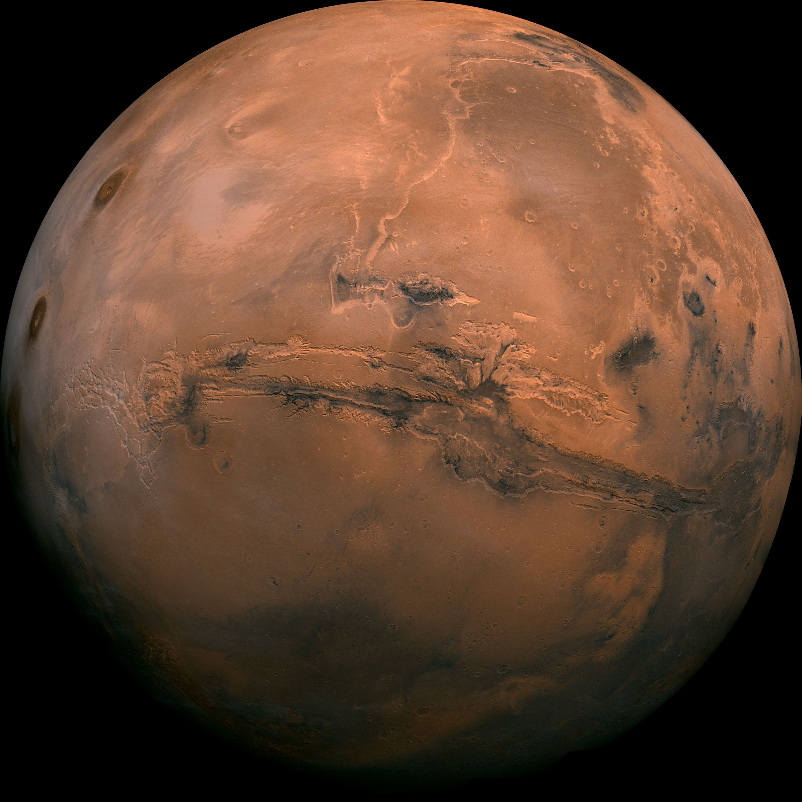
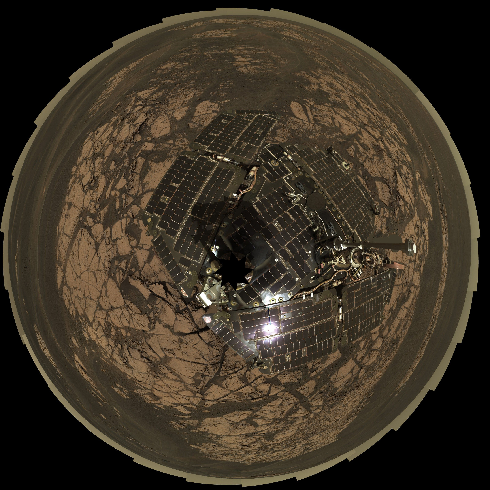
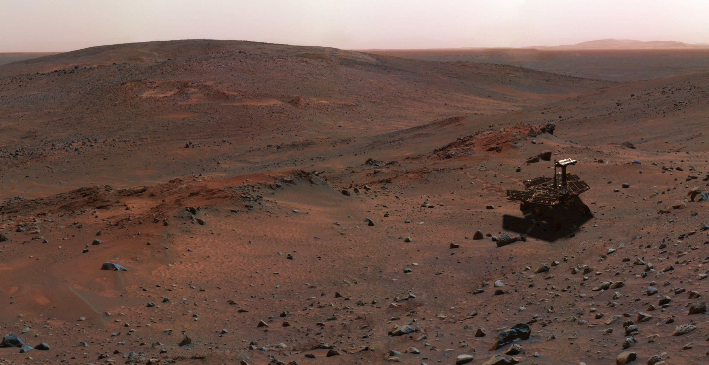
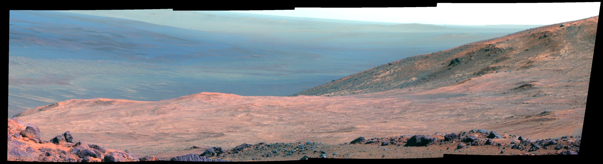

[facebook](https://www.facebook.com/sharer/sharer.php?u=https%3A%2F%2Fwww.natgeo.pt%2Fespaco%2F2018%2F11%2F10-coisas-incriveis-sobre-marte) [twitter](https://twitter.com/share?url=https%3A%2F%2Fwww.natgeo.pt%2Fespaco%2F2018%2F11%2F10-coisas-incriveis-sobre-marte&via=natgeo&text=10%20Coisas%20Incr%C3%ADveis%20Sobre%20Marte) [whatsapp](https://web.whatsapp.com/send?text=https%3A%2F%2Fwww.natgeo.pt%2Fespaco%2F2018%2F11%2F10-coisas-incriveis-sobre-marte) [flipboard](https://share.flipboard.com/bookmarklet/popout?v=2&title=10%20Coisas%20Incr%C3%ADveis%20Sobre%20Marte&url=https%3A%2F%2Fwww.natgeo.pt%2Fespaco%2F2018%2F11%2F10-coisas-incriveis-sobre-marte) [mail](mailto:?subject=NatGeo&body=https%3A%2F%2Fwww.natgeo.pt%2Fespaco%2F2018%2F11%2F10-coisas-incriveis-sobre-marte%20-%2010%20Coisas%20Incr%C3%ADveis%20Sobre%20Marte) [Espaço](https://www.natgeo.pt/espaco) 
# 10 Coisas Incríveis Sobre Marte 
## Marte, um planeta que podemos ver frequentemente no céu noturno, não pára de nos surpreender. Por [National Geographic](https://www.natgeo.pt/autor/national-geographic) Publicado 2/11/2018, 12:36 

Observação de Marte Fotografia por © National Geographic Channels/Robert Viglasky Marte, o quarto planeta a contar do Sol, situado a cerca de 1,5 unidades astronómicas, logo a seguir à Terra e antes de Júpiter, faz-nos sonhar desde a antiguidade. Muito se tem falado nos últimos anos sobre a possibilidade de fazer as malas e ir para Marte, de vez. Mas, antes de planear a mudança, veja 10 coisas incríveis sobre Marte que tem mesmo de saber. 

**O SEU NOME VEM DO DEUS DA GUERRA** 

Marte é o nome do Deus Romano da guerra. Acredita-se que os Antigos associariam este planeta com sangue, guerra e fúria, pela sua cor vermelha. Já os Babilónios chamavam a Marte a Estrela da Morte, ou Nergal, que era o Deus da guerra e da morte. Também os Gregos lhe deram o nome do seu Deus da morte: Ares. 

**JÁ FOI SINÓNIMO DE MAU PRESSÁGIO** 

Durante muito tempo, o planeta Marte era uma espécie de símbolo de azar, agoiros e maus presságios. Quando Marte estava mais visível e brilhante no céu noturno, as civilizações mais antigas acreditavam que haveria guerra na Terra. 

[Como é Marte? Veja o vídeo](https://www.natgeo.pt/video/tv/como-e-marte-1) . 

Se influenciou guerras, não sabemos, mas já enviou meteoritos para a Terra. Conhecem-se mais de uma centena de meteoritos marcianos, encontrados um pouco por todo o mundo. O mais importante destes, Allan Hills 84001, foi encontrado na Antártica em 1984. 

**MARTE TEM DUAS LUAS** 

Os dois satélites naturais que orbitam Marte são muito menores que a nossa Lua. Fobos tem cerca de 22 quilómetros de diâmetro; Deimos, apenas 12. Fobos demora cerca de 7 horas e 39 minutos a dar a volta a Marte (o que significa que orbita a uma velocidade de pouco mais de 2km/s), mas Deimos demora pouco mais de um dia e seis horas, pelo que a sua velocidade é menor, cerca de 1,35km/s. E sabe o porquê das Luas de Marte terem estes nomes ? Fobos (medo) e Deimos (pânico) são os dois cavalos que puxam a carruagem de Ares, o equivalente Grego de Marte. 

Expedição Marte Fotografia por © 1998 Hewlett-Packard Company **UM DIA MARCIANO É DESIGNADO POR 'SOL' E UM ANO É MAIS COMPRIDO** 

Um dia em Marte, ou dia marciano, designa-se por _sol_ , e dura 23 horas e 39 minutos. Já um ano marciano, que dura 669,6 _sols,_ é quase o dobro de um ano terrestre! Para Marte completar uma volta em torno do Sol passam 687 dias terrestres, ou seja, um ano, dez meses e 17 dias. Por duas razões: está a uma maior distância do Sol (228 milhões de quilómetros), e a velocidade orbital de Marte (velocidade com que dá a volta ao Sol) é de cerca de 24 km/h, inferior à da Terra. 

**TEM A SEGUNDA MONTANHA MAIS ALTA E O SEGUNDO MAIOR DESFILADEIRO** 

O Monte Olimpo de Marte é um vulcão extinto com 21 quilómetros de altura e 600 de extensão, formado há biliões de anos. O Monte Olimpo perde o título de maior montanha do Sistema Solar para a cratera Rehasilvia, no asteróide Vesta. 

O segundo maior desfiladeiro do Sistema Solar também chama casa a Marte. O Valles Marinieri, em honra à sonda que o descobriu, é um desfiladeiro com 4 mil quilómetros de extensão, 200 de largura e mais de 7 de profundidade. 

Montanha em Marte Fotografia por © 1998 Hewlett-Packard Company **MARTE TEM ATMOSFERA, TEMPESTADES E ESTAÇÕES DO ANO** 

A atmosfera de Marte não permite a vida humana, já que é composta maioritariamente por dióxido de carbono (96%), árgon e azoto. Por ser um planeta com atmosfera, tem um clima que se repete periodicamente, tal como as estações do ano na Terra. 

A temperatura média em Marte é de cerca de 60 graus negativos, mas pode chegar aos 30ºC no “Verão” e aos -143ºC no “Inverno”. Marte tem também violentas e enormes tempestades de areia que acontecem todos os anos e duram várias semanas, e ainda tempestades globais que envolvem o planeta a cada 3 anos marcianos – 5 anos terrestres. 

**EXISTE ÁGUA DOCE E SALGADA** 

Existe água em Marte! Mas a atmosfera do planeta vermelho é muito pouco densa, e a água não se mantém durante muito tempo à superfície. 

A água doce existente em Marte está sob a forma de calotas polares e permafrost – o tipo de solo Ártico, composto de gelo e rochas. Recentemente, graças à sonda Mars Reconnaissance Orbiter, descobriu-se que existe água salgada em estado líquido a correr no curioso planeta, assim que as temperaturas sobem dos 23 graus negativos. 

Esta descoberta faz todo o sentido, já que existem evidências de “mares” e “rios” antigos na superfície de Marte. 

Conheça o [lago subterrâneo descoberto em Marte](https://www.natgeo.pt/espaco/2018/07/um-lago-subterraneo-encontrado-em-marte-conheca-os-factos) ! 

Colagem de fotografias tiradas pelo rover Curiosity, e coloridas artificialmente, mostram parte da Marathon Valley em Marte. Fotografia por NASA , JPL Cal-tech , Cornell Univ. , Arizona State Univ. **MEIA CENTENA DE SONDAS ESPACIAIS** 

Desde 1960 já se enviaram (ou tentaram enviar) 56 sondas, em missões a Marte. Destas, apenas 17 foram bem sucedidas! 

Nove, no entanto, ainda estão operacionais, sendo a Mars Odissey a missão mais antiga ainda em rota, enviada em 2001. A mais recente missão a Marte é a InSight, lançada a 5 de Maio de 2018, e que deverá aterrar no planeta a 26 de Novembro de 2018. O facto é que sem estas missões não tínhamos [belíssimas imagens de Marte](https://www.natgeo.pt/photography/2018/07/exploracao-de-marte-em-imagens?image=02-mars-rover-anniversary-gallery_0) . 

Mais: [21 anos de robôs em Marte, e as suas fotografias!](https://www.natgeo.pt/fotografia/2018/04/robos-em-marte-21-anos-de-fotografias-fantasticas) 

**PODERÁ JÁ TER TIDO ALGUMA FORMA DE VIDA** 

Há décadas que se explora a possibilidade de vida em Marte. Um estudo deste ano diz que sim, mas não para humanos. 

Especula-se que há milhões de anos Marte fosse um planeta mais quente e com mais água, criando assim um potencial para lá ter existido vida. O rover Curiosity, da NASA, recolheu em Marte uma rocha onde foram identificados azoto, hidrogénio, oxigénio, fósforo e carbono, alguns dos ingredientes químicos essenciais para a vida. Assim, Marte pode bem ter tido micróbios a habitá-lo. 

**É O PLANETA COM MAIS POTENCIAL PARA SUPORTAR VIDA HUMANA** 

Mais uma vez, Marte não tem condições para acolher humanos atualmente, mas os cientistas não descartam a hipótese de algum dia vir a ter. 

Estão a fazer-se todos os esforços no sentido de compreender definitivamente se Marte já albergou vida e seres vivos, compreender exaustivamente o clima e os processos climáticos, bem como a história, a origem e evolução de Marte como um sistema geológico, e finalmente, prepará-lo para exploração humana. 

Uma coisa é certa: nenhum outro planeta do Sistema Solar apresenta tantas similaridades com a Terra como Marte, e isso é uma grande esperança. 

Será que a [sobrevivência da Humanidade implica ir para Marte](https://www.natgeo.pt/espaco/2018/04/so-ha-uma-forma-da-humanidade-sobreviver) ? 

Resta-nos a pergunta, tão cantada por David Bowie: _Is there life on Mars?_ 

[source](https://www.natgeo.pt/espaco/2018/11/10-coisas-incriveis-sobre-marte)