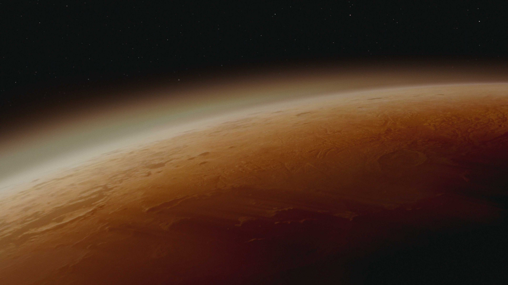

[facebook](https://www.facebook.com/sharer/sharer.php?u=https%3A%2F%2Fwww.natgeo.pt%2Fespaco%2F2018%2F11%2F7-desafios-da-vida-humana-em-marte) [twitter](https://twitter.com/share?url=https%3A%2F%2Fwww.natgeo.pt%2Fespaco%2F2018%2F11%2F7-desafios-da-vida-humana-em-marte&via=natgeo&text=7%20Desafios%20da%20Vida%20Humana%20em%20Marte) [whatsapp](https://web.whatsapp.com/send?text=https%3A%2F%2Fwww.natgeo.pt%2Fespaco%2F2018%2F11%2F7-desafios-da-vida-humana-em-marte) [flipboard](https://share.flipboard.com/bookmarklet/popout?v=2&title=7%20Desafios%20da%20Vida%20Humana%20em%20Marte&url=https%3A%2F%2Fwww.natgeo.pt%2Fespaco%2F2018%2F11%2F7-desafios-da-vida-humana-em-marte) [mail](mailto:?subject=NatGeo&body=https%3A%2F%2Fwww.natgeo.pt%2Fespaco%2F2018%2F11%2F7-desafios-da-vida-humana-em-marte%20-%207%20Desafios%20da%20Vida%20Humana%20em%20Marte) [Espaço](https://www.natgeo.pt/espaco) 
# 7 Desafios da Vida Humana em Marte 
## Viver em Marte ainda é uma hipótese distante em 2018, porém os primeiros passos já foram dados. Há alguns factos que podem atrasar ou dificultar a missão de colocar humanos a viverem em Marte até 2030. Por [National Geographic](https://www.natgeo.pt/autor/national-geographic) Publicado 19/11/2018, 14:48 

Cena de um dos novos episódios da série Marte, produzida por Brian Grazer e Ron Howard, na National Geographic. Fotografia por © National geographic Channels Dia 17 de novembro decorreu mais uma sessão de Marte 2030, o ciclo de conversas com os maiores especialistas portugueses desta área, que pretende desvendar os desafios da vida no planeta vermelho e responder a algumas perguntas sobre este tema. Pedro Fevereiro do Instituto de Tecnologia Química e Biológica e Rui Agostinho do Instituto de Astrofísica e Ciências do Espaço, foram os oradores da segunda sessão, intitulada ‘Ir para Marte’. 

A NASA pretende enviar humanos em missões para Marte até 2030, mas continua a debater-se com alguns desafios. Pedro Fevereiro e Rui Agostinho partilharam algumas dificuldades e factos sobre Marte com a plateia. 

**1. Ficar à superfície de Marte é difícil se não for no subsolo.** Devido à radiação emitida pelo planeta, a probabilidade de desenvolvermos cancro em Marte, acresce 5%. As doses de radiação acumuladas no espaço são muito superiores às da Estação Espacial Internacional. A este facto soma-se a quase inexistente atmosfera em Marte, e é a atmosfera terrestre que protege os seres humanos do impacto causado pela radiação. 

**2. Tudo tem uma cor semelhante à ferrugem em Marte e o ambiente não varia muito** , daí a origem do nome Planeta Vermelho. A geologia deste planeta está marcada pela radiação emitida por Marte. A quantidade de partículas presentes em Marte é quase 1/100 da nossa. Isto dificulta a plantação de espécies de plantas em Marte. 

**3. O pó é muito fino e há tempestades de poeira frequentemente.** Se alguém viver no subsolo de Marte, tem de sair à superfície para limpar o pó dos rovers, de vez em quando. As tempestades de areia impedem o recarregamento das baterias dos rovers, através da energia solar. Além disso, este pó devido à sua espessura extremamente fina, infiltra-se facilmente nos fatos espaciais. 

**4. Por cada 2 quilogramas de objetos, são necessários 130 quilogramas de foguetão.** A maior parte dos foguetões leva uma carga útil (por carga útil entendem-se pessoas e objetos) de 1.5 % do seu tamanho total. Isto restringe a quantidade de material enviado em cada voo e aumenta exponencialmente o custo das missões. 

**5. A viagem para Marte ainda demora cerca de oito meses.** Isto implica uma grande quantidade de combustível, alimentos e material de apoio às equipas das missões. Enquanto por exemplo, para a Lua, demora apenas 3 dias. 

**6. Os astronautas são testados e escolhidos meticulosamente** , pois têm de ter um perfil que aguente todos os desafios físicos e sociais que esta viagem implica. 

**7. Marte tem sempre uma temperatura negativa.** Pode pensar-se em criar um genoma capaz de aguentar condições extremas e testar se sobrevive em Marte. Não existem organismos orgânicos à superfície mas podem haver no subsolo e nada nos garante que não irão competir com os organismos que se possam enviar para lá. 

O facto de não existir vida em Marte demonstra que ainda não estão reunidas as condições para lá (sobre)vivermos. Marte 2030 parece ainda uma realidade distante e antes de pensarmos em lá viver, temos de saber mais sobre este planeta. Não perca os novos episódios da série [Marte](https://www.natgeo.pt/espaco/2018/10/marte-regressa-com-desafios-entre-ciencia-e-industria) , produzida por Brian Grazer e Ron Howard – domingos às 22:30. 

A entrada nas sessões de [Marte 2030](https://www.ccb.pt/Default/pt/Programacao/LiteraturaEPensamento?a=1551) tem um custo individual de 2,50€ ou de 8,00€ para o ciclo completo. As sessões são transmitidas online, através do link: [https://videocast.fccn.pt/live/id_fc_ul/marte2030](https://videocast.fccn.pt/live/id_fc_ul/marte2030) . 

