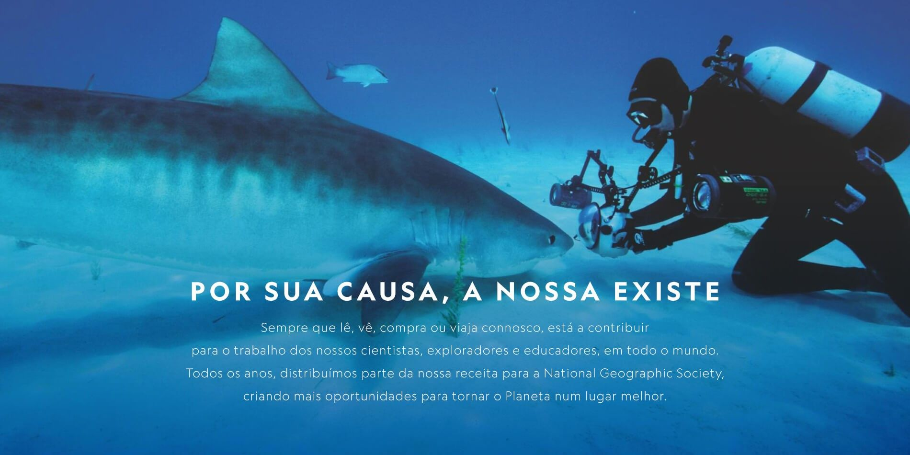
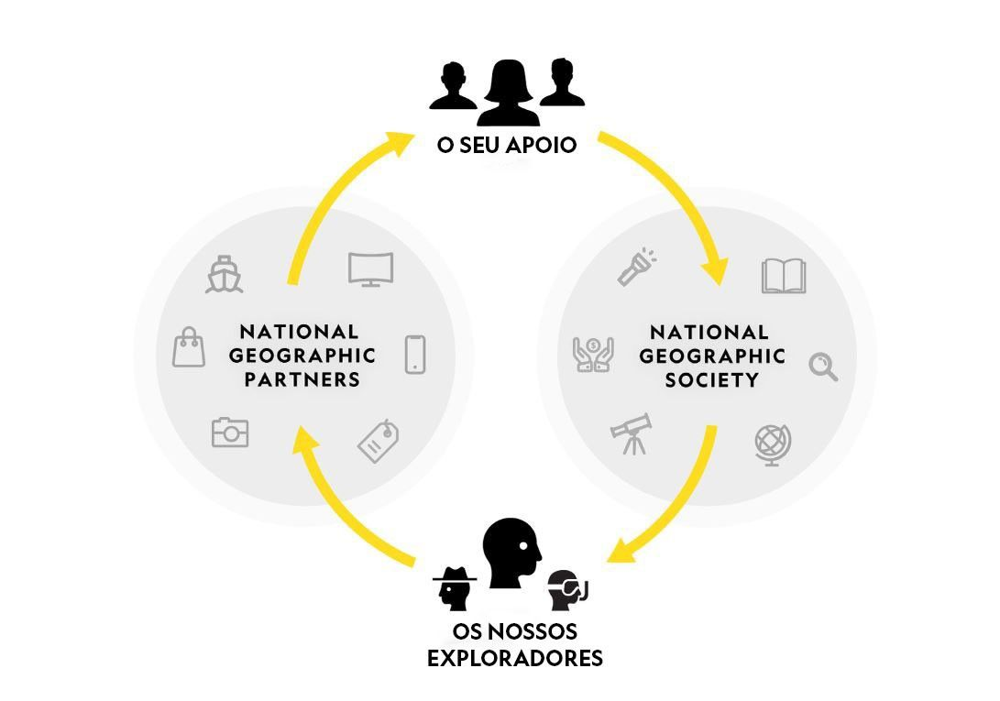
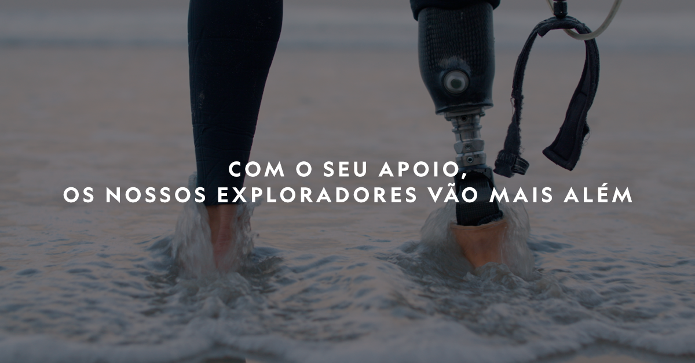

[facebook](https://www.facebook.com/sharer/sharer.php?u=https%3A%2F%2Fwww.natgeo.pt%2Fexploracao%2F2019%2F02%2Fpor-sua-causa-nossa-existe) [twitter](https://twitter.com/share?url=https%3A%2F%2Fwww.natgeo.pt%2Fexploracao%2F2019%2F02%2Fpor-sua-causa-nossa-existe&via=natgeo&text=Por%20Sua%20Causa%2C%20a%20Nossa%20Existe) [whatsapp](https://web.whatsapp.com/send?text=https%3A%2F%2Fwww.natgeo.pt%2Fexploracao%2F2019%2F02%2Fpor-sua-causa-nossa-existe) [flipboard](https://share.flipboard.com/bookmarklet/popout?v=2&title=Por%20Sua%20Causa%2C%20a%20Nossa%20Existe&url=https%3A%2F%2Fwww.natgeo.pt%2Fexploracao%2F2019%2F02%2Fpor-sua-causa-nossa-existe) [mail](mailto:?subject=NatGeo&body=https%3A%2F%2Fwww.natgeo.pt%2Fexploracao%2F2019%2F02%2Fpor-sua-causa-nossa-existe%20-%20Por%20Sua%20Causa%2C%20a%20Nossa%20Existe) [A Nossa Causa](https://www.natgeo.pt/a-nossa-causa) 
# Por Sua Causa, a Nossa Existe 
## Conheça melhor a missão da National Geographic e descubra como o seu contributo é crucial para a proteção e conservação do nosso planeta. Por [National Geographic](https://www.natgeo.pt/autor/national-geographic) Publicado 13/02/2019, 18:27 , Atualizado 12/01/2022, 09:31 

A National Geographic está no centro de uma comunidade que integra pessoas audazes e com uma ávida curiosidade. Perseguimos grandes questões e desafiamos pensamentos outrora aceites. 

Fundadores como Alexander Graham Bell, acreditavam no poder de uma boa história e de como a mesma poderia estimular a curiosidade, ajudar a resolver grandes problemas e a ultrapassar limites impostos ao ser humano. Através dos nossos **canais televisivos, revista, livros, viagens, exposições e eventos** , oferecemos um vasto conjunto de experiências, onde cada história nos permite conhecer melhor o mundo e o papel de cada um. 

Ao longo de [mais de 130 anos](https://www.natgeo.pt/historia/2019/10/130-anos-de-descobertas-aventura-e-exploracao) , a National Geographic distingue-se por desafiar, proteger e inspirar a humanidade a ir mais além. A nossa moldura amarela é uma porta para aventuras e diversos locais que o mundo nos reserva e que a National Geographic tem o prazer de trazer até si. 

<code>{"tag":"VIDEO","src":"data:audio/mpeg;base64,SUQzBAAAAAAAI1RTU0UAAAAPAAADTGF2ZjU2LjI1LjEwMQAAAAAAAAAAAAAA//tQAAAAAAAAAAAAAAAAAAAAAAAAAAAAAAAAAAAAAAAAAAAASW5mbwAAAA8AAAACAAAEEwCZmZmZmZmZmZmZmZmZmZmZmZmZmZmZmZmZmZmZmZmZmZmZmZmZmZmZmZmZmZmZmZmZ//////////////////////////////////////////////////////////////////8AAAAATGF2YzU2LjI2AAAAAAAAAAAAAAAAJAAAAAAAAAAABBN3YQi+AAAAAAAAAAAAAAAAAAAAAP/7kGQAD/AAAGkAAAAIAAANIAAAAQAAAaQAAAAgAAA0gAAABExBTUUzLjk5LjVVVVVVVVVVVVVVVVVVVVVVVVVVVVVVVVVVVVVVVVVVVVVVVVVVVVVVVVVVVVVVVVVVVVVVVVVVVVVVVVVVVVVVVVVVVVVVVVVVVVVVVVVVVVVVVVVVVVVVVVVVVVVVVVVVVVVVVVVVVVVVVVVVVVVVVVVVVVVVVVVVVVVVVVVVVVVVVVVVVVVVVVVVVVVVVVVVVVVVVVVVVVVVVVVVVVVVVVVVVVVVVVVVVVVVVVVVVVVVVVVVVVVVVVVVVVVVVVVVVVVVVVVVVVVVVVVVVVVVVVVVVVVVVVVVVVVVVVVVVVVVVVVVVVVVVVVVVVVVVVVVVUxBTUUzLjk5LjVVVVVVVVVVVVVVVVVVVVVVVVVVVVVVVVVVVVVVVVVVVVVVVVVVVVVVVVVVVVVVVVVVVVVVVVVVVVVVVVVVVVVVVVVVVVVVVVVVVVVVVVVVVVVVVVVVVVVVVVVVVVVVVVVVVVVVVVVVVVVVVVVVVVVVVVVVVVVVVf/7kmRAj/AAAGkAAAAIAAANIAAAAQAAAaQAAAAgAAA0gAAABFVVVVVVVVVVVVVVVVVVVVVVVVVVVVVVVVVVVVVVVVVVVVVVVVVVVVVVVVVVVVVVVVVVVVVVVVVVVVVVVVVVVVVVVVVVVVVVVVVVVVVVVVVVVVVVVVVVVVVVVVVVVVVVVVVVVVVVVVVVVVVVVVVVVVVVVVVVVVVVVVVVVVVVVVVVVVVVVVVVVVVVVVVVVVVVVVVVVVVVVVVVVVVVVVVVVVVVVVVVVVVVVVVVVVVVVVVVVVVVVVVVVVVVVVVVVVVVVVVVVVVVVVVVVVVVVVVVVVVVVVVVVVVVVVVVVVVVVVVVVVVVVVVVVVVVVVVVVVVVVVVVVVVVVVVVVVVVVVVVVVVVVVVVVVVVVVVVVVVVVVVVVVVVVVVVVVVVVVVVVVVVVVVVVVVVVVVVVVVVVVVVVVVVVVVVVVVVVVVVVVVVVVVVVVVVVVVVVVVVVVVVVVVVVVVVVVVVVVVVVVVVVVVVVVVVVVVVVVVVVVVVVVVVVVVVVVVVVVVVVVVVVVVVVVU="}</code> <code>{"tag":"VIDEO","src":"https://sire-ngcpt-pmd.fichub.com/mpx/NGP_NatGeo_GS/10/224/video-1550139581_298509381150_mp4_video_1920x1080_4000000_primary_audio_eng_6.mp4"}</code>  

Publicidade: O seu vídeo começa em 

--:-- 

-------- 
--:-- / --:-- 
-------- 

Bem-vindo ao Portal da National Geographic Mas esta porta só está aberta graças ao seu apoio. Sempre que lê, vê, compra ou viaja connosco, está a contribuir para o trabalho dos nossos cientistas, exploradores e educadores em todo o mundo. Sem o seu apoio, os nossos exploradores não conseguiriam ultrapassar o seu primeiro instinto de curiosidade. 

Desde 1888, a National Geographic atribuiu mais de 15 mil [bolsas](https://www.natgeo.pt/bolsas) nos campos da conservação, educação, investigação, storytelling e tecnologia. Através da sua paixão, persistência, curiosidade e dedicação, os nossos exploradores contribuem para o conhecimento do planeta e criam soluções para um futuro mais sustentável. 

A exploração acontece graças a si e **Por Sua Causa, A Nossa Existe** . O seu contributo permite que todos os anos parte do nosso lucro reverta para a **National Geographic Society.** 

Através do apoio à investigação, exploração e conservação, a **National Geographic Partners** contribui para projetos em todo o mundo. Conta histórias sobre a humanidade de uma perspetiva única, empenhando-se em produzir conteúdo inspirador sobre ciência, aventura e exploração. O seu apoio e contributo reverte para a **National Geographic Society** , uma organização global sem fins lucrativos, que investe em grandes ideias e pessoas audazes dedicadas à preservação de espécies e ecossistemas, à proteção de culturas e à promoção do conhecimento do mundo, e que tencionam criar um planeta equilibrado. 

Perceba como o seu contributo é essencial para a exploração do planeta! 

Direcionamos a nossa atenção para projetos que promovem a ciência, a tecnologia e a narração de histórias que ajudam na proteção de espécies em vias de extinção e que proporcionam uma maior aprendizagem da história e cultura humanas. 

Conheça alguns dos nossos projetos e o seu impacto. 

**ALGUNS DOS NOSSOS PROJETOS** 

**Beyond Yellowstone** 

Objetivo: Apoio à vida selvagem 

Apoio a paisagens compatíveis com a vida selvagem no Ecossistema do Greater Yellowstone e no Centro de Montana, abordando desafios de recuperação e migração de espécies em terras públicas e privadas, respeitando as necessidades dos proprietários e comunidades locais. 

**Big Cats Initiative** 

Objetivo: Um futuro para os grandes felinos 

Apoiamos cientistas e conservacionistas que trabalham em conjunto para salvar grandes felinos. Com a sua ajuda, apoiamos mais de 120 projetos inovadores, que ajudam a proteger estes animais, em 28 países. 

**Last Wild Places** 

Objetivo: Proteger as maravilhas naturais que sustentam a vida na Terra 

Um planeta em equilíbrio é aquele em que as pessoas e as espécies podem prosperar. Mas com ameaças como a destruição de habitats, mudanças climáticas e extinção de espécies, estamos a viver num planeta cada vez mais desequilibrado. Os lugares selvagens estão a desaparecer a um ritmo sem precedentes. Em menos de 50 anos, perdemos 60% das populações de animais selvagens. No último século, 90% dos grandes peixes do oceano desapareceram. Espécies de plantas, animais e insetos estão em extinção 1000 vezes mais rápido do que nunca. As boas notícias? Nas áreas protegidas, a vida está a regressar. 15% da nossa terra e 7% do nosso oceano já fazem parte de áreas oficialmente protegidas. Mas isto não é suficiente. E é por isso que a National Geographic Society lançou o Last Wild Places, uma iniciativa de uma década que ajuda a proteger os lugares que sustentam a vida na Terra. 

**Okavango Wilderness Project** 

Objetivo: Proteger o Okavango 

Okavango, a principal fonte de água para um milhão de pessoas. O seu delta, localizado no norte de Botsuana, é um dos lugares mais ricos de África em biodiversidade e abriga não só a maior população de elefantes remanescentes do mundo, mas também leões, guepardos, cães selvagens e centenas de espécies de aves. No entanto, o seu futuro é incerto. 

Este projeto é integrado por Adjany Costa, conservacionista e ictióloga da National Geographic, que trabalha em conjunto com investigadores e especialistas locais, avaliando o sistema fluvial e protegendo a bacia hidrográfica do rio. 

**Conheça melhor o trabalho da exploradora:** 

Adjany Costa - Exploradora National Geographic **Out of Eden Walk** 

Objetivo: Refazer o caminho dos nossos antepassados 

A caminhada de aproximadamente 34 mil quilómetros de Paul Salopek faz parte de uma experiência que consiste em percorrer os caminhos dos primeiros humanos que migraram de África na Idade da Pedra e tornaram a Terra nossa. Ao longo do caminho, Paul relata as principais histórias do nosso tempo - da mudança climática à inovação tecnológica, da migração em massa à sobrevivência cultural - dando voz às pessoas que as habitam todos os dias. As suas palavras, assim como suas fotografias, vídeos e áudios, criam um registo global da vida humana no começo de um novo milénio contado por aldeões, nómadas, comerciantes, fazendeiros, soldados e artistas que raramente são notícia. Desta forma, se optarmos por abrandar e observar cuidadosamente o que nos rodeia, também podemos redescobrir o nosso mundo. 

**Photo Ark** 

Objetivo: Alertar para as espécies em risco 

Em 2005, Joel Sartore iniciou uma missão: fotografar as 12 mil espécies animais que vivem em cativeiro. Era o início do [Photo Ark – A Nova Arca de Noé](https://www.natgeo.pt/photoark) , um projeto inovador e ambicioso que pretende criar um arquivo inédito da biodiversidade global e inspirar o público a dedicar-se à conservação das criaturas mais vulneráveis no planeta. 

**Photo Camp** 

Objetivo: Ajudar os mais jovens a encontrarem a sua voz 

No National Geographic Photo Camp, jovens de comunidades desfavorecidas, incluindo adolescentes em situação de risco e refugiados, aprendem a usar a fotografia para contar as suas próprias histórias, explorar o mundo ao seu redor e desenvolver conexões profundas com outras pessoas. 

**Plastics: Source to Sea** 

Objetivo: Encontrar soluções que previnam o plástico nos oceanos 

Aproximadamente nove milhões de toneladas de plástico acabam no oceano a cada ano. A poluição plástica no oceano tem implicações terríveis para a vida marinha, assim como para os seres humanos, na verdade, para todo o nosso planeta. A National Geographic Society está a trabalhar no combate ao plástico através da investigação de como o mesmo se desloca nas bacias hidrográficas e que apoia as soluções para evitar que o plástico vá para o oceano. 

**Pristine Seas** 

Objetivo: Proteger os oceanos 

O oceano abrange 70% do Planeta e abriga uma incrível diversidade de vida. Fornece-nos alimento, emprego e oxigénio. No entanto, estamos a destruí-lo. 

Este projeto consiste em explorar e ajudar a salvar os oceanos. É essencial que o mundo saiba que estes lugares existem, que estão a ser ameaçados e que é necessária ajuda para os proteger. 

**Space Archaeology** 

Objetivo: Olhar para o passado com uma nova perspetiva 

Os exploradores da National Geographic ainda estão na vanguarda da tecnologia - como Sarah Parcak, bolsista da National Geographic, que analisa imagens de satélite tiradas a centenas de quilómetros acima da Terra para mapear locais arqueológicos ao redor do mundo. 

**Sumatran Rhino Rescue** 

Objetivo: Proteger a espécie em risco de extinção 

O número de rinocerontes de Sumatra está em declínio e espécies está agora no limiar da extinção. 

Este projeto tem como missão resgatar e realocar os rinocerontes e construir instalações para o seu cuidado e reprodução, a fim de trazer as espécies de volta. 

**Year of the Bird** 

Objetivo: Celebrar os 100 anos do tratado de aves migratórias 

Uma iniciativa que comemora os 100 anos da celebração do Tratado de Aves Migratórias e ambiciona proteger as aves durante os próximos 100 anos. 

Graças ao seu contributo, conseguimos apoiar projetos ambiciosos nas áreas da ciência, exploração e conservação. Quando lê, assiste, compra ou viaja connosco, está a apoiar o trabalho dos nossos cientistas, exploradores e educadores em todo o mundo. **Obrigado por nos ajudar a contribuir para um planeta mais sustentável.** 

