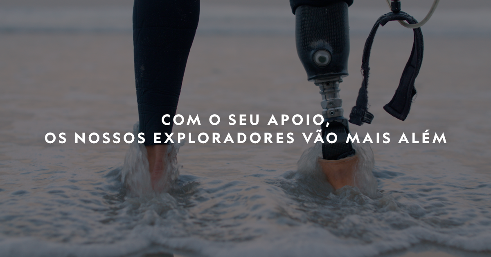
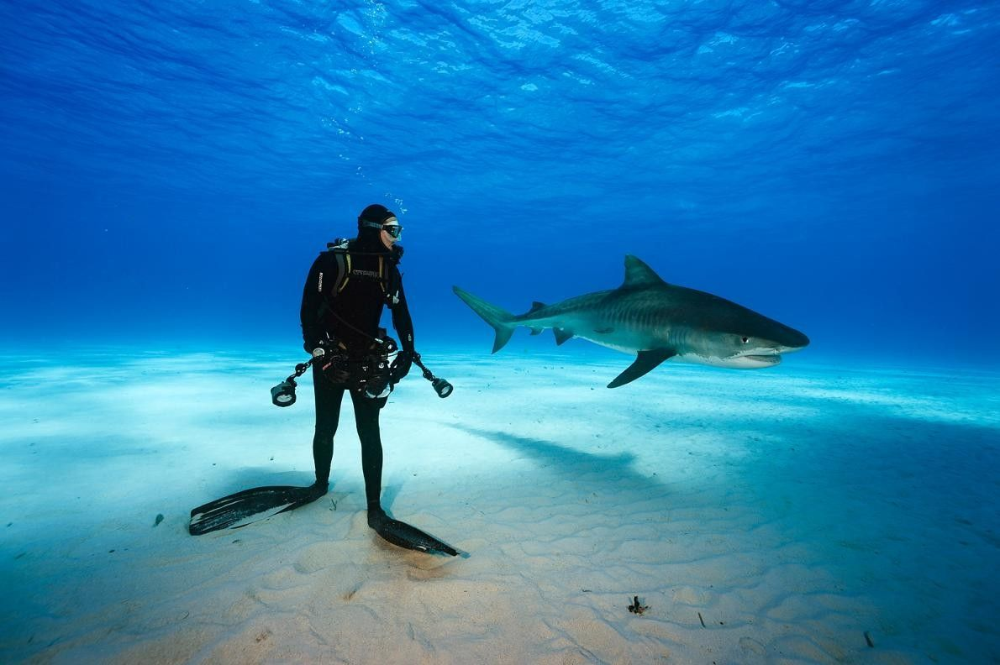
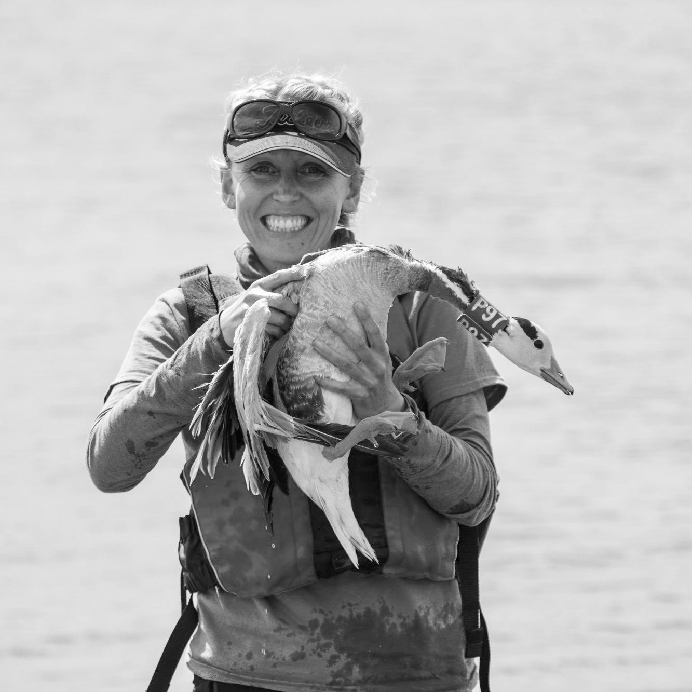

[facebook](https://www.facebook.com/sharer/sharer.php?u=https%3A%2F%2Fwww.natgeo.pt%2Fexploracao%2F2019%2F02%2Fspark-historias-inspiradoras-dos-nossos-exploradores) [twitter](https://twitter.com/share?url=https%3A%2F%2Fwww.natgeo.pt%2Fexploracao%2F2019%2F02%2Fspark-historias-inspiradoras-dos-nossos-exploradores&via=natgeo&text=The%20Spark%20%E2%80%93%20Hist%C3%B3rias%20Inspiradoras%20dos%20Nossos%20Exploradores) [whatsapp](https://web.whatsapp.com/send?text=https%3A%2F%2Fwww.natgeo.pt%2Fexploracao%2F2019%2F02%2Fspark-historias-inspiradoras-dos-nossos-exploradores) [flipboard](https://share.flipboard.com/bookmarklet/popout?v=2&title=The%20Spark%20%E2%80%93%20Hist%C3%B3rias%20Inspiradoras%20dos%20Nossos%20Exploradores&url=https%3A%2F%2Fwww.natgeo.pt%2Fexploracao%2F2019%2F02%2Fspark-historias-inspiradoras-dos-nossos-exploradores) [mail](mailto:?subject=NatGeo&body=https%3A%2F%2Fwww.natgeo.pt%2Fexploracao%2F2019%2F02%2Fspark-historias-inspiradoras-dos-nossos-exploradores%20-%20The%20Spark%20%E2%80%93%20Hist%C3%B3rias%20Inspiradoras%20dos%20Nossos%20Exploradores) [A Nossa Causa](https://www.natgeo.pt/a-nossa-causa) 
# The Spark – Histórias Inspiradoras dos Nossos Exploradores 
## Conheça algumas histórias dos exploradores da National Geographic e descubra como iniciaram as suas missões inspiradoras. Por [National Geographic](https://www.natgeo.pt/autor/national-geographic) Publicado 21/02/2019, 19:11 

Ao longo de 130 anos, a National Geographic distingue-se por desafiar, proteger e inspirar a humanidade a ir mais além. Desde 1888 **atribuímos mais de 14 mil bolsas** nos campos da conservação, educação, investigação, escrita e tecnologia. Através da sua paixão, persistência, curiosidade e dedicação, os nossos exploradores contribuem para o conhecimento do planeta e criam soluções para um futuro mais sustentável. 

The Spark é um conjunto de histórias de superação que nos revelam a motivação de alguns dos exploradores da National Geographic. A curiosidade, persistência e exploração estão acessíveis a todos e as barreiras são ultrapassáveis - podemos aceitá-las ou ter a ousadia de as enfrentar. Um explorador é qualquer pessoa que identifique esses limites e os leve mais além. Esta pode ser a sua história. 

**DESCUBRA AS HISTÓRIAS DOS NOSSOS EXPLORADORES:** 

<code>{"tag":"VIDEO"}</code> <code>{"tag":"VIDEO"}</code>  

Publicidade: O seu vídeo começa em 

--:-- 

-------- 
--:-- / --:-- 
-------- 

audio/video source is invalid 

This is a sample 

## Color 

## Opacity 

## Font 

## Size 

## Color 

## Effect 

## Color 

## Opacity 

Player Shortcuts 

Play/Pause 

P or Spacebar 

Full Screen 

F 

Exit Full Screen 

F or Esc 

Skip Back 5 Seconds 

← 

Skip Ahead 5 Seconds 

→ 

Jump Back 10 Seconds 

J 

Jump Ahead 10 Seconds 

L 

Restart 

0 or Home 

Skip to the End 

End 

Volume Up 

↑ 

Volume Down 

↓ 

Mute Audio 

M 

Toggle Closed Captions 

C 

Decrease Caption Size 

− 

Increase Caption Size 

= or + 

Cycle Caption Text Preset 

B 

Show Keyboard Controls 

<kbd>?</kbd> or / 

ACABOU DE VER 

#### Albert Lin 

A SEGUIR 

Este vídeo começará em 

8 
segundos 

Albert Lin Albert Lin é filósofo, engenheiro, artista, cientista, surfista, humanitário, pioneiro, aventureiro, viajante, sonhador, inovador e pai. Os seus pais ensinaram-lhe que o estímulo de cada um deve partir da sua paixão e curiosidade, por isso, depois de se licenciar, seguiu o seu sonho. Comprou um bilhete para a Mongólia com o intuito de encontrar as raízes da sua humanidade e ficou obcecado com a história de Gengis Khan, um homem que mudou o mundo por acreditar que conseguia. **Quanto mais explorava, mais compreendia que o que procurava estava no espírito e costumes das pessoas que o rodeavam.** 

Contudo, há cerca de um ano, o cientista teve de repensar a sua vida quando perdeu uma perna na sequência de um acidente violento. Escolheu tornar-se biónico e nesse momento, todos os seus esforços passados fizeram sentido. A mensagem de Gengis Khan incentivou-o a enfrentar o desconhecido e a dar o primeiro passo, escolhendo uma nova realidade. Todos temos o poder para encarar os limites da vida e aventurar-nos em desafios desconhecidos. Esta também pode ser a sua história. 

Asha De Vos Asha De Vos é bióloga, influenciadora, investigadora, conservacionista, oradora, fotógrafa e tem uma forte relação com a água. É apaixonada e atraída pelo oceano desde que se lembra – em criança sonhava ter superpoderes que lhe permitissem desvendar os mistérios marinhos. Não tinha dúvidas que ambicionava ser bióloga marinha, mas tinha dificuldade em visualizar-se como tal, por viver no Sri Lanka, um país em que os biólogos marinhos são raros. 

Os seus pais deram-lhe força para acreditar que conseguia fazer tudo aquilo a que se entregasse, encorajando-a a perseguir a sua paixão. **Por nunca lhe terem imposto limites, sentia-se livre e sem constrangimentos.** Em 2008, aliada à sua paixão e perseverança, lançou o Blue Whale Project no Sri Lanka. Atualmente, a bióloga considera que tem dois superpoderes: visibilidade e vulnerabilidade, através dos quais pretende incentivar outras pessoas a salvarem os oceanos. Cada linha de costa precisa de um herói local e cada um de nós pode ser esse herói. 

David Lang David Lang é empreendedor, marinheiro, criador, visionário, orador, designer, cientista e nunca sonhou ser explorador. Sentindo que tinha de se desafiar a ir mais além, o antigo analista financeiro largou um percurso seguro para procurar a liberdade que lhe faltava. 

Uma gruta subaquática, teoricamente cheia de ouro, levou-o a construir um robô submarino numa garagem. Sem nunca ter sido fã de tecnologia, de repente, descobriu um novo mundo. Procurou ajuda na internet e recebeu respostas de toda a parte, construindo algo incrível com o apoio de muitas pessoas. 

Há um limite à volta daquilo que os humanos consideram ser verdadeiro e possível, mas para David Lang, um explorador é qualquer pessoa que encontre esse limite e o leve mais além. Seguindo a sua curiosidade, **conseguiu criar uma comunidade global com os exploradores marinhos mais improváveis** . Não encontrou ouro na gruta, mas descobriu algo muito valioso: a exploração não está reservada a pessoas especiais, a exploração está acessível a todos e esta também pode ser a sua história. 

A exploração acontece graças a si e **[Por Sua Causa, A Nossa Existe](https://www.natgeo.pt/national-geographic/2019/02/por-sua-causa-nossa-existe)** . Graças ao seu contributo, conseguimos apoiar projetos ambiciosos nas áreas da ciência, exploração e conservação. Quando lê, assiste, compra ou viaja connosco, está a apoiar o trabalho dos nossos cientistas, exploradores e educadores em todo o mundo. **Obrigado por nos ajudar a contribuir para um planeta mais sustentável.** 

### + EXPLORADORES  [A Nossa Causa](https://www.natgeo.pt/a-nossa-causa) 1:00 
## [Adjany Costa](https://www.natgeo.pt/video/tv/adjany-costa-exploradora-national-geographic)  [A Nossa Causa](https://www.natgeo.pt/a-nossa-causa) 1:00 
## [Borge Ousland](https://www.natgeo.pt/video/tv/borge-ousland-explorador-national-geographic)  [A Nossa Causa](https://www.natgeo.pt/a-nossa-causa) 1:00 
## [Martin Edström](https://www.natgeo.pt/video/tv/martin-edstrom-explorador-national-geographic) 

[source](https://www.natgeo.pt/exploracao/2019/02/spark-historias-inspiradoras-dos-nossos-exploradores)