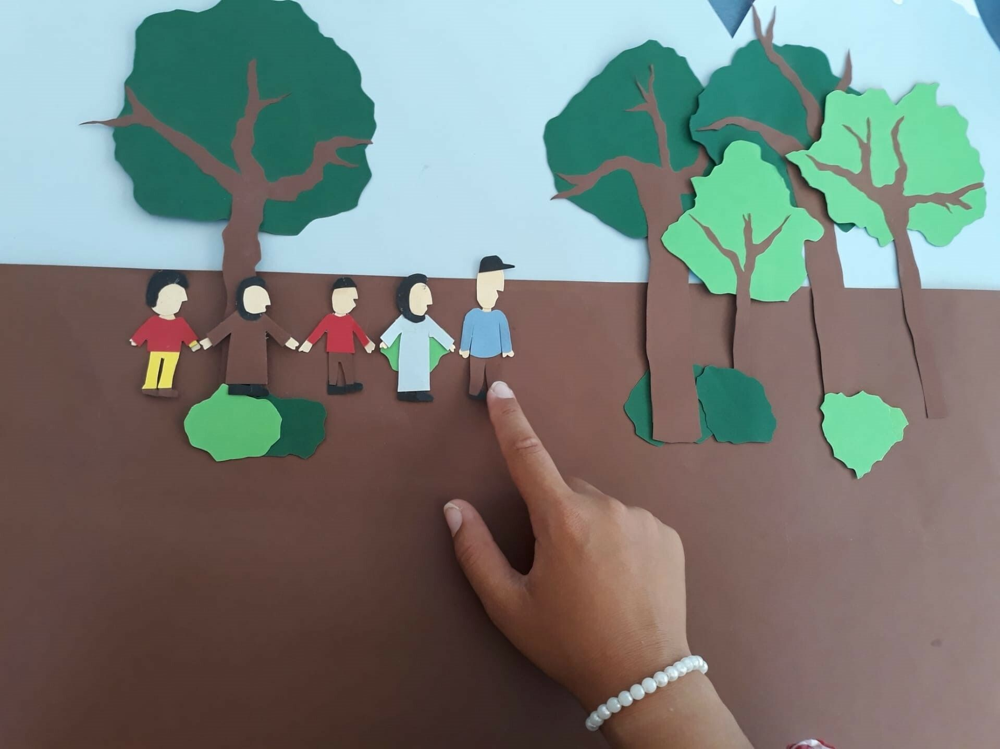

[facebook](https://www.facebook.com/sharer/sharer.php?u=https%3A%2F%2Fwww.natgeo.pt%2Ffamilia%2F2022%2F08%2Fa-narrativa-das-criancas-em-campos-de-refugiados) [twitter](https://twitter.com/share?url=https%3A%2F%2Fwww.natgeo.pt%2Ffamilia%2F2022%2F08%2Fa-narrativa-das-criancas-em-campos-de-refugiados&via=natgeo&text=A%20narrativa%20das%20crian%C3%A7as%20em%20campos%20de%20refugiados) [whatsapp](https://web.whatsapp.com/send?text=https%3A%2F%2Fwww.natgeo.pt%2Ffamilia%2F2022%2F08%2Fa-narrativa-das-criancas-em-campos-de-refugiados) [flipboard](https://share.flipboard.com/bookmarklet/popout?v=2&title=A%20narrativa%20das%20crian%C3%A7as%20em%20campos%20de%20refugiados&url=https%3A%2F%2Fwww.natgeo.pt%2Ffamilia%2F2022%2F08%2Fa-narrativa-das-criancas-em-campos-de-refugiados) [mail](mailto:?subject=NatGeo&body=https%3A%2F%2Fwww.natgeo.pt%2Ffamilia%2F2022%2F08%2Fa-narrativa-das-criancas-em-campos-de-refugiados%20-%20A%20narrativa%20das%20crian%C3%A7as%20em%20campos%20de%20refugiados) [Família](https://www.natgeo.pt/familia) 
# A narrativa das crianças em campos de refugiados 
## O cinema de animação foi o mote do trabalho da exploradora da National Geographic Fausta Cardoso Pereira que esteve cerca de quatro meses com crianças em campos de refugiados na Grécia. Por [Filipa Coutinho](https://www.natgeo.pt/autor/filipa-coutinho) Publicado 8/08/2022, 15:27 

A investigadora portuguesa continua a desenhar e a implementar projetos de cooperação, desenvolvimento e sustentabilidade. Está atualmente a desenvolver trabalho para Moçambique, em conjunto com ONGs. 

Fotografia por Ozias Filho Quando lhe peço para descrever o seu trabalho em algumas frases, Fausta Cardoso Pereira explica que tem “um trabalho interdisciplinar, que vai desde a gestão até à arte, com pessoas de várias origens sociais, culturais e religiosas”. Por isto, considera-se privilegiada, “uma contadora de histórias que vive, ouve e observa as histórias que conta”. 

Ouviu uma [reportagem](https://www.tsf.pt/internacional/eu-so-tenho-um-sonho-chegar-ao-reino-unido-10293770.html) sobre um bosque em Dunquerque que serve de abrigo a cerca de 1000 curdos iraquianos, iranianos e sírios, que a inspirou a conceber este projeto. A entrevista relatava os refugidos de Calais que tentavam viajar para Inglaterra. As palavras de um dos testemunhos ficaram-lhe na memória: “Não sou um terrorista. Vim para a Europa para escapar ao terrorismo”. Foi com este eco que Fausta Cardoso Pereira quis contribuir para romper com a narrativa negativa e os estereótipos que os europeus têm sobre os refugiados. 

**Esquerda:** **Superior:** A jovem Nour anima uma sequência do filme "Nour's Book". 

**Direita:** **Inferior:** Storyboard do filme "Summer Nights in Afghanistan". 

fotografias de Fausta Cardoso Pereira Depois de ler o texto de um menino refugiado na Suécia em que dizia “Não sou apenas um refugiado. Sou o Marwan Akrawi.”, começou a questionar-se que histórias têm as crianças refugiadas para nos contar. E se pudessem contar as suas histórias por eles próprios, com as suas próprias mãos e sendo fiéis à sua narrativa? 

Assim nasceu o seu projeto “Campo Aberto – uma nova narrativa de crianças em Campos de Refugiados”, gravado entre maio e agosto de 2021. Através de seis curtas animadas com objetos presentes no campo, como flores, recortes de papel e pedras, crianças dos 8 aos 18 anos deram palco ao seu olhar do mundo e às preocupações que as rodeiam enquanto aguardam por uma solução no espaço europeu. 

O cinema animado foi uma solução óbvia para Fausta Cardoso Pereira pelo seu trabalho no passado, na gestão do projeto “Os Filmes do Recreio” - workshops de cinema de animação com crianças do Alentejo. Duas das vantagens eram o baixo orçamento e permitir que a visão e identidade das crianças não fosse corrompida. 

O processo foi longo, desde o apoio de várias organizações não-governamentais, à formação das crianças sobre a linguagem da animação, e ao trabalho dos tradutores. A acrescentar as dificuldades logísticas e de saúde impostas pela pandemia de SARS-CoV-2. Da equipa de trabalho faziam parte uma realizadora de cinema de animação como formadora e um psicólogo responsável por assegurar um ambiente seguro entre equipa e as crianças. O projeto incluiu 38 pessoas da Síria, Afeganistão, Iraque, Irão e crianças curdas. 

Para ver este vídeo é necessário aceitar as cookies do Youtube 

Animação do filme "Eyes full of Hope". 

Fotografia por Fausta Cardoso Pereira O início arrancava com exercícios de animação, “em que as crianças e jovens animavam objetos que traziam como flores, pedras, arroz, botões”. O propósito era “captar o interesse e perceberem que a animação é muito mais do que os cartoons que vêm na TV.” Fausta Cardoso Pereira esclarece que mais tarde, “seguia-se o processo de storytelling e storyboard” e na semana final, as crianças dedicavam-se a “ animar a história e à exibição dos filmes, no último dia, com a presença dos jovens e das famílias”. 

Segundo a investigadora, o maior desafio do projeto foi a língua e o grande mosaico de culturas no campo. Explica ainda que criaram “estratégias de comunicação para ultrapassar esta situação, com recurso a linguagem corporal e aprendizagem “learning by doing”. Como resultado acabaram todos por se “divertir imenso e, a equipa, aprendeu algumas palavras em árabe”. Fausta Cardoso Pereira partilha ainda que “a vontade destas crianças e jovens em construir histórias e contá-las com recurso a uma linguagem diferente, ajudou a ultrapassar todas as barreiras”. 

“Por vezes os participantes já sabiam que história queriam contar”. Algumas crianças recordavam os seus países ou a jornada até entrarem na fronteira da Grécia. Alguns jovens foram treinados mais a fundo no mundo da animação com os programas “Premiere” e “After Effects”. E, de acordo com a investigadora, depois da equipa abandonar o campo, algumas crianças em Lesvos continuaram a fazer filmes animados. 

Para ver este vídeo é necessário aceitar as cookies do Youtube 

À conversa com Fausta Cardoso Pereira, pergunto se pode partilhar uma das histórias dessas crianças, que mais a impressionou. Conta-me a **** história de Somaya, a protagonista do filme “Eyes full of Hope”. Quando começaram a “planear o _storytelling_ , na narrativa que o grupo gostaria de contar, a Somaya, com lágrimas nos olhos, diz-nos que quer falar sobre os perigos e dificuldades que passou até chegar a Lesvos”. Nesse mesmo dia, a sua família tinha recebido a segunda recusa ao pedido de asilo, sendo que, geralmente, este cenário implica o envio das pessoas para os seus países de origem. “É quase impossível conseguir que um advogado desencadeie um terceiro pedido de asilo”, explica a investigadora. “Somaya disse-nos que quer que as pessoas compreendam, de uma vez por todas, porque é que ela, e outros como ela, saíram do seu país, porque é que estão em solo europeu. Este filme reflete uma mensagem política muito forte porque foi elaborado num momento crítico para esta criança”. 

### “A maioria (dos filmes) tem uma mensagem política.” No final do projeto, os investigadores fizeram uma análise antropológica dos filmes e aperceberam-se que “a maioria tem uma mensagem política”. Por exemplo, os pássaros e as bombas são elementos comuns. Dois dos filmes utilizam a palavra “esperança” no título. A narrativa mostrou que a linha entre o _storytelling_ e os traumas é muito ténue. E, felizmente, o ambiente seguro que foi criado para estas atividades de trabalho, permitiu-lhes expressarem emoções que habitualmente guardam para si próprios. 

A investigadora está atualmente à procura de financiamento para voltar a trabalhar com a comunidade de refugiados na Grécia, agora com mais tempo para cada grupo de crianças e com o apoio de um tradutor. 

[Fausta Cardoso Pereira](http://www.faustacardosopereira.com/) é _storyteller_ , vencedora do prémio Antón Risco (Espanha) pelo livro "Dormir com Lisboa" e gestora de projetos de cooperação, desenvolvimento e sustentabilidade. Pode ver os vídeos deste projeto [aqui](https://www.youtube.com/channel/UC7_KyGXsCEhRVk7kn_yJ3AA/videos) . 

[source](https://www.natgeo.pt/familia/2022/08/a-narrativa-das-criancas-em-campos-de-refugiados)