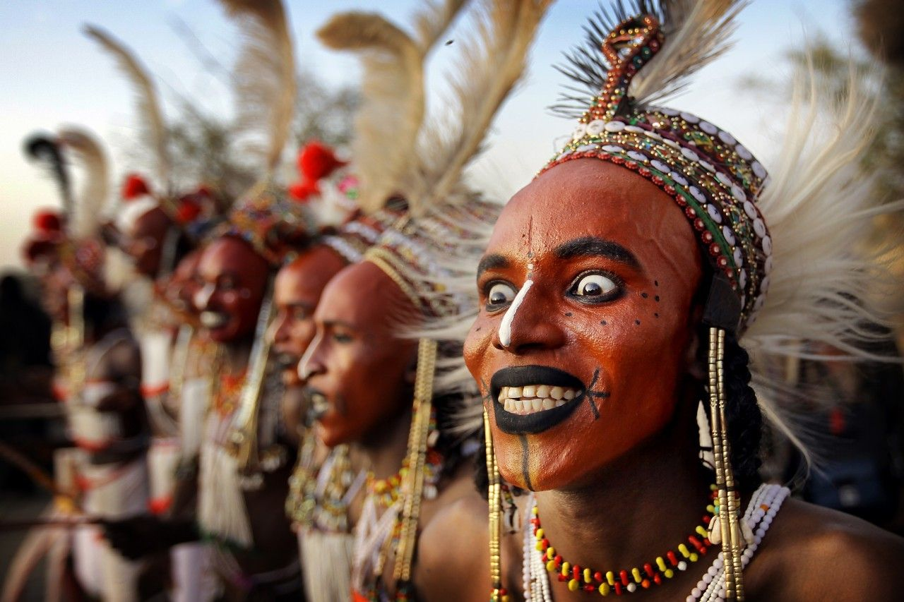
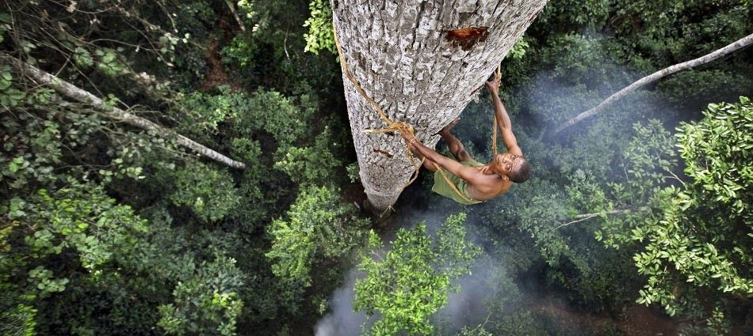

[facebook](https://www.facebook.com/sharer/sharer.php?u=https%3A%2F%2Fwww.natgeo.pt%2Ffotografia%2F2018%2F08%2Ftimothy-allen-um-zoologo-apaixonado-por-povos-indigenas) [twitter](https://twitter.com/share?url=https%3A%2F%2Fwww.natgeo.pt%2Ffotografia%2F2018%2F08%2Ftimothy-allen-um-zoologo-apaixonado-por-povos-indigenas&via=natgeo&text=Timothy%20Allen%20%E2%80%93%20Um%20Zo%C3%B3logo%20Apaixonado%20por%20Povos%20Ind%C3%ADgenas) [whatsapp](https://web.whatsapp.com/send?text=https%3A%2F%2Fwww.natgeo.pt%2Ffotografia%2F2018%2F08%2Ftimothy-allen-um-zoologo-apaixonado-por-povos-indigenas) [flipboard](https://share.flipboard.com/bookmarklet/popout?v=2&title=Timothy%20Allen%20%E2%80%93%20Um%20Zo%C3%B3logo%20Apaixonado%20por%20Povos%20Ind%C3%ADgenas&url=https%3A%2F%2Fwww.natgeo.pt%2Ffotografia%2F2018%2F08%2Ftimothy-allen-um-zoologo-apaixonado-por-povos-indigenas) [mail](mailto:?subject=NatGeo&body=https%3A%2F%2Fwww.natgeo.pt%2Ffotografia%2F2018%2F08%2Ftimothy-allen-um-zoologo-apaixonado-por-povos-indigenas%20-%20Timothy%20Allen%20%E2%80%93%20Um%20Zo%C3%B3logo%20Apaixonado%20por%20Povos%20Ind%C3%ADgenas) [Fotografia](https://www.natgeo.pt/fotografia) 
# Timothy Allen – Um Zoólogo Apaixonado por Povos Indígenas 
## Timothy Allen é um fotógrafo e cineasta inglês, conhecido pelo seu trabalho com povos indígenas e comunidades isoladas em todo o mundo. É um dos oradores do ExodusTalks que se realiza a 12 de dezembro de 2020. Por [National Geographic](https://www.natgeo.pt/autor/national-geographic) Publicado 31/08/2018, 09:53 , Atualizado 7/12/2020, 13:26 

Fotografia por Timothy Allen Nos últimos 20 anos o fotojornalista tem viajado e partilhado as histórias das suas aventuras. Trabalhou no The Independent, no mar da china e com tribos na Sibéria. As suas fotografias não retratam o que observa, mas sim a sua relação com as coisas com que contacta e as pessoas com quem se cruza. Para captar a essência do que vivência, acredita que tem de se misturar com estes povos. Não pode ser objetivo e distante como muitos dos seus colegas de trabalho. 

Em 2008, Allen ficou supraconhecido depois de produzir um documentário para a BBC intitulado ‘Planeta Humano’. Passou mais de um ano e meio a viajar em mais de 40 países. Colabora há muitos anos com agências de comunicação e os projetos mais recentes já o levaram aos locais mais inóspitos do mundo. Foi um dos oradores da edição de 2018 do Exodus Aveiro Fest e a sua palestra está incluída no [**ExodusTalks**](https://www.natgeo.pt/fotografia/2020/12/reserve-a-tarde-de-12-de-dezembro-para-o-exodustalks) , um evento exclusivamente digital realizado a 12 de dezembro de 2020. 

Organiza retiros de fotografia e dá workshops e palestras de fotografia em todo o mundo. Estas expedições e cursos dão a oportunidade de ouvir os relatos das experiências de Timothy Allen pelos quatro cantos do planeta e de aprender alguns truques e fotografar com o especialista. 

Fotografia por Timothy Allen Timothy Allen atribui uma bolsa todos os anos a cinco fotógrafos – ‘ [Timothy Allen Photography Scholarshio Award](http://humanplanet.com/timothyallen/travel-photography-scholarship/) ’. O fotógrafo já foi distinguido com um Emmy, dois BAFTA e 19 menções honrosas para Travel Photographer of the Year, tendo recebido o prémio em 2013. 

Ganha inspiração na espécie humana, concretamente nas pessoas que vivem em condições muito especiais. Por vezes, a única coisa que troca com estes povos são sorrisos e olhares. 

Mas como se escolhem que histórias se querem contar? Segundo o fotógrafo, a melhor forma é viajar e procurar histórias através de um contacto local. 

Fotografia por Timothy Allen O fotógrafo considera que fotografar é um ato intuitivo num momento decisivo, em que não se deve hesitar. 

Este ano, o festival [Exodus Aveiro Fest](https://www.natgeo.pt/exodus) dá lugar ao ExodusTalks, um evento exclusivamente digital que decorre no dia 12 de dezembro. Se ainda não conseguiu assistir ao icónico evento ou anseia por matar saudades do festival, não perca esta oportunidade! Adquira o seu bilhete para o evento **[aqui](https://www.exodusaveirofest.com/tickets/exodustalks/)** . 

Siga as páginas de [Instagram](https://www.instagram.com/Timothy_Allen/) e [Facebook](https://www.facebook.com/timothy.allen/) para acompanhar as aventuras de Timothy Allen! 

