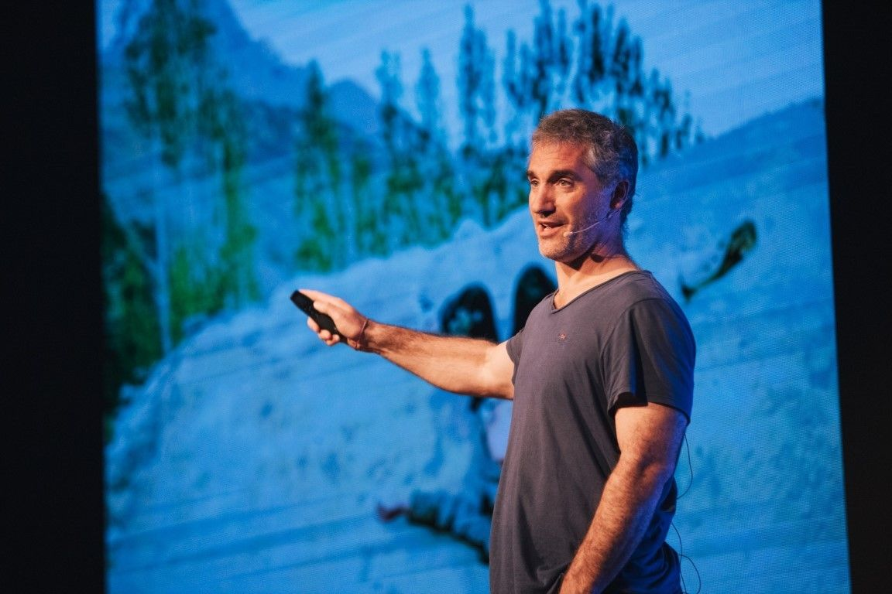

[facebook](https://www.facebook.com/sharer/sharer.php?u=https%3A%2F%2Fwww.natgeo.pt%2Ffotografia%2F2019%2F10%2Fentrevista-matthieu-paley-o-fotografo-do-mundo-vive-em-portugal) [twitter](https://twitter.com/share?url=https%3A%2F%2Fwww.natgeo.pt%2Ffotografia%2F2019%2F10%2Fentrevista-matthieu-paley-o-fotografo-do-mundo-vive-em-portugal&via=natgeo&text=Entrevista%20a%20Matthieu%20Paley%20%E2%80%93%20o%20Fot%C3%B3grafo%20do%20Mundo%20Vive%20em%20Portugal) [whatsapp](https://web.whatsapp.com/send?text=https%3A%2F%2Fwww.natgeo.pt%2Ffotografia%2F2019%2F10%2Fentrevista-matthieu-paley-o-fotografo-do-mundo-vive-em-portugal) [flipboard](https://share.flipboard.com/bookmarklet/popout?v=2&title=Entrevista%20a%20Matthieu%20Paley%20%E2%80%93%20o%20Fot%C3%B3grafo%20do%20Mundo%20Vive%20em%20Portugal&url=https%3A%2F%2Fwww.natgeo.pt%2Ffotografia%2F2019%2F10%2Fentrevista-matthieu-paley-o-fotografo-do-mundo-vive-em-portugal) [mail](mailto:?subject=NatGeo&body=https%3A%2F%2Fwww.natgeo.pt%2Ffotografia%2F2019%2F10%2Fentrevista-matthieu-paley-o-fotografo-do-mundo-vive-em-portugal%20-%20Entrevista%20a%20Matthieu%20Paley%20%E2%80%93%20o%20Fot%C3%B3grafo%20do%20Mundo%20Vive%20em%20Portugal) [Fotografia](https://www.natgeo.pt/fotografia) 
# Entrevista a Matthieu Paley – o Fotógrafo do Mundo Vive em Portugal 
## Distinguido com prémios como o World Press Photo e Fotógrafo Internacional do Ano, Matthieu Paley é o verdadeiro fotógrafo do mundo e no ano passado mudou-se com a família para Portugal. Por [National Geographic](https://www.natgeo.pt/autor/national-geographic) Publicado 21/10/2019, 11:39 , Atualizado 7/12/2020, 13:49 

Matthieu Paley, explorador de comunidades, numa palestra na edição de 2018 do Exodus Aveiro Fest. 

Fotografia por Exodus Aveiro Fest Nos últimos 20 anos a paixão de **Matthieu Paley** levou-o a correr o mundo em diferentes missões para várias revistas e Organizações Não Governamentais. É um contribuidor frequente da **National Geographic** e publicou vários livros sobre os destinos mais remotos por onde tem passado. O seu trabalho foca-se em regiões que são desvirtuadas ou incompreendidas, especialmente com temas relacionados com o comprometimento da cultura e do meio ambiente. 

A sua primeira história para a National Geographic foi sobre os nómadas do povo quirguiz, nas montanhas do Afeganistão, para a revista de fevereiro de 2013. No projeto [“A Evolução da Dieta”](https://www.nationalgeographic.com/foodfeatures/evolution-of-diet/) , o fotógrafo documentou o que custa levar comida para a mesa em diferentes comunidades autossuficientes. Mostrou ao mundo que o corpo humano tem uma capacidade de adaptação inacreditável que nos permite ajustarmo-nos às condições geográficas em que estamos inseridos e, sobretudo, aos recursos naturais que temos disponíveis. 

Deixou o seu país de origem – a França – para viver em alguns dos locais mais isolados do planeta. Depois de viver no Paquistão, em Hong Kong e na Turquia, o fotógrafo está atualmente a viver em Portugal, com a mulher – Mareile Paley - e os dois filhos do casal. 

A National Geographic abre as portas do mundo e Matthieu Paley é o superlativo deste objetivo. 

**Tem alguma memória de infância preferida?** 

Quando tinha 5 anos, o meu pai construiu uma caravana e todos os verões durante meses, viajávamos por toda a Europa, até à Turquia e Norte de África. Estas são memórias maravilhosas. Há dois anos, fiz exatamente a mesma coisa para os meus filhos, por todas as memórias destes tempos. 

**Como se sente num mundo cada vez mais digital e vertical?** 

O digital é a realidade atual… usar este acesso digital que temos para uma quantidade incrível de informação ou para desperdiçar o nosso tempo. É também um grande desafio enquanto pai. É algo em que penso muito, em termos do uso do ecrã e o que estão a fazer com isto. Temos de estar atentos, sem estar completamente contra isso. 

Como fotógrafo, se não estiver longe das profundezas dos Himalaias ou em algum sítio remoto - mesmo quando estou em alguma zona remota - tenho pessoas ao meu redor que estão constantemente a olhar para o telefone e sou muito sensível a isso, porque estou sempre à espera que algo aconteça ou que haja algum tipo de interação humana. 

O lado vertical, demorei um pouco de tempo para me acostumar, mas habituo-me a qualquer tipo de forma de ver e rapidamente se torna natural ver ou forçar ligeiramente a imagem vertical. Gosto de brincar com formatos. Acho que isso nos permite refrescar a forma de compor uma imagem. 

**Qual é a sua opinião sobre a instantaneidade das fotografias de hoje em dia?** 

Depende se decidirmos fotografar e publicá-las imediatamente. Eu não gosto de o fazer. Eu trabalho muito com ‘atraso’, não gosto de ser um escravo do conteúdo. 

Com as redes sociais, por exemplo, se começarmos a trabalhar uma história num local, o nosso público espera que alimentemos esse espaço e publiquemos coisas novas, e eu não gosto de ser incomodado quando estou em viagem, então costumo fazer isso algumas semanas depois. Às vezes faço isso em campo, mas com uma abordagem mais leve sobre o que me rodeia, uma perspetiva peculiar de algo. 

Não quero aprofundar um tema no meio digital de uma maneira instantânea e acho que o problema com todas as notícias rápidas e de última hora, todos os programas de TV que apresentam algo que aconteceu há um minuto atrás, é que não tiveram tempo para serem digeridas e entendidas adequadamente e muitas vezes é enganador. 

Este tipo de feed de notícias instantâneo deve ser usado com muito cuidado. 

**Que preocupações leva na mochila?** 

Tenho as minhas próprias preocupações em contar uma história, porque quando estou a ir para um trabalho, a viajar, tenho que contar uma história sobre algo específico, então tenho que entender muito bem essa história para ter uma imagem com significado, não apenas a imagem bonita mas uma imagem bonita, boa, forte, que se encaixa na história em que estou a trabalhar. Essa é a minha constante preocupação, de conseguir essa interseção entre uma imagem que é forte e uma imagem que não é puramente bonita. 

A minha preocupação é descobrir quem eu acabei de fotografar, os seus nomes e os antecedentes, e toda essa pesquisa que acho muito importante para escrever uma legenda, que traga outra camada de entendimento sobre o que vemos... ser fotógrafo hoje em dia é um trabalho muito multidimensional, está longe de apenas tirar uma foto. Há muita pesquisa em campo, muita pesquisa antes de viajar, para entender o tema e garantir que somos capazes de entendê-lo bem para encontrar essa conexão, encontrar o significado subjacente no seu ambiente e depois fotografá-lo. 

**Que história gostaria de contar em Portugal?** 

É mais uma história global. Estou interessado no êxodo rural. A parte central de Portugal que, nos últimos 20 a 30 anos, está a esvaziar-se, assim como em França e em muitos outros países. O equilíbrio entre urbano e rural foi enviesado para o urbano há quase 10 anos, cerca de 60% do mundo vive num ambiente urbano. Não há muito tempo, era o oposto, era muito mais forte nas áreas rurais. 

Estou interessado nesta paisagem abandonada, nestas aldeias abandonadas que ficam para trás. Não é especificamente em Portugal, é mais um fenómeno global, mas este seria um país interessante para fotografar o tema. 

**Já viveu nos EUA, Turquia, Paquistão, Hong Kong, Índia e Tajiquistão e, agora, Portugal. O que o encanta em Portugal?** 

Muitas coisas (risos)! Gosto do facto de não ser um país grande. É um país que não tem uma população grande, então parece que podemos enfrentar muitos dos problemas. Portugal tem coragem de enfrentar muitos problemas relacionados com temas com que me preocupo, como o meio ambiente e a poluição, pelo menos para os meus olhos vindos da Ásia. É realmente bom ver um bom nível de respeito e cuidado com isso. Isso faz-me sentir confortável. 

Logisticamente, a localização é boa para mim. Agora vivo na Arrábida e tenho acesso à cidade, ao aeroporto, mas gosto de viver num ambiente natural, isso é ótimo... e para os meus filhos e para a minha esposa é bom. Eu sou francês, a minha mulher é alemã, não estamos muito longe de casa, mas moramos num sítio interessante, que é diferente. 

O que eu gosto aqui é de aprender sobre outro país e isso é sempre o que eu quero. Se puder viver num sítio onde posso aprender outra coisa... uma língua diferente, uma cultura diferente, isso torna-se emocionante! 

**Se pudesse pedir um desejo para o Planeta, qual seria?** 

Que as pessoas se preocupassem com o que está a acontecer e que fossem menos egoístas. O problema com as pessoas é que a única maneira de as tornar interessadas sobre um problema é se lhes acertarmos na carteira. Se não atingir a sua prosperidade, podem sentir e dizer " _sim, sim, claro, eu debato-me por isso_ ", mas não farão nada. 

Gostaria que as pessoas tivessem sensibilidade para o que está a acontecer em escala global e não olhassem apenas para o seu bairro e para o próprio país. Estamos todos ligados e isso é algo que eu gostaria que fosse sentido pela maioria de nós. 

**CURIOSIDADES** 

**Cresceu na…** Normandia, no norte de França. 

**O seu herói é…** Tenho muitos, não tenho apenas um. 

**Num dia típico…** Não existe um dia típico quando se é um fotógrafo freelancer (risos)! Depende se estou em casa, a trabalhar,... Quando estou em casa, fico muito tempo à frente do computador. Quando estou a trabalhar, ando muito a pé, conheço pessoas e tomo notas, foco-me no meu trabalho. É por isso que gosto da minha profissão, não existem dias típicos. 

**Para se divertir…** faço kitesurf. Adoro estar na água! 

**O seu sítio preferido no mundo é…** a zona ocidental dos Himalaias, no norte do Paquistão e no Tajiquistão. Esse é de longe o meu sítio favorito. É a minha segunda casa… Falo a língua, vou lá há 20 anos. 

**Não consegue viajar sem…** uma almofada. 

**E se não fosse fotógrafo tinha sido…** talvez desportista (surf, kitesurf, ...). Hoje em dia interesso-me muito por agricultura e permacultura e talvez me envolvesse nisso, tendo uma quinta. Se me pudesse dizer, ficaria muito curioso (risos)! De facto, não sei. 

**O seu melhor conselho para os seus filhos é…** manter sempre o foco no que os motiva, no que os entusiasma e não se desviarem disso. Porque a vida dar-lhes-á oportunidades de fazer algo que talvez profissionalmente lhes dê mais dinheiro, mas – seja qual for a decisão deles – garantam que está conectado com o que querem fazer com a sua vida. Não é fácil, porque têm de se conhecer a si próprios. 

