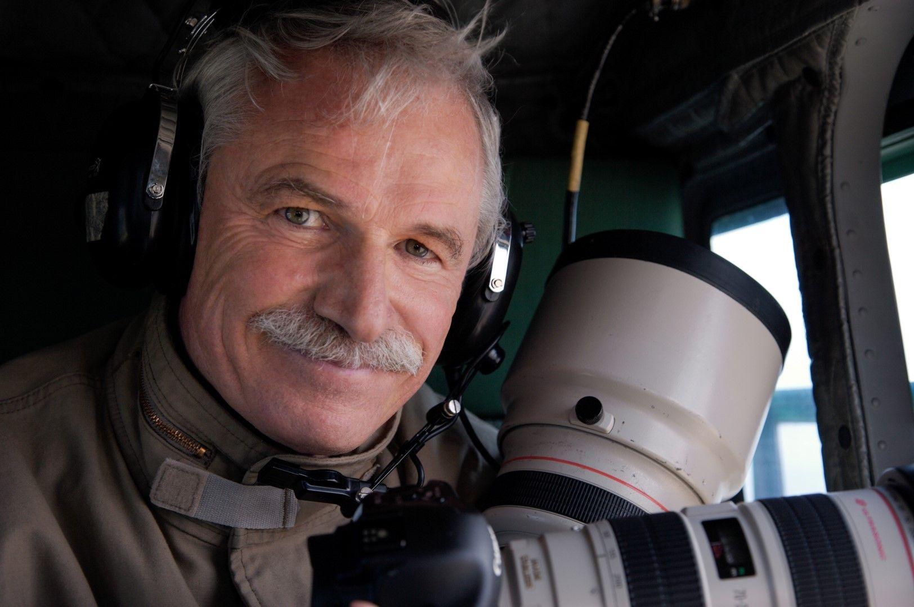
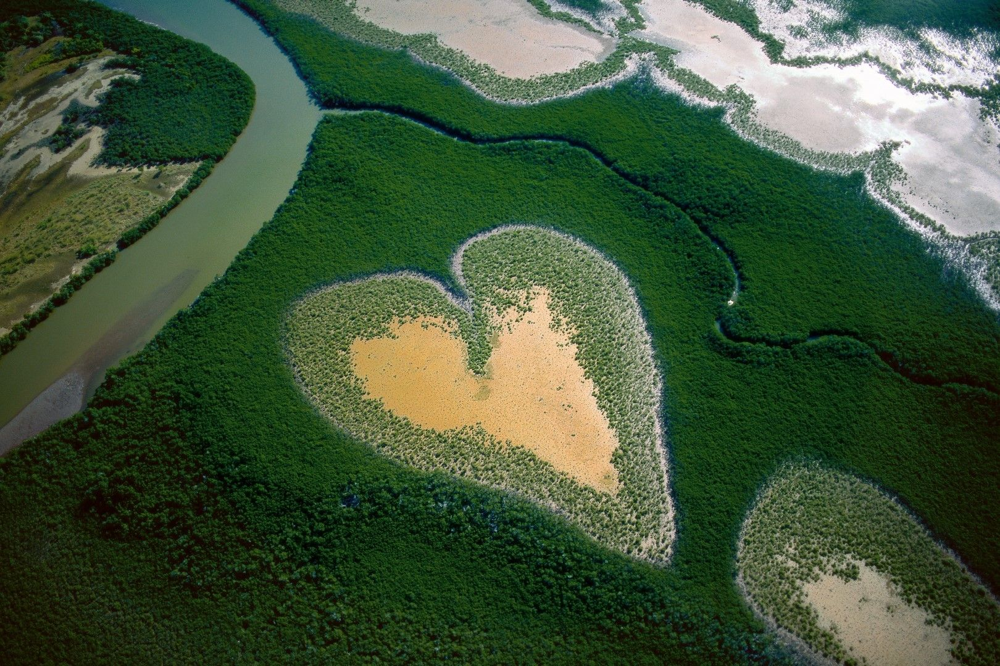
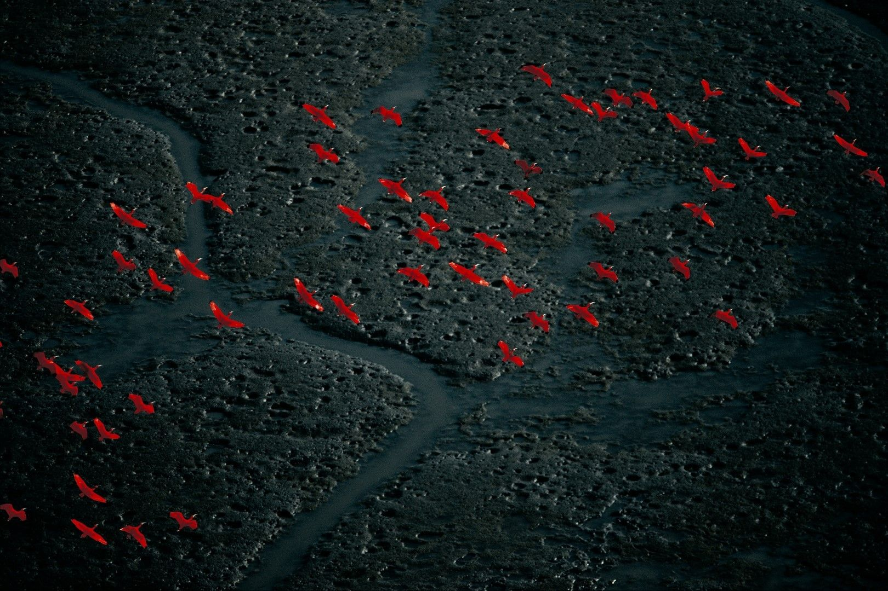
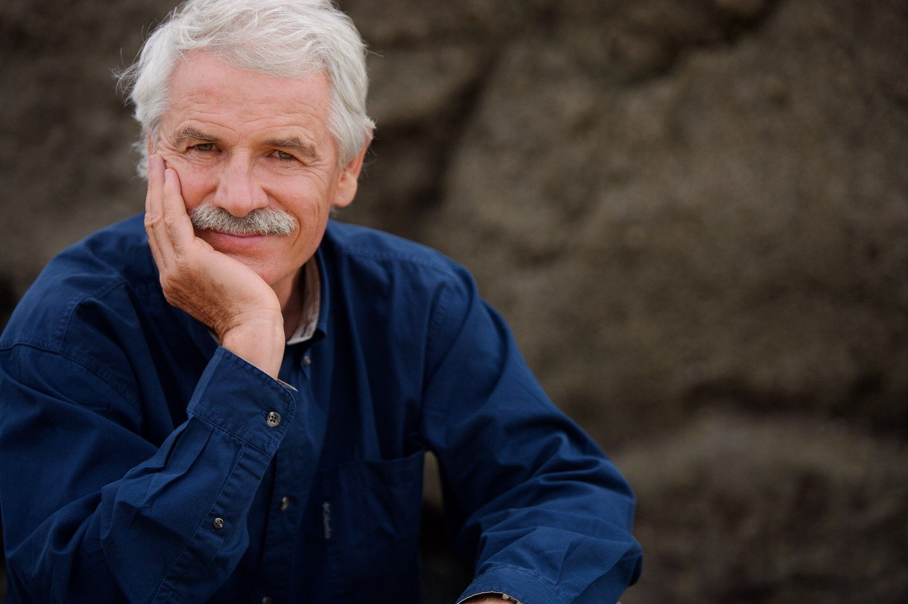

[facebook](https://www.facebook.com/sharer/sharer.php?u=https%3A%2F%2Fwww.natgeo.pt%2Ffotografia%2F2018%2F11%2Fyann-arthus-bertrand-e-a-personalidade-exodus-2018-e-vem-a-portugal) [twitter](https://twitter.com/share?url=https%3A%2F%2Fwww.natgeo.pt%2Ffotografia%2F2018%2F11%2Fyann-arthus-bertrand-e-a-personalidade-exodus-2018-e-vem-a-portugal&via=natgeo&text=Yann%20Arthus-Bertrand%20%C3%A9%20a%20Personalidade%20Exodus%202018%20e%20Vem%20a%20Portugal) [whatsapp](https://web.whatsapp.com/send?text=https%3A%2F%2Fwww.natgeo.pt%2Ffotografia%2F2018%2F11%2Fyann-arthus-bertrand-e-a-personalidade-exodus-2018-e-vem-a-portugal) [flipboard](https://share.flipboard.com/bookmarklet/popout?v=2&title=Yann%20Arthus-Bertrand%20%C3%A9%20a%20Personalidade%20Exodus%202018%20e%20Vem%20a%20Portugal&url=https%3A%2F%2Fwww.natgeo.pt%2Ffotografia%2F2018%2F11%2Fyann-arthus-bertrand-e-a-personalidade-exodus-2018-e-vem-a-portugal) [mail](mailto:?subject=NatGeo&body=https%3A%2F%2Fwww.natgeo.pt%2Ffotografia%2F2018%2F11%2Fyann-arthus-bertrand-e-a-personalidade-exodus-2018-e-vem-a-portugal%20-%20Yann%20Arthus-Bertrand%20%C3%A9%20a%20Personalidade%20Exodus%202018%20e%20Vem%20a%20Portugal) [Fotografia](https://www.natgeo.pt/fotografia) 
# Yann Arthus-Bertrand é a Personalidade Exodus 2018 e Vem a Portugal 
## Yann Arthus-Bertrand é a personalidade homenageada em 2018, no National Geographic Exodus Aveiro Fest. Fotógrafo há mais de 40 anos, é Embaixador da Boa Vontade das Nações Unidas e o realizador de ‘HOME’ e ‘HUMAN’. Por [National Geographic](https://www.natgeo.pt/autor/national-geographic) Publicado 11/11/2018, 12:28 

Fotografia de Yann Arthus-Bertrand, reconhecido fotógrafo, embaixador da Boa Vontade das Nações Unidas e o realizador de ‘HOME’ e ‘HUMAN’. Fotografia por Arquivo de Yann Arthus-Bertrand "Sou apenas um homem entre 7 biliões de outras pessoas." Yann Arthus-Bertrand é fascinado pela natureza e pelo mundo animal desde sempre. Antes de ter 20 anos já dirigia uma reserva natural no centro de França. A paixão pela fotografia surgiu depois, quando viveu no Quénia e fez um estudo sobre o comportamento dos leões e começou a utilizar a máquina fotográfica para complementar as suas observações. 

Foi no continente africano que descobriu outra paixão: a fotografia aérea. Em 1991, fundou a primeira agência de aerofotografia – ‘Altitute’. Desenvolveu projetos mais longos, livros e exposições, focando-se na relação humana com a natureza. Projetos como ‘ _The Earth from Above’, ‘Animals’, ‘HOME’_ e _‘HUMAN’_ , são alguns dos seus trabalhos com mais notoriedade. 

Fotografia aérea do reconhecido fotógrafo, embaixador da Boa Vontade das Nações Unidas, e realizador de ‘HOME’ e ‘HUMAN’. Fotografia por Yann Arthus-Bertrand Em 2003 iniciou um dos maiores projetos fotográficos e humanos de sempre – ‘ _Six Billion Others_ ’, fotografando pessoas em todo o mundo e recolhendo os seus testemunhos em vídeo. O fotógrafo acredita que os olhos são mesmo o espelho da alma, porque "não há nada mais constrangedor do que alguém olhar para si diretamente nos seus olhos e mostrar a sua alma". Cada vida é única, por isso cada olhar é diferente. 

No ano de 2005 criou a Fundação GoodPlanet com o intuito de aumentar a proteção ambiental. Esta organização tem-se focado na educação ambiental e luta contra as alterações climáticas. O seu compromisso por esta causa, valeu-lhe a nomeação para Embaixador da Boa Vontade para o Programa Ambiental das Nações Unidas, em 2009. 

ver galeria Em 2011 co-realizou ‘ _PLANET OCEAN_ ’ com Michael Pitiot, lançado em 2012 na Conferência das Nações Unidas Rio+20. 

Depois de conhecer milhares de pessoas e ouvir tantas histórias diferentes _,_ questionou-se se todos teremos a mesma ambição por liberdade, amor e reconhecimento. "O que significa ser humano hoje em dia? Será que as nossas necessidades são as mesmas? Por que é que mantemos os mesmos erros, geração após geração? Por que ainda é tão difícil compreendermo-nos uns aos outros?". 60 países, 2000 testemunhos e dois anos depois, culminaram no filme ‘ _HUMAN’,_ estreado em 2015. Nesse ano, apresentou outro filme seu – ‘TERRA’, que nos conta a história da vida na Terra. 

Fotografia de Yann Arthus-Bertrand, reconhecido fotógrafo, embaixador da Boa Vontade das Nações Unidas e realizador de ‘HOME’ e ‘HUMAN’. Fotografia por Arquivo de Yann Arthus-Bertrand "Há 40 anos que fotografo o nosso planeta e a diversidade humana e pressinto que a humanidade não está a fazer nenhum progresso". É desta forma que Yann Arthus-Bertrand apela à preservação do planeta. As suas fotografias, muitas vezes feitas em balões, aviões e helicópteros, revelam a beleza da humanidade e a beleza da Terra, mas também nos mostram o impacto da poluição e a escassez dos recursos naturais. 

Yann Arthus-Bertrand é a Personalidade do Ano [Exodus](https://www.natgeo.pt/exodus) 2018, que decorrerá a 1 e 2 de dezembro no Centro de Congressos de Aveiro. Pode acompanhar o trabalho do fotógrafo e realizador na sua [conta de Instagram](https://www.instagram.com/yannarthusbertrand/) e [página de Facebook](https://www.facebook.com/Y.A.Bertrand/) . 

[source](https://www.natgeo.pt/fotografia/2018/11/yann-arthus-bertrand-e-a-personalidade-exodus-2018-e-vem-a-portugal)