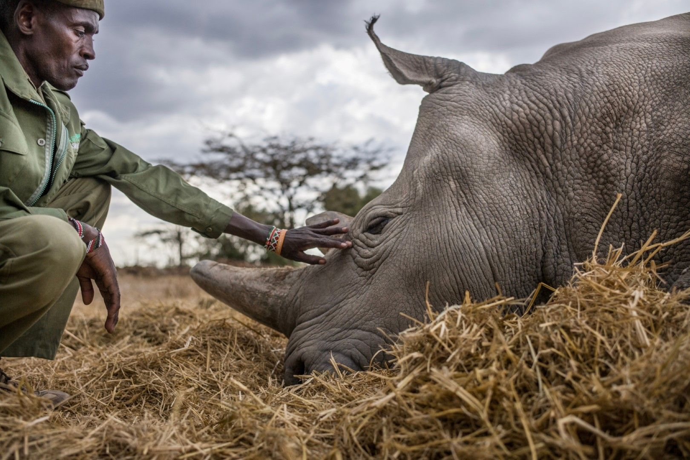

[facebook](https://www.facebook.com/sharer/sharer.php?u=https%3A%2F%2Fwww.natgeo.pt%2Ffotografia%2F2019%2F12%2Fentrevista-justin-mott-fundador-de-kindred-guardians) [twitter](https://twitter.com/share?url=https%3A%2F%2Fwww.natgeo.pt%2Ffotografia%2F2019%2F12%2Fentrevista-justin-mott-fundador-de-kindred-guardians&via=natgeo&text=Entrevista%20a%20Justin%20Mott%2C%20fundador%20de%20%E2%80%98Kindred%20Guardians%E2%80%99) [whatsapp](https://web.whatsapp.com/send?text=https%3A%2F%2Fwww.natgeo.pt%2Ffotografia%2F2019%2F12%2Fentrevista-justin-mott-fundador-de-kindred-guardians) [flipboard](https://share.flipboard.com/bookmarklet/popout?v=2&title=Entrevista%20a%20Justin%20Mott%2C%20fundador%20de%20%E2%80%98Kindred%20Guardians%E2%80%99&url=https%3A%2F%2Fwww.natgeo.pt%2Ffotografia%2F2019%2F12%2Fentrevista-justin-mott-fundador-de-kindred-guardians) [mail](mailto:?subject=NatGeo&body=https%3A%2F%2Fwww.natgeo.pt%2Ffotografia%2F2019%2F12%2Fentrevista-justin-mott-fundador-de-kindred-guardians%20-%20Entrevista%20a%20Justin%20Mott%2C%20fundador%20de%20%E2%80%98Kindred%20Guardians%E2%80%99) [Fotografia](https://www.natgeo.pt/fotografia) 
# Entrevista a Justin Mott, fundador de ‘Kindred Guardians’ 
## Distinguido com prémios como o Fotógrafo de Viagem do Ano e o prémio anual do PDN, o trabalho de Justin Mott tem o poder de nos inspirar a cuidarmos melhor do nosso planeta. Por [National Geographic](https://www.natgeo.pt/autor/national-geographic) Publicado 30/12/2019, 13:00 , Atualizado 7/12/2020, 13:51 

Justin Mott é um fotógrafo e produtor documental, editorial e comercial, americano, amplamente premiado. Fotografia por Bernardo Conde É um dos fotógrafos mais conhecidos e respeitados do Sudeste Asiático. **Justin Mott** fotografou mais de 100 trabalhos para o New York Times e os seus clientes incluem a National Geographic, The Smithsonian, TIME, The Washington Post, The Guardian e ONGs e organizações como a Cruz Vermelha, a Fundação de Bill e Melinda Gates e a ONU. 

Justin é o fundador e proprietário da [Mott Visuals](https://www.mottvisuals.com/) , uma empresa de produção premium especializada em fotografia comercial e produção de vídeo. Foi jurado e apresentador do reality show Photo Face-Off durante 5 anos e atualmente está a trabalhar no seu projeto pessoal de longo prazo intitulado [**'Kindred Guardians'**](https://www.justinmott.com/kindred-guardians) . 

‘Kindred Guardians’ documenta pessoas em todo o mundo que dedicam as suas vidas ao bem-estar animal. Cada capítulo explora uma condição diferente e uma nova conexão entre humanos e animais. Justin partilha o trabalho destes guardiões de uma forma única, documentando os laços entre humanos e animais. As suas histórias incluem links com mais informações sobre como ajudar estas causas. 

**O que o entusiasma todos os dias no seu trabalho?** 

O meu projeto pessoal em andamento - Kindred Guardians, através do qual conheço as pessoas mais incríveis do mundo que dedicam as suas vidas a ajudar animais. É tão inspirador estar perto deles, e é uma honra e um privilégio poder contar as suas histórias. 

Peter Esegon, de 47 anos, é um dos principais cuidadores de rinocerontes da OI Pejeta. Nesta fotografia relaxa com Najin enquanto ela faz uma sesta. Os zeladores vivem longe das suas famílias num pequeno campo com vista para a zona de rinocerontes, durante 20 dias consecutivos e com 6 dias de folga. Fotografia por [Justin Mott](https://www.natgeo.pt/fotografo/justin-mott) **Qual é a sua fotografia preferida atualmente?** 

A minha fotografia preferida de todos os tempos é a imagem do homem-tanque na Praça de Tiananmen, é tão poderosa e representa muita coisa, tanto naquela época como agora. A imagem preferida da minha autoria está sempre a mudar porque estou frequentemente a contar novas histórias e a captar novos momentos. Atualmente, a minha fotografia de um dos dois últimos rinocerontes brancos do norte com um guarda armado em primeiro plano é a minha favorita, porque diz muito sobre a condição dos rinocerontes e dos guardas florestais que arriscam as suas vidas para mantê-los seguros. 

**Qual a sua opinião sobre a instantaneidade e a 'democratização' da fotografia hoje em dia?** 

Tem dois lados. Por um lado, cada vez mais pessoas estão interessadas em fotografia, o que é positivo, mas, ao mesmo tempo, para um contador de histórias longas como eu, que elaboro ensaios ou artigos fotográficos, as pessoas nem sempre têm _attention span_ (intervalo temporal em que as pessoas têm capacidade para se concentrarem em uma atividade ou assunto) para percorrerem uma apresentação de slides completa e digerirem um artigo bem trabalhado. 

**Que preocupações leva na mochila?** 

Estou sempre preocupado em dar a cada história o tempo que merece para ser contada adequadamente. Preocupo-me sempre se estou a esforçar-me o suficiente criativamente e com receio em perder um momento ou um elemento crucial da história. Sou duro comigo mesmo, a minha mochila está cheia de preocupações. 

Justin Mott foi um dos oradores da edição de 2018 do Exodus Aveiro Fest e viajou por Portugal durante uma semana. 

Fotografia por Pedro Cardoso **Após a sua recente viagem a Portugal, há alguma história que gostasse de contar sobre o país ou o povo português?** 

Uau, o calor das pessoas e a comida, meu Deus a comida! Fiquei verdadeiramente emocionado com a hospitalidade e, claro, a rica história de Portugal… é um país tão bonito e historicamente rico. Estou a pensar em experimentar morar em Lisboa durante alguns meses por ano, se conseguir fazer com que funcione. 

**Se pudesse fazer apenas mais um projeto, qual seria?** 

Isto pode parecer absurdo, mas seria no meu projeto em que estou a trabalhar agora - Kindred Guardians. Honestamente, demorou uma década para descobrir que esta era a minha paixão e agora estou finalmente a fazer com que isto funcione. Tenho inúmeras histórias sobre pessoas que dedicam as suas vidas a ajudar animais e fico muito inspirado por cada tema e cada história. 

**Se pudesse pedir um desejo para o Planeta, qual seria?** 

É claro que me preocupo com as mudanças climáticas e com as coisas horríveis que nós humanos, estamos a fazer para destruir o nosso planeta, mas adoraria que as pessoas começassem a ter compaixão pelos animais e que isso levasse a mais respeito e preocupação com o ecossistema a que todos chamamos lar. 

**CURIOSIDADES 

Cresceu em...** Smithfield, Rhode Island, EUA. 

**O seu herói é...** Cada tema do meu projeto são os meus heróis. 

**Num dia típico...** Se estou a filmar, estou a obscurecer o meu assunto, se estou de volta ao escritório, em casa, estou a editar, a alinhar histórias e a gerir a minha empresa de produção Mott Visuals. 

**Para se divertir...** Tenho a minha Leica no pescoço e estou a contar histórias com ela. 

**O seu sítio preferido no mundo é…** Block Island, Rhode Island. Quero aposentar-me lá um dia. 

**Não consegue viajar sem...** Dúvida. Uso a dúvida para me esforçar criativamente. 

**Se não fosse fotógrafo tinha sido…** Gostaria de pensar que ajudaria animais de outra forma. 

**O seu melhor conselho para um fotógrafo júnior é...** Dê a si mesmo um projeto pessoal pelo qual seja apaixonado e no qual possa desenvolver-se. Não precisa de viajar para um lugar distante, a história pode estar perto de casa, basta começar algo e estar atento. 

**Acompanhe os seus projetos:** 

[Projetos editoriais](https://www.justinmott.com/) 

[Conta de Instagram](http://instagram.com/askmott) 

[Blog](https://www.askmott.com/) 

[source](https://www.natgeo.pt/fotografia/2019/12/entrevista-justin-mott-fundador-de-kindred-guardians)