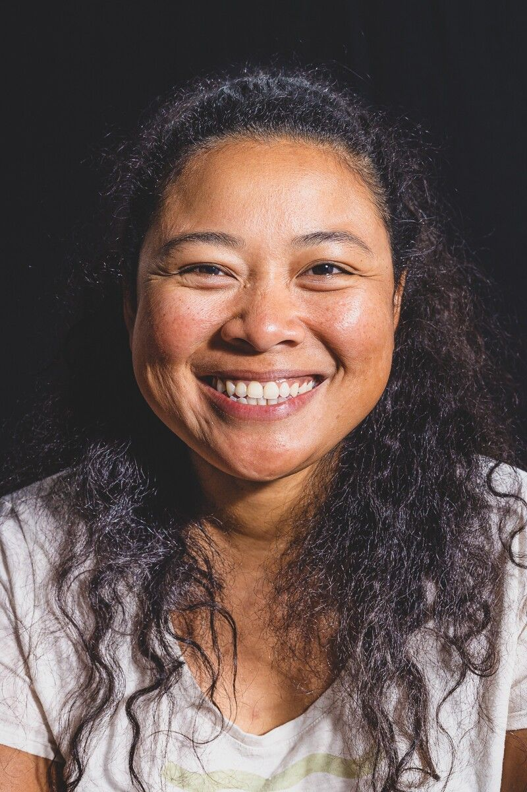

[facebook](https://www.facebook.com/sharer/sharer.php?u=https%3A%2F%2Fwww.natgeo.pt%2Ffotografia%2F2022%2F05%2Fprojeto-documental-de-bernardo-conde-valoriza-a-diversidade-humana) [twitter](https://twitter.com/share?url=https%3A%2F%2Fwww.natgeo.pt%2Ffotografia%2F2022%2F05%2Fprojeto-documental-de-bernardo-conde-valoriza-a-diversidade-humana&via=natgeo&text=Projeto%20documental%20de%20Bernardo%20Conde%20valoriza%20a%20diversidade%20humana) [whatsapp](https://web.whatsapp.com/send?text=https%3A%2F%2Fwww.natgeo.pt%2Ffotografia%2F2022%2F05%2Fprojeto-documental-de-bernardo-conde-valoriza-a-diversidade-humana) [flipboard](https://share.flipboard.com/bookmarklet/popout?v=2&title=Projeto%20documental%20de%20Bernardo%20Conde%20valoriza%20a%20diversidade%20humana&url=https%3A%2F%2Fwww.natgeo.pt%2Ffotografia%2F2022%2F05%2Fprojeto-documental-de-bernardo-conde-valoriza-a-diversidade-humana) [mail](mailto:?subject=NatGeo&body=https%3A%2F%2Fwww.natgeo.pt%2Ffotografia%2F2022%2F05%2Fprojeto-documental-de-bernardo-conde-valoriza-a-diversidade-humana%20-%20Projeto%20documental%20de%20Bernardo%20Conde%20valoriza%20a%20diversidade%20humana) [Olhares de Portugal](https://www.natgeo.pt/olhares-de-portugal) 
# Projeto documental de Bernardo Conde valoriza a diversidade humana 
## O projeto de fotografia e vídeo “Os Outros – pessoas como nós” tem como pano de fundo a pandemia e a consequente distância criada entre pessoas e nações. Por [Filipa Coutinho](https://www.natgeo.pt/autor/filipa-coutinho) Publicado 20/05/2022, 16:06 

Fotografia por Bernardo Conde Em tempos difíceis, [**Bernardo Conde**](https://www.natgeo.pt/viagem-e-aventuras/2020/01/entrevista-bernardo-conde-da-engenharia-lider-de-viagens) continua a viver inquieto e a partilhar o seu encanto pela vida humana, desta vez sob o mote "Os Outros - pessoas como nós”. Este é o seu mais recente projeto de fotografia e vídeo, exposto no Teatro Aveirense até 8 de junho. 

“Falamos sempre dos outros, mas se calhar é preciso ouvi-los para percebermos que são pessoas como nós”, sugere o fotógrafo. A iniciativa contempla uma exposição de fotografia, um documentário e um livro, produzidos durante a pandemia, perante a consequente distância criada entre pessoas e nações. Uma distância física, mas não uma distância humana. 

**Esquerda:** **Superior:** O projeto do fotógrafo teve como foco pessoas que habitam ou visitaram Aveiro em 2021. 

**Direita:** **Inferior:** Anisa Subekti vive atualmente em Portugal e passou por Aveiro no ano passado. 

fotografias de Bernardo Conde Apresentado no Salão Nobre do Teatro Aveirense, este projeto teve por base dezenas de encontros do fotógrafo e líder de viagens com pessoas que vivem ou passaram por Aveiro em 2021, formando um bonito e enorme mosaico de personalidades distintas que celebram a singularidade e a diversidade da nossa existência. Numa altura em que a desconfiança se instalava, por medo de infeção ou desconhecimento dos perigos da doença, este projeto procurou afirmar a necessidade da solidariedade entre conhecidos e desconhecidos, mostrando que o que nos une é mais forte do que o que nos separa. 

Segundo o autor, o projeto busca captar a essência de cada pessoa, na descoberta do que as move, do que sentimos que o mundo precisa, do que nos aproxima enquanto seres humanos com origens diferentes, profissões variadas, vidas distintas, mas tão próximas do que nos faz ser... humanos. 

O projeto “Os Outros - pessoas como nós” integra-se na estratégia Cultura em Tempos de (In)Certeza, criada pela Câmara Municipal de Aveiro como apoio ao setor cultural durante o período de pandemia, de que já resultaram várias obras. Para este trabalho foi escolhido o fotógrafo e documentarista aveirense Bernardo Conde, pela sua ampla experiência de viagem, contacto regular com outros povos e organização do evento [Exodus Aveiro Fest](https://www.exodusaveirofest.com/) . 

A exposição tem entrada gratuita e pode ser visitada até 8 de junho, de segunda-feira a sábado, entre as 14h00 e as 18h00, no Salão Nobre do Teatro Aveirense. 

