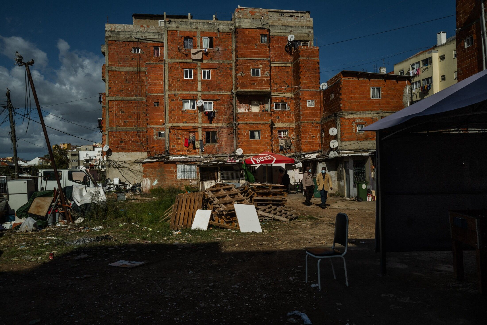
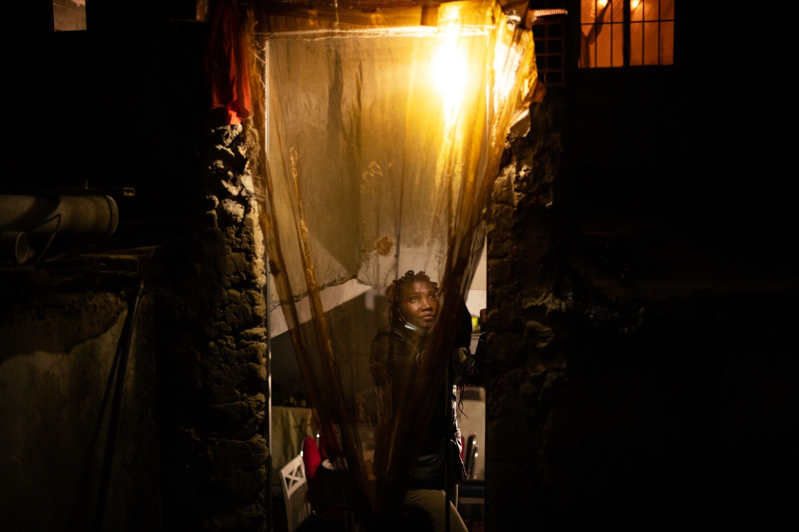

[facebook](https://www.facebook.com/sharer/sharer.php?u=https%3A%2F%2Fwww.natgeo.pt%2Ffotografia%2F2021%2F04%2Fjamaika-visao-imersiva-de-uma-realidade-por-jose-sarmento-matos) [twitter](https://twitter.com/share?url=https%3A%2F%2Fwww.natgeo.pt%2Ffotografia%2F2021%2F04%2Fjamaika-visao-imersiva-de-uma-realidade-por-jose-sarmento-matos&via=natgeo&text=%22Jamaika%22%3A%20vis%C3%A3o%20imersiva%20de%20uma%20realidade%20por%20Jos%C3%A9%20Sarmento%20Matos) [whatsapp](https://web.whatsapp.com/send?text=https%3A%2F%2Fwww.natgeo.pt%2Ffotografia%2F2021%2F04%2Fjamaika-visao-imersiva-de-uma-realidade-por-jose-sarmento-matos) [flipboard](https://share.flipboard.com/bookmarklet/popout?v=2&title=%22Jamaika%22%3A%20vis%C3%A3o%20imersiva%20de%20uma%20realidade%20por%20Jos%C3%A9%20Sarmento%20Matos&url=https%3A%2F%2Fwww.natgeo.pt%2Ffotografia%2F2021%2F04%2Fjamaika-visao-imersiva-de-uma-realidade-por-jose-sarmento-matos) [mail](mailto:?subject=NatGeo&body=https%3A%2F%2Fwww.natgeo.pt%2Ffotografia%2F2021%2F04%2Fjamaika-visao-imersiva-de-uma-realidade-por-jose-sarmento-matos%20-%20%22Jamaika%22%3A%20vis%C3%A3o%20imersiva%20de%20uma%20realidade%20por%20Jos%C3%A9%20Sarmento%20Matos) [Fotografia](https://www.natgeo.pt/fotografia) 
# "Jamaika": visão imersiva de uma realidade por José Sarmento Matos 
## O projeto Jamaika, do fotojornalista José Sarmento Matos em colaboração com moradores do bairro e o músico Kid Robinn, foi um dos trabalhos selecionados pela National Geographic Society para ser apoiado pelo Fundo de Emergência COVID-19 para Jornalistas. Por [Filipa Coutinho](https://www.natgeo.pt/autor/filipa-coutinho) fotografias de José Sarmento Matos Publicado 3/05/2021, 17:52 , Atualizado 13/05/2021, 12:34 

Dois dos três prédios principais do bairro da Jamaica, no Seixal. Em 2018 as pessoas que viviam no lote 10 do Jamaica foram realojadas, o edifício foi demolido em 2019. Nos prédios que restam vivem ainda à volta de 700 pessoas em condições bastante precárias. 

Bairro da Jamaica, 26 de outubro de 2020 

Fotografia por José Sarmento Matos Numa capital europeia, ainda há pessoas a viver em contextos precários, com condições de habitação muito básicas. No século XXI, a segregação e o racismo ainda são temas fraturantes. 

O Bairro da Jamaica, no Seixal, é um bairro onde vivem maioritariamente pessoas de origem e descendência africana, tal como de etnia cigana em prédios inacabados. Depois de uma das torres do Bairro da Jamaica ser demolida em 2019, o processo de realojamento aparenta estar atrasado, e os restantes edifícios permanecem em condições muito difíceis para quem ainda os habita - condições que se agravam em tempos de pandemia. 

Este é um bairro que está indefinido por fronteiras pouco razoáveis. É um cenário dramático, com pouca ou nenhuma luz nas zonas comuns do prédio, em que chove dentro de algumas casas, onde o espaço já era demasiado apertado antes dos períodos de confinamento. Foi esta a causa que [**José Sarmento Matos**](https://www.josesmatos.com/) elegeu documentar durante a pandemia, projeto financiado pela bolsa que recebeu do Fundo de Emergência COVID-19 para Jornalistas da National Geographic Society. 

Como parte do projeto Jamaika, José Sarmento Matos distribuiu câmaras de filmar a alguns dos habitantes e pediu-lhes para assumir o papel de repórter e documentar a vivência local. Durante o trabalho, desafiou [Kid Robinn](https://links.altafonte.com/bp7mjrj) , um rapper que nasceu e cresceu no bairro da Jamaica, para escrever a música que dá melodia e relato ao documentário. O projeto do fotojornalista teve como frutos uma coleção de retratos dos residentes; um ensaio fotográfico; um documentário sobre o bairro e uma [exposição no MAAT](https://www.maat.pt/pt/x-nao-e-um-pais-pequeno-desvendar-era-pos-global) . 

Existe um programa local do governo que tem previsto realojar os residentes do bairro até 2022, mas apenas um dos edifícios foi realojado até agora. Quezílias e um processo em tribunal contribuem para o atraso do processo. Cerca de 700 pessoas aguardam realojamento. 

ver galeria 

**Esquerda:** Aurora, 30 anos, posa para um retrato na sua casa. 

**Direita:** Asmir, 22 anos, namorado da Aurora, retratado na sua cama. 

Fotografia por José Sarmento Matos José Sarmento Matos sentou-se à conversa connosco, numa esplanada à beira-rio e apresentou-nos o projeto. 

**"** Nos arredores de Lisboa, no Seixal, Jamaica é um bairro extremamente carenciado, composto por prédios inacabados onde vivem migrantes de África ou descendentes de africanos de Angola, São Tomé e Príncipe e Guiné-Bissau e pessoas de etnia cigana. Faltam condições sanitárias básicas, chove dentro de algumas casas e as pessoas têm de subir as escadas às escuras porque não há eletricidade na maioria dos espaços comuns. 

A pandemia agravou a pobreza e o sentimento de isolamento desta comunidade, que sofre há muitos anos de segregação. A maioria dos residentes têm trabalhos não qualificados – o que torna a sua situação económica ainda mais frágil durante a pandemia – e, dadas as condições de habitação, estão muito mais expostos à crise sanitária provocada pelo COVID-19, especialmente nestes tempos em que o conforto do lar se tornou mais importante do que nunca. Até agora, a comunidade não recebeu qualquer apoio destinado a melhorar as condições habitacionais tendo em vista a luta contra o SARS-Cov2. 

Existe um programa municipal para realojar todo o bairro até 2022 mas desde 2018 apenas foram realojados os residentes de um edifício. Cerca de 700 pessoas, que vivem em três edifícios semelhantes, continuam à espera de realojamento. Na atual fase de pandemia, os moradores consideram essa necessidade ainda mais vital, uma vez que é extremamente difícil estar confinado em tais condições. 

Além de ser segregado há mais de 30 anos, o bairro da Jamaica é geralmente foco de notícias quando há intervenções da polícia, menosprezando-se sempre o facto de se tratar de um caso de grave injustiça social. É isto que este trabalho tenta salientar, aprofundando o dia-a-dia do bairro durante a atual crise, mas também reportar uma situação que não devia existir em Portugal no século XXI. O projeto centra-se em histórias de vida com diferentes experiências de confronto com a ameaça do COVID-19, contadas na perspetiva dos próprios moradores, mas também se foca em vivências e experiências que contam a história do bairro e das pessoas que lá vivem. 

Jamaika, documentário de José Sarmento Matos Documentário produzido no âmbito do projeto.

**Esquerda:** Adelaide Costa, 59 anos, posa para um retrato no seu café. 

**Direita:** Alda e Lurdes Pontes, mãe e filha, posam para um retrato. 

Fotografia por José Sarmento Matos 

**Esquerda:** Manuela Pedro, 35 anos. 

**Direita:** Roberto Cravid aka Kid Robinn, 22 anos, rapper nascido e criado no bairro da Jamaica. 

Fotografia por José Sarmento Matos Como fotógrafo documental e jornalista, decidi abordar este projeto de uma forma mais imersiva, não só para compreender melhor a realidade, mas também para expor à audiência uma perspetiva menos tradicional e mais íntima do que é viver num bairro como o Jamaica. Para além de ter feito o meu trabalho documental fotográfico mais convencional, emprestei câmaras digitais compactas a um grupo de residentes para serem eles a criar parte das suas narrativas. Também quis que as entrevistas fossem feitas de uma forma colaborativa, com amigos a entrevistarem-se mutuamente e crianças a entrevistarem as suas mães acerca do seu passado, as suas raízes e a vinda dos seus países de origem para Portugal, diretamente para o bairro da Jamaica. Embora tenham contado com a minha ajuda na construção de algumas perguntas e, também na filmagem das entrevistas, foram as pessoas que escolheram o que queriam contar sobre a pandemia e os seus impactos, o que mudou nas suas vidas pessoais e profissionais e que tipo de apoio necessitam, ou questões relacionadas com a chegada a Portugal quando imigraram. 

Tive também a colaboração de um rapper local, Kid Robinn (22 anos), nascido e criado no bairro, que escreveu uma música / poema contextualizando a sua história de vida – desde que nasceu até à atual pandemia (a canção “perspetiva” faz parte do filme). 

O projeto pretende amplificar as vozes dos residentes no bairro da Jamaica de forma a melhorar a sua relação com a sociedade e expor uma situação que representa uma grave questão de desigualdade em Portugal, que deve ser posto em causa e mudado. 

No seu todo, o projeto resulta num trabalho multimédia, com retratos em Polaroids, um ensaio fotográfico e um filme documentário (com entrevistas, vídeos / fotografias da minha autoria e vídeos feitos pelos residentes, e com a música / rap de Kid Robinn). **"** 

**Esquerda:** Lulu posa para um retrato no café da Ivete. 

**Direita:** Cristiana Chaves, 55 anos, trata do cabelo da sua nora em frente à sua casa. 

Fotografia por José Sarmento Matos 

A exposição ‘X Não é um país pequeno – Desvendar a Era Pós-Global’, patente até 6 de setembro no MAAT, permite ver este projeto e convida-o a subir dois degraus, entrar na maquete, e refletir perante o que vê. Um prédio meio construído, meio desfeito, com roupa estendida e sonhos que, de certa forma, também ficaram estendidos e pendurados nos tijolos daquele prédio. Suspensos, à espera de serem realojados. 

Leia a [entrevista ao fotógrafo documental](https://www.natgeo.pt/fotografia/2021/05/entrevista-ao-fotojornalista-jose-sarmento-matos) . 

Descubra [como pode concorrer às bolsas da National Geographic Society](https://www.natgeo.pt/ciencia/2019/12/conhece-bolsas-da-national-geographic-society) . 

