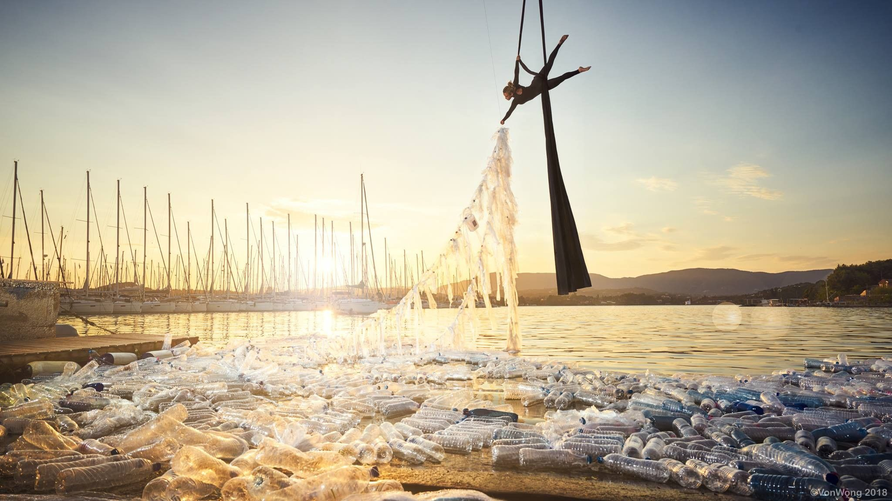
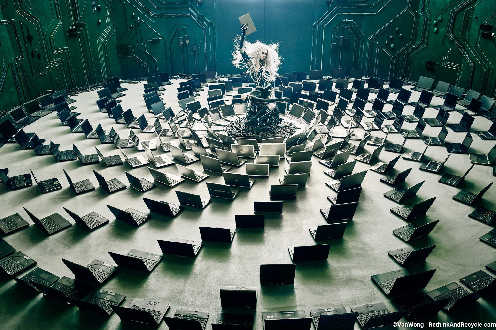
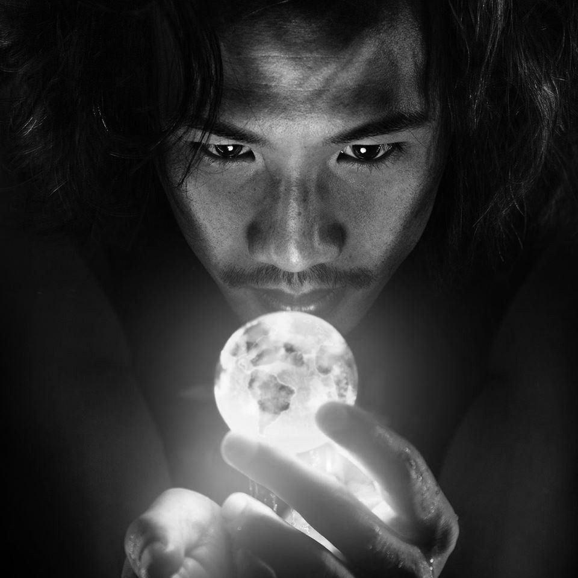

[facebook](https://www.facebook.com/sharer/sharer.php?u=https%3A%2F%2Fwww.natgeo.pt%2Ffotografia%2Fbenjamin-von-wong-de-engenheiro-de-minas-a-fotografo) [twitter](https://twitter.com/share?url=https%3A%2F%2Fwww.natgeo.pt%2Ffotografia%2Fbenjamin-von-wong-de-engenheiro-de-minas-a-fotografo&via=natgeo&text=Benjamin%20Von%20Wong%20%E2%80%93%20de%20Engenheiro%20de%20Minas%20a%20Fot%C3%B3grafo) [whatsapp](https://web.whatsapp.com/send?text=https%3A%2F%2Fwww.natgeo.pt%2Ffotografia%2Fbenjamin-von-wong-de-engenheiro-de-minas-a-fotografo) [flipboard](https://share.flipboard.com/bookmarklet/popout?v=2&title=Benjamin%20Von%20Wong%20%E2%80%93%20de%20Engenheiro%20de%20Minas%20a%20Fot%C3%B3grafo&url=https%3A%2F%2Fwww.natgeo.pt%2Ffotografia%2Fbenjamin-von-wong-de-engenheiro-de-minas-a-fotografo) [mail](mailto:?subject=NatGeo&body=https%3A%2F%2Fwww.natgeo.pt%2Ffotografia%2Fbenjamin-von-wong-de-engenheiro-de-minas-a-fotografo%20-%20Benjamin%20Von%20Wong%20%E2%80%93%20de%20Engenheiro%20de%20Minas%20a%20Fot%C3%B3grafo) [Fotografia](https://www.natgeo.pt/fotografia) 
# Benjamin Von Wong – de Engenheiro de Minas a Fotógrafo 
## Ben Von Wong tem um estilo surrealista único e fotografa problemas ambientais como o lixo eletrónico e o uso excessivo de plástico. É um dos oradores do National Geographic Exodus Aveiro Fest em 2018. Por [National Geographic](https://www.natgeo.pt/autor/national-geographic) 

Um dos projetos do fotógrafo Benjamin Von Wong que ilustra o uso excessivo de plástico e o seu impacto nos oceanos. Fotografia por Benjamin Von Wong Tente imaginar um Engenheiro de Minas. De seguida imagine um Engenheiro de Minas Fotógrafo reconhecido mundialmente. É Benjamin Von Wong, Engenheiro de Minas até 2012 e dedicado à fotografia desde então. Ben tem um estilo muito especial de fotografar - usa o surrealismo para ilustrar problemas de cariz ambiental e projetos de impacto social. Cria cenários épicos, misturando o mundo real e a ficção. 

Cresceu a ler livros de fantasia e ficção científica, passou por 13 escolas diferentes e nunca via televisão. Tocou violino durante 10 anos. Não tem uma equipa permanente, nem um estúdio. Não tem um escritório, nem uma televisão. É cinturão preto em Taekwondo. Demitiu-se do seu trabalho enquanto Engenheiro de Minas em Nevada (E.U.A.), no ano de 2012, sem hesitar. 

Autointitula-se _artivist_ e tenta transmitir mensagens importantes de uma forma super-realista. “Penso que uma fotografia deve despertar alguma emoção.” É preciso uma imensa dose de criatividade para transmitir mensagens aborrecidas sobre problemas comuns, muitas vezes já desgastados. Ben acredita que é mais fácil com imagens extravagantes e exageradas. 

Dificilmente se consegue destacar um dos seus projetos, porque o _storytelling_ e o resultado final são sempre impressionantes. Alguns dos mais recentes são: ‘#MermaidsHatePlastic’ - um projeto com uma sereia e 10.000 garrafas de plástico; ‘#RethinkRecycleRevive’ com lixo eletrónico; e ‘#SharkShephers’ - um projeto subaquático com uma modelo e tubarões. 

Uma das fotografias de Ben, que demonstram o seu estilo surrealista num projeto com lixo eletrónico . Fotografia por Benjamin Von Wong Para conseguir ilustrar as suas ideias, já fez de tudo um pouco. Convenceu uma modelo a pousar com tubarões no fundo do mar. Colocou várias pessoas a fazerem tarefas domésticas com tempestades a aproximarem-se. Atirou plástico equivalente ao tamanho de um camião no oceano para o fotografar (retirando-o posteriormente). Pendurou uma mãe quadriplégica de cadeira de rodas numa falésia. Fotografou a equipa de uma empresa, seminua a fazer exercício. O seu intuito é tornar as pessoas mais cientes do que acontece à sua volta. 

“No mundo criativo e artístico, a maior coisa que podemos recear somos nós próprios.” Ben Von Wong deixa alguns pensamentos no seu site: 

“Não se limite a falar sobre o seu trabalho, fale sobre o motivo pelo qual o faz. 

Seja generoso e amável para quem está à sua volta. _What goes around, comes around._ 

Faça o que gosta. O dinheiro virá. 

Sim. Precisamos do Facebook. E, não, isso não significa apenas criar uma conta e atualizá-la uma vez por mês.” 

Fotografia do fotógrafo Benjamin Von Wong. Fotografia por Benjamin Von Wong As suas fotografias contam uma história e têm um toque de fantasia. São épicas e majestosas, combinando efeitos especiais e conceitos inovadores. “Acredito que a criatividade pode ser aprendida – apenas nunca podemos ficar satisfeitos com o que criamos.” Ben Von Wong utiliza a sua formação em Engenharia para resolver problemas técnicos nos seus cenários fotográficos. 

Está atualmente dedicado a projetos de conservação que ajudem a nivelar a arte e a utilização das redes sociais de uma forma construtiva. Não perca as histórias por detrás das suas fotografias, no [National Geographic Exodus Aveiro Fest](https://www.natgeo.pt/exodus) a 1 e 2 de dezembro de 2018, no Centro de Congressos de Aveiro. Acompanhe os projetos alucinantes de Ben Von Wong na sua conta de [Instagram](https://www.instagram.com/vonwong/) e no seu [website](http://www.vonwong.com/) . 

