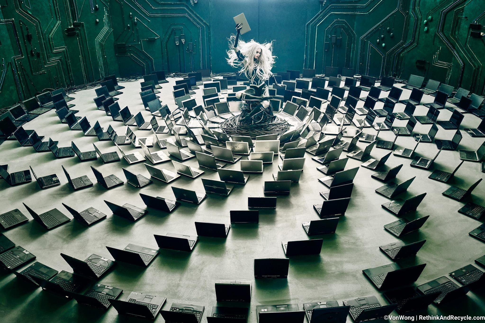

[facebook](https://www.facebook.com/sharer/sharer.php?u=https%3A%2F%2Fwww.natgeo.pt%2Ffotografia%2Fentrevista-a-eduardo-leal-historias-do-fotografo-documental) [twitter](https://twitter.com/share?url=https%3A%2F%2Fwww.natgeo.pt%2Ffotografia%2Fentrevista-a-eduardo-leal-historias-do-fotografo-documental&via=natgeo&text=Entrevista%20a%20Eduardo%20Leal%20-%20Hist%C3%B3rias%20do%20Fot%C3%B3grafo%20Documental) [whatsapp](https://web.whatsapp.com/send?text=https%3A%2F%2Fwww.natgeo.pt%2Ffotografia%2Fentrevista-a-eduardo-leal-historias-do-fotografo-documental) [flipboard](https://share.flipboard.com/bookmarklet/popout?v=2&title=Entrevista%20a%20Eduardo%20Leal%20-%20Hist%C3%B3rias%20do%20Fot%C3%B3grafo%20Documental&url=https%3A%2F%2Fwww.natgeo.pt%2Ffotografia%2Fentrevista-a-eduardo-leal-historias-do-fotografo-documental) [mail](mailto:?subject=NatGeo&body=https%3A%2F%2Fwww.natgeo.pt%2Ffotografia%2Fentrevista-a-eduardo-leal-historias-do-fotografo-documental%20-%20Entrevista%20a%20Eduardo%20Leal%20-%20Hist%C3%B3rias%20do%20Fot%C3%B3grafo%20Documental) [Fotografia](https://www.natgeo.pt/fotografia) 
# Entrevista a Eduardo Leal - Histórias do Fotógrafo Documental 
## A carreia do fotógrafo documental português é marcada por projetos como ‘Revolução Cubana’, ‘A Ascensão das Cholitas’ e ‘Árvores de Plástico’, e já foi distinguida com prémios como Estação Imagem e Sony World Photo Awards. Por [National Geographic](https://www.natgeo.pt/autor/national-geographic) 

Eduardo Leal Fotografia por Sophie Gost 

**[Eduardo Leal](http://www.eduardoleal.co.uk/)** nasceu no Porto, onde se formou em Jornalismo e viveu até aos 23 anos, altura em que saiu do país para aprofundar o seu conhecimento na área da fotografia documental. Foi consultor na Fundação Arpad A. Busson durante cinco anos, onde esteve responsável pela coleção ‘Cuba in Revolution’, e integrou a equipa editorial do livro com o mesmo título. 

Os seus projetos e viagens levaram-no a mais de 40 países. Documentou a Venezuela durante oito anos, cobriu as eleições de Evo Morales e, mais recentemente, concebeu a exposição ‘A Ascenção das _Cholitas_ ’, com o intuito de inspirar outras mulheres. É professor visitante na Universidade de São José, em Macau, onde vive atualmente. Eduardo Leal foi um dos oradores da edição deste ano do **[National Geographic Exodus Aveiro Fest](https://www.natgeo.pt/exodus)** , onde afirmou que “o seu luxo é poder fazer aquilo que faz”, documentar histórias. 

**Aterrou na Venezuela no Momento Certo, Quando os Protestos Começaram a Desenrolar-se. Fotografou o Projeto ‘Árvores de Plástico’ - Premiado pela Sony World Photo Awards, Quando Menos Esperava, Anos Depois de Decidir Fazer Um Projeto nesta Área. Como Procura as Próximas Histórias?** 

Um bocado por intuição. Habitualmente tenho uma lista de histórias que quero fazer. Na altura estava na América do Sul, por isso procurava histórias à cerca dos países da região. Tenho temas que me interessam como, por exemplo, a poluição, a condição da mulher na sociedade e questões políticas. Vou vendo mais ou menos o que se passa nas zonas onde trabalho e procurando temas que me suscitem interesse. Movo-me pela curiosidade e satisfazendo essa curiosidade. E no fundo é assim que me guio. 

A minha lista não para de crescer. Tenho uma lista com temas por país e vou registando as histórias que descubro. Por vezes só fica a ideia no ar… depois vou vendo o que me interessa mais documentar, o que acho prioritário nesse momento. É assim que vou saltando de projeto em projeto, tirando os projetos que surgem inesperadamente. 

**O Fator Sorte Tem Influência?** 

Sim, por exemplo, quando fui para a Venezuela pela primeira vez, foi pela curiosidade que tinha enquanto trabalhava na coleção da ‘Revolução Cubana’. Quando cheguei lá, o Chávez anunciou que estava doente e começou a história do fim do _Chavismo_ . Foi um período em que aconteceu muita coisa e que começou por acaso. 

Há uma história que fiz sobre [jogadores de basquetebol na Bolívia](http://www.eduardoleal.co.uk/bolivian-ball) , que apareceu durante um jantar num restaurante em Potosí. Ao meu lado estavam cinco americanos enormes que não conseguiram entrar na NBA e decidiram mudar de país para conseguirem jogar basquetebol, indo parar à Bolívia. Comecei a fazer-lhes perguntas e dessa conversa de meia hora, enquanto estávamos a comer, surgiu uma oportunidade de fazer uma história sobre eles. 

Há histórias planeadas, como a ‘ [Ascenção das](http://www.eduardoleal.co.uk/cholitas-rise) _[Cholitas](http://www.eduardoleal.co.uk/cholitas-rise) ’_ , que se calhar também foram sorte. Fui documentar as ‘ _Cholitas do Wrestling’_ e não esperava que o tema se desenvolvesse para outro tipo de história. 

Eduardo Leal foi um dos oradores da edição de 2018 do National Geographic Exodus Aveiro Fest. Fotografia por Ricardo Matos Abreu 

**É Cada Vez Mais Perigoso Ser Fotojornalista e o Eduardo já Sofreu isso na Pele, em 2014, na Venezuela. Isso Moldou a Forma como se Posiciona no Terreno e Interage com as Pessoas que Fotografa?** 

Sim, uma história destas marca sempre. Não me considero um herói e a experiência que lá tive marcou-me bastante. A forma de trabalhar no dia seguinte mudou muito, tomei consciência dos riscos. Hoje em dia, nós fotojornalistas, somos cada vez mais um ‘alvo’… porque em alturas de risco e conflito temos de estar à frente, sem estarmos à frente não há fotografias. Além disso, as pessoas têm muito mais consciência do poder da imagem e do que podem fazer com ela. 

Depois de tudo o que me aconteceu, lembro-me de ter de voltar à Venezuela e pensar duas vezes se me ia identificar como jornalista. No entanto, o que aconteceu não alterou a forma como interajo com as pessoas, a menos que seja um tema muito sensível. 

Na América Latina há bastante criminalidade e isso afeta a forma de trabalhar, mas as histórias ainda são possíveis… apenas requerem mais trabalho e cuidado. 

**Que Realidade Não Conflituosa Mais o Chocou?** 

Uma das histórias que mais me chocou foi a ‘ [Copa do Povo](http://www.eduardoleal.co.uk/copa-do-povo) ’ em São Paulo, sobre pessoas que estavam a viver num acampamento com barracas feitas a partir de sacos de plástico, depois de saírem das suas casas devido à inflação gerada pelo mundial de futebol. Muitas dessas pessoas eram de classe média - alguns professores, e saíam de fato e gravata de manhã… ficaram sem casa porque os seus senhorios aumentaram a renda duas ou três vezes e os seus salários não acompanharam essa inflação. 

Desse acampamento conseguia ver-se o estádio do Mineirão, onde ia ser lançado o mundial de futebol. Era curioso as pessoas conseguirem ver o estádio sem beneficiarem dele. Chocou-me bastante por ser muito ingrato e achar que ninguém deve viver nessas condições, por não ser um conflito e poder acontecer a qualquer pessoa. Podia ter-me acontecido a mim. 

**Vivemos numa Era em que se Publicam Diariamente Milhares de Fotografias nas Redes Sociais. Qual é o Papel deste Meio de Comunicação no Fotojornalismo do Século XXI?** 

Com a era digital, a fotografia foi muito democratizada, hoje toda a gente pode tirar fotografias. A imagem começou a perder o seu valor por haver tanta imagem produzida e sermos bombardeados com imagens todos os dias. Vê-se que as pessoas passam as fotografias no Instagram sem olhar, é um _zapping_ de fotografias. É tudo muito efémero e acho que a fotografia perdeu um bocado com isso. 

Mas ao mesmo tempo, num momento em que os media estão em crise e há menos _assignments_ , as redes sociais vieram dar-nos a possibilidade de distribuirmos o trabalho. Quem faz fotojornalismo e fotografia documental aborda temas para os quais quer que as pessoas olhem e reflitam, e as redes sociais vieram dar-nos uma voz maior. 

Habitualmente trabalho com revistas e media nos Estados Unidos e na Europa, e obviamente é muito difícil uma revista dessas chegar a outros continentes. Se calhar, através das redes sociais consigo levar a história e a voz das pessoas a esses sítios… dão-nos a oportunidade de espalhar a mensagem e de chegar a pessoas, que de outra maneira não chegaríamos. 

Eduardo Leal foi um dos oradores da edição de 2018 do National Geographic Exodus Aveiro Fest. Fotografia por Carlos Guiomar 

**Depois de Projetos como ‘ _Afterquake’_ e ‘Copa do Povo’, que Preocupações Leva na Mochila?** 

Se me perguntassem há 10 anos atrás o que queria fazer, diria que queria ser fotógrafo de guerra. Acho que é a primeira coisa que nos vem à cabeça, por ser muito romantizado. E, com o tempo, comecei a perceber que podia contar histórias igualmente importantes, sem precisar de correr tantos riscos. 

Acho que as preocupações que levo na mochila neste momento, são as mesmas, porque os meus interesses começam a ficar muito focados em certos aspetos. As linhas pelas quais guio o meu trabalho são: o género e o papel da mulher na sociedade, a poluição, as questões políticas e o ambiente… e são essas as minhas preocupações. 

Depois tenho outras preocupações inerentes ao trabalho de um fotojornalista e fotógrafo documental, como o período entre _assignments_ e o tempo longe da família e dos amigos. Além das histórias que vou fazer e como as vou fazer… até porque é uma profissão muito isolada, com muito tempo na estrada. 

**Já Afirmou que “o Tempo é Crucial para Desenvolver a Narrativa Certa”. Qual é a sua Opinião Sobre a Instantaneidade das Fotografias de Hoje em Dia?** 

Como já disse, apesar da instantaneidade nos afetar na perda do valor da imagem, ao mesmo tempo não nos afeta porque fazemos histórias diferentes. Eu perco tempo com as histórias. Uma pessoa que tira uma fotografia instantânea, por mais bonita que seja, e até pode ter milhares de _likes_ , não tem profundidade. É muito aprazível ao olho, mas não tem substância por trás disso. 

Não critico as pessoas que tiram fotografias porque por vezes estão a colmatar espaço onde nós não estávamos e isso está a ser documentado…, mas não nos podemos basear só nisso, até porque essas pessoas não têm um código de ética que tenham de seguir. Tiram as fotografias com um telemóvel ou uma câmara e não vão falar com as pessoas para saberem o nome delas e os factos… e com o tempo, essas pessoas não nos estão a tirar o nosso espaço. 

**Há Muitas Histórias por Contar em Portugal?** 

Acho que há imensas. O facto de ter ido para fora muito cedo, leva-me a não fazer tantas histórias em Portugal, mas costumo dizer que há histórias até na nossa rua. Às vezes o problema é, como os ingleses dizem, ‘ _the grass is always greener on the other side_ ’ ('a relva é sempre mais verde do outro lado'). 

Tenho a certeza que se der uma volta ao quarteirão onde a minha mãe vive, no Porto, tenho uma história de uma peixeira que ainda vende peixe na rua... ou o senhor que tem uma mercearia há 70 anos. Isto são histórias que se calhar vão deixar de existir e eram muito interessantes de serem contadas. 

Nós documentamos para mostrar uma problemática e para chamar à atenção, mas também se devem contar histórias como estas para futuras gerações entenderem. Se levares esta história de uma mercearia portuguesa com um homem que anda de lápis atrás da orelha, que aponta tudo num livro à antiga e que sabe todos os itens que tem na loja, a um japonês, ele se calhar fica maluco… e para nós é banal e passa-nos ao lado. 

Há histórias em todo o lado. Se pararmos, respirarmos e olharmos à nossa volta, começamos a vê-las. 

Cartaz da edição de 2018 do National Geographic Exodus Fest. Fotografia por National Geographic | Exodus 

**O que o Inspira?** 

Penso que bebo um pouco de tudo… 

A **literatura** inspira-me muito! Os autores levam-me a imaginar as fotografias que já quero fazer, é quase um esboço... é uma pesquisa e inspiração porque estou a ler e a imaginar a fotografia que faria nesse cenário. 

Por vezes há fotografias que refletem esse tipo de inspiração. As letras de uma **música** , ou o ritmo de uma música mais lenta, levam-me a fotografar de uma maneira mais calma, menos frenética. A música que ouvi antes de fotografar pode conduzir-me a um estado de espírito mais acelerado e levar-me a fotografar de uma forma mais rápida… ou o contrário. 

A **pintura** e a luz na pintura, principalmente a pintura de grandes mestres antigos… **outros fotógrafos** … no fundo, acho que tudo serve de inspiração. Para descobrir as histórias faço a pesquisa em jornais, revistas e livros, mas para ir fotografar consigo beber um bocadinho em todo o lado. 

**Tem Algum Projeto de Sonho?** 

Acho que felizmente estou a fazê-los. Os projetos que descubro que quero fazer, estou a fazê-los. Se calhar há um ou outro que agora não tenho na América do Sul, e tinha o gosto de fazer lá, mas quando estou a fazer os projetos, estou a realizar os meus sonhos. 

Se calhar há um projeto megalómano que gostava de fazer e para o qual é difícil obter financiamento… adorava fazer um projeto gigantesco dedicado à Amazónia, mas era preciso um grande financiamento e muitos anos para um projeto assim. 

Por vezes vejo projetos muito bons, mas que já estão feitos e aos quais não vou acrescentar nada. Os meus projetos de sonho estou a vivê-los ano a ano. As histórias que estou a fazer são as que quero fazer neste momento. 

O bom das minhas histórias é serem muito terrenas. As _Cholitas,_ por exemplo, não são de difícil acesso, não são impossíveis. Não tenho o sonho de ir fazer uma história na Antártida, que logisticamente é muito complicado. As minhas histórias são quase do dia-a-dia, são muito acessíveis... eu posso produzi-las. 

**Que Qualidades Não Podem Faltar a Um Fotojornalista?** 

Para mim, uma delas é paciência. Precisamos de muita paciência para procurar a luz, para ter acesso às coisas. No início, como viajante, queria fazer histórias rapidamente… fazer uma a seguir à outra, quase como virar bifes. 

Uma coisa que por vezes critico muito, é a exploração do sofrimento das pessoas… a procura do sofrimento na história. Por vezes tem de se fazer isso, mas é possível fazê-lo respeitando o sofrimento da pessoa. Podemos mostrar o sofrimento da pessoa sem baba e ranho, de uma maneira mais respeitosa. É muito importante essa empatia e humanidade num fotojornalista, por lidarmos com questões muito importantes… até porque corremos o risco de fechar a porta a outra pessoa que vá fazer a mesma história. 

Se queremos apelar à humanidade pelos nossos trabalhos, temos de ser humanos, abertos, respeitosos e entender que as pessoas por vezes não têm tempo para nós, porque nos estão a dar acesso à vida e tempo delas. Temos de entender isso e ser pacientes, não só com a luz e o projeto, mas com as pessoas. 

### + artigos  [Fotografia](https://www.natgeo.pt/fotografia) 
## [Timothy Allen – Um Zoólogo Apaixonado por Povos Indígenas](https://www.natgeo.pt/fotografia/2018/08/timothy-allen-um-zoologo-apaixonado-por-povos-indigenas)  [Fotografia](https://www.natgeo.pt/fotografia) 
## [Benjamin Von Wong – de Engenheiro de Minas a Fotógrafo](https://www.natgeo.pt/fotografia/benjamin-von-wong-de-engenheiro-de-minas-a-fotografo)  [Fotografia](https://www.natgeo.pt/fotografia) 
## [Matthieu Paley Vem Diretamente de Uma Caravana em Portugal para o Exodus](https://www.natgeo.pt/fotografia/2018/09/matthieu-paley-vem-diretamente-de-uma-caravana-em-portugal-para-o-exodus) 

