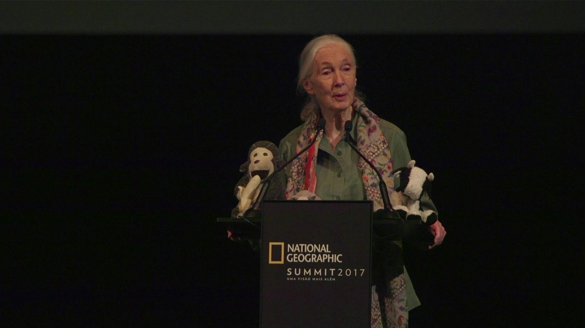
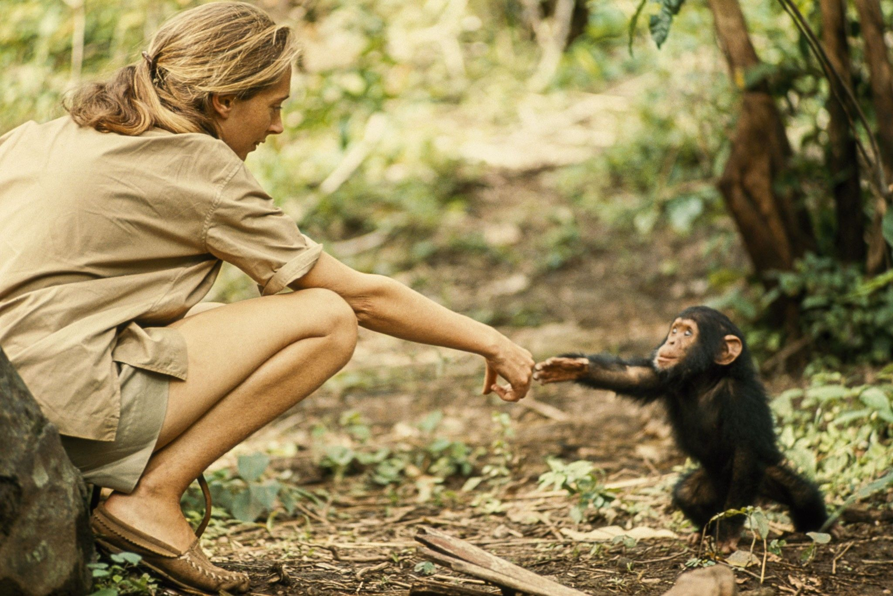
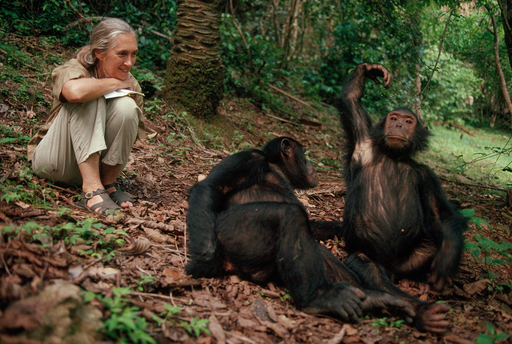
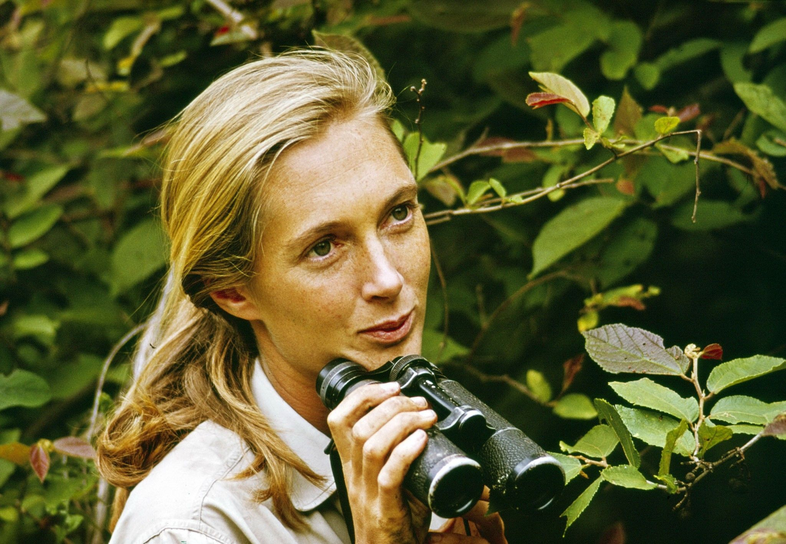

[facebook](https://www.facebook.com/sharer/sharer.php?u=https%3A%2F%2Fwww.natgeo.pt%2Fhistoria%2F2019%2F04%2Fjane-goodall-celebra-85-anos-a-vida-da-mulher-que-revolucionou-o-estudo-dos-chimpanzes-selvagens) [twitter](https://twitter.com/share?url=https%3A%2F%2Fwww.natgeo.pt%2Fhistoria%2F2019%2F04%2Fjane-goodall-celebra-85-anos-a-vida-da-mulher-que-revolucionou-o-estudo-dos-chimpanzes-selvagens&via=natgeo&text=Jane%20Goodall%20Celebra%2085%20anos%20%E2%80%93%20a%20Vida%20da%20Mulher%20que%20Revolucionou%20o%20Estudo%20dos%20Chimpanz%C3%A9s%20Selvagens) [whatsapp](https://web.whatsapp.com/send?text=https%3A%2F%2Fwww.natgeo.pt%2Fhistoria%2F2019%2F04%2Fjane-goodall-celebra-85-anos-a-vida-da-mulher-que-revolucionou-o-estudo-dos-chimpanzes-selvagens) [flipboard](https://share.flipboard.com/bookmarklet/popout?v=2&title=Jane%20Goodall%20Celebra%2085%20anos%20%E2%80%93%20a%20Vida%20da%20Mulher%20que%20Revolucionou%20o%20Estudo%20dos%20Chimpanz%C3%A9s%20Selvagens&url=https%3A%2F%2Fwww.natgeo.pt%2Fhistoria%2F2019%2F04%2Fjane-goodall-celebra-85-anos-a-vida-da-mulher-que-revolucionou-o-estudo-dos-chimpanzes-selvagens) [mail](mailto:?subject=NatGeo&body=https%3A%2F%2Fwww.natgeo.pt%2Fhistoria%2F2019%2F04%2Fjane-goodall-celebra-85-anos-a-vida-da-mulher-que-revolucionou-o-estudo-dos-chimpanzes-selvagens%20-%20Jane%20Goodall%20Celebra%2085%20anos%20%E2%80%93%20a%20Vida%20da%20Mulher%20que%20Revolucionou%20o%20Estudo%20dos%20Chimpanz%C3%A9s%20Selvagens) [História](https://www.natgeo.pt/historia) 
# Jane Goodall Celebra 85 anos – a Vida da Mulher que Revolucionou o Estudo dos Chimpanzés Selvagens 
## A maior especialista mundial em chimpanzés celebra 85 anos e uma carreira de 59 anos a estudar os seus hábitos. Por [National Geographic](https://www.natgeo.pt/autor/national-geographic) Publicado 2/04/2019, 15:09 

Jane Goodall na primeira edição do National Geographic Summit, em Lisboa Com apenas 26 anos, **Jane Goodall** parte numa viagem de Inglaterra para a Tanzânia e aventura-se no mundo dos chimpanzés selvagens, mundo esse até então pouco conhecido. Consigo levava apenas um caderno, uns binóculos e uma imensa curiosidade. 

Aos 85 anos, a **aventura que iniciou em 1960** , quando ainda era jovem, tornou-a na maior especialista a nível mundial em chimpanzés. Comemora o seu aniversário e, em simultâneo, 59 anos de carreira. 

A incerteza de há uns anos é, atualmente, a mais extraordinária marca no estudo dos hábitos destes animais. Jane Goodall percorre o mundo para falar sobre os chimpanzés e sobre as ameaças e crises ambientais a que estes animais estão sujeitos, apelando ao bom senso e consciencialização para os comportamentos da população em relação ao nosso planeta. 

**JANE NO MUNDO DOS CHIMPANZÉS** 

Durante 59 anos, Valerie Jane Morris Goodall, tem sido uma primatóloga, etóloga, cientista e antropóloga. Dedicou a sua carreira ao estudo da vida social e familiar dos chimpanzés em Gombe, na Tanzânia. 

Os seus estudos contribuíram para o desenvolvimento dos conhecimentos sobre a aprendizagem social, a capacidade de raciocínio e a cultura destes animais. 

Quando chegou à Tanzânia, começou por observar a alimentação dos chimpanzés e verificou que o que se pensava sobre a mesma estava errada. Ao contrário do que se pensava na altura, estes animais não eram vegetarianos. Aqui, Jane pôde documentar a caça de um porco do mato africano e de macaco Piliocolobus, que serviram de alimento para o grupo de chimpanzés. 

Descobriu, igualmente, que estes conseguiam produzir e usar ferramentas que os humanos usavam. 

Em 1975, Jane presenciou atos de canibalismo entre os primatas do Parque Nacional do Gombe, para se alimentarem. 

Estas foram algumas das mais importantes descobertas de Jane Goodall no mundo dos chimpanzés, que alteraram completamente a forma como a humanidade olhava para eles. 

Um jovem chimpanzé chamado Flint a interagir com a etóloga Jane Goodall. Flint foi o primeiro chimpanzé a nascer em Gombe, após a chegada de Jane. 
Fotografia por Hugo Van Lawick , Nat Geo Image Collection **DAS PESQUISAS AO ATIVISMO** 

Para além do contributo que prestou no mundo dos chimpanzés selvagens, Jane pertence ao grupo “Humane Society of the United States”, é mensageira da paz das Nações Unidas, desde 2004, e fundou o “The Jane Goodall Institute”. 

Este instituto, fundado em 1977, tem como objetivo melhorar as vidas de pessoas e animais, contribuir para um ambiente mais sustentável e consciente e dar continuidade às pesquisas sobre os chimpanzés. 

Em 1991, Jane Goodall inaugurou a Roots & Shoots, uma instituição que motiva os jovens da Tanzânia a criar soluções próprias para combater as problemáticas ambientais que afetam o país. 

Em abril comemora o seu 85.º aniversário e 59 anos de carreira. Uma vida repleta de aventuras e contribuições para o estudo dos chimpanzés e para o planeta em geral. 

### + SOBRE JANE GOODALL  [História](https://www.natgeo.pt/historia) 
## [Jane Goodall: Como Uma Mulher Redefiniu a Humanidade](https://www.natgeo.pt/historia/2019/01/jane-goodall-como-uma-mulher-redefiniu-a-humanidade)  [Animais](https://www.natgeo.pt/animais) 
## [50 Anos Depois, O Estudo dos Chimpanzés Feito Por Jane Goodall Ainda Proporciona Novas Descobertas](https://www.natgeo.pt/animais/2017/11/50-anos-depois-o-estudo-dos-chimpanzes-feito-por-jane-goodall-ainda-proporciona-novas-descobertas)  [História](https://www.natgeo.pt/historia) 
## [Conheça as Mulheres Difíceis que Escreveram as Suas Próprias Regras](https://www.natgeo.pt/historia/2018/05/conheca-as-mulheres-dificeis-que-escreveram-as-suas-proprias-regras) 

