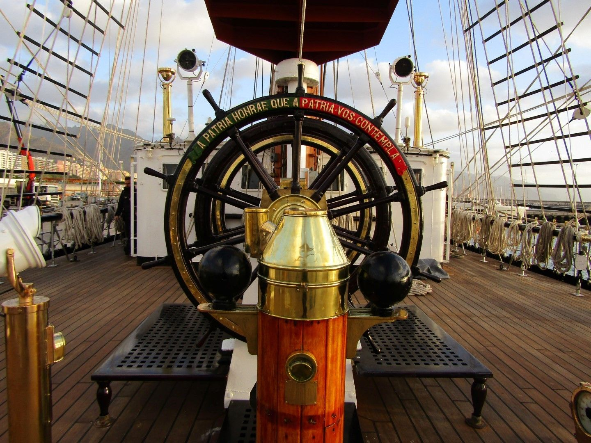

[facebook](https://www.facebook.com/sharer/sharer.php?u=https%3A%2F%2Fwww.natgeo.pt%2Fhistoria%2F2020%2F02%2Fnavio-escola-sagres-reedita-viagem-de-fernao-de-magalhaes) [twitter](https://twitter.com/share?url=https%3A%2F%2Fwww.natgeo.pt%2Fhistoria%2F2020%2F02%2Fnavio-escola-sagres-reedita-viagem-de-fernao-de-magalhaes&via=natgeo&text=Navio-Escola%20Sagres%20Reedita%20a%20Viagem%20de%20Fern%C3%A3o%20de%20Magalh%C3%A3es) [whatsapp](https://web.whatsapp.com/send?text=https%3A%2F%2Fwww.natgeo.pt%2Fhistoria%2F2020%2F02%2Fnavio-escola-sagres-reedita-viagem-de-fernao-de-magalhaes) [flipboard](https://share.flipboard.com/bookmarklet/popout?v=2&title=Navio-Escola%20Sagres%20Reedita%20a%20Viagem%20de%20Fern%C3%A3o%20de%20Magalh%C3%A3es&url=https%3A%2F%2Fwww.natgeo.pt%2Fhistoria%2F2020%2F02%2Fnavio-escola-sagres-reedita-viagem-de-fernao-de-magalhaes) [mail](mailto:?subject=NatGeo&body=https%3A%2F%2Fwww.natgeo.pt%2Fhistoria%2F2020%2F02%2Fnavio-escola-sagres-reedita-viagem-de-fernao-de-magalhaes%20-%20Navio-Escola%20Sagres%20Reedita%20a%20Viagem%20de%20Fern%C3%A3o%20de%20Magalh%C3%A3es) [História](https://www.natgeo.pt/historia) 
# Navio-Escola Sagres Reedita a Viagem de Fernão de Magalhães 
## Fernão de Magalhães iniciou aquela que viria a ser a primeira circum-navegação do mundo no séc. XVI. Quinhentos anos depois, o Navio-Escola Sagres dá a mesma volta ao mundo. Por [National Geographic](https://www.natgeo.pt/autor/national-geographic) Publicado 20/02/2020, 14:57 

O Navio-Escola Sagres partiu no dia 5 de janeiro de Lisboa para a viagem de circum-navegação. Fotografia por Marinha PortuguESA **A 20 de setembro de 1519** , a armada de Fernão de Magalhães partia para uma longa viagem, com efeitos históricos para a humanidade – a primeira circum-navegação do mundo. As cinco naus comandadas por Magalhães partiram do porto de Sanlúcar de Barrameda, próximo de Cádiz, ao serviço do rei castelhano D. Carlos I. Pretendia-se alcançar por ocidente as ilhas das Especiarias, evitando atravessar os territórios atribuídos a Portugal pelo Tratado de Tordesilhas. 

As paragens da viagem culminaram muitas vezes em destinos fatais para a armada. Magalhães acaba por morrer em combate contra a tribo de Lapu Lapu, na batalha de Mactan, travada nas Filipinas a 27 de abril de 1521. O trajeto continuou e a viagem viria a ser terminada pelo espanhol Sebastian Elcano, ao comando da nau Victoria - a única que voltaria ao porto de Sanlúcar de Barrameda. A 6 de setembro de 1522, os poucos sobreviventes da armada que tinha partido quase três anos antes, regressam ao cais espanhol após terminarem uma rota com cerca de 78 mil quilómetros – a primeira volta ao mundo. 

Quinhentos anos depois, no dia 5 de janeiro, cadetes da Marinha Portuguesa partiram de Lisboa a bordo do Navio-Escola Sagres, para comemorar e recordar o feito histórico alcançado pelo português Fernão de Magalhães. Será a maior viagem que o navio já fez, ao longo de 372 dias, percorrendo 19 países e visitando 12 das cidades magalhânicas. A expedição leva a ciência a bordo através de projetos como o CIRCULARES, um projeto multidisciplinar de ciência cidadã desenvolvido por investigadores da Faculdade de Ciências da Universidade de Lisboa. 

Cinco séculos separam as duas viagens. Uma muito penosa, marcada por tumultos, enfermidades e escassez de alimentos a bordo, e disputas, aprisionamentos e batalhas em terra. Outra pretende registar as alterações marinhas e recolher dados climatéricos, retratando a biodiversidade e analisando os poluentes encontrados ao longo da rota. 

A primeira viagem de circum-navegação do mundo assinalou a notável descoberta de novas espécies de animais e plantas, um dos aspetos científicos mais marcantes da expedição. Hoje, os desafios científicos são outros. Que espécies encontrarão os tripulantes do Navio-Escola Sagres? Que alterações sofreu o ecossistema marinho? 

As fotografias das espécies encontradas ficarão disponíveis na plataforma [Biodiversity4All](https://www.biodiversity4all.org/observations) . A informação reunida nesta expedição permitirá comparar, com a devida perspetiva histórica, as viagens épicas da armada de Fernão de Magalhães e dos futuros membros da Marinha Portuguesa. 

Quinhentos anos depois da viagem de Magalhães, muitos territórios mantêm os nomes atribuídos por quem os assinalou no mapa. O que terá mudado no mundo entre as duas viagens? 

[source](https://www.natgeo.pt/historia/2020/02/navio-escola-sagres-reedita-viagem-de-fernao-de-magalhaes)