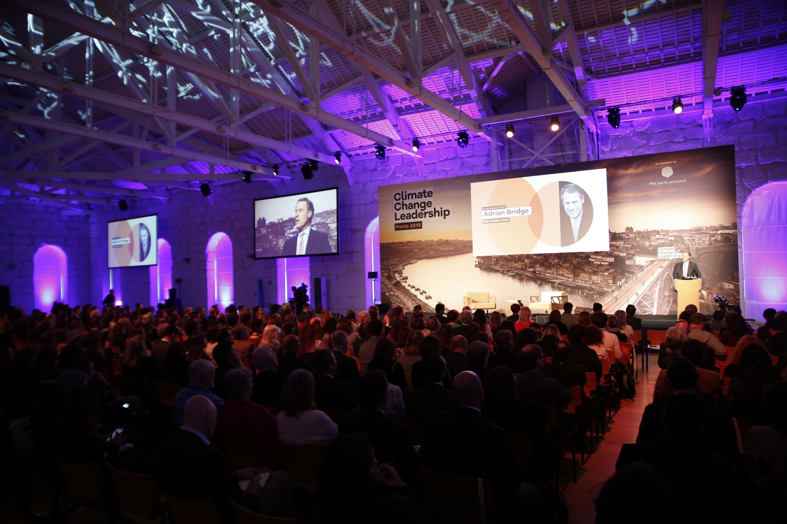

[facebook](https://www.facebook.com/sharer/sharer.php?u=https%3A%2F%2Fwww.natgeo.pt%2Fmeio-ambiente%2F2019%2F03%2Fcinco-historias-otimistas-na-climate-change-leadership) [twitter](https://twitter.com/share?url=https%3A%2F%2Fwww.natgeo.pt%2Fmeio-ambiente%2F2019%2F03%2Fcinco-historias-otimistas-na-climate-change-leadership&via=natgeo&text=Cinco%20Hist%C3%B3rias%20Otimistas%20na%20Climate%20Change%20Leadership) [whatsapp](https://web.whatsapp.com/send?text=https%3A%2F%2Fwww.natgeo.pt%2Fmeio-ambiente%2F2019%2F03%2Fcinco-historias-otimistas-na-climate-change-leadership) [flipboard](https://share.flipboard.com/bookmarklet/popout?v=2&title=Cinco%20Hist%C3%B3rias%20Otimistas%20na%20Climate%20Change%20Leadership&url=https%3A%2F%2Fwww.natgeo.pt%2Fmeio-ambiente%2F2019%2F03%2Fcinco-historias-otimistas-na-climate-change-leadership) [mail](mailto:?subject=NatGeo&body=https%3A%2F%2Fwww.natgeo.pt%2Fmeio-ambiente%2F2019%2F03%2Fcinco-historias-otimistas-na-climate-change-leadership%20-%20Cinco%20Hist%C3%B3rias%20Otimistas%20na%20Climate%20Change%20Leadership) 
# Cinco Histórias Otimistas na Climate Change Leadership 
## O Porto Summit 2019, integrado na cimeira Climate Change Leadership, levou ao Porto um prestigiado painel de oradores liderado por Al Gore. Por [National Geographic](https://www.natgeo.pt/autor/national-geographic) Publicado 9/03/2019, 17:32 

O terceiro dia da [Climate Change Leadership](https://www.natgeo.pt/meio-ambiente/2019/01/climate-change-leadership-regressa-ao-porto-com-solucoes) levou ao palco testemunhos importantes da indústria vinícola e culminou com a segunda edição do **Porto Summit** , que contou com a presença de mais de 850 pessoas de 30 nacionalidades. 

Adrian Bridge, diretor-geral da Taylor’s e organizador do evento, abriu a cerimónia recordando que “ _há muitas soluções, apenas temos de saber quais são as melhores_ ”, porque “ _todos podemos fazer mais amanhã do que fizemos hoje_ ”. 

Cinco histórias de cinco oradores com projetos de intervenção completamente diferentes, reforçaram a urgência de agirmos e tomarmos decisões em prol de um planeta mais saudável e seguro. 

**Afroz Shah** , distinguido pela ONU com o prémio de “Champion of the Earth” pelo seu trabalho e compromisso naquela que foi considerada a maior limpeza de praia do mundo, deixou uma mensagem importante ao público – “ _se virmos algo que deva ser feito, devemos fazê-lo_ ”. O advogado e ativista acrescentou que a “ _terra deve ser um melhor lugar do que foi_ ”. 

**Kaj Török** , diretor de sustentabilidade da Max Burgers - uma cadeia de restaurantes mundial que criou os primeiros hambúrgueres com pegada ecológica positiva, partilhou os desafios e sucessos do primeiro menu mundial climaticamente positivo. Kaj Török afirmou que “ _é demasiado tarde para apenas reduzirmos as emissões de dióxido de carbono_ ” e que todos temos de contribuir para a estabilização do clima, incentivando os participantes a imaginarem um dia em que vestem um robe carbonicamente positivo, lavam os dentes com uma escova carbonicamente positiva e tomam um pequeno almoço carbonicamente positivo. 

**Ester Asin** , diretora-geral da WWF para a Europa, falou da sua experiência na liderança de projetos globais de preservação ambiental. Ester Asin disse que “ _agora é o tempo para agirmos, agora ou nunca_ ”, acrescentando que a indústria, os investidores e as autoridades locais já estão a fazer mudanças. A oradora recordou que os cinco anos mais quentes do planeta aconteceram nos últimos cinco anos. 

**João Matos Fernandes** , Ministro do Ambiente e da Transição Energética, apresentou o roteiro português para a neutralidade carbónica e reforçou o compromisso do país em reduzir a pegada ecológica a zero até 2050, através da valorização do território e promoção de uma economia circular. 

**Al Gore** , Prémio Nobel da Paz em 2007 e Ex-Vice Presidente dos E.U.A., inspirou o público através de um discurso entusiasta no qual apelou à cooperação internacional. O líder mundial congratulou o país pelo exemplo em áreas como a energia solar e eólica, afirmando que a “ _liderança assumida em Portugal é um exemplo para todo o mundo_ ”. Al Gore frisou que “ _todas as ações que tomarmos são importantes e utilizar o Porto Protocol como plataforma de partilha de soluções vai fazer a diferença_ ”. 

A economia global está a adaptar-se a um conjunto de alterações, em que todas as indústrias conseguem melhorar. O planeta não tem tempo a perder. 

[source](https://www.natgeo.pt/meio-ambiente/2019/03/cinco-historias-otimistas-na-climate-change-leadership)