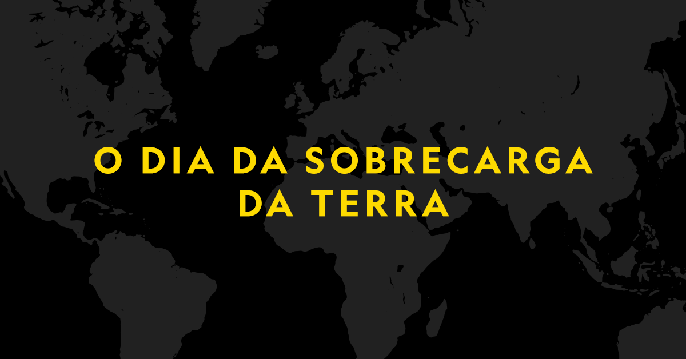

[facebook](https://www.facebook.com/sharer/sharer.php?u=https%3A%2F%2Fwww.natgeo.pt%2Fmeio-ambiente%2F2018%2F08%2Fo-dia-da-sobrecarga-da-terra-1-de-agosto-de-2018) [twitter](https://twitter.com/share?url=https%3A%2F%2Fwww.natgeo.pt%2Fmeio-ambiente%2F2018%2F08%2Fo-dia-da-sobrecarga-da-terra-1-de-agosto-de-2018&via=natgeo&text=O%20Dia%20da%20Sobrecarga%20da%20Terra%3A%201%20de%20Agosto%20de%202018) [whatsapp](https://web.whatsapp.com/send?text=https%3A%2F%2Fwww.natgeo.pt%2Fmeio-ambiente%2F2018%2F08%2Fo-dia-da-sobrecarga-da-terra-1-de-agosto-de-2018) [flipboard](https://share.flipboard.com/bookmarklet/popout?v=2&title=O%20Dia%20da%20Sobrecarga%20da%20Terra%3A%201%20de%20Agosto%20de%202018&url=https%3A%2F%2Fwww.natgeo.pt%2Fmeio-ambiente%2F2018%2F08%2Fo-dia-da-sobrecarga-da-terra-1-de-agosto-de-2018) [mail](mailto:?subject=NatGeo&body=https%3A%2F%2Fwww.natgeo.pt%2Fmeio-ambiente%2F2018%2F08%2Fo-dia-da-sobrecarga-da-terra-1-de-agosto-de-2018%20-%20O%20Dia%20da%20Sobrecarga%20da%20Terra%3A%201%20de%20Agosto%20de%202018) 
# O Dia da Sobrecarga da Terra: 1 de Agosto de 2018 Por [National Geographic](https://www.natgeo.pt/autor/national-geographic) Publicado 1/08/2018, 16:52 

O fim dos recursos naturais é certo. A 1 de agosto de 2018, assinala-se o dia em que a demanda anual da humanidade por recursos naturais ultrapassa o que o planeta consegue reconstituir no ano corrente. Esta data é o marco de sobrecarga do consumo de recursos naturais, que tem lugar no dia anual mais cedo de sempre, antecipando-se um dia face à data de 2017. 

A disponibilidade de recursos naturais, como a água, o solo, a energia, o ar limpo e os alimentos, não nos preocupa no dia-a-dia, mas deveria. Este será um tema que continuará a ser discutido nos próximos meses, pois a data que se marca este ano a 1 de agosto, será antecipada anualmente, até estarmos a viver sem dar lugar à renovação dos recursos naturais que consumimos. 

A estes dados acresce o facto da população estar em constante expansão e a tendência é o consumo alimentar e de recursos naturais aumentar drasticamente até serem encontradas soluções ‘artificiais’ ou de outra natureza. 

Esta data é sinalizada, desde o ano de 1986, como o Dia da Sobrecarga da Terra e tem vindo a ser antecipada ano após ano. O dia é estimado através de um cálculo dos consumos de recursos de cada país, sendo que alguns países ainda não atingiram o limite de regeneração anual e outros já o ultrapassaram na passada primavera. 

O que podemos fazer para ajudar a desacelerar este ritmo alucinante de consumo natural? Alguns defendem que passa por consumir menos carne, consumindo menos combustíveis, evitando o desperdício alimentar e limitando a utilização dos recursos naturais. 

Se mantivermos os números de hoje e a população mundial continuar a aumentar, é altamente provável que até 2050 esgotemos as reservas de minerais como Prata, Cobre, Urânio, Ouro e Zinco. A estes minerais segue-se o petróleo e o gás natural. 

Se nada for alterado, em 2019, o Planeta Terra vai esgotar a sua regeneração natural mais cedo que este ano, e assim continuará. Já consumimos todos os recursos disponíveis para 2018 e, por agora, vivemos de 1 de agosto a 31 de dezembro de 2018, ‘a crédito’. 

