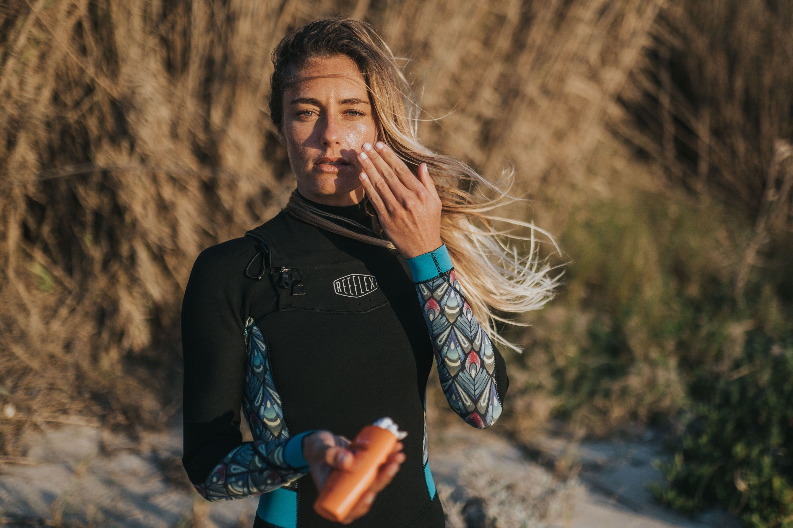
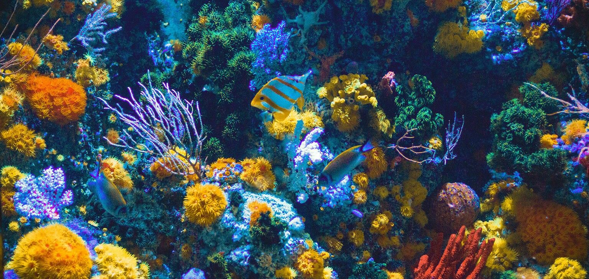
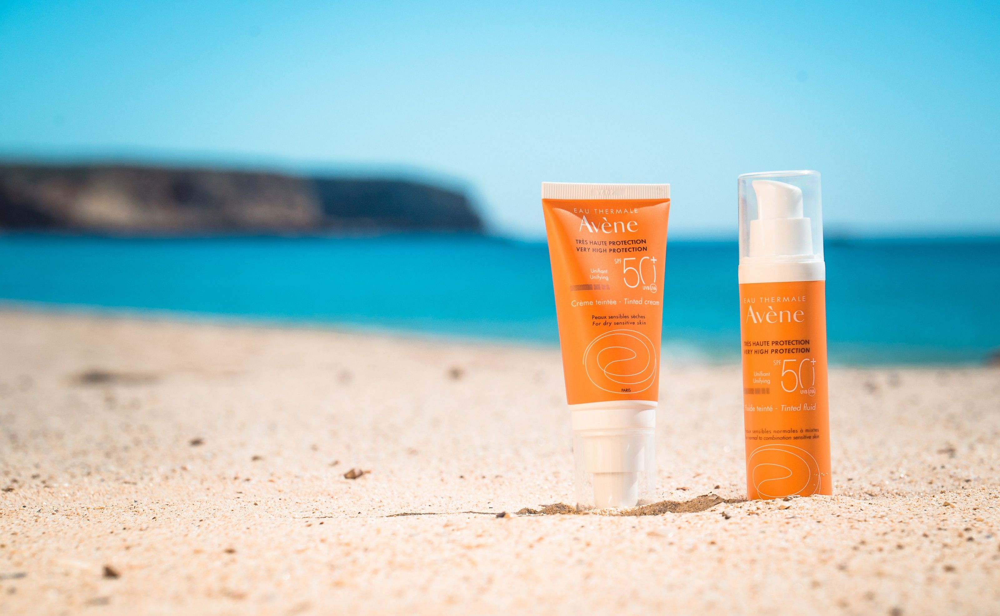

[facebook](https://www.facebook.com/sharer/sharer.php?u=https%3A%2F%2Fwww.natgeo.pt%2Fmeio-ambiente%2F2019%2F05%2Fprotetor-solar-um-grande-poluidor-dos-oceanos) [twitter](https://twitter.com/share?url=https%3A%2F%2Fwww.natgeo.pt%2Fmeio-ambiente%2F2019%2F05%2Fprotetor-solar-um-grande-poluidor-dos-oceanos&via=natgeo&text=Protetor%20Solar%3A%20Um%20Grande%20Poluidor%20dos%20Oceanos) [whatsapp](https://web.whatsapp.com/send?text=https%3A%2F%2Fwww.natgeo.pt%2Fmeio-ambiente%2F2019%2F05%2Fprotetor-solar-um-grande-poluidor-dos-oceanos) [flipboard](https://share.flipboard.com/bookmarklet/popout?v=2&title=Protetor%20Solar%3A%20Um%20Grande%20Poluidor%20dos%20Oceanos&url=https%3A%2F%2Fwww.natgeo.pt%2Fmeio-ambiente%2F2019%2F05%2Fprotetor-solar-um-grande-poluidor-dos-oceanos) [mail](mailto:?subject=NatGeo&body=https%3A%2F%2Fwww.natgeo.pt%2Fmeio-ambiente%2F2019%2F05%2Fprotetor-solar-um-grande-poluidor-dos-oceanos%20-%20Protetor%20Solar%3A%20Um%20Grande%20Poluidor%20dos%20Oceanos) CONTEÚDO PATROCINADO 

# Protetor Solar: Um Grande Poluidor dos Oceanos 
## A maioria dos produtos solares contem componentes prejudiciais para a saúde humana e ambiental, causando impactos negativos na vitalidade dos oceanos, fonte de 70% do oxigénio que respiramos. Por [Filipa Coutinho](https://www.natgeo.pt/autor/filipa-coutinho) Publicado 6/05/2019, 10:05 

Joana Schenker, a primeira atleta portuguesa a sagrar-se campeã mundial de bodyboard em 2017, é uma das vozes da proteção dos oceanos e embaixadora da marca Fotografia por Eau Thermale Avène 

Muitas pessoas desconhecem que além da poluição marinha e do aumento da temperatura da água, os protetores solares são um dos principais poluidores dos oceanos. Os ingredientes químicos incorporados na composição da maioria dos protetores solares contaminam a água e agridem os biossistemas marinhos. 

Isto significa que quando está no mar com proteção solar não-biodegradável na pele, liberta matérias químicas prejudiciais para a vida marinha. E se não der um mergulho, as substâncias são libertadas no sistema de tratamento de águas durante o duche, perfazendo as **14 mil toneladas de protetor solar que vão parar aos oceanos anualmente** . 

Os protetores solares possuem tipicamente até 20 compostos químicos. Um dos componentes frequentemente utilizados é a oxibenzona, [presente em mais de 3.500 produtos de proteção solar](https://link.springer.com/article/10.1007/s00244-015-0227-7) , que atua como bloqueadora dos raios ultravioletas. Para cumprir o efeito de barreira, a oxibenzona tem uma elevada capacidade de penetração nas camadas mais profundas da pele, levando a que parte da substância se mantenha no organismo após a aplicação. 

Alguns estudos científicos têm sugerido que a oxibenzona provoca [danos celulares](http://www.faculty.ucr.edu/~christob/Sunscreen_enhancement.pdf) e desequilíbrios hormonais, acumulando riscos para a saúde humana. Este cenário é especialmente preocupante tendo em conta que já foram encontrados químicos de protetores solares em amostras de leite materno, expondo fetos e recém-nascidos a estas substâncias. 

Estima-se que 75% dos recifes de corais se encontram ameaçados pela atividade humana Fotografia por Eau Thermale Avène 

**IMPACTO NOS RECIFES DE CORAIS** 

Os corais são ecossistemas de biodiversidade, capazes de acolher 25% a 50% das espécies marinhas e desempenham um papel fundamental na proteção contra a erosão dos solos e na diminuição dos danos causados por furacões e tsunamis. 

Contudo, cerca de 75% dos recifes de corais encontram-se ameaçados pela atividade humana e as substâncias tóxicas utilizadas nos protetores solares, ao promoverem infeções virais, são um dos grandes contribuidores. Essas matérias químicas têm impacto na reprodução, desenvolvimento e ADN dos corais, culminando no [processo de branqueamento](https://www.ncbi.nlm.nih.gov/pmc/articles/PMC2291018/#b22-ehp0116-000441) – um fenómeno semelhante ao efeito da lixívia em roupa colorida que provoca deformações morfológicas enormes. 

Estima-se que 30% dos recifes de corais tenham sido irreversivelmente perdidos nos últimos 30 anos e, se o ritmo de aquecimento do planeta se mantiver igual, **90% dos recifes irá desaparecer até 2050** . Se os perdermos, ficamos sem um ecossistema vital que afetará 500 milhões de pessoas, dependentes dos recifes de corais para proteção costeira, alimentação e rendimento. 

**PROTEÇÃO SOLAR CONSCIENTE** 

Segundo Craig Downs, diretor executivo do Laboratório Ambiental Haereticus - uma organização científica sem fins lucrativos, os químicos dos protetores solares “ _causam mais danos aos recifes de corais do que as alterações climáticas_ ”. 

Até ser implementada regulamentação que proíba a comercialização de protetores solares que contenham oxibenzona e outros componentes semelhantes, a escolha recai no consumidor. Ao evitar protetores solares com estes elementos, está a contribuir para a proteção do meio marinho e redução dos danos causados aos recifes de corais. 

Ao escolher um produto solar, saiba que pode optar por uma alternativa sem substâncias químicas nocivas, mais saudável para si e para os oceanos. Graças a uma seleção rigorosa de ingredientes, os protetores solares Eau Thermale Avène **[SKIN PROTECT OCEAN RESPECT](https://www.eau-thermale-avene.pt/skinprotect-oceanrespect)** são uma escolha segura. 

Os protetores solares Eau Thermale Avène SKIN PROTECT OCEAN RESPECT não possuem silicones nem filtros hidrossolúveis, minimizando o impacto da sua utilização no meio marinho Fotografia por Eau Thermale Avène 

Os protetores solares da gama cor-de-laranja desta marca são desenvolvidos com uma menor quantidade de filtros e componentes que favorecem a biodegradabilidade da fórmula, minimizando o impacto no meio marinho. Sem silicones as fórmulas tornam-se mais biodegradáveis, e sem filtros hidrossolúveis são mais difíceis de assimilar por organismos marinhos, limitando os danos ambientais causados pela sua utilização. 

Eau Thermale Avène assumiu o compromisso de diminuir a sua pegada ecológica e já reduziu o consumo de água em 40%, o uso de eletricidade em 27% e as emissões de Dióxido de Carbono em menos 700 toneladas. A marca recupera agora mais de 90% de resíduos, restringindo o seu desperdício. 

Publicidade: O seu vídeo começa em ${TimeInfo.currentTime:asRemaining:asNumber} ${TimeInfo.units:segundos:segundo}

${TimeInfo.currentTime:asHMS} 

-------- 
${TimeInfo.currentTime:asHMS} / ${TimeInfo.duration:asHMS} 
-------- 

Skin Protect Ocean Respect 

A par disso, apoia o [projeto Pejarakan](https://www.purprojet.com/project/pejarakan/) do PUR PROJECT, que tem a missão de regenerar o ecossistema marinho na Indonésia com a ajuda das comunidades locais. Este projeto ajuda a criar e restaurar recifes de corais e desenvolve uma aquacultura sustentável de corais. Em virtude deste trabalho com o Pur Project na construção de um recife artificial com transplantação de fragmentos de corais ao largo da ilha de Bali, **já foram salvos ou implantados mais de 2.000 corais** . 

Ao proteger a sua pele de forma consciente, protege os oceanos. Na próxima vez que escolher um protetor solar, lembre-se da sua pele, lembre-se do oceano. 

Este conteúdo é-lhe trazido pelo nosso parceiro. Não reflete necessariamente a visão da National Geographic ou da sua equipa editorial. 

[source](https://www.natgeo.pt/meio-ambiente/2019/05/protetor-solar-um-grande-poluidor-dos-oceanos)