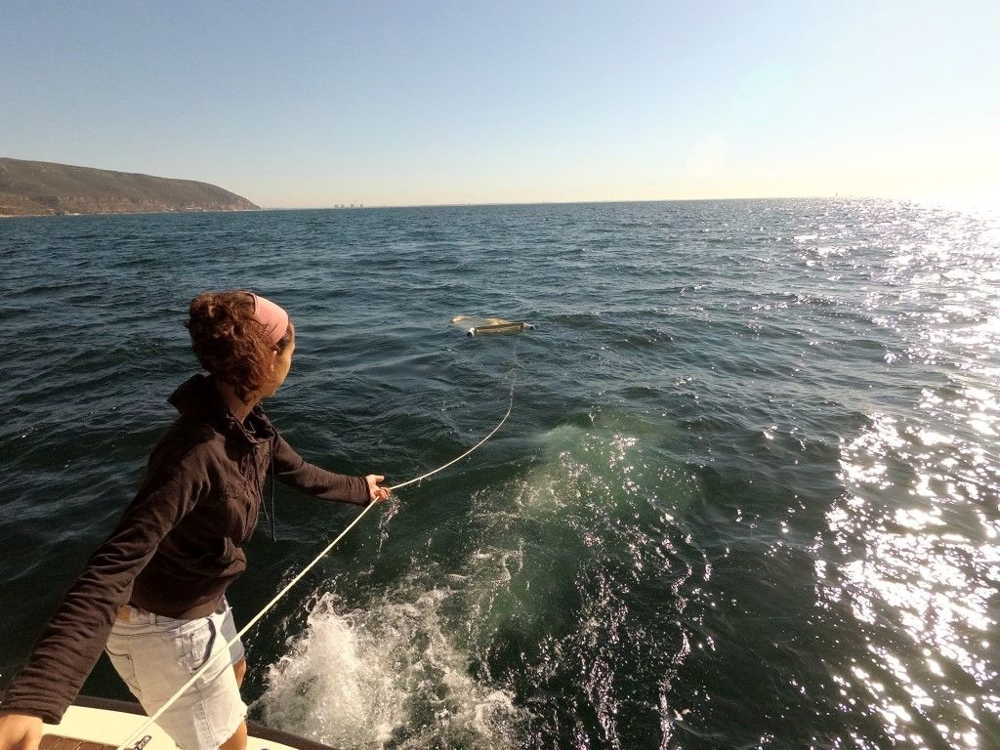
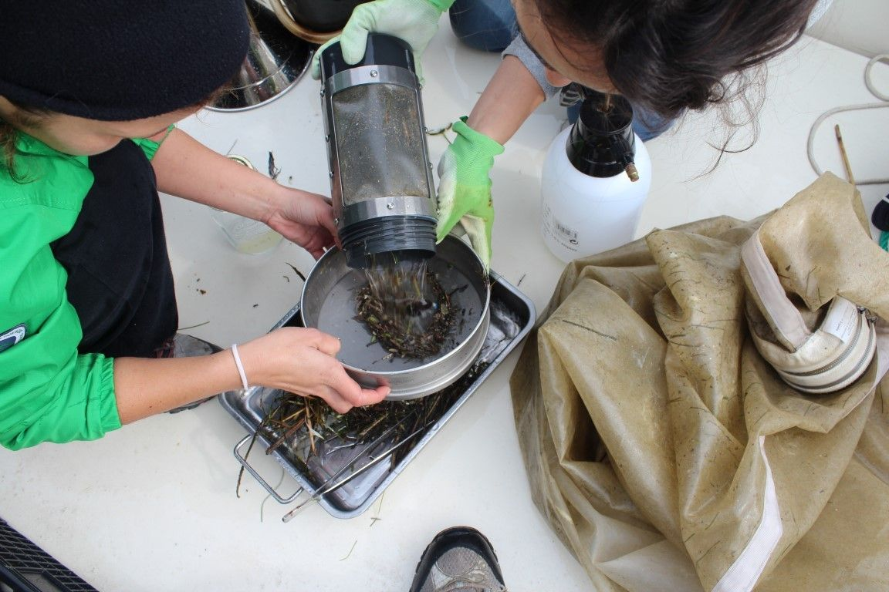
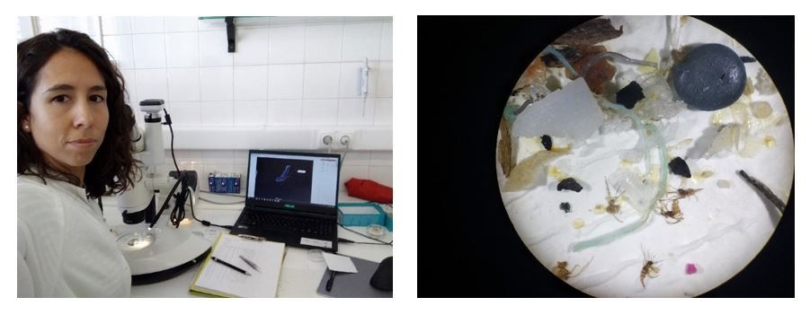
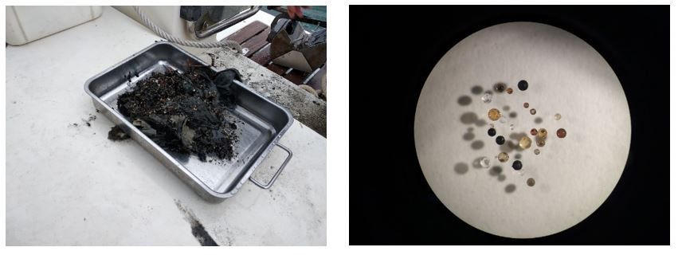

[facebook](https://www.facebook.com/sharer/sharer.php?u=https%3A%2F%2Fwww.natgeo.pt%2Fmeio-ambiente%2F2019%2F10%2Fdiana-rodrigues-estuda-poluicao-por-microplasticos-no-sado-e-mar-da-arrabida) [twitter](https://twitter.com/share?url=https%3A%2F%2Fwww.natgeo.pt%2Fmeio-ambiente%2F2019%2F10%2Fdiana-rodrigues-estuda-poluicao-por-microplasticos-no-sado-e-mar-da-arrabida&via=natgeo&text=Diana%20Rodrigues%20Estuda%20a%20Polui%C3%A7%C3%A3o%20por%20Micropl%C3%A1sticos%20no%20Sado%20e%20Mar%20da%20Arr%C3%A1bida) [whatsapp](https://web.whatsapp.com/send?text=https%3A%2F%2Fwww.natgeo.pt%2Fmeio-ambiente%2F2019%2F10%2Fdiana-rodrigues-estuda-poluicao-por-microplasticos-no-sado-e-mar-da-arrabida) [flipboard](https://share.flipboard.com/bookmarklet/popout?v=2&title=Diana%20Rodrigues%20Estuda%20a%20Polui%C3%A7%C3%A3o%20por%20Micropl%C3%A1sticos%20no%20Sado%20e%20Mar%20da%20Arr%C3%A1bida&url=https%3A%2F%2Fwww.natgeo.pt%2Fmeio-ambiente%2F2019%2F10%2Fdiana-rodrigues-estuda-poluicao-por-microplasticos-no-sado-e-mar-da-arrabida) [mail](mailto:?subject=NatGeo&body=https%3A%2F%2Fwww.natgeo.pt%2Fmeio-ambiente%2F2019%2F10%2Fdiana-rodrigues-estuda-poluicao-por-microplasticos-no-sado-e-mar-da-arrabida%20-%20Diana%20Rodrigues%20Estuda%20a%20Polui%C3%A7%C3%A3o%20por%20Micropl%C3%A1sticos%20no%20Sado%20e%20Mar%20da%20Arr%C3%A1bida) [Meio Ambiente](https://www.natgeo.pt/meio-ambiente) 
# Diana Rodrigues Estuda a Poluição por Microplásticos no Sado e Mar da Arrábida 
## A bióloga marinha ganhou uma bolsa da National Geographic em 2018 para desenvolver o seu projeto que pretende contribuir para a redução da poluição marinha por microplásticos em Portugal, através da aproximação da ciência à sociedade. Por [National Geographic](https://www.natgeo.pt/autor/national-geographic) Publicado 15/10/2019, 17:35 , Atualizado 2/02/2021, 09:41 

Diana prepara um arrasto de superfície com rede de neuston. É necessário dar dezenas de metros de cabo para garantir que as amostras recolhidas da camada superficial do mar recebem a menor perturbação possível da esteira da embarcação. Fotografia por André Silveira [**Diana Rodrigues**](http://orcid.org/0000-0001-5430-1384) ganhou uma bolsa de um ano da National Geographic até junho de 2019 para realizar o seu projeto dedicado à **redução da poluição marinha por microplásticos** , combinando investigação científica e campanhas de sensibilização locais. 

Foi no Estuário do Sado e no Parque Marinho Professor Luiz Saldanha que, com a colaboração do [ICNF](https://www.icnf.pt/) e de vários voluntários, a bióloga marinha recolheu os dados científicos que apoiarão a divulgação e sensibilização dos munícipes de Sesimbra e Setúbal. A meta do projeto é avaliar e divulgar o estado de poluição de locais bem conhecidos/familiares dos cidadãos, de forma a potencializar mudanças de comportamento. 

Diana recolheu amostras de neuston marinho (organismos que vivem na camada superficial das massas de água) e de sedimento ao longo de vários meses, para avaliar a disponibilidade de microplásticos no subtidal (zona marinha que nunca fica exposta durante os períodos de maré baixa) e consequentemente compreender o nível de exposição/contaminação a que os organismos marinhos estão sujeitos nesta zona costeira. Este conhecimento será fundamental para o seu projeto de doutoramento (orientado por Paula Sobral, da [Universidade NOVA de Lisboa](https://www.unl.pt/) ), cujo objetivo final é avaliar os impactos da ingestão de microplásticos em espécies de peixes marinhos em Portugal e poderá ainda vir a servir de base científica à geração de medidas preventivas eficientes que se pretendam implementar. 

Atualmente a investigadora está a extrair, contar e caracterizar os microplásticos dos vários tipos de amostras, etapa que estará concluída no início de 2020. No fim deste ano iniciará as ações de sensibilização para diferentes tipos de públicos de Setúbal e Sesimbra, através de workshops, sessões de educação ambiental em escolas, debates com associações – por exemplo de pescadores - e indústrias, e reuniões com ONG. Nestas campanhas, a bióloga marinha irá solicitar o apoio das autarquias, da [APLM](https://www.aplixomarinho.org/) (Associação Portuguesa do Lixo Marinho, na qual Diana é voluntária) e do centro de investigação [MARE – Centro de Ciências do Mar e do Ambiente](http://www.mare-centre.pt/pt) , onde está a desenvolver o seu projeto de doutoramento. 

Diana Rodrigues e Sílvia Tavares processam a amostra contida no copo da rede de Neuston que será armazenada num frasco de vidro até ser analisada em laboratório. Fotografia por Ana F. Lopes **Explique o seu trabalho numa frase.** 

ConsCIENCIAlizar sobre o poder (e o dever) do cidadão na redução da poluição por microplásticos, transformando a noção de ameaça global, invisível e distante, em local, irrefutável e familiar. 

**O que a levou a escolher esta zona marinha para realizar o seu estudo?** 

Razões não faltavam! Em primeiro lugar, tem sido no Parque Marinho Professor Luiz Saldanha que têm decorrido os projetos de investigação em que tenho colaborado. Tudo começou com a amostragem da tese de mestrado em Ecologia Marinha (2010) focada no comportamento de peixes (labrídeos; bodiões) e nas suas associações com os habitats disponíveis em recifes rochosos. Depois, já enquanto bolseira de investigação, integrei uma equipa dedicada à ecologia de peixes e participei, até 2017, em diversas campanhas nesta zona costeira, fazendo amostragens diurnas e noturnas com recurso regular ao mergulho com escafandro. Isso conferiu-nos horas infindáveis de contacto direto com o parque marinho e permitiu-nos verificar a elevada biodiversidade pela qual é conhecido e testemunhar as pressões a que está sujeito. Peripécias, aventuras e sustos à parte, as várias horas que estive embarcada diariamente e a presença contínua nesta zona marinha ao longo das estações do ano, permitiram-me experienciar a sua realidade e capacidade de resiliência. 

Em segundo lugar, ao considerar o estuário do Sado como parte do local em estudo, poderia incorporar, de acordo com o que a literatura sugere, um potencial “hotspot” de microplásticos. Por fim, dada a proximidade aos municípios de Sesimbra e Setúbal (2 centros urbanos) e devido às inúmeras atividades que decorrem nesta zona marinha (turismo, campismo, pesca, porto comercial para navios de mercadorias, estaleiro naval, observação de cetáceos, mergulho, etc), foi muito claro para mim decidir onde realizar a investigação do meu doutoramento. 

**O que a entusiasma no seu trabalho?** 

Embora seja para muitos um trabalho aborrecido, é com imensa curiosidade e expectativa que aguardo os dias de trabalho à lupa para finalmente ver os microplásticos extraídos das inúmeras amostras. 

É caricato, mas como os microplásticos são praticamente invisíveis a olho nu e nem sempre apresentam cores bem vivas, quem estuda esta problemática acaba por passar várias semanas ou meses a processar amostras sem ter uma noção concreta da carga de microplásticos recolhida. Isso significa que só no final do processamento se obtém uma perceção dos diferentes níveis de poluição nos pontos amostrados e consequentemente do tempo que ainda levará a fase de contagem, medição e identificação das partículas extraídas (uma etapa que por si só já é morosa). 

É igualmente motivador perceber o entusiasmo de quem vai acompanhando este trabalho desde o início, tanto os que colaboraram na recolha das amostras no “campo” àqueles que assistiram à angústia na decisão dos melhores protocolos de extração em laboratório, ao público nas palestras, amigos e familiares, que demonstram vontade em conhecer os resultados sobre esta zona costeira tão procurada por portugueses e estrangeiros. 

Esquerda: A fase de contagem e medição dos microplásticos requer inúmeras horas de trabalho à lupa e exige muitos cuidados para se evitar a contaminação por fibras provenientes do ar. 
Direita: Campo de visão à lupa no qual se veem, entre outras partículas, os microplásticos extraídos de uma amostra de neuston recolhido junto à Praia de Alpertuche. Fotografia por Diana Rodrigues **Como é que a bolsa da National Geographic a ajudou?** 

Num projeto de doutoramento é frequente ser necessário alterar o plano de trabalhos por falta de financiamento, por questões logísticas, prazos reduzidos, etc. E embora nos preparem para essa possibilidade nunca estamos prontos para abdicar de um plano que nos levou tantas horas a construir e que a nosso ver é o plano ideal. Apesar de ter tentado várias opções de financiamento, como os resultados acabam por demorar e reduzir as já baixas expectativas, eu estava a passar por esse dilema e a tentar conformar-me com a necessidade de traçar um plano B (concretizável com as condições que dispunha). Ganhar esta bolsa trouxe por isso muito alívio, uma motivação renovada e (confesso) alguma euforia! Assim, embora com responsabilidade acrescida, já não tinha de desistir do plano inicial. Pude então adquirir o equipamento em falta para assegurar a recolha das várias amostras no “campo” e também garantir o material necessário às diferentes etapas do trabalho em laboratório. Por último, considero uma mais-valia a credibilidade e visibilidade que esta entidade financiadora confere às diversas fases do projeto, aspetos muito relevantes em comunicação de ciência. 

**Pode partilhar um dado que tenha aprendido com esta bolsa, até ao momento?** 

Os resultados preliminares das amostras de sedimento analisadas indicam que é no ponto de amostragem mais próximo do estuário do Sado (junto a Setúbal) que existe maior abundância de microplásticos e onde se detetaram todas as microesferas (partículas incorporadas nos produtos de higiene pessoal e cosmética). 

Esquerda: Amostra de sedimento recolhida no estuário do Sado com draga Petite Ponar. Direita: Microesferas extraídas de uma amostra de sedimento do estuário do Sado. Fotografia por André Silveira e Diana Rodrigues **Quando deixa o laboratório, que preocupações leva consigo?** 

É inevitável para quem trabalha (ou colabora) nesta temática ganhar certos hábitos que tanto podem inspirar como incomodar as pessoas que nos rodeiam. 

Tudo começa por também considerarmos como lixo todas as partículas de plástico com poucos milímetros ou micrómetros. A verdade é que basta experienciar a facilidade e rapidez com que no laboratório uma amostra fica contaminada por fibras provenientes do ar, para tomar consciência que todas as nossas ações têm impacto. Parafraseando o que diz a ativista Greta Thunberg no vídeo partilhado com o ambientalista George Monbiot, “ _Everything counts. What you do counts_ .” 

Devido a esta minuciosidade no trabalho, acabamos por transportar essa consciência dos nossos atos/escolhas para todo o lado e por querer corrigir/aconselhar aqueles que nos rodeiam. Isso nem sempre é bem aceite, mas a pouco e pouco vão sendo implementadas medidas que impõe obrigatoriamente mudanças de comportamento. 

Já sabemos que a velocidade a que se descartam produtos de plástico e a que estes se acumulam nos oceanos é desmesurada, o que implica uma maior rapidez na formulação de medidas que desacelerem esta tendência. Por isso preocupa-me o tempo que leva a concretizar um trabalho como o do meu projeto, cujos resultados deviam ser divulgados rapidamente. Preocupa-me saber que, por ignorância ou por preguiça, muitas pessoas não se esforçam por reduzir a sua pegada (de plástico), prejudicando as próximas gerações. Preocupa-me a possibilidade de, com o intuito de reduzir a poluição por plástico, arranjarmos novos problemas ao procurar soluções/alternativas para determinados produtos/embalagens. Preocupam-me os resíduos que a minha investigação produz… enfim… a consciência acrescida traz preocupações acrescidas... 

**Quais os próximos passos?** 

O meu objetivo atual é concluir o processamento das amostras de neuston e sedimentos. A conclusão desta tarefa será, na realidade, o ponto de partida da história do meu doutoramento, à qual se seguirão ações de divulgação. Numa fase posterior passarei à deteção e análise de microplásticos nos peixes que foram capturados em simultâneo com as amostras de neuston e sedimentos para finalmente poder comparar a quantidade e a diversidade de microplásticos presentes nos organismos e no ambiente. Mais tarde seguir-se-ão experiências em laboratório com larvas e juvenis de peixes que, sob as condições de poluição locais simuladas, serão alimentados com dietas especialmente preparadas incluindo microplásticos para avaliar os impactos no desenvolvimento, comportamento e nos processos bioquímicos e celulares dos organismos, sob a co-orientação de Ana Faria do [ISPA - Instituto Universitário](http://www.ispa.pt/) e de Helena Costa da Universidade Nova de Lisboa. 

**Se pudesse pedir um desejo para o Planeta, qual seria?** 

Desejo que todas as pessoas do planeta possam viver a experiência de um mergulho com escafandro ou participar numa limpeza costeira, de forma a que cada um possa constatar, por si próprio, as maravilhas que temos a perder e o lixo que vamos acumulando. 

_Entrevista concedida a 14 de outubro de 2019_ 

[source](https://www.natgeo.pt/meio-ambiente/2019/10/diana-rodrigues-estuda-poluicao-por-microplasticos-no-sado-e-mar-da-arrabida)