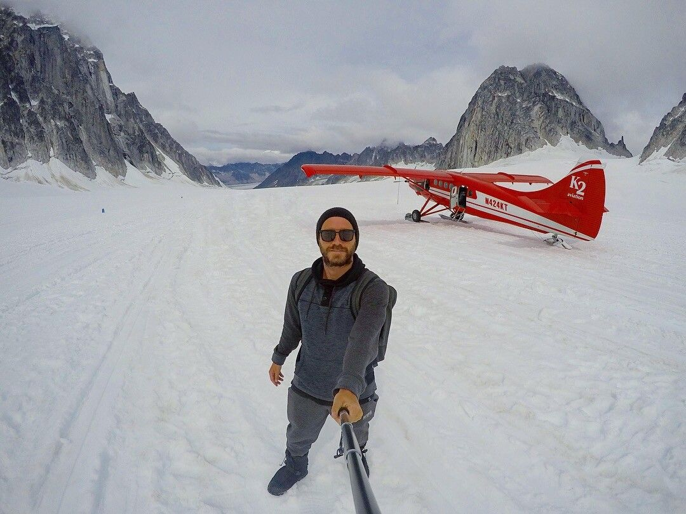
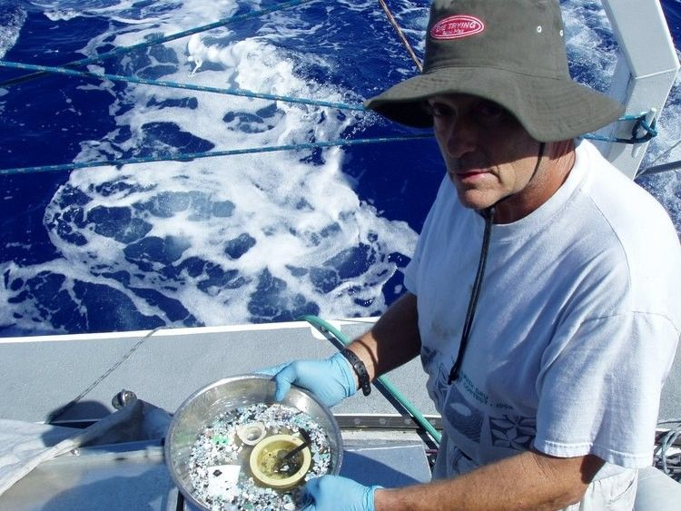
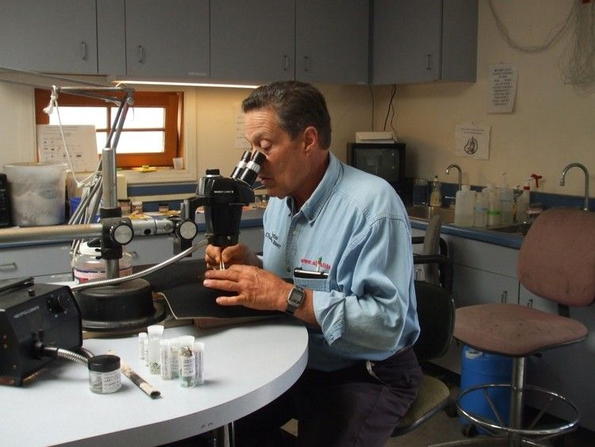
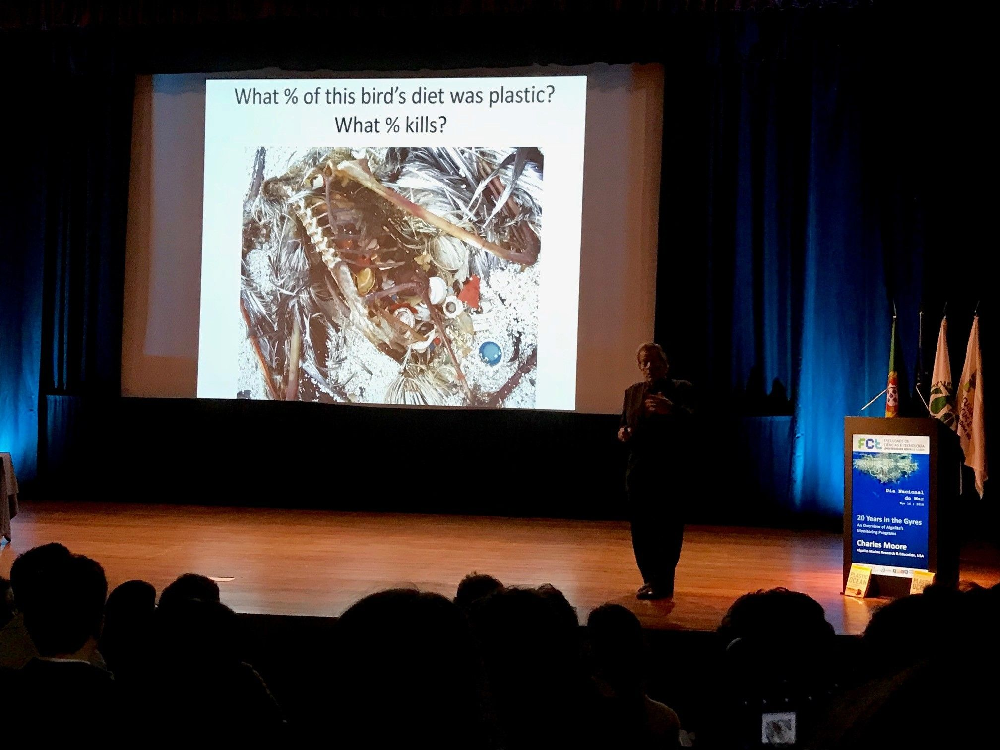

[facebook](https://www.facebook.com/sharer/sharer.php?u=https%3A%2F%2Fwww.natgeo.pt%2Fmeio-ambiente%2F2018%2F11%2Fa-invasao-do-plastico-narrada-por-charles-moore-em-lisboa) [twitter](https://twitter.com/share?url=https%3A%2F%2Fwww.natgeo.pt%2Fmeio-ambiente%2F2018%2F11%2Fa-invasao-do-plastico-narrada-por-charles-moore-em-lisboa&via=natgeo&text=A%20Invas%C3%A3o%20do%20Pl%C3%A1stico%20Narrada%20por%20Charles%20Moore%2C%20em%20Lisboa) [whatsapp](https://web.whatsapp.com/send?text=https%3A%2F%2Fwww.natgeo.pt%2Fmeio-ambiente%2F2018%2F11%2Fa-invasao-do-plastico-narrada-por-charles-moore-em-lisboa) [flipboard](https://share.flipboard.com/bookmarklet/popout?v=2&title=A%20Invas%C3%A3o%20do%20Pl%C3%A1stico%20Narrada%20por%20Charles%20Moore%2C%20em%20Lisboa&url=https%3A%2F%2Fwww.natgeo.pt%2Fmeio-ambiente%2F2018%2F11%2Fa-invasao-do-plastico-narrada-por-charles-moore-em-lisboa) [mail](mailto:?subject=NatGeo&body=https%3A%2F%2Fwww.natgeo.pt%2Fmeio-ambiente%2F2018%2F11%2Fa-invasao-do-plastico-narrada-por-charles-moore-em-lisboa%20-%20A%20Invas%C3%A3o%20do%20Pl%C3%A1stico%20Narrada%20por%20Charles%20Moore%2C%20em%20Lisboa) 
# A Invasão do Plástico Narrada por Charles Moore, em Lisboa 
## Charles Moore descobriu o início da ilha de plástico no Pacífico Norte e veio a Portugal no Dia do Mar, para explicar como estamos a ser invadidos pelo Plástico. Por [National Geographic](https://www.natgeo.pt/autor/national-geographic) Publicado 19/11/2018, 19:18 

O Capitão Charles Moore numa palestra no Dia Nacional do Mar, na Biblioteca da Faculdade de Ciências e Tecnologia da Universidade Nova de Lisboa. Fotografia por National Geographic Para celebrar o Dia Nacional do Mar, que se assinala a 16 de novembro, a [Biblioteca da Faculdade de Ciências e Tecnologia da Universidade Nova de Lisboa](http://www.biblioteca.fct.unl.pt/) , trouxe a Portugal o Capitão Charles Moore – o homem que descobriu a concentração de plástico no Pacífico Norte, há 20 anos atrás. 

Em 1997, durante uma competição de vela entre Los Angeles e o Havai, Charles Moore descobriu uma mancha de lixo no Oceano Pacífico, constituída sobretudo por plástico. Devido aos ventos fracos desta região, as correntes marinhas empurraram tudo o que flutuava à superfície da água para o centro. Esta mancha víria a ganhar uma dimensão devastadora e a denominar-se ‘ilha de plástico’. Iniciava-se assim, o debate do problema do plástico nos oceanos e a devoção do Capitão Charles Moore a esta [causa](http://www.captain-charles-moore.org/) . 

Capitão Charles Moore a mostrar o microplástico recolhido numa das suas expedições. Fotografia por Charles Moore A crise petrolífera de 1973-1974 e a crise financeira mundial de 2008-2010 foram os únicos dois momentos, desde 1940, em que a produção de plástico sofreu um decréscimo. O plástico invadiu as nossas vidas. Está por todo o lado. Na nossa roupa, nos produtos de beleza e higiene pessoal, na praia, no ar, na água, e foi recentemente encontrado em [fezes humanas](https://www.natgeo.pt/meio-ambiente/2018/10/microplasticos-encontrados-pela-primeira-vez-nas-fezes-humanas) . 

Apesar de ser um problema alarmante, a redução do plástico descartável não pode ser feita em todas as áreas. Nos hospitais, por exemplo, os materiais descartáveis são necessários por motivos de saúde. Mas há um grande número de cenários dos quais os podemos eliminar. Não precisamos de vegetais embrulhados em plástico. Não precisamos de invólucros em livros. Não precisamos de palhinhas de plástico para beber refrigerantes. 

Charles Moore no seu trabalho de investigação e monitorização do plástico nos oceanos. Fotografia por Charles Moore O plástico não se acumula em todos os oceanos. Os ventos podem influenciar o deslocamento do plástico e dificultar o seu avistamento à superfície. Este fenómeno não é consistente. A concentração varia muito na mesma zona geográfica. O Oceano Atlântico não acumula tanto plástico pelas suas correntes turbulentas. 

Vinte anos depois, esta concentração de lixo cresceu em proporções alarmantes, matando muitos animais marinhos. A ilha de plástico tem agora 1.6 milhões de quilómetros quadrados. É 17 vezes maior que o nosso país. “Estamos a ser atacados pelo plástico”. 

Segundo Charles Moore, “é muito mais fácil ficar a olhar para a realidade imediata, à frente dos nossos olhos… para o ecrã dos nossos telemóveis. Mas essa realidade não nos demonstra o que está a acontecer em outros sítios.” 

Charles Moore durante a sua palestra no Dia Nacional do Mar, na Biblioteca da Faculdade de Ciências e Tecnologia da Universidade Nova de Lisboa. Fotografia por National Geographic Atualmente estima-se que 90% de todo o lixo que flutua no oceano, seja plástico. Quanto mais tempo permanecer no oceano, mais alaranjado fica e mais concentração de poluição possuí. Apenas na área do Pacífico Norte, existem cerca de 100 milhões de toneladas de lixo marinho, responsáveis pela morte de um milhão de aves marinhas, todos os anos. O Capitão Charles Moore terminou a sua palestra com uma frase que dá que pensar. “O plástico está no ar, no pó,… já respiramos plástico.” 

[source](https://www.natgeo.pt/meio-ambiente/2018/11/a-invasao-do-plastico-narrada-por-charles-moore-em-lisboa)