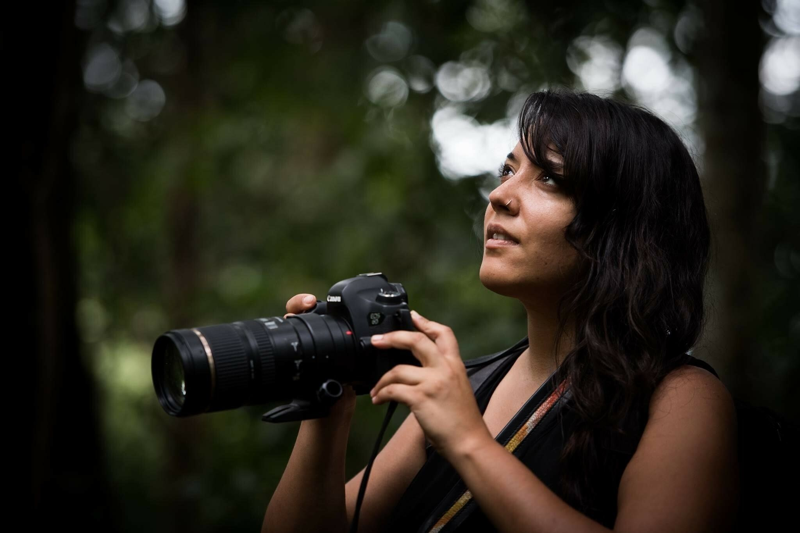
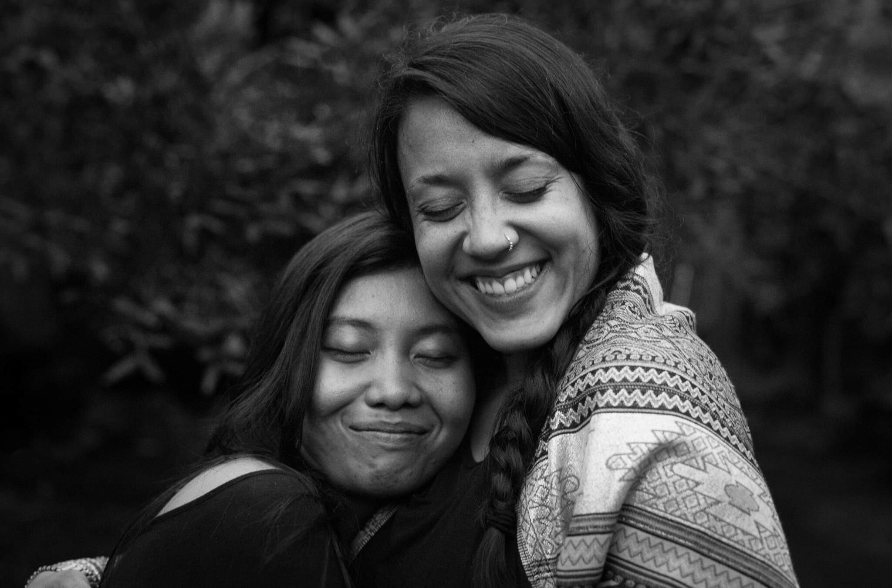
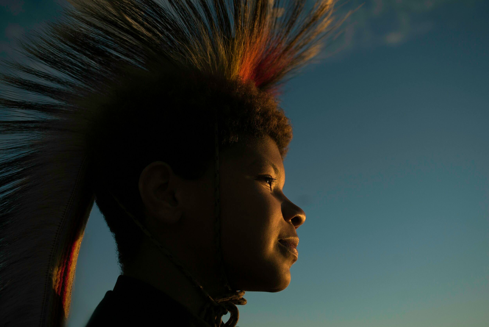
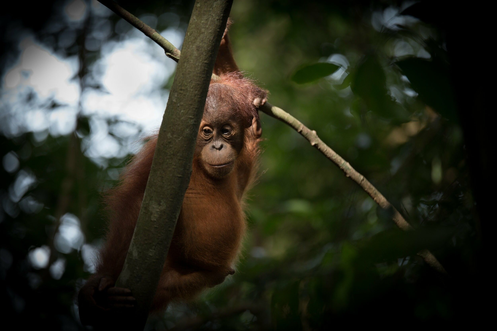
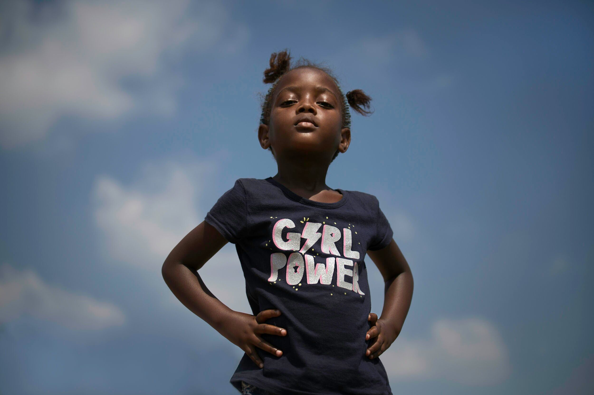

[facebook](https://www.facebook.com/sharer/sharer.php?u=https%3A%2F%2Fwww.natgeo.pt%2Fmeio-ambiente%2F2021%2F03%2Fentrevista-danielle-da-silva) [twitter](https://twitter.com/share?url=https%3A%2F%2Fwww.natgeo.pt%2Fmeio-ambiente%2F2021%2F03%2Fentrevista-danielle-da-silva&via=natgeo&text=Danielle%20da%20Silva%3A%20%22Os%20nossos%20antepassados%20eram%20muito%20pr%C3%B3ximos%20da%20terra%2C%20e%20os%20nossos%20velhos%20possuem%20as%20chaves%20desse%20conhecimento%E2%80%9D) [whatsapp](https://web.whatsapp.com/send?text=https%3A%2F%2Fwww.natgeo.pt%2Fmeio-ambiente%2F2021%2F03%2Fentrevista-danielle-da-silva) [flipboard](https://share.flipboard.com/bookmarklet/popout?v=2&title=Danielle%20da%20Silva%3A%20%22Os%20nossos%20antepassados%20eram%20muito%20pr%C3%B3ximos%20da%20terra%2C%20e%20os%20nossos%20velhos%20possuem%20as%20chaves%20desse%20conhecimento%E2%80%9D&url=https%3A%2F%2Fwww.natgeo.pt%2Fmeio-ambiente%2F2021%2F03%2Fentrevista-danielle-da-silva) [mail](mailto:?subject=NatGeo&body=https%3A%2F%2Fwww.natgeo.pt%2Fmeio-ambiente%2F2021%2F03%2Fentrevista-danielle-da-silva%20-%20Danielle%20da%20Silva%3A%20%22Os%20nossos%20antepassados%20eram%20muito%20pr%C3%B3ximos%20da%20terra%2C%20e%20os%20nossos%20velhos%20possuem%20as%20chaves%20desse%20conhecimento%E2%80%9D) [Meio Ambiente](https://www.natgeo.pt/meio-ambiente) 
# Danielle da Silva: "Os nossos antepassados eram muito próximos da terra, e os nossos velhos possuem as chaves desse conhecimento” 
## A fotógrafa luso-indiana, que acaba de receber uma bolsa da National Geographic Society, conversou connosco sobre o legado das raízes ancestrais e a nossa responsabilidade no planeta. Por [Filipa Coutinho](https://www.natgeo.pt/autor/filipa-coutinho) Publicado 8/03/2021, 06:57 

A fotógrafa Danielle da Silva faz um epítome sobre os ensinamentos do mundo natural e da importância da herança dos nossos antepassados. 

Nayla Azmi cedida por Danielle da Silva **Danielle da Silva** é uma fotógrafa e videógrafa amplamente aclamada e premiada, fundadora dos [Photographers Without Borders](https://www.photographerswithoutborders.org/) , através da qual ensina ONGs na criação de histórias visuais impactantes. É uma mulher com uma sabedoria fenomenal sobre a herança transmitida pelas raízes ancestrais e os ensinamentos da natureza. 

Detém os chapéus de conservacionista, académica, ativista, mentora, escritora e oradora em palestras à volta do globo, como no [Festival Exodus](https://www.natgeo.pt/fotografia/2019/08/danielle-da-silva-uma-lente-conservacionista-no-exodus) . Danielle, filha de mãe portuguesa e pai indiano, é apaixonada por usar a narrativa para conectar as pessoas à terra e uni-las de uma forma ética. A fotógrafa trabalhou com centenas de ONGs e várias organizações internacionais, esteve em mais de 80 países, e aprendeu mais de seis idiomas. 

Tivemos o privilégio de conversar com Danielle sobre a sua conexão ao mundo natural, através de uma videochamada de Zoom, que foi tudo menos remota. 

**Na sua opinião, o** **que nos ensina a natureza?** 

A natureza é o nosso maior professor. Refiro-me à natureza como a Mãe Natureza como a nossa mãe, aquela que nos dá vida e nos nutre. Acho que a natureza nos ensina quem somos e qual é a nossa verdadeira responsabilidade neste planeta - manter o equilíbrio, assumir responsabilidades, ser responsáveis nos nossos relacionamentos como seres cognitivamente complexos. Na minha cultura indiana e na minha cultura portuguesa, temos uma relação próxima da natureza. Tradicionalmente, ambas as comunidades dependiam dessa relação para obter bens essenciais, como comida e água. A minha avó portuguesa tem um polegar verde mágico, e compartilha sempre estes pedaços de sabedoria comigo quanto mais tempo passo com ela. É muito importante conversar com os nossos idosos. Os nossos antepassados eram muito próximos da terra, e os nossos velhos possuem as chaves desse conhecimento. 

Danielle abraça uma amiga num abraço caloroso. 

cedida por Danielle da Silva Também sou muito próxima da cultura Anishinaabe, no Canadá, através de uma família que considero como meus parentes. Eles ensinaram-me muito sobre a cultura, o idioma e alguns dos ensinamentos. Por exemplo, existem sete ensinamentos do avô. E cada ensinamento é representado por um animal diferente - há a verdade, a honestidade, o amor, a humildade, a coragem, o respeito, a sabedoria... cada um deles é associado a um animal. O lobo, por exemplo, representa humildade, e o urso representa coragem. Nas histórias da criação de Anishinaabe, os animais são guias para os humanos. Carregam instruções para nós e mostram-nos como viver com os ritmos naturais da Mãe Natureza. Mostram aos humanos que, nas nossas sociedades, cada um de nós desempenha um papel especial no ecossistema da humanidade. É por isso que na cultura Anishinaabe, cada família também tem um clã, que também possui determinadas responsabilidades. Por exemplo, a família da minha amiga Heather Manitowabi pertence ao clã dos ursos. A responsabilidade do clã dos ursos geralmente é viver nos arredores e proteger a comunidade. 

A Mãe Natureza e os nossos parentes animais estão cá para nos guiar e nos mostrar quando estamos desequilibrados, a prejudicar ou a explorar demasiado. Assim como a natureza fica quase doente quando fazemos isso a um nível tão alto, nós também - e é quando essa conexão acontece. Observamos isso nas comunidades, quando as pessoas se afastam da natureza - vemos um aumento na depressão e no suicídio e mais em comunidades que não têm árvores. podemos ver que quando nos desconectamos da natureza, do nosso papel, ficamos física e mentalmente doentes. Há algo maior para o qual estamos a ser solicitados a observar, especialmente agora. Qual é o nosso verdadeiro papel como humanos? Estamos aqui para retirar e explorar? Ou estamos aqui para cuidar? 

**Tem estado mais conectada com a natureza desde os confinamentos associados à pandemia?** 

A cem por cento! 

Estava física e mentalmente exausta de tantas viagens relacionadas com o meu trabalho. Novamente, sou muito privilegiada por ter conseguido fazer isto tudo. Mas custou muito, a mim e ao meio ambiente. Por mais que queira compensar o carbono em todas as minhas viagens, há uma fatura. 

### “Depois de sair da cidade (Toronto), senti uma mudança imediata de uma sensação de carência e, talvez até de desespero, para uma sensação de abundância e contentamento.” Quando me mudei para a terra onde moro (12 hectares perto do Parque Algonquin e Muskoka no Ontário), foi com a firme intenção de criar raízes e de me enraizar. Depois de fazer isso e de sair da cidade (Toronto), senti uma mudança imediata de uma sensação de carência e, talvez até de desespero, para uma sensação de abundância e contentamento, realização no dia-a-dia. Olho em volta e tenho janelas em todos os sítios. Posso ver árvores e florestas, posso ouvir pássaros. Ando algumas centenas de metros e vejo um riacho murmurante e um alce à porta com as minhas câmaras. Tenho câmaras _light motion_ em volta de casa e consigo ver a vida que está a acontecer e agora na neve consigo ver pegadas de lobos, raposas, esquilos... tanta vida! Então sim, sinto-me muito mais conectada com a natureza. Uma das minhas coisas preferidas é quando a comida escasseia, muitos pássaros vêm diretamente à minha porta e diretos à minha cara e tentam ver se tenho algo para eles. Nem sempre tenho alguma coisa, mas eles têm sido uma presença tão bonita. Estou a sentir-me muito mais conectada à natureza. 

**E a importância de “abrir mão”?** 

Soltar ou abandonar significa mudar a maneira como reajo às coisas. Então, de certa forma, não é realmente abrir mão, mas mais abrir mão da maneira como certas coisas me afetaram no passado. Isso significa processar, reenquadrar e abrir mão de velhas histórias... encontrar contentamento e satisfação no dia-a-dia, realmente apreciando o processo e o que está a acontecer neste momento. 

Retrato de uma criança indígena fotografada por Danielle. 

Fotografia por Danielle da Silva **Pode contar-nos um pouco mais sobre a sua forte conexão espiritual? Como a explora?** 

Acho que no início da minha vida fui muito resistente à espiritualidade ou a qualquer coisa que não pudesse ser explicada ou que não pudesse ver com os próprios olhos porque fui formada em ciências. Com o tempo, porém, lembrei-me do que realmente trata a ciência - curiosidade. E a minha curiosidade sempre foi enorme. 

Quanto mais entendo sobre ciência, sobre biologia, química e física e matemática, mais vejo conexões. Somos parte de algo muito maior, quer acreditemos ou não. 

Também sou fascinada pela sabedoria, práticas e tradições antigas, muitas das quais foram denegridas pela ciência colonial e pela criação de conhecimento. Quando olho para as práticas ancestrais dos meus próprios antepassados da Índia, a ioga e Ayurveda, que foram roubadas, apropriadas e manipuladas de tantas maneiras diferentes para servir ao olhar ocidental, vejo muita sabedoria e compreensão sobre como o mundo funciona, e a nossa relação com a natureza cravada neles. 

Quando estava no pior momento da minha vida, foi ao falar e ouvir a natureza, a água, a floresta e os animais, que tive a mais alta das vibrações. As conexões que fiz com um orangotango chamado Meena há muitos anos deixaram uma impressão que durou muitos anos e que me fez angariar dezenas de milhares de dólares para ajudar a proteger um habitat de 10 hectares designado Santuário de Vida Selvagem de Sumatra, adjacente ao ecossistema Gunung Leuser. 

O facto de poder ser agarrada por uma árvore e de todo o meu peso “derreter”; e de olhar para a ciência e entender que existe realmente um fluxo de energia entre nós e que todas as árvores estão conectadas... é espiritual. E científico. Como disse Carl Sagan, “a ciência não é apenas compatível com a espiritualidade; é uma fonte profunda de espiritualidade”. 

Da mesma forma, Albert Einstein disse: “a coisa mais bonita que podemos experimentar é o Misterioso”. Ele também disse: “a mente intuitiva é um presente sagrado e a mente racional é uma serva fiel. Criamos uma sociedade que honra o servo e esqueceu o presente”. 

### “A minha esperança é que o ressurgimento indígena que está a acontecer em todo o mundo nos ajude a ver um caminho ou hipóteses diferentes.” Concordo. Acredito que esquecemos o dom de quem somos como humanos e que estamos a ser lembrados disso. Também me entristece quando nos referimos à nossa espécie como “parasitas”, porque esquece que existem comunidades - comunidades indígenas especificamente - que não se comportaram como parasitas. Há conhecimento e sabedoria disponíveis que podem ensinar-nos como viver e governar com responsabilidade, em reciprocidade com tudo ao nosso redor. A minha esperança é que o ressurgimento indígena que está a acontecer em todo o mundo nos ajude a ver um caminho ou hipóteses diferentes. 

Um orangotango bebé fotografado durante o projeto da fotógrafa em Sumatra. 

Fotografia por Danielle da Silva **Como tem nutrido a sua criatividade?** 

Acabei de receber uma [bolsa da National Geographic Society](https://www.natgeo.pt/bolsas) para ir a Sumatra e documentar o feminismo indígena na conservação. Estou muito grata à comunidade da National Geographic e estou entusiasmada para começar a planear isso! 

Como Visionária Executiva da Photographers Without Borders, estou sempre ocupada! Tenho trabalhado na divulgação do [Storytelling for Change Summit](https://hopin.com/events/storytellingsummit) [decorre a 27 e 28 de março]. Será um evento digital lotado, onde criaremos coletivamente uma visão para o futuro e, em seguida, falaremos sobre como podemos usar a nossa narrativa para lá chegar. Participarão mais de 50 _storytellers_ , agentes de mudança, poetas e detentores de conhecimento de todo o mundo, juntamente com palestras das fotógrafos da National Geographic Cristina Mittermeier e Ami Vitale. Estamos a concentrar-nos em dar ferramentas às pessoas e a partilhar soluções para que as pessoas possam saltar e seguir em frente em tudo o que estão a tentar realizar. Também estamos a angariar fundos para apoiar o nosso Fundo e Bolsas de Estudo de Storytellers sedeados em comunidades. 

Também me tenho focado em plantar e regar as sementes dos futuros líderes de storytelling, gerindo o meu programa de mentoria, que começou em janeiro. Estou a liderar 20 visionários no processo de construção dos seus sonhos incríveis. 

Pretendo continuar a apoiar as minhas parcerias, como é habitual, especialmente aqui no Canadá e também em Sumatra e na Índia. Muita coisa está a acontecer agora na Índia e em Sumatra, com ambos os governos a criar leis que visam explorar os agricultores e o meio ambiente. Em ambos os locais, os agricultores têm cometido suicídio devido à seca e aos baixos rendimentos ou preços. É importante para mim usar o meu conhecimento competências de forma intencional, propositalmente útil e cooperante. 

Criança enverga orgulhosamente uma tshirt que diz _girl power_ (poder feminino). 

Fotografia por Danielle da Silva **É fácil inspirar mudanças através de uma lente num mundo com tanto “ruído”?** 

Mudança é apenas a diferença entre A e B. Estamos sempre a mudar - a mudança é inevitável; é apenas como direcionamos a nossa mudança e é por isso que é importante cultivar uma visão e focar-nos nela. Acho que se continuarmos a encontrar formas de acrescentar valor ao mundo, poderemos elevar-nos acima do ruído. 

**Como se pode encontrar um caminho que nos diga algo?** 

Acho que, antes de mais nada, é muito importante olhar para dentro de nós e fazer esse trabalho de descobrir quem somos. De onde viemos? Depois de compreender isso, podemos ver para onde queremos ir. Para onde queremos ir? Como chegamos lá? Escolha os caminhos que o levam até lá. Sabemos que estamos no caminho certo quando encontramos equilíbrio entre a mente, o corpo, a alma, as ações, os pensamentos, as palavras. Encontramos menos resistência. Quão bonito seria se todos pudéssemos encontrar o nosso caminho? 

