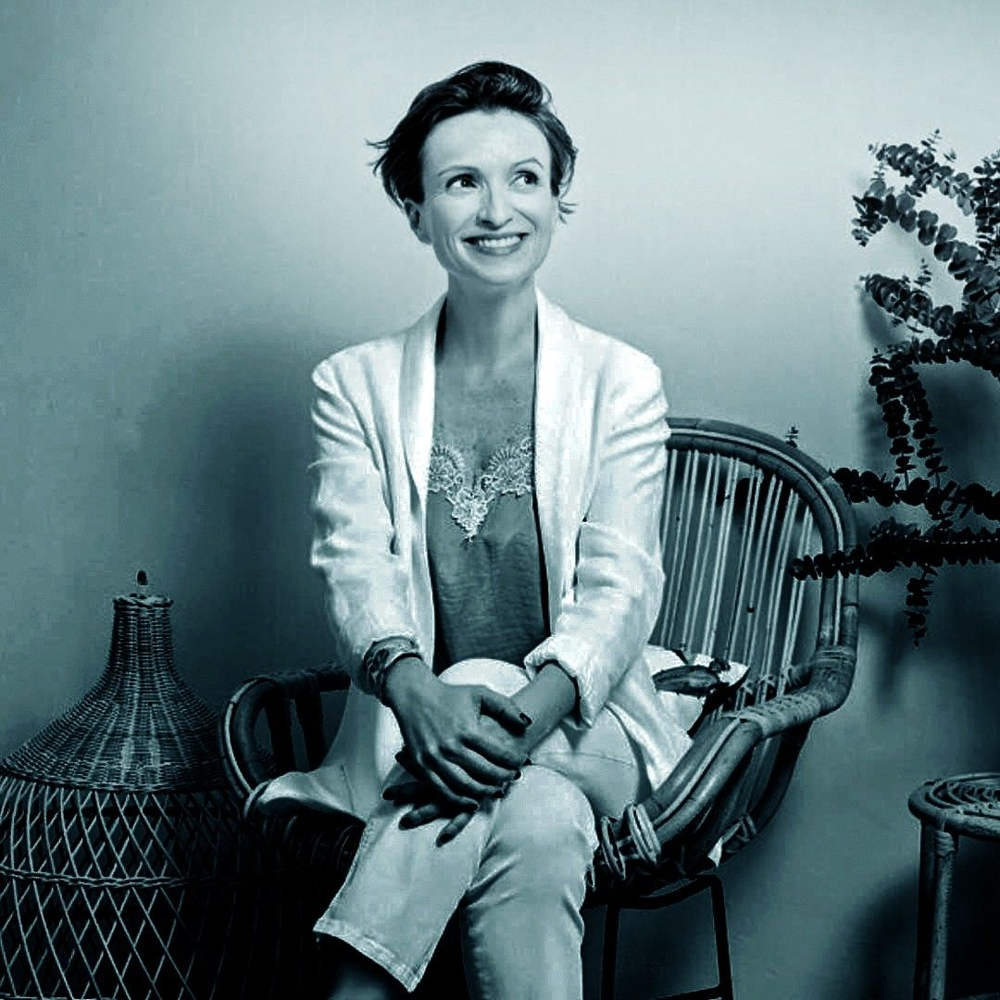

[facebook](https://www.facebook.com/sharer/sharer.php?u=https%3A%2F%2Fwww.natgeo.pt%2Fnational-geographic-summit%2F2019%2F04%2Fclaire-sancelot-a-voz-do-desperdicio-zero) [twitter](https://twitter.com/share?url=https%3A%2F%2Fwww.natgeo.pt%2Fnational-geographic-summit%2F2019%2F04%2Fclaire-sancelot-a-voz-do-desperdicio-zero&via=natgeo&text=Claire%20Sancelot%2C%20a%20Voz%20do%20Desperd%C3%ADcio%20Zero) [whatsapp](https://web.whatsapp.com/send?text=https%3A%2F%2Fwww.natgeo.pt%2Fnational-geographic-summit%2F2019%2F04%2Fclaire-sancelot-a-voz-do-desperdicio-zero) [flipboard](https://share.flipboard.com/bookmarklet/popout?v=2&title=Claire%20Sancelot%2C%20a%20Voz%20do%20Desperd%C3%ADcio%20Zero&url=https%3A%2F%2Fwww.natgeo.pt%2Fnational-geographic-summit%2F2019%2F04%2Fclaire-sancelot-a-voz-do-desperdicio-zero) [mail](mailto:?subject=NatGeo&body=https%3A%2F%2Fwww.natgeo.pt%2Fnational-geographic-summit%2F2019%2F04%2Fclaire-sancelot-a-voz-do-desperdicio-zero%20-%20Claire%20Sancelot%2C%20a%20Voz%20do%20Desperd%C3%ADcio%20Zero) CONTEÚDO PATROCINADO 

[Summit 2022](https://www.natgeo.pt/summit2022) 
# Claire Sancelot, a Voz do Desperdício Zero 
## No dia 29 de abril, a ativista de Desperdício Zero Claire Sancelot traz ao palco do National Geographic Summit 2019 o tema ‘Small Steps, Big impact’. Por [National Geographic](https://www.natgeo.pt/autor/national-geographic) Publicado 18/04/2019, 16:42 

Claire Sancelot é ativista de Desperdício Zero e abriu a primeira loja dedicada a este estilo de vida na Malásia 

**Claire Sancelot** vive um estilo de vida com Desperdício Zero em Kuala Lumpur, com o seu marido, os seus três filhos e um cão. Desperdício Zero não significa que temos de cultivar os nossos próprios vegetais ou utilizar a mesma roupa até se estragar, mas sim que nenhum lixo vai para um aterro. Claire evita produzir lixo, uma tarefa que considera difícil numa casa com três crianças, no entanto, afirma que “ _se todos fizermos o nosso melhor, podemos criar um mundo com muito menos lixo_ ”. 

Tomou a decisão de viver com **Desperdício Zero** em 2010, após o nascimento da sua filha mais velha, quando percebeu que o lixo gerado pela sua família era insustentável e que as alterações climáticas são a maior ameaça à humanidade. Claire recorda que ficou “ _horrorizada com a quantidade de lixo que um bebé pequeno criava_ ”. Quis imediatamente **diminuir o impacto negativo do lixo produzido pela sua família** , abrindo mais tarde a primeira loja de Desperdício Zero na Malásia. 

Desde então, o seu trabalho já foi reconhecido pelas Nações Unidas e a sua história tem sido partilhada em vários programas de rádio e na imprensa. Nas suas palestras, Claire desmistifica o estilo de vida de Desperdício Zero através de exemplos domésticos simples. Embora as alterações climáticas sejam um tema muito sério, a ativista torna a vida sustentável prazerosa e viável _._ 

A loja The Hive e o blog com o mesmo nome, demonstram que levar um estilo de vida com Desperdício Zero é simples, económico, divertido e totalmente possível para qualquer pessoa. Se Claire e a sua família conseguem fazê-lo, qualquer um consegue! 

Venha ouvir esta e outras vozes no [National Geographic Summit 2019](https://www.natgeo.pt/summit2019) . 

**CONTACTOS:** 

Para qualquer dúvida ou informação, por favor contacte-nos através de: 

**Email:** [ngsummit@winworld.pt](mailto:ngsummit@winworld.pt) 

**Telefone:** (+351) 91 3839 945 

Este conteúdo é-lhe trazido pelo nosso parceiro. Não reflete necessariamente a visão da National Geographic ou da sua equipa editorial. 

[source](https://www.natgeo.pt/national-geographic-summit/2019/04/claire-sancelot-a-voz-do-desperdicio-zero)