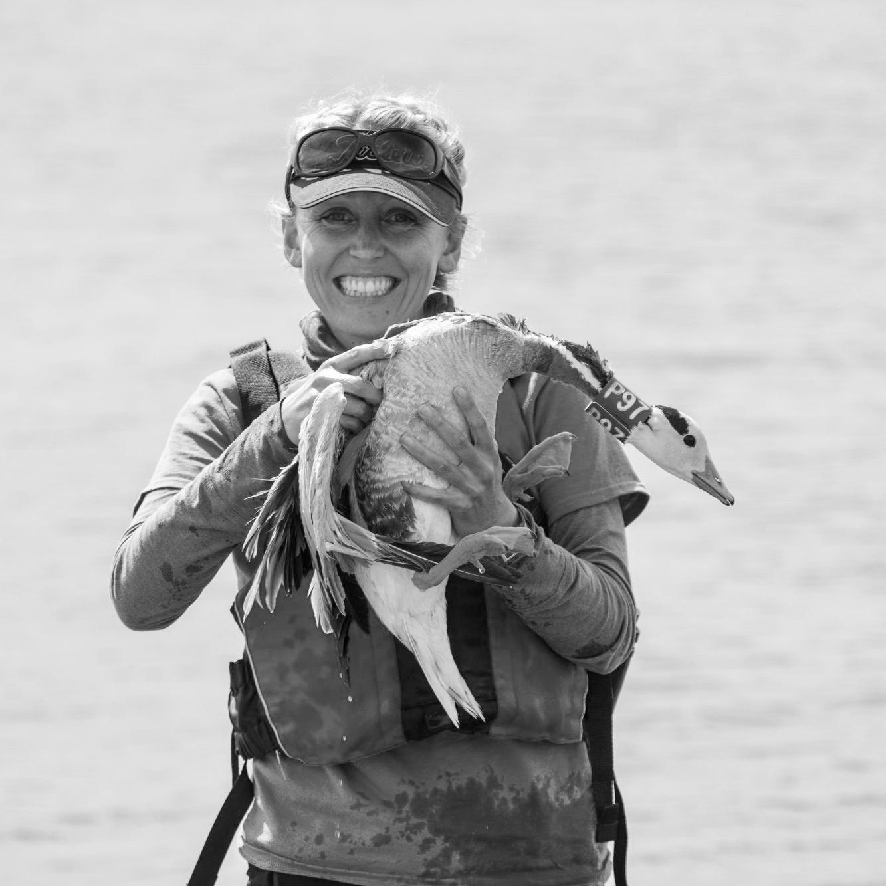
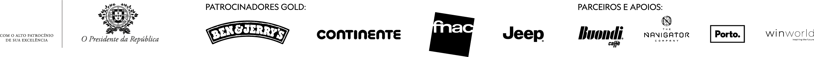

[facebook](https://www.facebook.com/sharer/sharer.php?u=https%3A%2F%2Fwww.natgeo.pt%2Fnational-geographic-summit%2F2019%2F03%2Flucy-hawkes-a-voz-do-mundo-animal) [twitter](https://twitter.com/share?url=https%3A%2F%2Fwww.natgeo.pt%2Fnational-geographic-summit%2F2019%2F03%2Flucy-hawkes-a-voz-do-mundo-animal&via=natgeo&text=Lucy%20Hawkes%2C%20a%20Voz%20do%20Mundo%20Animal) [whatsapp](https://web.whatsapp.com/send?text=https%3A%2F%2Fwww.natgeo.pt%2Fnational-geographic-summit%2F2019%2F03%2Flucy-hawkes-a-voz-do-mundo-animal) [flipboard](https://share.flipboard.com/bookmarklet/popout?v=2&title=Lucy%20Hawkes%2C%20a%20Voz%20do%20Mundo%20Animal&url=https%3A%2F%2Fwww.natgeo.pt%2Fnational-geographic-summit%2F2019%2F03%2Flucy-hawkes-a-voz-do-mundo-animal) [mail](mailto:?subject=NatGeo&body=https%3A%2F%2Fwww.natgeo.pt%2Fnational-geographic-summit%2F2019%2F03%2Flucy-hawkes-a-voz-do-mundo-animal%20-%20Lucy%20Hawkes%2C%20a%20Voz%20do%20Mundo%20Animal) CONTEÚDO PATROCINADO 

[Summit 2022](https://www.natgeo.pt/summit2022) 
# Lucy Hawkes, a Voz do Mundo Animal 
## No dia 29 de abril, a ecologista fisiológica Lucy Hawkes traz ao palco do National Geographic Summit 2019 o tema ‘Plastic Pollution Through Animals’ Eyes’. Por [National Geographic](https://www.natgeo.pt/autor/national-geographic) Publicado 11/03/2019, 15:37 

Lucy Hawkes, ecologista fisiológica e autora de mais de 60 artigos científicos sobre migração animal 

**Lucy Hawkes** foi a primeira pessoa na Universidade de Exeter a rastrear tartarugas marinhas de populações da Carolina do Norte, nos E.U.A., e das ilhas de Cabo Verde, em 2007. O seu trabalho foca-se nos custos e estímulos da migração animal, sobre os quais escreveu mais de 60 artigos científicos, citados mais de 2300 vezes. 

A **ecologista fisiológica** é fascinada pelo tema da migração e trabalha atualmente num projeto sobre ‘animais atletas’, como gosta de lhes chamar. A sua investigação foca-se em migrações incríveis feitas por alguns dos maiores animais do planeta, incluindo os tubarões-frade de águas profundas e os gansos-de-cabeça-listada que voam a elevadas altitudes. 

Lucy Hawkes adora ver o mundo durante o seu trabalho de campo e através dos olhos dos animais. A ecologista afirma que “ _frequentemente pensamos num planeta focando-nos no nosso ambiente local, em pessoas que conhecemos, nos sítios em que vivemos e trabalhamos, talvez tão longe quanto o nosso destino de férias preferido, mas somos muito agnósticos no que toca a estes grandes processos de escala global_ ”. 

<code>{"tag":"VIDEO"}</code> <code>{"tag":"VIDEO"}</code>  

Publicidade: O seu vídeo começa em 

--:-- 

-------- 
--:-- / --:-- 
-------- 

audio/video source is invalid 

This is a sample 

## Color 

## Opacity 

## Font 

## Size 

## Color 

## Effect 

## Color 

## Opacity 

Player Shortcuts 

Play/Pause 

P or Spacebar 

Full Screen 

F 

Exit Full Screen 

F or Esc 

Skip Back 5 Seconds 

← 

Skip Ahead 5 Seconds 

→ 

Jump Back 10 Seconds 

J 

Jump Ahead 10 Seconds 

L 

Restart 

0 or Home 

Skip to the End 

End 

Volume Up 

↑ 

Volume Down 

↓ 

Mute Audio 

M 

Toggle Closed Captions 

C 

Decrease Caption Size 

− 

Increase Caption Size 

= or + 

Cycle Caption Text Preset 

B 

Show Keyboard Controls 

<kbd>?</kbd> or / 

ACABOU DE VER 

#### Summit 2019 | Lucy Hawkes 

A SEGUIR 

Este vídeo começará em 

8 
segundos 

Summit 2019 | Lucy Hawkes Venha ouvir esta e outras vozes no [National Geographic Summit 2019](https://www.natgeo.pt/summit2019) . 

**CONTACTOS:** 

Para qualquer dúvida ou informação, por favor contacte-nos através de: 

**Email:** [ngsummit@winworld.pt](mailto:ngsummit@winworld.pt) 

**Telefone:** (+351) 91 3839 945 

Este conteúdo é-lhe trazido pelo nosso parceiro. Não reflete necessariamente a visão da National Geographic ou da sua equipa editorial. 

[source](https://www.natgeo.pt/national-geographic-summit/2019/03/lucy-hawkes-a-voz-do-mundo-animal)