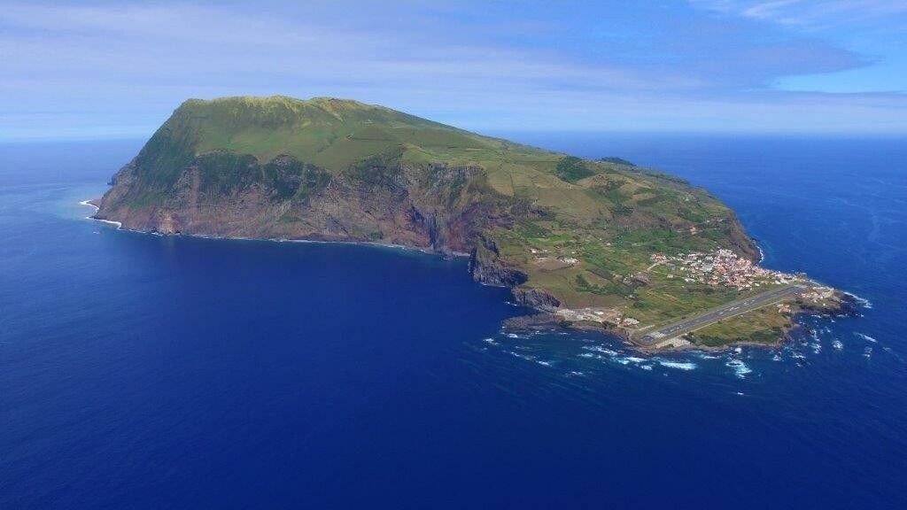

[facebook](https://www.facebook.com/sharer/sharer.php?u=https%3A%2F%2Fwww.natgeo.pt%2Fnational-geographic-summit%2F2019%2F03%2Fpaula-sobral-a-voz-do-microplastico) [twitter](https://twitter.com/share?url=https%3A%2F%2Fwww.natgeo.pt%2Fnational-geographic-summit%2F2019%2F03%2Fpaula-sobral-a-voz-do-microplastico&via=natgeo&text=Paula%20Sobral%2C%20a%20Voz%20do%20Micropl%C3%A1stico) [whatsapp](https://web.whatsapp.com/send?text=https%3A%2F%2Fwww.natgeo.pt%2Fnational-geographic-summit%2F2019%2F03%2Fpaula-sobral-a-voz-do-microplastico) [flipboard](https://share.flipboard.com/bookmarklet/popout?v=2&title=Paula%20Sobral%2C%20a%20Voz%20do%20Micropl%C3%A1stico&url=https%3A%2F%2Fwww.natgeo.pt%2Fnational-geographic-summit%2F2019%2F03%2Fpaula-sobral-a-voz-do-microplastico) [mail](mailto:?subject=NatGeo&body=https%3A%2F%2Fwww.natgeo.pt%2Fnational-geographic-summit%2F2019%2F03%2Fpaula-sobral-a-voz-do-microplastico%20-%20Paula%20Sobral%2C%20a%20Voz%20do%20Micropl%C3%A1stico) CONTEÚDO PATROCINADO 

[Summit 2022](https://www.natgeo.pt/summit2022) 
# Paula Sobral, a Voz do Microplástico 
## No dia 29 de abril, a Professora e Investigadora Paula Sobral traz ao palco do National Geographic Summit 2019 o tema ‘Saving Our Seas From Plastic Pollution’. Por [National Geographic](https://www.natgeo.pt/autor/national-geographic) Publicado 11/03/2019, 15:51 

Paula Sobral, fundadora e Presidente da Associação Portuguesa do Lixo Marinho 

**Paula Sobral** desenvolve investigação sobre microplásticos e lixo marinho desde 2008. É a fundadora e Presidente da Associação Portuguesa do Lixo Marinho, plataforma para sensibilização e co-responsabilização, e desenvolve atividades de comunicação desta temática para a sociedade. A bióloga é Professora na Faculdade de Ciências e Tecnologia da Universidade Nova de Lisboa e investigadora no MARE – Centro de Ciências do Mar e do Ambiente. 

Paula Sobral, liderou o projeto pioneiro ‘Poizon - Microplásticos e poluentes persistentes. Uma dupla ameaça à vida no mar’ e coordena a nível nacional os projetos intergovernamentais de investigação BASEMAN ( _Microplastics Analysis in European Waters_ ) e PLASTOX ( _Direct and indirect ecotoxicological impacts of microplastics on marine organisms_ ). A **especialista de microplásticos** é membro do GESAMP ( _Joint Group of Experts on the Scientific Aspects of Marine Environmental Protection – United Nations_ ) e tem colaborado com várias instituições e agências governamentais na implementação da Diretiva Quadro Estratégia Marinha. 

Atualmente estima-se que 90% de todo o lixo que flutua no oceano seja plástico. Paula Sobral afirma que _“uma grande parte deste problema que surge com o lixo marinho tem a ver com a substituição que houve de vários materiais que eram degradáveis e que deixaram de ser. Hoje em dia é tudo plástico.”_ Se todos podemos contribuir para a redução do uso de plásticos descartáveis, a bióloga acrescenta que _“a indústria - portanto, quem faz os objetos - pode e deve também ter um papel aqui muito importante, como, por exemplo, pensar no ciclo de vida do produto que faz.”_ 

<code>{"tag":"VIDEO","src":"data:audio/mpeg;base64,SUQzBAAAAAAAI1RTU0UAAAAPAAADTGF2ZjU2LjI1LjEwMQAAAAAAAAAAAAAA//tQAAAAAAAAAAAAAAAAAAAAAAAAAAAAAAAAAAAAAAAAAAAASW5mbwAAAA8AAAACAAAEEwCZmZmZmZmZmZmZmZmZmZmZmZmZmZmZmZmZmZmZmZmZmZmZmZmZmZmZmZmZmZmZmZmZ//////////////////////////////////////////////////////////////////8AAAAATGF2YzU2LjI2AAAAAAAAAAAAAAAAJAAAAAAAAAAABBN3YQi+AAAAAAAAAAAAAAAAAAAAAP/7kGQAD/AAAGkAAAAIAAANIAAAAQAAAaQAAAAgAAA0gAAABExBTUUzLjk5LjVVVVVVVVVVVVVVVVVVVVVVVVVVVVVVVVVVVVVVVVVVVVVVVVVVVVVVVVVVVVVVVVVVVVVVVVVVVVVVVVVVVVVVVVVVVVVVVVVVVVVVVVVVVVVVVVVVVVVVVVVVVVVVVVVVVVVVVVVVVVVVVVVVVVVVVVVVVVVVVVVVVVVVVVVVVVVVVVVVVVVVVVVVVVVVVVVVVVVVVVVVVVVVVVVVVVVVVVVVVVVVVVVVVVVVVVVVVVVVVVVVVVVVVVVVVVVVVVVVVVVVVVVVVVVVVVVVVVVVVVVVVVVVVVVVVVVVVVVVVVVVVVVVVVVVVVVVVVVVVVVVVUxBTUUzLjk5LjVVVVVVVVVVVVVVVVVVVVVVVVVVVVVVVVVVVVVVVVVVVVVVVVVVVVVVVVVVVVVVVVVVVVVVVVVVVVVVVVVVVVVVVVVVVVVVVVVVVVVVVVVVVVVVVVVVVVVVVVVVVVVVVVVVVVVVVVVVVVVVVVVVVVVVVVVVVVVVVf/7kmRAj/AAAGkAAAAIAAANIAAAAQAAAaQAAAAgAAA0gAAABFVVVVVVVVVVVVVVVVVVVVVVVVVVVVVVVVVVVVVVVVVVVVVVVVVVVVVVVVVVVVVVVVVVVVVVVVVVVVVVVVVVVVVVVVVVVVVVVVVVVVVVVVVVVVVVVVVVVVVVVVVVVVVVVVVVVVVVVVVVVVVVVVVVVVVVVVVVVVVVVVVVVVVVVVVVVVVVVVVVVVVVVVVVVVVVVVVVVVVVVVVVVVVVVVVVVVVVVVVVVVVVVVVVVVVVVVVVVVVVVVVVVVVVVVVVVVVVVVVVVVVVVVVVVVVVVVVVVVVVVVVVVVVVVVVVVVVVVVVVVVVVVVVVVVVVVVVVVVVVVVVVVVVVVVVVVVVVVVVVVVVVVVVVVVVVVVVVVVVVVVVVVVVVVVVVVVVVVVVVVVVVVVVVVVVVVVVVVVVVVVVVVVVVVVVVVVVVVVVVVVVVVVVVVVVVVVVVVVVVVVVVVVVVVVVVVVVVVVVVVVVVVVVVVVVVVVVVVVVVVVVVVVVVVVVVVVVVVVVVVVVVVVVVVVU="}</code> <code>{"tag":"VIDEO"}</code>  

Publicidade: O seu vídeo começa em 

--:-- 

-------- 
--:-- / --:-- 
-------- 

Summit 2019 | Paula Sobral Venha ouvir esta e outras vozes no [National Geographic Summit 2019](https://www.natgeo.pt/summit2019) . 

**CONTACTOS:** 

Para qualquer dúvida ou informação, por favor contacte-nos através de: 

**Email:** [ngsummit@winworld.pt](mailto:ngsummit@winworld.pt) 

**Telefone:** (+351) 91 3839 945 

Este conteúdo é-lhe trazido pelo nosso parceiro. Não reflete necessariamente a visão da National Geographic ou da sua equipa editorial. 

[source](https://www.natgeo.pt/national-geographic-summit/2019/03/paula-sobral-a-voz-do-microplastico)