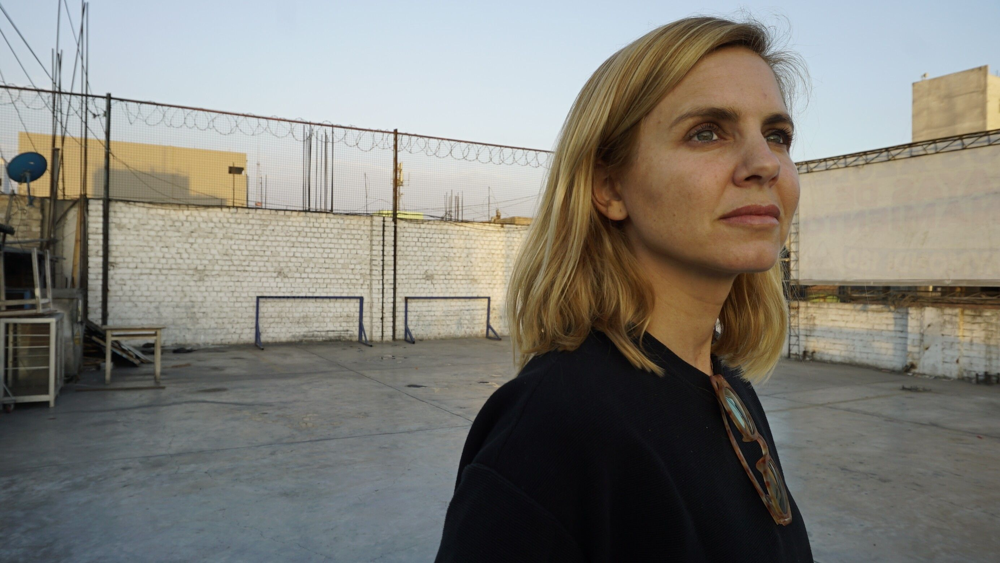

[facebook](https://www.facebook.com/sharer/sharer.php?u=https%3A%2F%2Fwww.natgeo.pt%2Ftelevisao-e-video%2F2020%2F10%2Fum-olhar-feminino-sobre-a-rota-do-trafico) [twitter](https://twitter.com/share?url=https%3A%2F%2Fwww.natgeo.pt%2Ftelevisao-e-video%2F2020%2F10%2Fum-olhar-feminino-sobre-a-rota-do-trafico&via=natgeo&text=Um%20Olhar%20Feminino%20Sobre%20a%20Rota%20do%20Tr%C3%A1fico) [whatsapp](https://web.whatsapp.com/send?text=https%3A%2F%2Fwww.natgeo.pt%2Ftelevisao-e-video%2F2020%2F10%2Fum-olhar-feminino-sobre-a-rota-do-trafico) [flipboard](https://share.flipboard.com/bookmarklet/popout?v=2&title=Um%20Olhar%20Feminino%20Sobre%20a%20Rota%20do%20Tr%C3%A1fico&url=https%3A%2F%2Fwww.natgeo.pt%2Ftelevisao-e-video%2F2020%2F10%2Fum-olhar-feminino-sobre-a-rota-do-trafico) [mail](mailto:?subject=NatGeo&body=https%3A%2F%2Fwww.natgeo.pt%2Ftelevisao-e-video%2F2020%2F10%2Fum-olhar-feminino-sobre-a-rota-do-trafico%20-%20Um%20Olhar%20Feminino%20Sobre%20a%20Rota%20do%20Tr%C3%A1fico) [Televisão e Vídeo](https://www.natgeo.pt/televisao-e-video) 
# Um Olhar Feminino Sobre a Rota do Tráfico 
## Nesta entrevista exclusiva, a correspondente da National Geographic Mariana van Zeller, explica como ser mulher facilita o seu trabalho de investigação e fala sobre a atual explosão dos mercados negros. Por [Filipa Coutinho](https://www.natgeo.pt/autor/filipa-coutinho) Publicado 28/10/2020, 16:00 , Atualizado 18/02/2021, 09:11 

As [reportagens e documentários](https://www.marianavanzeller.com/) da jornalista foram distinguidos com o _duPont-Columbia Award_ , o _Livingston Award_ para Jovens Jornalistas, o _Peabody Award,_ uma honra da Academia de Televisão e uma nomeação para um Emmy. 

Fotografia por National Geographic Destemida aparenta ser uma palavra demasiado diminuta para descrever a coragem e tenacidade de **Mariana van Zeller** . Depois de trabalhar num programa de viagens na SIC, decidiu fazer jornalismo de investigação. Queria compreender por que é que o mundo funciona da forma que funciona. Mudou-se para Nova Iorque para frequentar um mestrado na Columbia University’s Graduate School of Journalism e, apenas um mês após o início das aulas, já se encontrava a reportar os eventos do 11 de setembro para Portugal. 

Depois disso, mudou-se para a Síria para relatar a travessia mujahideen do país para o Iraque, acampou na selva amazónica para cobrir a disputa entre índios e mineiros pela maior mina de diamantes da América do Sul, viajou no “comboio da morte” __ para relatar os riscos que os migrantes da América Central correm para tentar alcançar os Estados Unidos e entrou nos pântanos da Nigéria para se encontrar com militantes que lutavam pelo controlo da riqueza petrolífera do país. 

Há 15 anos que a jornalista de investigação portuguesa tem “primeiros encontros” com indivíduos de redes criminosas para descobrir e revelar como operam os mercados negros. Durante a sua visita mais recente a Portugal, entrevistámos a protagonista da nova série da National Geographic ‘ [Na Rota do Tráfico com Mariana van Zeller](https://www.natgeo.pt/video/tv/rota-trafico-com-mariana-van-zeller) ’, que irá estrear no dia 13 de fevereiro. 

**Permita-me ir direta à pergunta que me deixa mais curiosa: não costuma ter medo?** 

Não muito (risos). Claro que há situações em que sei perfeitamente que as coisas podem não correr bem e que há uma certa ansiedade, mas em geral, não diria que sou uma pessoa que tenha muito medo. A minha curiosidade é sempre superior ao medo que sinto. 

**Nos últimos 15 anos tem tido muitos “primeiros encontros” com elementos de redes criminosas e nunca sabe quem vai encontrar. Que estratégias utiliza para se proteger e “misturar-se” nestes contextos?** 

São muitos meses de preparação em termos da segurança que temos no terreno e também são muitos anos de relações que foram desenvolvidas com estes grupos. Trabalho há muitos anos nestes mercados negros - nos chamados _underworlds_ - e há uma relação de confiança que cresceu. Em alguns dos grupos novos que temos nestes episódios, há sempre um primeiro encontro com estes grupos criminosos em que não podemos trazer câmaras ou microfones, em que eles querem ter a certeza que não somos da polícia e que somos de facto jornalistas. 

Estes primeiros encontros, a que chamo “ _underworld first dates_ ” envolvem sempre bebidas, comida e muita conversa e só depois de terem total confiança em nós é que nos dão acesso. Quando finalmente temos acesso a estes grupos, por vezes até me sinto mais protegida estando dentro do território controlado por eles, do que fora destes territórios. Mas claro que existe sempre uma preparação de segurança, para termos a certeza com quem nos vamos encontrar e onde, para ter a certeza que temos um backup e uma equipa fora desse território que sabe exatamente onde estamos e o que fazer no caso de as coisas correrem mal. 

Mariana van Zeller fala com um elemento de uma rede de tráfico em Lima, no Peru. 

Fotografia por National Geographic **Do ponto de vista jornalístico, um encontro com alguém do mercado negro deve ser ao mesmo tempo fascinante e aterrador. Ser mulher facilita?** 

Facilita, imenso! Digo sempre que ser mulher facilita muito. Acho que somos menos ameaçadoras e acho que a curiosidade feminina e o facto de chegarmos a uma situação sem julgamento e com mais empatia, ajuda a que as pessoas se abram connosco. Tento entender por que é que estas pessoas fazem o que fazem, como se entra no mundo criminoso. Não acredito que ninguém nasça e decida um dia que quer virar um criminoso. Penso que são certas oportunidades ou a falta de oportunidades que levam um indivíduo a esses mundos. Para mim há sempre uma curiosidade e uma tentativa de entender o porquê, em vez de o julgar. E penso que essa é uma abordagem muito mais feminina do que masculina. 

**Se pudesse viajar no tempo, para uma época em que não viveu, que história gostaria de ter contado?** 

Sou fascinada com o tempo da exploração portuguesa. O meu filho chama-se Vasco por causa do Vasco da Gama. Quando conheci o meu marido, que é americano e nunca tinha conhecido nenhum português ou portuguesa, e nunca tinha estado em Portugal… e disse-me logo que era fascinado pelo Vasco da Gama e que tinha todos os livros sobre ele. Quando fiquei grávida, disse-me logo que tinha de ser Vasco. Partilho com ele esse fascínio pela exploração portuguesa. Um dos motivos pelos quais faço este tipo de jornalismo tem muito a ver com o meu sangue português. Adorava poder ir para trás no tempo e estar no início da exploração e envolvida nos momentos mais brilhantes da história do meu país. 

**Que preocupações carrega na sua mochila quando está em produção no terreno?** 

Mais do que todas as preocupações, carrego a minha segurança e a segurança da minha equipa e daqueles que nos ajudam e falam connosco no terreno. 

Perguntam-nos sempre como temos coragem de ir a estes sítios e fazer este tipo de reportagens tão perigosas, mas muitas vezes o que as pessoas não sabem é que dependemos muito dos jornalistas locais que nos ajudam, que já têm os contactos, que nos levam a conhecer estes mundos e que já fizeram reportagens locais. Eles são de facto quem tem coragem, porque têm de ficar no país quando nós voltamos para os nossos países. 

<code>{"tag":"VIDEO"}</code> <code>{"tag":"VIDEO"}</code>  

Publicidade: O seu vídeo começa em 

--:-- 

-------- 
--:-- / --:-- 
-------- 

audio/video source is invalid 

This is a sample 

## Color 

## Opacity 

## Font 

## Size 

## Color 

## Effect 

## Color 

## Opacity 

Player Shortcuts 

Play/Pause 

P or Spacebar 

Full Screen 

F 

Exit Full Screen 

F or Esc 

Skip Back 5 Seconds 

← 

Skip Ahead 5 Seconds 

→ 

Jump Back 10 Seconds 

J 

Jump Ahead 10 Seconds 

L 

Restart 

0 or Home 

Skip to the End 

End 

Volume Up 

↑ 

Volume Down 

↓ 

Mute Audio 

M 

Toggle Closed Captions 

C 

Decrease Caption Size 

− 

Increase Caption Size 

= or + 

Cycle Caption Text Preset 

B 

Show Keyboard Controls 

<kbd>?</kbd> or / 

ACABOU DE VER 

#### Na Rota do Tráfico com Mariana Van Zeller - trailer 

A SEGUIR 

Este vídeo começará em 

8 
segundos 

Na Rota do Tráfico com Mariana Van Zeller - trailer A jornalista premiada Mariana van Zeller explora o funcionamento interno dos mercados negros mais perigosos do submundo. Em cada episódio, ela explora um mercado negro diferente, que vende desde drogas, a armas, a pedaços de tigre. O objetivo é conhecer aqueles que se movem neste ambiente, aprender como funciona o negócio e pôr a descoberto as circunstâncias geopolíticas e o contexto que criaram esta economia clandestina no valor de vários triliões de dólares.
**Que efeitos tem tido a pandemia no mundo do tráfico?** 

Quando começou a pandemia estávamos em pós-produção e, portanto, não tivemos de ir logo para o terreno fazer reportagens, mas passado uns meses começámos a fazer planos para fazer reportagens outra vez. Tive medo, achei que as coisas tinham mudado tanto à minha volta que com certeza também tinham mudado nos mercados negros mundiais, mas o que descobri foi que o mercado não foi afetado negativamente, pelo contrário. É durante as crises económicas e financeiras mundiais que os mercados negros explodem. A minha experiência ao viajar e ao continuar a trabalhar no terreno durante estes tempos tem comprovado que existe mais tráfico de droga e de sexo do que nunca. 

**Quais as coordenadas de Portugal na rota do tráfico?** 

Vivemos num mundo globalizado e interconectado, portanto não há nada que aconteça em termos de tráfico de drogas no México ou no Brasil que não tenha uma repercussão na Europa. Sabemos que muitas das drogas consumidas em Portugal vêm da América Latina e sabemos que muitos dos euros falsos que utilizamos na Europa, incluindo em Portugal, são feitos, por exemplo, no Peru. 

Um dos grandes objetivos que tenho nas minhas reportagens é mostrar que o que acontece nas regiões mais distantes do mundo afeta o que acontece aqui em Portugal. Portanto, é importante mantermos os olhos abertos e curiosidade e interesse por aquilo que acontece à volta do mundo, porque afeta o nosso dia-a-dia. 

**Como tem sido trabalhar no terreno durante a pandemia?** 

Tem sido difícil, há vários desafios… não só o facto de termos de usar sempre máscara – essa é a parte mais fácil. Acho engraçado ouvir pessoas a reclamar de usar máscara quando, de todos os sacrifícios que temos feito a nível mundial, a máscara parece-me o menor dos sacrifícios. 

Há várias regras para termos a certeza que podemos fazer esta produção de uma maneira segura e saudável. Uma delas é a impossibilidade de voltar para casa quando existem dois ou três dias entre reportagens, em que não estamos a trabalhar. Infelizmente não podemos voltar para casa e estar com a nossa família durante esses dois ou três dias porque os colocamos em risco. A minha equipa de filmagens, que vive à volta dos Estados Unidos, tem estado meses longe da família. Tem sido desafiante, mas não nos podemos esquecer que estes mercados negros crescem exatamente nestas alturas, portanto, é mais importante do que nunca fazer este tipo de reportagens. 

**Quem foi uma das pessoas mais interessantes que conheceu?** 

Quando se fazem reportagens sobre os mercados negros, muitas vezes os homens são os protagonistas - são os líderes, os traficantes, as pessoas com poder. Houve algumas exceções, mas uma que nunca vou esquecer – um dos episódios que fizemos sobre _scammers_ (indivíduos que conduzem manobras fraudulentas para ganhar dinheiro) na Jamaica em que uma das personagens que filmámos era uma mulher com 25 a 30 anos. Todos os dias vai para o trabalho, num dos hotéis enormes com turistas do mundo inteiro, sabendo que os turistas gastam mais dinheiro por dia nesse hotel do que ela ganha num ano de trabalho. Um dia voltou para casa e o avô dela ficou muito doente e tinha hipótese de ter um tratamento que não custava muito dinheiro, mas que ela não conseguia pagar. Foi aí que decidiu que, para salvar o avô, ia ter de encontrar outra maneira de fazer dinheiro. Decidiu tornar-se _scammer_ . Continua a trabalhar no hotel e à noite chega a casa e faz _scams_ à volta do mundo. 

Penso que é muito mais importante compreender como se chega a estas situações do que julgar, porque não vamos conseguir alterar nada e melhorar o mundo sem haver primeiro uma compreensão. 

**CURIOSIDADES 

Cresceu em...** Cascais. 

**Para se divertir...** boa comida e bom vinho. 

**O seu sítio preferido no mundo é...** Portugal, claro. 

**Não consegue viajar sem...** as minhas botas do trabalho. 

**O conselho que daria a alguém que sonhe em trabalhar em jornalismo de investigação é...** persistência. Nunca desistir! 

_‘ [Na Rota do Tráfico com Mariana van Zeller](https://www.natgeo.pt/video/tv/rota-trafico-com-mariana-van-zeller) ’ estreia dia 13 de fevereiro no National Geographic. Esta entrevista foi editada por motivos de extensão e clareza._ 

[source](https://www.natgeo.pt/televisao-e-video/2020/10/um-olhar-feminino-sobre-a-rota-do-trafico)