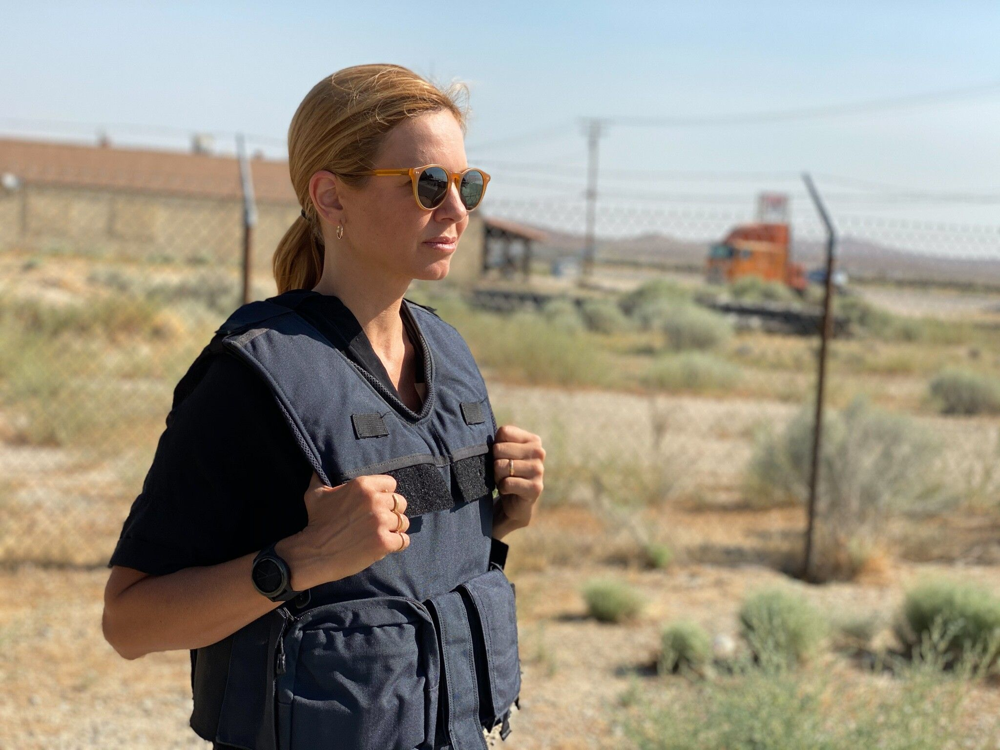
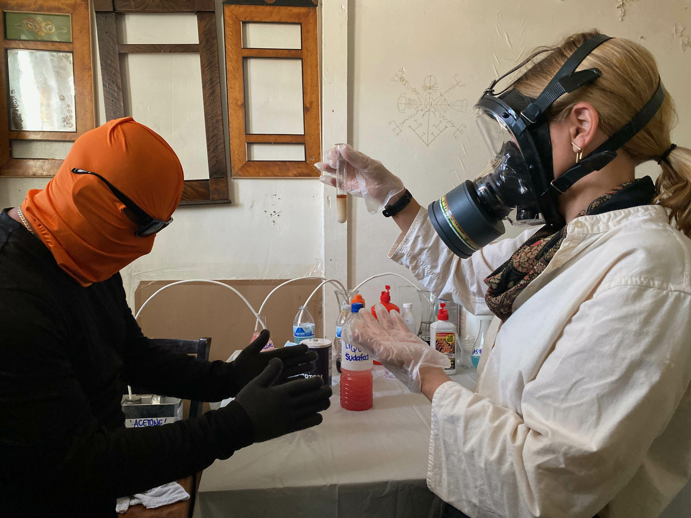
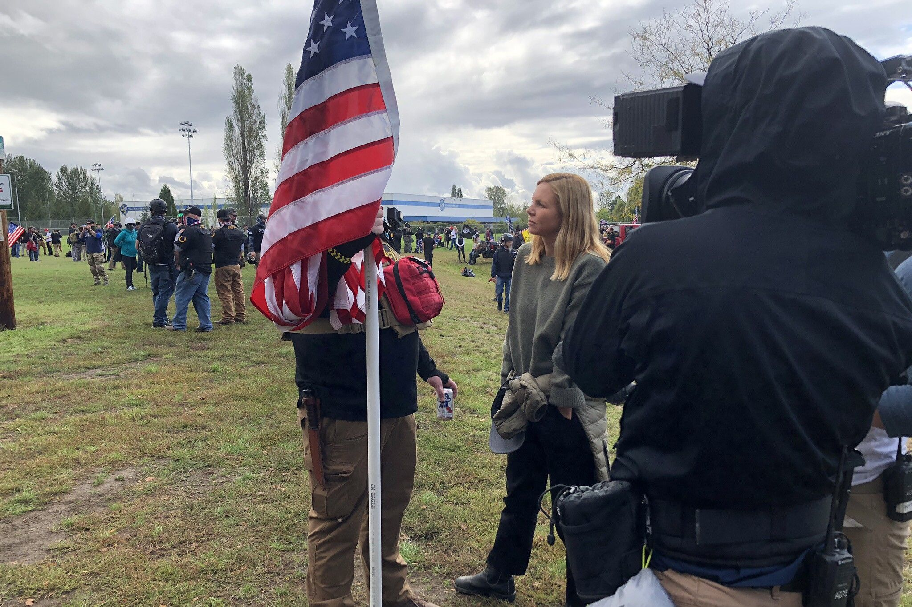

[facebook](https://www.facebook.com/sharer/sharer.php?u=https%3A%2F%2Fwww.natgeo.pt%2Ftelevisao-e-video%2F2021%2F12%2Fmariana-van-zeller-pandemia-tem-causado-uma-explosao-mercados-negros) [twitter](https://twitter.com/share?url=https%3A%2F%2Fwww.natgeo.pt%2Ftelevisao-e-video%2F2021%2F12%2Fmariana-van-zeller-pandemia-tem-causado-uma-explosao-mercados-negros&via=natgeo&text=Mariana%20van%20Zeller%3A%20%E2%80%9CA%20pandemia%20tem%20causado%20uma%20explos%C3%A3o%20significativa%20nos%20mercados%20negros%20mundiais%E2%80%9D) [whatsapp](https://web.whatsapp.com/send?text=https%3A%2F%2Fwww.natgeo.pt%2Ftelevisao-e-video%2F2021%2F12%2Fmariana-van-zeller-pandemia-tem-causado-uma-explosao-mercados-negros) [flipboard](https://share.flipboard.com/bookmarklet/popout?v=2&title=Mariana%20van%20Zeller%3A%20%E2%80%9CA%20pandemia%20tem%20causado%20uma%20explos%C3%A3o%20significativa%20nos%20mercados%20negros%20mundiais%E2%80%9D&url=https%3A%2F%2Fwww.natgeo.pt%2Ftelevisao-e-video%2F2021%2F12%2Fmariana-van-zeller-pandemia-tem-causado-uma-explosao-mercados-negros) [mail](mailto:?subject=NatGeo&body=https%3A%2F%2Fwww.natgeo.pt%2Ftelevisao-e-video%2F2021%2F12%2Fmariana-van-zeller-pandemia-tem-causado-uma-explosao-mercados-negros%20-%20Mariana%20van%20Zeller%3A%20%E2%80%9CA%20pandemia%20tem%20causado%20uma%20explos%C3%A3o%20significativa%20nos%20mercados%20negros%20mundiais%E2%80%9D) [Televisão e Vídeo](https://www.natgeo.pt/televisao-e-video) 
# Mariana van Zeller: “A pandemia tem causado uma explosão significativa nos mercados negros mundiais” 
## Conversámos com Mariana van Zeller antes da estreia da segunda temporada de “Na Rota do Tráfico” sobre alguns dos momentos que mais a surpreenderam durante as gravações. Por [Filipa Coutinho](https://www.natgeo.pt/autor/filipa-coutinho) Publicado 7/12/2021, 17:26 

Na série “Na Rota do Tráfico com Mariana Van Zeller”, a jornalista portuguesa conduz os espectadores numa viagem a lugares nunca antes vistos. 

Fotografia por National Geographic Há 15 anos que Mariana van Zeller investiga e se encontra com indivíduos de redes criminosas para revelar como operam os mercados negros. Depois do sucesso da primeira temporada de “ [Na Rota do Tráfico com Mariana van Zeller](https://www.natgeo.pt/video/tv/rota-trafico-com-mariana-van-zeller) ”, a nova temporada chega no dia 18 de dezembro ao National Geographic. 

Na série documental, a premiada jornalista explora o funcionamento interno dos mercados negros, ganhando a confiança e entrando nas redes mais perigosas do mundo. Em cada episódio, Mariana Van Zeller explora diferentes comércios clandestinos como o mercado negro das cirurgias plásticas e os clubes de motards fora-da-lei. A missão da jornalista é conhecer aqueles que se movem neste ambiente, aprender como atuam e revelar o contexto geopolítico que criou esta economia paralela que gera triliões de dólares. 

"Nunca tem medo?" perguntámos-lhe no [ano passado](https://www.natgeo.pt/televisao-e-video/2020/10/um-olhar-feminino-sobre-a-rota-do-trafico) . Na altura, a jornalista de investigação revelou que a sua curiosidade ultrapassa sempre o medo que possa sentir. A poucos dias da estreia da segunda temporada de “Na Rota do Tráfico” voltámos a conversar com Mariana van Zeller. 

**Esta série permite-nos derrubar estereótipos e preconceitos episódio, após episódio. Que investigação e encontro mais a surpreendeu nesta segunda temporada?** 

Acho que o mais assustador foi o tempo que passei com o movimento de supremacia branca, sentando-me ao lado de alguns neonazis que falavam abertamente sobre a violência e a morte dos que chamam “invasores do ocidente”, e também da forma como falavam das minorias e da imigração. Foi bastante assustador, sabendo que o que eles dizem faz parte de uma rede global de supremacia branca que está em crescimento e que tem tido efeito direto em ataques terroristas não só nos EUA, como na Nova Zelândia e na Noruega, e que estão todos interconectados. Foi assustador perceber que este movimento funciona muito como o tráfico de drogas ou de armas. Em vez de estarem a colocar drogas ou armas nos corpos de pessoas, estão a colocar ideias e mentiras nas suas cabeças. 

<code>{"tag":"VIDEO"}</code> <code>{"tag":"VIDEO"}</code>  

Publicidade: O seu vídeo começa em 

--:-- 

-------- 
--:-- / --:-- 
-------- 

audio/video source is invalid 

This is a sample 

## Color 

## Opacity 

## Font 

## Size 

## Color 

## Effect 

## Color 

## Opacity 

Player Shortcuts 

Play/Pause 

P or Spacebar 

Full Screen 

F 

Exit Full Screen 

F or Esc 

Skip Back 5 Seconds 

← 

Skip Ahead 5 Seconds 

→ 

Jump Back 10 Seconds 

J 

Jump Ahead 10 Seconds 

L 

Restart 

0 or Home 

Skip to the End 

End 

Volume Up 

↑ 

Volume Down 

↓ 

Mute Audio 

M 

Toggle Closed Captions 

C 

Decrease Caption Size 

− 

Increase Caption Size 

= or + 

Cycle Caption Text Preset 

B 

Show Keyboard Controls 

<kbd>?</kbd> or / 

ACABOU DE VER 

#### Trailer: Na Rota do Tráfico com Mariana Van Zeller 2 

A SEGUIR 

Este vídeo começará em 

8 
segundos 

Trailer: Na Rota do Tráfico com Mariana Van Zeller 2 **Que efeitos tiveram estes quase dois anos de pandemia no mundo do tráfico?** 

Começámos a gravar a segunda temporada em julho de 2020 e o que reparámos de imediato é que a pandemia tem causado uma explosão significativa nos mercados negros mundiais. Não só de armas e drogas, mas por exemplo, de burlas. Um dos episódios que gravámos foi sobre romances com burlas – um crime que cresceu por causa da solidão de muitas pessoas. Foi incrível ver isto. Sempre que há uma crise económica mundial e sempre que as pessoas perdem empregos, têm de virar-se para onde podem para poder sobreviver e trazer dinheiro e comida para a família. Neste caso, para os mercados negros, que estão sempre à nossa volta e sempre dispostos a receber mais mão-de-obra. 

**A equipa apanhou algum susto durante as gravações?** 

Houve uma cena que nunca mais me vou esquecer. Estávamos em mar aberto, no oceano Atlântico, quando fizemos o episódio da pesca ilegal. Fomos com a Sea Shepherd e com a Liberian Coast Guard, com quem entrámos a meio da noite num barco que eles achavam que estava a pescar ilegalmente. Estavam ondas grandes, aproximámo-nos do barco sem luzes, com escuridão total, e tínhamos de saltar para cima de um escadote para subir, com o barco a andar, sem sabermos com que situação nos iríamos deparar. Existem situações em que estes barcos de pesca ilegal têm pessoas armadas lá dentro e nós no momento não sabíamos. Foi um momento de grande preocupação para a equipa toda. 

**Esquerda:** **Superior:** Mariana van Zeller durante as gravações do episódio sobre metanfetaminas. 

**Direita:** **Inferior:** Uma das conversas da jornalista realizadas para o episódio "Supremacia Branca". 

fotografias de National Geographic **Em que se distingue esta segunda temporada?** 

Fomos mais fundo nos mercados negros e também alargámos os temas que abrangemos. O tema, por exemplo, da supremacia branca – que à primeira instância não pensamos ser um tema dos mercados negros – é bastante preocupante. E eu tenho um orgulho muito grande na nossa equipa e na National Geographic por ter aceitado este desafio ainda antes da invasão do capitólio no dia 6 de janeiro, e termos inclusive passado tempo com os Proud Boys [organização política neofascista de extrema-direita], que acabaram por estar envolvidos na invasão do capitólio. Fazer um episódio destes é mais relevante do que nunca. 

Não perca a estreia de "Na Rota do Tráfico com Mariana van Zeller", dia 18 de dezembro às 22:30. 

[source](https://www.natgeo.pt/televisao-e-video/2021/12/mariana-van-zeller-pandemia-tem-causado-uma-explosao-mercados-negros)