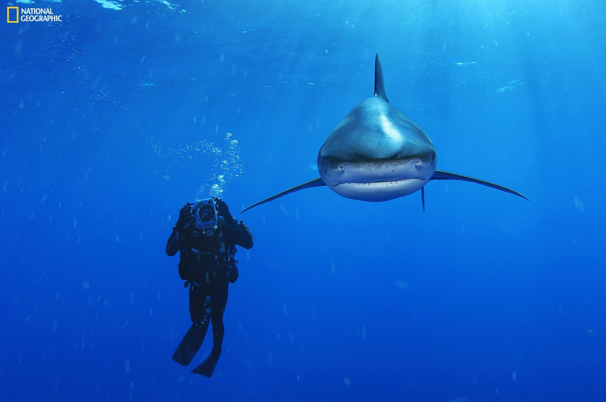

[facebook](https://www.facebook.com/sharer/sharer.php?u=https%3A%2F%2Fwww.natgeo.pt%2Ftubarao%2F2019%2F05%2Fuma-nova-perspetiva-dos-tubaroes-entrevista-a-brian-skerry) [twitter](https://twitter.com/share?url=https%3A%2F%2Fwww.natgeo.pt%2Ftubarao%2F2019%2F05%2Fuma-nova-perspetiva-dos-tubaroes-entrevista-a-brian-skerry&via=natgeo&text=Uma%20Nova%20Perspetiva%20dos%20Tubar%C3%B5es%3A%20Entrevista%20a%20Brian%20Skerry) [whatsapp](https://web.whatsapp.com/send?text=https%3A%2F%2Fwww.natgeo.pt%2Ftubarao%2F2019%2F05%2Fuma-nova-perspetiva-dos-tubaroes-entrevista-a-brian-skerry) [flipboard](https://share.flipboard.com/bookmarklet/popout?v=2&title=Uma%20Nova%20Perspetiva%20dos%20Tubar%C3%B5es%3A%20Entrevista%20a%20Brian%20Skerry&url=https%3A%2F%2Fwww.natgeo.pt%2Ftubarao%2F2019%2F05%2Fuma-nova-perspetiva-dos-tubaroes-entrevista-a-brian-skerry) [mail](mailto:?subject=NatGeo&body=https%3A%2F%2Fwww.natgeo.pt%2Ftubarao%2F2019%2F05%2Fuma-nova-perspetiva-dos-tubaroes-entrevista-a-brian-skerry%20-%20Uma%20Nova%20Perspetiva%20dos%20Tubar%C3%B5es%3A%20Entrevista%20a%20Brian%20Skerry) [Sharks](https://www.natgeo.pt/sharks) 
# Uma Nova Perspetiva dos Tubarões: Entrevista a Brian Skerry 
## Com mais de 10 mil horas debaixo de água e 14 viagens à volta do mundo, Brian Skerry é um dos principais fotógrafos subaquáticos do mundo e um acérrimo promotor da conservação marinha. Por [National Geographic](https://www.natgeo.pt/autor/national-geographic) Publicado 21/05/2019, 17:37 

"A primeira vez que estive na presença de um tubarão-de-pontas-brancas foi na Ilha do Gato, em 2006, e estava acompanhado do meu mentor Wes Pratt." 

Fotografia por Brian Skerry , National Geographic **Qual é o poder da fotografia na conservação marinha?** 

Penso que o poder da fotografia na conservação marinha é o de contextualizar as coisas. Durante muito tempo, o que vimos na fotografia subaquática foi a beleza do oceano e ecossistemas e animais magníficos. A realidade é que estes animais e ecossistemas estão em perigo. 

Digo muitas vezes que o oceano está a morrer de uma morte por mil cortes… está a ser agredido em muitos níveis diferentes. Mas muito poucas pessoas mergulham ou passam tempo debaixo de água. Enquanto criaturas terrestres, criaturas que vivem no solo, temos dificuldade em compreender estes problemas no mar. Uma vez que os humanos são criaturas visuais, respondemos emocionalmente a fotografias e imagens e conseguimos recordá-las durante toda a vida, acredito que a fotografia pode ajudar as pessoas a perceberem o problema. 

**Os tubarões mudam o seu comportamento enquanto são fotografados?** 

Não sei se mudam o seu comportamento enquanto são fotografados, mas penso que os tubarões, tal como todos os animais, têm personalidade. Um dia podemos estar com um tubarão mais envergonhado e outro dia com um tubarão mais arrojado, e temos de ler esses sinais. 

Acho que é como ir ao quintal de um vizinho e um dia ver o seu cão a abanar a cauda e termos uma boa impressão, e outro dia sabemos que não o devemos importunar. Não sei se a fotografia faz muita diferença, mas penso que o seu comportamento pode variar de acordo com as circunstâncias. 

[**VEJA ALGUMAS FOTOGRAFIAS DA EXPOSIÇÃO SHARKS:**](https://www.natgeo.pt/photography/2019/05/revelamos-5-fotografias-da-exposicao-sharks) 

ver galeria **Um encontro com um tubarão deve ser ao mesmo tempo formidável e aterrador. Alguma vez se sentiu ameaçado?** 

Tive alguns momentos muito especiais com tubarões. Fiz centenas, se não milhares de mergulhos com tubarões, e apenas me senti realmente ameaçado três ou quatro vezes, em que tive de sair da água. 

Uma das minhas experiências preferidas foi durante um artigo que fiz em 2006 para a National Geographic sobre tubarões das Bahamas. Queria ir às Bahamas porque era um local que tinha protegido os tubarões. Era um sítio onde podia encontrar muitas espécies diferentes por existirem habitats diferentes. E queria usá-lo para falar sobre a necessidade de conservação dos tubarões. Fotografei muitas espécies, mas havia uma que tinha esperança de ver: o tubarão-de-pontas-brancas que é considerada a quarta espécie mais perigosa. Antes era abundante nas Bahamas, mas na altura em fiz o artigo não conhecia ninguém que o tivesse visto nos últimos 30 anos. Tinham todos sido mortos, tinham todos sido pescados. 

Contudo, encontrei um local na zona central das Bahamas, uma ilha chamada Cat Island, onde os conseguíamos encontrar. Fiz uma expedição durante 16 dias e, por ser potencialmente um animal perigoso, levei uma jaula de mergulho e em 16 dias apenas vimos um. Recordo-me do biólogo com quem estava, entrar na jaula. Eu fiquei fora da jaula e não tinha a certeza, mas apareceu este animal lindo com cerca de três metros de comprimento e estava curioso comigo no início, a bater com o nariz na minha câmara, até se acalmar e fazer círculos grandes à minha volta durante uma ou duas horas. 

O sol estava a baixar, mas estava lindo, a água quente e azul, e o tubarão com cor dourada que era um mito para mim. Apesar de ter uma péssima reputação, foi muito educado e teve um efeito muito duradouro em mim. Nunca vou esquecer esse cenário e o prazer de estar na água com um animal como esse, potencialmente perigoso, no meio do oceano. Foi fantástico. 

**Por que é tão urgente proteger os tubarões?** 

Vivemos num planeta de água e metade do ar que inspiramos vem do oceano. Mais de 50% do ar que respiramos é gerado pelo oceano. Porém, o oceano está a morrer e um dos problemas é retirarmos tantos animais do mar. Nos últimos 60 anos, após a segunda guerra mundial, removemos cerca de 90% dos peixes grandes do mar e isso inclui os tubarões. Os tubarões, o atum, o espadarte… Todos os anos, matamos mais de 100 milhões de tubarões, sobretudo pelas suas barbatanas para sopa de barbatana de tubarão. 

Penso que, enquanto predadores, os tubarões desempenham um papel vital na saúde dos ecossistemas marinhos. Como os lobos na terra ou os ursos-pardos, ou os leões e os tigres. Precisamos dos predadores para manter estes ecossistemas saudáveis. E os tubarões fazem isso. 

Para mim é importante retratar os tubarões como um animal que não devemos temer, mas como algo magnífico que devemos respeitar. Talvez com essa narrativa e boa ciência consigamos eliminar essa erradicação. 

**Onde encontra a coragem para sair da jaula de mergulho?** 

Não sei se é coragem ou estupidez. Geralmente não estou numa jaula, apenas utilizei jaulas com grandes tubarões-brancos. Com outras espécies, não as uso. 

Em termos de coragem, advém de fazer isto há muito tempo. Desde a primeira experiência com um tubarão-azul, quando saí da jaula aprendi que apesar da sua má reputação, os tubarões não são assim tão perigosos para os mergulhadores. Podem sê-lo, não quero soar imprudente, tenho sempre consciência que é arriscado, mas acho que o podemos fazer em segurança e aceito o risco. 

Acho que sendo um fotógrafo, queremos tirar essa fotografia, queremos ajudar a contar a história dos tubarões. E por vezes é muito difícil tirá-la de uma jaula, temos de estar muito próximos dos animais. Isso é o que me inspira a aproximar-me deles, mas tento sempre virar as coisas a meu favor… não o faço de forma arriscada. Tenho um assistente a vigiar a minha retaguarda ou uso um fato com correntes e, se não me sentir seguro, saio da água. Não sou maluco, sou prudente. 

_Entrevista realizada a Brian Skerry, a 28 de abril de 2019_ 

[source](https://www.natgeo.pt/tubarao/2019/05/uma-nova-perspetiva-dos-tubaroes-entrevista-a-brian-skerry)