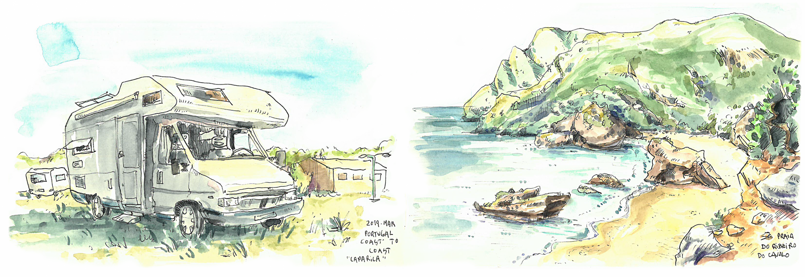

[facebook](https://www.facebook.com/sharer/sharer.php?u=https%3A%2F%2Fwww.natgeo.pt%2Fviagem-e-aventuras%2F2019%2F08%2Fcomo-ultrapassar-a-hodofobia-o-medo-de-viajar) [twitter](https://twitter.com/share?url=https%3A%2F%2Fwww.natgeo.pt%2Fviagem-e-aventuras%2F2019%2F08%2Fcomo-ultrapassar-a-hodofobia-o-medo-de-viajar&via=natgeo&text=Como%20Ultrapassar%20a%20Hodofobia%20%E2%80%93%20o%20Medo%20de%20Viajar%3F) [whatsapp](https://web.whatsapp.com/send?text=https%3A%2F%2Fwww.natgeo.pt%2Fviagem-e-aventuras%2F2019%2F08%2Fcomo-ultrapassar-a-hodofobia-o-medo-de-viajar) [flipboard](https://share.flipboard.com/bookmarklet/popout?v=2&title=Como%20Ultrapassar%20a%20Hodofobia%20%E2%80%93%20o%20Medo%20de%20Viajar%3F&url=https%3A%2F%2Fwww.natgeo.pt%2Fviagem-e-aventuras%2F2019%2F08%2Fcomo-ultrapassar-a-hodofobia-o-medo-de-viajar) [mail](mailto:?subject=NatGeo&body=https%3A%2F%2Fwww.natgeo.pt%2Fviagem-e-aventuras%2F2019%2F08%2Fcomo-ultrapassar-a-hodofobia-o-medo-de-viajar%20-%20Como%20Ultrapassar%20a%20Hodofobia%20%E2%80%93%20o%20Medo%20de%20Viajar%3F) [A disseminação global do coronavírus está a afetar os viajantes. Mantenha-se atualizado sobre a explicação científica por trás do surto >>](https://www.natgeo.pt/coronavirus) 

[Viagem e Aventuras](https://www.natgeo.pt/viagem-e-aventuras) 
# Como Ultrapassar a Hodofobia – o Medo de Viajar? 
## A hodofobia pode manifestar-se de forma mais ou menos grave, chegando a causar falta de ar e tremores por todo o corpo. Descubra como combatê-la. Por [Filipa Coutinho](https://www.natgeo.pt/autor/filipa-coutinho) Publicado 20/08/2019, 18:03 , Atualizado 19/07/2021, 15:54 

Autocaravana na Costa da Caparica (à esquerda) e Praia da Ribeira do Cavalo (à direita). Fotografia por André Gomes Viajar possibilita uma troca de culturas e conhecimento, uma troca de hábitos e rotinas, uma troca de experiências e realidades… um autêntico mar de aventuras. Mas sabia que existem pessoas que têm **fobia de viajar** ? Essa condição sintomática é chamada **hodofobia** e pode manifestar-se antes do embarque num automóvel, barco, autocarro ou avião, de forma mais ou menos grave, chegando a causar falta de ar e tremores por todo o corpo. 

Existem pessoas que gostam de viajar em lazer e pessoas que viajam apenas por obrigatoriedade profissional. Há quem prefira viajar a solo e há quem não saiba viajar sem companhia. E até existem pessoas viciadas em viajar, que abandonam a sua carreira para se dedicarem ao _wanderlust_ (forte desejo em viajar). Ao viajar, todos ganhamos qualquer coisa. 

## **Quando viaja, quantas preocupações leva na sua mala?** 
O medo é um instinto natural do ser humano e uma forma de autopreservação, pois é o instinto que impede de corrermos riscos em determinados cenários e de colocar a nossa vida em perigo. Descubra as principais fobias associadas ao ato de viajar e como pode combater ou ajudar alguém a ultrapassar este medo. 

**Glossário de algumas fobias associadas às viagens** 

Agirofobia – receio profundo em atravessar uma rua ou estrada 

Agrizoofobia – um forte medo de animais selvagens 

Atefobia – medo de ruínas 

Criofobia – aversão e fobia ao frio intenso 

Escalafobia – pavor de escadas rolantes 

Heliofobia – medo de ficar sob o sol 

Limnofobia – medo de lagos 

Macrofobia – medo de longos períodos de espera 

Nomofobia – pavor de ficar sem rede no telemóvel 

Osmofobia – aversão a odores desagradáveis 

Se tem alguma destas fobias, lembre-se que pode estar a perder a maior aventura da sua vida. E, se ainda assim não o convencemos, veja a nossa seleção de [**imagens dos 10 países mais felizes do mundo**](https://www.natgeo.pt/photography/2019/04/faca-uma-viagem-pelos-paises-mais-felizes-do-mundo) . 

ver galeria 
## **Como vencer o medo?** 
Se sofre de algum destes medos, o ideal é confrontar esse receio e ultrapassá-lo. Pode fazê-lo viajando com uma pessoa da sua confiança que lhe consiga transmitir calma, se necessário. 

Uma das opções é consultar um **psicoterapeuta** para ajudá-lo a identificar a sua fobia, tentando ultrapassá-la através de terapia. Pode começar por vencer outro medo mais imediato, que não implique deslocar-se do sítio onde vive. A sensação de vencer outro medo irá dar-lhe um boost de dopamina, ideal para tentar combater outra fobia. 

Existem **cursos** para vencer o pânico de viajar em algumas companhias de aviação. A TAP desenvolveu o [Programa Ganhar Asas](https://www.flytap.com/pt-pt/a-bordo/perder-o-medo-de-voar/ganhar-asas) com uma equipa especializada que incluí dois psicólogos com formação cognitivo-comportamental, destinado a pessoas que nunca viajaram ou têm pavor em viajar. 

Pode ainda experimentar a **[hipnoterapia](https://www.sociedadeportuguesahipnose.com/)** , disponível em alguns hospitais públicos e privados portugueses ou o relaxamento muscular progressivo, uma técnica criada por um médico americano que procura proporcionar um estado de relaxamento físico que permita atingir um estado de relaxamento mental. 

Se, em alternativa à medicação convencional, preferir uma abordagem natural, o **óleo essencial de laranja** pode ser um aliado num cenário de pânico, ajudando a controlar a ansiedade e o nervosismo, fortalecendo o equilíbrio emocional. Deve ser utilizado na sua forma mais pura e, se possível, deve ter origem biológica. Pode aplicá-lo topicamente, por exemplo no pulso, uma a duas gotas serão suficientes. 

Nos dias que antecedem a viagem deve evitar o consumo de café, bebidas com cafeína ou teína, comidas pesadas, e deve tentar dormir tranquilamente. Durante a viagem deve manter-se hidratado, bem alimentado e distraído. 

Outra dica para combater este tipo de fobias é ler algumas **estatísticas** sobre acidentes de viagem. Vai descobrir que atualmente a probabilidade de ter um acidente de avião é de 0,000014%. Se for viajar neste meio de transporte, opte por um lugar na parte da frente do avião, onde a turbulência é menos sentida. 

Viaje com calma, devagar. Não faça planos à justa e inclua tempo para relaxar no seu calendário de viagem. 

## **Convencido?** 
Segundo um provérbio asiático, é melhor ver coisas uma única vez do que ouvir falar delas um milhar de vezes. Ao viajar ganhamos bem-estar, recordações e novos limites. Ao viajar vamos **mais além** . 

Há quem diga que o medo é o maior inimigo do homem. Se viajar estiver em causa, talvez seja. 

[source](https://www.natgeo.pt/viagem-e-aventuras/2019/08/como-ultrapassar-a-hodofobia-o-medo-de-viajar)